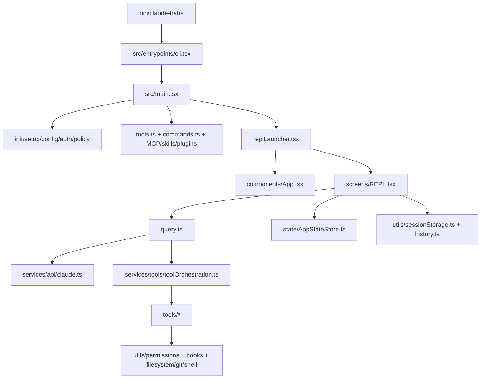

# Claude Code Haha 源码阅读笔记

> 这份笔记面向两类读者：人在 Obsidian 里按模块阅读，或大模型按路径、符号、关键词检索。所有路径都保留仓库相对路径，便于直接跳转。

## 快速定位

- 启动入口：`bin/claude-haha` -> `src/entrypoints/cli.tsx` -> `src/main.tsx`。
- 交互主界面：`src/replLauncher.tsx` 动态加载 `src/components/App.tsx` 和 `src/screens/REPL.tsx`。
- 模型主循环：`src/query.ts` 负责消息规范化、模型流、工具调用、压缩、恢复与停止 hook。
- API 适配：`src/services/api/claude.ts` 是 Anthropic 兼容 API 的流式/非流式请求实现。
- 工具系统：`src/Tool.ts` 定义工具协议，`src/tools.ts` 注册工具，`src/services/tools/*` 执行工具。
- Slash 命令：`src/commands.ts` 聚合内置命令、skills、plugins 的动态命令。
- 状态核心：`src/state/AppStateStore.ts` 定义全局状态形状，`src/state/AppState.tsx` 提供 React store 访问。
- 终端渲染：`src/ink/*` 是定制 Ink 渲染层，`src/components/*` 是业务 UI。
- 扩展系统：`src/services/mcp/*`、`src/skills/*`、`src/plugins/*` 分别负责 MCP、Skills、Plugins。

## 整体架构

### 分层理解

- 入口层：`entrypoints/cli.tsx` 做快速路径和特殊子命令分流，`main.tsx` 做完整 CLI 参数解析、配置初始化、权限/策略/MCP/插件/skill 加载，并创建初始 `AppState`。
- 交互层：`screens/REPL.tsx` 是 TUI 会话的控制面，接收输入、排队命令、显示消息、发起 `query()`，并协调权限弹窗、IDE、后台任务和恢复逻辑。
- 推理层：`query.ts` 是 agentic turn 的状态机，围绕 `Message[]`、`SystemPrompt`、`ToolUseContext` 循环处理模型响应、工具结果、自动压缩、token 预算和 stop hooks。
- 工具层：`Tool.ts` 约定每个工具的名称、schema、权限、并发安全、执行和 UI 展示；`tools.ts` 根据环境特性构造可用工具池；`services/tools/*` 负责串并行执行。
- 服务层：`services/api` 对接模型 API；`services/mcp` 管 MCP 连接、配置、资源、工具；`services/compact` 管上下文压缩；`services/analytics` 管遥测；其他 service 提供 LSP、OAuth、设置同步等能力。
- 状态层：`state/AppStateStore.ts` 给 TUI 放置所有长生命周期状态，`hooks/*` 和 `context/*` 将状态、终端输入、后台任务、通知、权限、IDE 状态接入 React。
- 扩展层：Skills 变成命令或上下文提示，Plugins 提供命令/skills/MCP，MCP 服务器贡献工具和资源；它们最终都会汇入 `commands.ts`、`tools.ts` 或 `ToolUseContext`。

## 核心数据结构

| 名称 | 位置 | 用途 | 阅读提示 |
|---|---|---|---|
| `Message` | `src/utils/messages.ts` | 会话历史、用户消息、助手消息、工具结果、进度消息的统一载体 | 先看 `createUserMessage`、`createAssistantMessage`、`normalizeMessagesForAPI`；部分源码 import 使用 `.js` 后缀，对应当前仓库的 TS/Bun 解析约定。 |
| `Tool` | `src/Tool.ts` | 所有 agent 工具的协议：schema、权限、执行、渲染、并发安全 | 工具目录下每个 `*Tool.ts` 基本都在实现这个协议。 |
| `ToolUseContext` | `src/Tool.ts` | 工具执行时可访问的会话上下文、AppState、权限、MCP、agent 定义、文件缓存等 | 这是工具层和 REPL/query 层之间最重要的上下文对象。 |
| `AppState` | `src/state/AppStateStore.ts` | TUI 全局状态：权限、任务、MCP、插件、通知、待处理请求、模型、提示建议等 | 新 UI 状态通常先找这里有没有既有字段和 setter。 |
| `TaskStateBase` | `src/Task.ts` | 后台任务状态公共字段，覆盖 shell、本地 agent、远程 agent、dream 等 | 任务实现位于 `src/tasks/*`。 |
| `Command` | `src/types/command.ts`、`src/commands.ts` | Slash 命令协议，支持 prompt、本地 JSX、local 等不同输出形态 | 命令实现按 `src/commands/<name>/index.ts` 聚合。 |
| `MCPServerConnection` | `src/services/mcp/types.ts` | MCP 客户端连接状态、工具、资源、服务端配置 | 读 MCP 时从 `config.ts`、`client.ts` 开始。 |
| `QueryParams` / query `State` | `src/query.ts` | 单次模型 turn 的输入和循环内部可变状态 | 这是理解工具调用、压缩、恢复的最佳入口。 |

## 核心模块阅读顺序

1. `src/entrypoints/cli.tsx`：运行入口与特殊模式分流。导出符号：无显式导出或主要为默认导出/副作用。
2. `src/main.tsx`：CLI 参数解析、会话初始化、TUI 启动中枢。导出符号：无显式导出或主要为默认导出/副作用。
3. `src/screens/REPL.tsx`：交互式 REPL 屏幕与会话主循环 UI。导出符号：无显式导出或主要为默认导出/副作用。
4. `src/query.ts`：主模型循环：请求模型、处理工具调用、压缩与恢复。导出符号：QueryParams, query。
5. `src/services/api/claude.ts`：API、MCP、压缩、遥测、同步、LSP 等服务层。导出符号：getExtraBodyParams, getPromptCachingEnabled, getCacheControl, configureTaskBudgetParams...。
6. `src/Tool.ts`：工具协议、权限上下文与工具运行时类型。导出符号：ToolInputJSONSchema, QueryChainTracking, ValidationResult, SetToolJSXFn...。
7. `src/tools.ts`：内置工具注册、环境开关过滤与工具池组装。导出符号：TOOL_PRESETS, ToolPreset, parseToolPreset, getToolsForDefaultPreset...。
8. `src/services/tools/toolOrchestration.ts`：API、MCP、压缩、遥测、同步、LSP 等服务层。导出符号：MessageUpdate, runTools。
9. `src/services/tools/toolExecution.ts`：API、MCP、压缩、遥测、同步、LSP 等服务层。导出符号：HOOK_TIMING_DISPLAY_THRESHOLD_MS, classifyToolError, MessageUpdateLazy, McpServerType...。
10. `src/commands.ts`：斜杠命令注册与动态命令合并。导出符号：INTERNAL_ONLY_COMMANDS, builtInCommandNames, meetsAvailabilityRequirement, getCommands...。
11. `src/state/AppStateStore.ts`：全局 AppState、store 与状态派生逻辑。导出符号：CompletionBoundary, SpeculationResult, SpeculationState, IDLE_SPECULATION_STATE...。
12. `src/state/AppState.tsx`：全局 AppState、store 与状态派生逻辑。导出符号：AppStoreContext, AppStateProvider, useAppState, useSetAppState...。
13. `src/services/mcp/client.ts`：API、MCP、压缩、遥测、同步、LSP 等服务层。导出符号：McpAuthError, McpToolCallError_I_VERIFIED_THIS_IS_NOT_CODE_OR_FILEPATHS, isMcpSessionExpiredError, clearMcpAuthCache...。
14. `src/services/mcp/config.ts`：API、MCP、压缩、遥测、同步、LSP 等服务层。导出符号：getEnterpriseMcpFilePath, unwrapCcrProxyUrl, getMcpServerSignature, dedupPluginMcpServers...。
15. `src/services/compact/compact.ts`：API、MCP、压缩、遥测、同步、LSP 等服务层。导出符号：POST_COMPACT_MAX_FILES_TO_RESTORE, POST_COMPACT_TOKEN_BUDGET, POST_COMPACT_MAX_TOKENS_PER_FILE, POST_COMPACT_MAX_TOKENS_PER_SKILL...。
16. `src/utils/messages.ts`：跨模块工具函数、配置、权限、会话存储、Git、模型、文件与系统适配。导出符号：withMemoryCorrectionHint, deriveShortMessageId, INTERRUPT_MESSAGE, INTERRUPT_MESSAGE_FOR_TOOL_USE...。
17. `src/utils/sessionStorage.ts`：跨模块工具函数、配置、权限、会话存储、Git、模型、文件与系统适配。导出符号：isTranscriptMessage, isChainParticipant, isEphemeralToolProgress, getProjectsDir...。
18. `src/tasks/LocalAgentTask/LocalAgentTask.tsx`：后台任务、子 Agent、远程任务与 shell 任务。导出符号：ToolActivity, AgentProgress, ProgressTracker, createProgressTracker...。
19. `src/tasks/RemoteAgentTask/RemoteAgentTask.tsx`：后台任务、子 Agent、远程任务与 shell 任务。导出符号：RemoteAgentTaskState, RemoteTaskType, AutofixPrRemoteTaskMetadata, RemoteTaskMetadata...。
20. `src/bridge/bridgeMain.ts`：remote-control/repl bridge 通信与权限回调。导出符号：BackoffConfig, runBridgeLoop。
21. `src/cli/structuredIO.ts`：非 TUI 传输、结构化 IO 与 CLI handlers。导出符号：SANDBOX_NETWORK_ACCESS_TOOL_NAME, StructuredIO。

## 模块级地图

| 模块 | 文件数 | 责任 | 先读文件 |
|---|---:|---|---|
| `src/QueryEngine.ts` | 1 | SDK/无头场景的查询封装 | 按 `index.ts`、同名主文件、types 文件顺序阅读 |
| `src/Task.ts` | 1 | TypeScript 业务模块或工具函数 | 按 `index.ts`、同名主文件、types 文件顺序阅读 |
| `src/Tool.ts` | 1 | 工具协议、权限上下文与工具运行时类型 | 按 `index.ts`、同名主文件、types 文件顺序阅读 |
| `src/assistant` | 1 | Kairos/assistant 模式相关封装 | 按 `index.ts`、同名主文件、types 文件顺序阅读 |
| `src/bootstrap` | 1 | 启动期全局状态 | 按 `index.ts`、同名主文件、types 文件顺序阅读 |
| `src/bridge` | 31 | remote-control/repl bridge 通信与权限回调 | `src/bridge/bridgeMain.ts`, `src/bridge/remoteBridgeCore.ts` |
| `src/buddy` | 6 | Buddy 伴随 UI/提示相关模块 | 按 `index.ts`、同名主文件、types 文件顺序阅读 |
| `src/cli` | 19 | 非 TUI 传输、结构化 IO 与 CLI handlers | `src/cli/structuredIO.ts`, `src/cli/transports/*` |
| `src/commands` | 207 | 斜杠命令实现 | `src/commands.ts`, `src/commands/<name>/index.ts` |
| `src/commands.ts` | 1 | 斜杠命令注册与动态命令合并 | 按 `index.ts`、同名主文件、types 文件顺序阅读 |
| `src/components` | 389 | 终端 UI 组件、权限弹窗、消息渲染和业务面板 | `src/components/App.tsx`, `src/components/Messages.tsx`, `src/components/permissions/PermissionRequest.tsx` |
| `src/constants` | 21 | 系统常量、提示词片段、产品配置与限制 | `src/constants/prompts.ts`, `src/constants/tools.ts`, `src/constants/system.ts` |
| `src/context` | 9 | React context 与用户/系统上下文组装 | `src/context.ts`, `src/context/*` |
| `src/context.ts` | 1 | React context 与用户/系统上下文组装 | 按 `index.ts`、同名主文件、types 文件顺序阅读 |
| `src/coordinator` | 1 | 项目文件 | 按 `index.ts`、同名主文件、types 文件顺序阅读 |
| `src/cost-tracker.ts` | 1 | TypeScript 业务模块或工具函数 | 按 `index.ts`、同名主文件、types 文件顺序阅读 |
| `src/costHook.ts` | 1 | TypeScript 业务模块或工具函数 | 按 `index.ts`、同名主文件、types 文件顺序阅读 |
| `src/dialogLaunchers.tsx` | 1 | React/Ink 组件或交互视图 | 按 `index.ts`、同名主文件、types 文件顺序阅读 |
| `src/entrypoints` | 12 | 运行入口与特殊模式分流 | `src/entrypoints/cli.tsx`, `src/entrypoints/init.ts` |
| `src/history.ts` | 1 | TypeScript 业务模块或工具函数 | 按 `index.ts`、同名主文件、types 文件顺序阅读 |
| `src/hooks` | 104 | React/Ink 交互、队列、权限、IDE、远程会话等 hooks | `src/hooks/useQueueProcessor.ts`, `src/hooks/useCanUseTool.tsx`, `src/hooks/useMergedTools.ts` |
| `src/ink` | 96 | 本项目内置/定制的终端渲染层 | `src/ink.ts`, `src/ink/ink.tsx`, `src/ink/renderer.ts` |
| `src/ink.ts` | 1 | 本项目内置/定制的终端渲染层 | 按 `index.ts`、同名主文件、types 文件顺序阅读 |
| `src/interactiveHelpers.tsx` | 1 | React/Ink 组件或交互视图 | 按 `index.ts`、同名主文件、types 文件顺序阅读 |
| `src/keybindings` | 14 | 快捷键解析、加载、校验与上下文 | `src/keybindings/resolver.ts`, `src/keybindings/loadUserBindings.ts` |
| `src/localRecoveryCli.ts` | 1 | TypeScript 业务模块或工具函数 | 按 `index.ts`、同名主文件、types 文件顺序阅读 |
| `src/main.tsx` | 1 | CLI 参数解析、会话初始化、TUI 启动中枢 | 按 `index.ts`、同名主文件、types 文件顺序阅读 |
| `src/memdir` | 8 | 记忆目录扫描、路径与检索提示 | `src/memdir/memdir.ts`, `src/memdir/findRelevantMemories.ts` |
| `src/migrations` | 11 | 配置/模型默认值的迁移脚本 | 按 `index.ts`、同名主文件、types 文件顺序阅读 |
| `src/moreright` | 1 | 布局/右侧扩展辅助 | 按 `index.ts`、同名主文件、types 文件顺序阅读 |
| `src/native-ts` | 4 | native 包替身或 TS 版本实现 | 按 `index.ts`、同名主文件、types 文件顺序阅读 |
| `src/outputStyles` | 1 | 输出样式目录加载 | 按 `index.ts`、同名主文件、types 文件顺序阅读 |
| `src/plugins` | 2 | 内置插件入口与插件技能桥接 | `src/plugins/bundled/index.ts`, `src/plugins/builtinPlugins.ts` |
| `src/projectOnboardingState.ts` | 1 | TypeScript 业务模块或工具函数 | 按 `index.ts`、同名主文件、types 文件顺序阅读 |
| `src/query` | 4 | 项目文件 | 按 `index.ts`、同名主文件、types 文件顺序阅读 |
| `src/query.ts` | 1 | 主模型循环：请求模型、处理工具调用、压缩与恢复 | 按 `index.ts`、同名主文件、types 文件顺序阅读 |
| `src/remote` | 4 | 远程会话管理与 WebSocket 适配 | `src/remote/RemoteSessionManager.ts`, `src/remote/SessionsWebSocket.ts` |
| `src/replLauncher.tsx` | 1 | React/Ink 组件或交互视图 | 按 `index.ts`、同名主文件、types 文件顺序阅读 |
| `src/schemas` | 1 | schema 类型 | 按 `index.ts`、同名主文件、types 文件顺序阅读 |
| `src/screens` | 3 | 交互式 REPL 屏幕与会话主循环 UI | `src/screens/REPL.tsx` |
| `src/server` | 3 | Direct Connect 本地服务端会话 | 按 `index.ts`、同名主文件、types 文件顺序阅读 |
| `src/services` | 130 | API、MCP、压缩、遥测、同步、LSP 等服务层 | `src/services/api/claude.ts`, `src/services/mcp/client.ts`, `src/services/compact/compact.ts` |
| `src/setup.ts` | 1 | TypeScript 业务模块或工具函数 | 按 `index.ts`、同名主文件、types 文件顺序阅读 |
| `src/skills` | 23 | 内置 skill、动态 skill 加载与 skill 命令 | `src/skills/loadSkillsDir.ts`, `src/skills/bundled/index.ts` |
| `src/state` | 6 | 全局 AppState、store 与状态派生逻辑 | `src/state/AppStateStore.ts`, `src/state/AppState.tsx` |
| `src/tasks` | 12 | 后台任务、子 Agent、远程任务与 shell 任务 | `src/Task.ts`, `src/tasks/LocalAgentTask/LocalAgentTask.tsx`, `src/tasks/RemoteAgentTask/RemoteAgentTask.tsx` |
| `src/tasks.ts` | 1 | 后台任务、子 Agent、远程任务与 shell 任务 | 按 `index.ts`、同名主文件、types 文件顺序阅读 |
| `src/tools` | 187 | Agent 可调用工具实现 | `src/tools.ts`, `src/Tool.ts`, `src/tools/BashTool/BashTool.tsx` |
| `src/tools.ts` | 1 | 内置工具注册、环境开关过滤与工具池组装 | 按 `index.ts`、同名主文件、types 文件顺序阅读 |
| `src/types` | 12 | 跨模块共享类型定义 | 按 `index.ts`、同名主文件、types 文件顺序阅读 |
| `src/upstreamproxy` | 2 | 上游代理转发 | 按 `index.ts`、同名主文件、types 文件顺序阅读 |
| `src/utils` | 566 | 跨模块工具函数、配置、权限、会话存储、Git、模型、文件与系统适配 | `src/utils/messages.ts`, `src/utils/sessionStorage.ts`, `src/utils/permissions/*` |
| `src/vim` | 5 | Vim 输入模式动作、motion 与 text object | 按 `index.ts`、同名主文件、types 文件顺序阅读 |
| `src/voice` | 1 | 语音模式开关 | 按 `index.ts`、同名主文件、types 文件顺序阅读 |

## 关键调用链

### 交互式输入到模型响应

1. 用户在 `src/screens/REPL.tsx` 的 `PromptInput` 输入内容。
2. `handlePromptSubmit`、消息队列和命令解析决定它是普通提示词、slash 命令还是本地 UI 命令。
3. 普通提示词进入 `query()`，并携带 `messages`、`systemPrompt`、`ToolUseContext`、`canUseTool`。
4. `query()` 调用 `services/api/claude.ts` 流式请求模型，收到文本、thinking、tool_use 等块。
5. 如果有 tool_use，`services/tools/toolOrchestration.ts` 按并发安全性分批运行工具。
6. 工具结果变成新的 `tool_result` 用户消息，再回到模型循环，直到停止、压缩、错误或达到 turn 限制。
7. `REPL.tsx` 将流式消息、工具进度、权限请求和最终响应写回 AppState 与 transcript。

### 工具权限链路

1. 工具声明在 `Tool.ts`，具体实现位于 `src/tools/<ToolName>/*`。
2. `tools.ts` 组装当前环境允许暴露给模型的工具池。
3. `useCanUseTool` 和 `utils/permissions/*` 根据模式、规则、hook、sandbox、UI 弹窗做确认。
4. `toolExecution.ts` 调用工具实现，`toolOrchestration.ts` 决定串行或并发。
5. 工具 UI 位于对应目录的 `UI.tsx` 或消息组件中。

### MCP/Skill/Plugin 汇入点

- MCP：`services/mcp/config.ts` 解析配置，`services/mcp/client.ts` 连接服务端并生成工具/资源/命令，最终注入 `ToolUseContext.options.mcpClients/mcpResources`。
- Skills：`skills/loadSkillsDir.ts` 读取用户或项目 skill，`skills/bundled/*` 提供内置 skill，动态 skill 命令汇入 `commands.ts`。
- Plugins：`utils/plugins/*` 管安装、缓存和命令加载，`plugins/bundled/*` 初始化内置插件。

## 文件级索引

> 表格列说明：`角色` 是按路径、文件名、导出符号和少量源码特征归纳的阅读提示；`导出/依赖线索` 用于大模型检索时快速判断是否值得打开文件。

### .env.example

| 文件 | 角色 | 导出/依赖线索 |
|---|---|---|
| `.env.example` | 项目文件 | 无显式导出线索 |

### .gitignore

| 文件 | 角色 | 导出/依赖线索 |
|---|---|---|
| `.gitignore` | 项目文件 | 无显式导出线索 |

### README.en.md

| 文件 | 角色 | 导出/依赖线索 |
|---|---|---|
| `README.en.md` | 项目说明与运行指南 | 无显式导出线索 |

### README.md

| 文件 | 角色 | 导出/依赖线索 |
|---|---|---|
| `README.md` | 项目说明与运行指南 | 无显式导出线索 |

### bin

| 文件 | 角色 | 导出/依赖线索 |
|---|---|---|
| `bin/claude-haha` | 项目文件 | 无显式导出线索 |

### bunfig.toml

| 文件 | 角色 | 导出/依赖线索 |
|---|---|---|
| `bunfig.toml` | TOML 配置 | 无显式导出线索 |

### package.json

| 文件 | 角色 | 导出/依赖线索 |
|---|---|---|
| `package.json` | 运行脚本、依赖和包入口声明 | 无显式导出线索 |

### preload.ts

| 文件 | 角色 | 导出/依赖线索 |
|---|---|---|
| `preload.ts` | TypeScript 业务模块或工具函数 | 无显式导出线索 |

### src

| 文件 | 角色 | 导出/依赖线索 |
|---|---|---|
| `src/QueryEngine.ts` | SDK/无头场景的查询封装 | 导出: QueryEngineConfig, QueryEngine；依赖: src/bootstrap/state.js, src/entrypoints/agentSdkTypes.js, src/services/api/claude.js, src/services/api/logging.js... |
| `src/Task.ts` | TypeScript 业务模块或工具函数 | 导出: TaskType, TaskStatus, isTerminalTaskStatus, TaskHandle...；依赖: ./state/AppState.js, ./types/ids.js, ./utils/task/diskOutput.js |
| `src/Tool.ts` | 工具协议、权限上下文与工具运行时类型 | 导出: ToolInputJSONSchema, QueryChainTracking, ValidationResult, SetToolJSXFn...；依赖: ./commands.js, ./hooks/useCanUseTool.js, ./utils/thinking.js, ./context/notifications.js... |
| `src/commands.ts` | 斜杠命令注册与动态命令合并 | 导出: INTERNAL_ONLY_COMMANDS, builtInCommandNames, meetsAvailabilityRequirement, getCommands...；依赖: ./commands/add-dir/index.js, ./commands/autofix-pr/index.js, ./commands/backfill-sessions/index.js, ./commands/btw/index.js... |
| `src/context.ts` | React context 与用户/系统上下文组装 | 导出: getSystemPromptInjection, setSystemPromptInjection, getGitStatus, getSystemContext...；依赖: ./bootstrap/state.js, ./constants/common.js, ./utils/claudemd.js, ./utils/diagLogs.js... |
| `src/cost-tracker.ts` | TypeScript 业务模块或工具函数 | 导出: getStoredSessionCosts, restoreCostStateForSession, saveCurrentSessionCosts, formatTotalCost...；依赖: ./bootstrap/state.js, ./entrypoints/agentSdkTypes.js, ./services/analytics/index.js, ./utils/advisor.js... |
| `src/costHook.ts` | TypeScript 业务模块或工具函数 | 导出: useCostSummary；依赖: ./cost-tracker.js, ./utils/billing.js, ./utils/fpsTracker.js |
| `src/dialogLaunchers.tsx` | React/Ink 组件或交互视图 | 导出: launchSnapshotUpdateDialog, launchInvalidSettingsDialog, launchAssistantSessionChooser, launchAssistantInstallWizard...；依赖: ./assistant/sessionDiscovery.js, ./context/stats.js, ./ink.js, ./interactiveHelpers.js... |
| `src/history.ts` | TypeScript 业务模块或工具函数 | 导出: getPastedTextRefNumLines, formatPastedTextRef, formatImageRef, parseReferences...；依赖: ./bootstrap/state.js, ./utils/cleanupRegistry.js, ./utils/config.js, ./utils/debug.js... |
| `src/ink.ts` | 本项目内置/定制的终端渲染层 | 导出: render, createRoot；依赖: ./components/design-system/ThemeProvider.js, ./ink/root.js, ./components/design-system/color.js, ./components/design-system/ThemedBox.js... |
| `src/interactiveHelpers.tsx` | React/Ink 组件或交互视图 | 导出: completeOnboarding, showDialog, exitWithError, exitWithMessage...；依赖: src/services/analytics/index.js, src/utils/gracefulShutdown.js, ./bootstrap/state.js, ./commands.js... |
| `src/localRecoveryCli.ts` | TypeScript 业务模块或工具函数 | 无显式导出线索 |
| `src/main.tsx` | CLI 参数解析、会话初始化、TUI 启动中枢 | 依赖: ./utils/startupProfiler.js, ./utils/settings/mdm/rawRead.js, ./utils/secureStorage/keychainPrefetch.js, ./constants/oauth.js... |
| `src/projectOnboardingState.ts` | TypeScript 业务模块或工具函数 | 导出: Step, getSteps, isProjectOnboardingComplete, maybeMarkProjectOnboardingComplete...；依赖: ./utils/config.js, ./utils/cwd.js, ./utils/file.js, ./utils/fsOperations.js |
| `src/query.ts` | 主模型循环：请求模型、处理工具调用、压缩与恢复 | 导出: QueryParams, query；依赖: ./hooks/useCanUseTool.js, ./services/api/withRetry.js, ./services/compact/autoCompact.js, ./services/compact/compact.js... |
| `src/replLauncher.tsx` | React/Ink 组件或交互视图 | 导出: launchRepl；依赖: ./context/stats.js, ./ink.js, ./screens/REPL.js, ./state/AppStateStore.js... |
| `src/setup.ts` | TypeScript 业务模块或工具函数 | 导出: setup；依赖: src/services/analytics/index.js, src/utils/cwd.js, src/utils/releaseNotes.js, src/utils/Shell.js... |
| `src/tasks.ts` | 后台任务、子 Agent、远程任务与 shell 任务 | 导出: getAllTasks, getTaskByType；依赖: ./Task.js, ./tasks/DreamTask/DreamTask.js, ./tasks/LocalAgentTask/LocalAgentTask.js, ./tasks/LocalShellTask/LocalShellTask.js... |
| `src/tools.ts` | 内置工具注册、环境开关过滤与工具池组装 | 导出: TOOL_PRESETS, ToolPreset, parseToolPreset, getToolsForDefaultPreset...；依赖: ./Tool.js, ./tools/AgentTool/AgentTool.js, ./tools/SkillTool/SkillTool.js, ./tools/BashTool/BashTool.js... |

### src/assistant

| 文件 | 角色 | 导出/依赖线索 |
|---|---|---|
| `src/assistant/sessionHistory.ts` | Kairos/assistant 模式相关封装 | 导出: HISTORY_PAGE_SIZE, HistoryPage, HistoryAuthCtx, createHistoryAuthCtx...；依赖: ../constants/oauth.js, ../entrypoints/agentSdkTypes.js, ../utils/debug.js, ../utils/teleport/api.js |

### src/bootstrap

| 文件 | 角色 | 导出/依赖线索 |
|---|---|---|
| `src/bootstrap/state.ts` | 全局 AppState、store 与状态派生逻辑 | 导出: ChannelEntry, AttributedCounter, getSessionId, regenerateSessionId...；依赖: src/entrypoints/agentSdkTypes.js, src/tools/AgentTool/agentColorManager.js, src/types/hooks.js, src/utils/crypto.js... |

### src/bridge

| 文件 | 角色 | 导出/依赖线索 |
|---|---|---|
| `src/bridge/bridgeApi.ts` | remote-control/repl bridge 通信与权限回调 | 导出: validateBridgeId, BridgeFatalError, createBridgeApiClient, isExpiredErrorType...；依赖: ./debugUtils.js, ./types.js |
| `src/bridge/bridgeConfig.ts` | remote-control/repl bridge 通信与权限回调 | 导出: getBridgeTokenOverride, getBridgeBaseUrlOverride, getBridgeAccessToken, getBridgeBaseUrl；依赖: ../constants/oauth.js, ../utils/auth.js |
| `src/bridge/bridgeDebug.ts` | remote-control/repl bridge 通信与权限回调 | 导出: BridgeDebugHandle, registerBridgeDebugHandle, clearBridgeDebugHandle, getBridgeDebugHandle...；依赖: ../utils/debug.js, ./bridgeApi.js, ./types.js |
| `src/bridge/bridgeEnabled.ts` | remote-control/repl bridge 通信与权限回调 | 导出: isBridgeEnabled, isBridgeEnabledBlocking, getBridgeDisabledReason, isEnvLessBridgeEnabled...；依赖: ../services/analytics/growthbook.js, ../utils/auth.js, ../utils/envUtils.js, ../utils/semver.js |
| `src/bridge/bridgeMain.ts` | remote-control/repl bridge 通信与权限回调 | 导出: BackoffConfig, runBridgeLoop；依赖: ../constants/product.js, ../services/analytics/datadog.js, ../services/analytics/firstPartyEventLogger.js, ../services/analytics/growthbook.js... |
| `src/bridge/bridgeMessaging.ts` | remote-control/repl bridge 通信与权限回调 | 导出: isSDKMessage, isSDKControlResponse, isSDKControlRequest, isEligibleBridgeMessage...；依赖: ../entrypoints/agentSdkTypes.js, ../entrypoints/sdk/controlTypes.js, ../entrypoints/sdk/coreTypes.js, ../services/analytics/index.js... |
| `src/bridge/bridgePermissionCallbacks.ts` | remote-control/repl bridge 通信与权限回调 | 依赖: ../utils/permissions/PermissionUpdateSchema.js |
| `src/bridge/bridgePointer.ts` | remote-control/repl bridge 通信与权限回调 | 导出: BRIDGE_POINTER_TTL_MS, BridgePointer, getBridgePointerPath, writeBridgePointer...；依赖: ../utils/debug.js, ../utils/errors.js, ../utils/getWorktreePathsPortable.js, ../utils/lazySchema.js... |
| `src/bridge/bridgeStatusUtil.ts` | remote-control/repl bridge 通信与权限回调 | 导出: StatusState, TOOL_DISPLAY_EXPIRY_MS, SHIMMER_INTERVAL_MS, timestamp...；依赖: ../constants/product.js, ../ink/stringWidth.js, ../utils/format.js, ../utils/intl.js |
| `src/bridge/bridgeUI.ts` | remote-control/repl bridge 通信与权限回调 | 导出: createBridgeLogger；依赖: ../constants/figures.js, ../ink/stringWidth.js, ../utils/debug.js, ./bridgeStatusUtil.js... |
| `src/bridge/capacityWake.ts` | remote-control/repl bridge 通信与权限回调 | 导出: CapacitySignal, CapacityWake, createCapacityWake |
| `src/bridge/codeSessionApi.ts` | remote-control/repl bridge 通信与权限回调 | 导出: createCodeSession, RemoteCredentials, fetchRemoteCredentials；依赖: ../utils/debug.js, ../utils/errors.js, ../utils/slowOperations.js, ./debugUtils.js |
| `src/bridge/createSession.ts` | remote-control/repl bridge 通信与权限回调 | 导出: createBridgeSession, getBridgeSession, archiveBridgeSession, updateBridgeSessionTitle；依赖: ../entrypoints/agentSdkTypes.js, ../utils/debug.js, ../utils/errors.js, ./debugUtils.js... |
| `src/bridge/debugUtils.ts` | remote-control/repl bridge 通信与权限回调 | 导出: redactSecrets, debugTruncate, debugBody, describeAxiosError...；依赖: ../services/analytics/index.js, ../utils/debug.js, ../utils/errors.js, ../utils/slowOperations.js |
| `src/bridge/envLessBridgeConfig.ts` | remote-control/repl bridge 通信与权限回调 | 导出: EnvLessBridgeConfig, DEFAULT_ENV_LESS_BRIDGE_CONFIG, getEnvLessBridgeConfig, checkEnvLessBridgeMinVersion...；依赖: ../services/analytics/growthbook.js, ../utils/lazySchema.js, ../utils/semver.js, ./bridgeEnabled.js |
| `src/bridge/flushGate.ts` | remote-control/repl bridge 通信与权限回调 | 导出: FlushGate |
| `src/bridge/inboundAttachments.ts` | remote-control/repl bridge 通信与权限回调 | 导出: InboundAttachment, extractInboundAttachments, resolveInboundAttachments, prependPathRefs...；依赖: ../bootstrap/state.js, ../utils/debug.js, ../utils/envUtils.js, ../utils/lazySchema.js... |
| `src/bridge/inboundMessages.ts` | remote-control/repl bridge 通信与权限回调 | 导出: extractInboundMessageFields, normalizeImageBlocks；依赖: ../entrypoints/agentSdkTypes.js, ../utils/imageResizer.js |
| `src/bridge/initReplBridge.ts` | remote-control/repl bridge 通信与权限回调 | 导出: InitBridgeOptions, initReplBridge；依赖: ../bootstrap/state.js, ../entrypoints/agentSdkTypes.js, ../entrypoints/sdk/controlTypes.js, ../services/analytics/growthbook.js... |
| `src/bridge/jwtUtils.ts` | remote-control/repl bridge 通信与权限回调 | 导出: decodeJwtPayload, decodeJwtExpiry, createTokenRefreshScheduler；依赖: ../services/analytics/index.js, ../utils/debug.js, ../utils/diagLogs.js, ../utils/errors.js... |
| `src/bridge/pollConfig.ts` | remote-control/repl bridge 通信与权限回调 | 导出: getPollIntervalConfig；依赖: ../services/analytics/growthbook.js, ../utils/lazySchema.js, ./pollConfigDefaults.js |
| `src/bridge/pollConfigDefaults.ts` | remote-control/repl bridge 通信与权限回调 | 导出: PollIntervalConfig, DEFAULT_POLL_CONFIG |
| `src/bridge/remoteBridgeCore.ts` | remote-control/repl bridge 通信与权限回调 | 导出: EnvLessBridgeParams, initEnvLessBridgeCore；依赖: ./replBridgeTransport.js, ./workSecret.js, ./sessionIdCompat.js, ./flushGate.js... |
| `src/bridge/replBridge.ts` | remote-control/repl bridge 通信与权限回调 | 导出: ReplBridgeHandle, BridgeState, BridgeCoreParams, BridgeCoreHandle...；依赖: ./bridgeApi.js, ./types.js, ../utils/debug.js, ../utils/diagLogs.js... |
| `src/bridge/replBridgeHandle.ts` | remote-control/repl bridge 通信与权限回调 | 导出: setReplBridgeHandle, getReplBridgeHandle, getSelfBridgeCompatId；依赖: ../utils/concurrentSessions.js, ./replBridge.js, ./sessionIdCompat.js |
| `src/bridge/replBridgeTransport.ts` | remote-control/repl bridge 通信与权限回调 | 导出: ReplBridgeTransport, createV1ReplTransport, createV2ReplTransport；依赖: src/entrypoints/sdk/controlTypes.js, ../cli/transports/ccrClient.js, ../cli/transports/HybridTransport.js, ../cli/transports/SSETransport.js... |
| `src/bridge/sessionIdCompat.ts` | remote-control/repl bridge 通信与权限回调 | 导出: setCseShimGate, toCompatSessionId, toInfraSessionId |
| `src/bridge/sessionRunner.ts` | remote-control/repl bridge 通信与权限回调 | 导出: safeFilenameId, PermissionRequest, createSessionSpawner；依赖: ../utils/slowOperations.js, ./debugUtils.js, ./types.js |
| `src/bridge/trustedDevice.ts` | remote-control/repl bridge 通信与权限回调 | 导出: getTrustedDeviceToken, clearTrustedDeviceTokenCache, clearTrustedDeviceToken, enrollTrustedDevice；依赖: ../constants/oauth.js, ../services/analytics/growthbook.js, ../utils/debug.js, ../utils/errors.js... |
| `src/bridge/types.ts` | remote-control/repl bridge 通信与权限回调 | 导出: DEFAULT_SESSION_TIMEOUT_MS, BRIDGE_LOGIN_INSTRUCTION, BRIDGE_LOGIN_ERROR, REMOTE_CONTROL_DISCONNECTED_MSG... |
| `src/bridge/workSecret.ts` | remote-control/repl bridge 通信与权限回调 | 导出: decodeWorkSecret, buildSdkUrl, sameSessionId, buildCCRv2SdkUrl...；依赖: ../utils/slowOperations.js, ./types.js |

### src/buddy

| 文件 | 角色 | 导出/依赖线索 |
|---|---|---|
| `src/buddy/CompanionSprite.tsx` | Buddy 伴随 UI/提示相关模块 | 导出: MIN_COLS_FOR_FULL_SPRITE, companionReservedColumns, CompanionSprite, CompanionFloatingBubble；依赖: ../hooks/useTerminalSize.js, ../ink/stringWidth.js, ../ink.js, ../state/AppState.js... |
| `src/buddy/companion.ts` | Buddy 伴随 UI/提示相关模块 | 导出: Roll, roll, rollWithSeed, companionUserId...；依赖: ../utils/config.js, ./types.js |
| `src/buddy/prompt.ts` | Buddy 伴随 UI/提示相关模块 | 导出: companionIntroText, getCompanionIntroAttachment；依赖: ../types/message.js, ../utils/attachments.js, ../utils/config.js, ./companion.js |
| `src/buddy/sprites.ts` | Buddy 伴随 UI/提示相关模块 | 导出: renderSprite, spriteFrameCount, renderFace；依赖: ./types.js |
| `src/buddy/types.ts` | 跨模块共享类型定义 | 导出: RARITIES, Rarity, duck, goose...；依赖: ../utils/theme.js |
| `src/buddy/useBuddyNotification.tsx` | Buddy 伴随 UI/提示相关模块 | 导出: isBuddyTeaserWindow, isBuddyLive, useBuddyNotification, findBuddyTriggerPositions；依赖: ../context/notifications.js, ../ink.js, ../utils/config.js, ../utils/thinking.js |

### src/cli

| 文件 | 角色 | 导出/依赖线索 |
|---|---|---|
| `src/cli/exit.ts` | 非 TUI 传输、结构化 IO 与 CLI handlers | 导出: cliError, cliOk |
| `src/cli/handlers/agents.ts` | 非 TUI 传输、结构化 IO 与 CLI handlers | 导出: agentsHandler；依赖: ../../tools/AgentTool/agentDisplay.js, ../../tools/AgentTool/loadAgentsDir.js, ../../utils/cwd.js |
| `src/cli/handlers/auth.ts` | 非 TUI 传输、结构化 IO 与 CLI handlers | 导出: installOAuthTokens, authLogin, authStatus, authLogout；依赖: ../../commands/logout/logout.js, ../../services/analytics/index.js, ../../services/api/errorUtils.js, ../../services/api/firstTokenDate.js... |
| `src/cli/handlers/autoMode.ts` | 非 TUI 传输、结构化 IO 与 CLI handlers | 导出: autoModeDefaultsHandler, autoModeConfigHandler, autoModeCritiqueHandler；依赖: ../../utils/errors.js, ../../utils/model/model.js, ../../utils/permissions/yoloClassifier.js, ../../utils/settings/settings.js... |
| `src/cli/handlers/mcp.tsx` | 非 TUI 传输、结构化 IO 与 CLI handlers | 导出: mcpServeHandler, mcpRemoveHandler, mcpListHandler, mcpGetHandler...；依赖: ../../components/MCPServerDesktopImportDialog.js, ../../ink.js, ../../keybindings/KeybindingProviderSetup.js, ../../services/analytics/index.js... |
| `src/cli/handlers/plugins.ts` | 非 TUI 传输、结构化 IO 与 CLI handlers | 导出: handleMarketplaceError, pluginValidateHandler, pluginListHandler, marketplaceAddHandler...；依赖: ../../bootstrap/state.js, ../../services/analytics/index.js, ../../services/plugins/pluginCliCommands.js, ../../types/plugin.js... |
| `src/cli/handlers/util.tsx` | 非 TUI 传输、结构化 IO 与 CLI handlers | 导出: setupTokenHandler, doctorHandler, installHandler；依赖: ../../components/LogoV2/WelcomeV2.js, ../../hooks/useManagePlugins.js, ../../ink.js, ../../keybindings/KeybindingProviderSetup.js... |
| `src/cli/ndjsonSafeStringify.ts` | 非 TUI 传输、结构化 IO 与 CLI handlers | 导出: ndjsonSafeStringify；依赖: ../utils/slowOperations.js |
| `src/cli/print.ts` | 非 TUI 传输、结构化 IO 与 CLI handlers | 导出: joinPromptValues, canBatchWith, runHeadless；依赖: src/services/settingsSync/index.js, src/services/remoteManagedSettings/index.js, src/cli/structuredIO.js, src/cli/remoteIO.js... |
| `src/cli/remoteIO.ts` | 远程会话管理与 WebSocket 适配 | 导出: RemoteIO；依赖: src/entrypoints/sdk/controlTypes.js, ../bootstrap/state.js, ../bridge/pollConfig.js, ../utils/cleanupRegistry.js... |
| `src/cli/structuredIO.ts` | 非 TUI 传输、结构化 IO 与 CLI handlers | 导出: SANDBOX_NETWORK_ACCESS_TOOL_NAME, StructuredIO；依赖: src//types/message.js, src/entrypoints/agentSdkTypes.js, src/entrypoints/sdk/controlSchemas.js, src/entrypoints/sdk/controlTypes.js... |
| `src/cli/transports/HybridTransport.ts` | 非 TUI 传输、结构化 IO 与 CLI handlers | 导出: HybridTransport；依赖: src/entrypoints/sdk/controlTypes.js, ../../utils/debug.js, ../../utils/diagLogs.js, ../../utils/sessionIngressAuth.js... |
| `src/cli/transports/SSETransport.ts` | 非 TUI 传输、结构化 IO 与 CLI handlers | 导出: parseSSEFrames, StreamClientEvent, SSETransport；依赖: src/entrypoints/sdk/controlTypes.js, ../../utils/debug.js, ../../utils/diagLogs.js, ../../utils/errors.js... |
| `src/cli/transports/SerialBatchEventUploader.ts` | 非 TUI 传输、结构化 IO 与 CLI handlers | 导出: RetryableError, SerialBatchEventUploader；依赖: ../../utils/slowOperations.js |
| `src/cli/transports/WebSocketTransport.ts` | 非 TUI 传输、结构化 IO 与 CLI handlers | 导出: WebSocketTransportOptions, WebSocketTransport；依赖: src/entrypoints/sdk/controlTypes.js, ../../services/analytics/index.js, ../../utils/CircularBuffer.js, ../../utils/debug.js... |
| `src/cli/transports/WorkerStateUploader.ts` | 非 TUI 传输、结构化 IO 与 CLI handlers | 导出: WorkerStateUploader；依赖: ../../utils/sleep.js |
| `src/cli/transports/ccrClient.ts` | 非 TUI 传输、结构化 IO 与 CLI handlers | 导出: CCRInitFailReason, CCRInitError, StreamAccumulatorState, createStreamAccumulator...；依赖: src/entrypoints/sdk/controlTypes.js, ../../bridge/jwtUtils.js, ../../utils/debug.js, ../../utils/diagLogs.js... |
| `src/cli/transports/transportUtils.ts` | 非 TUI 传输、结构化 IO 与 CLI handlers | 导出: getTransportForUrl；依赖: ../../utils/envUtils.js, ./HybridTransport.js, ./SSETransport.js, ./Transport.js... |
| `src/cli/update.ts` | 非 TUI 传输、结构化 IO 与 CLI handlers | 导出: update；依赖: src/services/analytics/index.js, src/utils/autoUpdater.js, src/utils/completionCache.js, src/utils/config.js... |

### src/commands

| 文件 | 角色 | 导出/依赖线索 |
|---|---|---|
| `src/commands/add-dir/add-dir.tsx` | 斜杠命令实现 | 导出: call；依赖: ../../bootstrap/state.js, ../../commands.js, ../../components/MessageResponse.js, ../../components/permissions/rules/AddWorkspaceDirectory.js... |
| `src/commands/add-dir/index.ts` | 斜杠命令实现 | 依赖: ../../commands.js, ./add-dir.js |
| `src/commands/add-dir/validation.ts` | 斜杠命令实现 | 导出: AddDirectoryResult, validateDirectoryForWorkspace, addDirHelpMessage；依赖: ../../Tool.js, ../../utils/errors.js, ../../utils/path.js, ../../utils/permissions/filesystem.js |
| `src/commands/advisor.ts` | 斜杠命令实现 | 依赖: ../commands.js, ../types/command.js, ../utils/advisor.js, ../utils/model/model.js... |
| `src/commands/agents/agents.tsx` | 斜杠命令实现 | 导出: call；依赖: ../../components/agents/AgentsMenu.js, ../../Tool.js, ../../tools.js, ../../types/command.js |
| `src/commands/agents/index.ts` | 斜杠命令实现 | 依赖: ../../commands.js, ./agents.js |
| `src/commands/ant-trace/index.js` | 斜杠命令实现 | 无显式导出线索 |
| `src/commands/autofix-pr/index.js` | 斜杠命令实现 | 无显式导出线索 |
| `src/commands/backfill-sessions/index.js` | 斜杠命令实现 | 无显式导出线索 |
| `src/commands/branch/branch.ts` | 斜杠命令实现 | 导出: deriveFirstPrompt, call；依赖: ../../bootstrap/state.js, ../../commands.js, ../../services/analytics/index.js, ../../types/command.js... |
| `src/commands/branch/index.ts` | 斜杠命令实现 | 依赖: ../../commands.js, ./branch.js |
| `src/commands/break-cache/index.js` | 斜杠命令实现 | 无显式导出线索 |
| `src/commands/bridge/bridge.tsx` | 斜杠命令实现 | 导出: call；依赖: ../../bridge/bridgeConfig.js, ../../bridge/bridgeEnabled.js, ../../bridge/envLessBridgeConfig.js, ../../bridge/types.js... |
| `src/commands/bridge/index.ts` | 斜杠命令实现 | 依赖: ../../bridge/bridgeEnabled.js, ../../commands.js, ./bridge.js |
| `src/commands/bridge-kick.ts` | 斜杠命令实现 | 依赖: ../bridge/bridgeDebug.js, ../commands.js, ../types/command.js |
| `src/commands/brief.ts` | 斜杠命令实现 | 依赖: ../bootstrap/state.js, ../services/analytics/growthbook.js, ../services/analytics/index.js, ../Tool.js... |
| `src/commands/btw/btw.tsx` | 斜杠命令实现 | 导出: call；依赖: ../../commands.js, ../../components/Markdown.js, ../../components/Spinner/SpinnerGlyph.js, ../../constants/figures.js... |
| `src/commands/btw/index.ts` | 斜杠命令实现 | 依赖: ../../commands.js, ./btw.js |
| `src/commands/bughunter/index.js` | 斜杠命令实现 | 无显式导出线索 |
| `src/commands/chrome/chrome.tsx` | 斜杠命令实现 | 导出: call；依赖: ../../components/CustomSelect/select.js, ../../components/design-system/Dialog.js, ../../ink.js, ../../state/AppState.js... |
| `src/commands/chrome/index.ts` | 斜杠命令实现 | 依赖: ../../bootstrap/state.js, ../../commands.js, ./chrome.js |
| `src/commands/clear/caches.ts` | 斜杠命令实现 | 导出: clearSessionCaches；依赖: ../../bootstrap/state.js, ../../commands.js, ../../constants/common.js, ../../context.js... |
| `src/commands/clear/clear.ts` | 斜杠命令实现 | 导出: call；依赖: ../../types/command.js, ./conversation.js |
| `src/commands/clear/conversation.ts` | 斜杠命令实现 | 导出: clearConversation；依赖: ../../bootstrap/state.js, ../../services/analytics/index.js, ../../state/AppState.js, ../../tasks/InProcessTeammateTask/types.js... |
| `src/commands/clear/index.ts` | 斜杠命令实现 | 依赖: ./clear/caches.js, ./clear/conversation.js, ../../commands.js, ./clear.js |
| `src/commands/color/color.ts` | 斜杠命令实现 | 导出: call；依赖: ../../bootstrap/state.js, ../../Tool.js, ../../tools/AgentTool/agentColorManager.js, ../../types/command.js... |
| `src/commands/color/index.ts` | 斜杠命令实现 | 依赖: ../../commands.js, ./color.js |
| `src/commands/commit-push-pr.ts` | 斜杠命令实现 | 依赖: ../commands.js, ../utils/attribution.js, ../utils/git.js, ../utils/promptShellExecution.js... |
| `src/commands/commit.ts` | 斜杠命令实现 | 依赖: ../commands.js, ../utils/attribution.js, ../utils/promptShellExecution.js, ../utils/undercover.js |
| `src/commands/compact/compact.ts` | 斜杠命令实现 | 导出: call；依赖: src/bootstrap/state.js, ../../constants/prompts.js, ../../context.js, ../../keybindings/shortcutFormat.js... |
| `src/commands/compact/index.ts` | 斜杠命令实现 | 依赖: ../../commands.js, ../../utils/envUtils.js, ./compact.js |
| `src/commands/config/config.tsx` | 斜杠命令实现 | 导出: call；依赖: ../../components/Settings/Settings.js, ../../types/command.js |
| `src/commands/config/index.ts` | 斜杠命令实现 | 依赖: ../../commands.js, ./config.js |
| `src/commands/context/context-noninteractive.ts` | 斜杠命令实现 | 导出: collectContextData, call；依赖: ../../services/compact/microCompact.js, ../../state/AppStateStore.js, ../../Tool.js, ../../tools/AgentTool/loadAgentsDir.js... |
| `src/commands/context/context.tsx` | 斜杠命令实现 | 导出: call；依赖: ../../commands.js, ../../components/ContextVisualization.js, ../../services/compact/microCompact.js, ../../types/command.js... |
| `src/commands/context/index.ts` | 斜杠命令实现 | 导出: context, contextNonInteractive；依赖: ../../bootstrap/state.js, ../../commands.js, ./context.js, ./context-noninteractive.js |
| `src/commands/copy/copy.tsx` | 斜杠命令实现 | 导出: collectRecentAssistantTexts, fileExtension, call；依赖: ../../commands.js, ../../components/CustomSelect/select.js, ../../components/design-system/Byline.js, ../../components/design-system/KeyboardShortcutHint.js... |
| `src/commands/copy/index.ts` | 斜杠命令实现 | 依赖: ../../commands.js, ./copy.js |
| `src/commands/cost/cost.ts` | 斜杠命令实现 | 导出: call；依赖: ../../cost-tracker.js, ../../services/claudeAiLimits.js, ../../types/command.js, ../../utils/auth.js |
| `src/commands/cost/index.ts` | 斜杠命令实现 | 依赖: ../../commands.js, ../../utils/auth.js, ./cost.js |
| `src/commands/createMovedToPluginCommand.ts` | 斜杠命令实现 | 导出: createMovedToPluginCommand；依赖: ../commands.js, ../Tool.js |
| `src/commands/ctx_viz/index.js` | 斜杠命令实现 | 无显式导出线索 |
| `src/commands/debug-tool-call/index.js` | 斜杠命令实现 | 无显式导出线索 |
| `src/commands/desktop/desktop.tsx` | 斜杠命令实现 | 导出: call；依赖: ../../commands.js, ../../components/DesktopHandoff.js |
| `src/commands/desktop/index.ts` | 斜杠命令实现 | 依赖: ../../commands.js, ./desktop.js |
| `src/commands/diff/diff.tsx` | 斜杠命令实现 | 导出: call；依赖: ../../types/command.js, ../../components/diff/DiffDialog.js |
| `src/commands/diff/index.ts` | 斜杠命令实现 | 依赖: ../../commands.js, ./diff.js |
| `src/commands/doctor/doctor.tsx` | 斜杠命令实现 | 导出: call；依赖: ../../screens/Doctor.js, ../../types/command.js |
| `src/commands/doctor/index.ts` | 斜杠命令实现 | 依赖: ../../commands.js, ../../utils/envUtils.js, ./doctor.js |
| `src/commands/effort/effort.tsx` | 斜杠命令实现 | 导出: showCurrentEffort, executeEffort, call；依赖: ../../hooks/useMainLoopModel.js, ../../services/analytics/index.js, ../../state/AppState.js, ../../types/command.js... |
| `src/commands/effort/index.ts` | 斜杠命令实现 | 依赖: ../../commands.js, ../../utils/immediateCommand.js, ./effort.js |
| `src/commands/env/index.js` | 斜杠命令实现 | 无显式导出线索 |
| `src/commands/exit/exit.tsx` | 斜杠命令实现 | 导出: call；依赖: ../../components/ExitFlow.js, ../../types/command.js, ../../utils/concurrentSessions.js, ../../utils/gracefulShutdown.js... |
| `src/commands/exit/index.ts` | 斜杠命令实现 | 依赖: ../../commands.js, ./exit.js |
| `src/commands/export/export.tsx` | 斜杠命令实现 | 导出: extractFirstPrompt, sanitizeFilename, call；依赖: ../../components/ExportDialog.js, ../../Tool.js, ../../types/command.js, ../../types/message.js... |
| `src/commands/export/index.ts` | 斜杠命令实现 | 依赖: ../../commands.js, ./export.js |
| `src/commands/extra-usage/extra-usage-core.ts` | 斜杠命令实现 | 导出: runExtraUsage；依赖: ../../services/api/adminRequests.js, ../../services/api/overageCreditGrant.js, ../../services/api/usage.js, ../../utils/auth.js... |
| `src/commands/extra-usage/extra-usage-noninteractive.ts` | 斜杠命令实现 | 导出: call；依赖: ./extra-usage-core.js |
| `src/commands/extra-usage/extra-usage.tsx` | 斜杠命令实现 | 导出: call；依赖: ../../commands.js, ../../types/command.js, ../login/login.js, ./extra-usage-core.js |
| `src/commands/extra-usage/index.ts` | 斜杠命令实现 | 导出: extraUsage, extraUsageNonInteractive；依赖: ../../bootstrap/state.js, ../../commands.js, ../../utils/auth.js, ../../utils/envUtils.js... |
| `src/commands/fast/fast.tsx` | 斜杠命令实现 | 导出: FastModePicker, call；依赖: ../../commands.js, ../../components/design-system/Dialog.js, ../../components/FastIcon.js, ../../ink.js... |
| `src/commands/fast/index.ts` | 斜杠命令实现 | 依赖: ../../commands.js, ../../utils/fastMode.js, ../../utils/immediateCommand.js, ./fast.js |
| `src/commands/feedback/feedback.tsx` | 斜杠命令实现 | 导出: renderFeedbackComponent, call；依赖: ../../commands.js, ../../components/Feedback.js, ../../types/command.js, ../../types/message.js |
| `src/commands/feedback/index.ts` | 斜杠命令实现 | 依赖: ../../commands.js, ../../services/policyLimits/index.js, ../../utils/envUtils.js, ../../utils/privacyLevel.js... |
| `src/commands/files/files.ts` | 斜杠命令实现 | 导出: call；依赖: ../../Tool.js, ../../types/command.js, ../../utils/cwd.js, ../../utils/fileStateCache.js |
| `src/commands/files/index.ts` | 斜杠命令实现 | 依赖: ../../commands.js, ./files.js |
| `src/commands/good-claude/index.js` | 斜杠命令实现 | 无显式导出线索 |
| `src/commands/heapdump/heapdump.ts` | 斜杠命令实现 | 导出: call；依赖: ../../utils/heapDumpService.js |
| `src/commands/heapdump/index.ts` | 斜杠命令实现 | 依赖: ../../commands.js, ./heapdump.js |
| `src/commands/help/help.tsx` | 斜杠命令实现 | 导出: call；依赖: ../../components/HelpV2/HelpV2.js, ../../types/command.js |
| `src/commands/help/index.ts` | 斜杠命令实现 | 依赖: ../../commands.js, ./help.js |
| `src/commands/hooks/hooks.tsx` | React/Ink 交互、队列、权限、IDE、远程会话等 hooks | 导出: call；依赖: ../../components/hooks/HooksConfigMenu.js, ../../services/analytics/index.js, ../../tools.js, ../../types/command.js |
| `src/commands/hooks/index.ts` | React/Ink 交互、队列、权限、IDE、远程会话等 hooks | 依赖: ../../commands.js, ./hooks.js |
| `src/commands/ide/ide.tsx` | 斜杠命令实现 | 导出: call, formatWorkspaceFolders；依赖: src/services/analytics/index.js, ../../commands.js, ../../components/CustomSelect/index.js, ../../components/design-system/Dialog.js... |
| `src/commands/ide/index.ts` | 斜杠命令实现 | 依赖: ../../commands.js, ./ide.js |
| `src/commands/init-verifiers.ts` | 斜杠命令实现 | 依赖: ../commands.js |
| `src/commands/init.ts` | 斜杠命令实现 | 依赖: ../commands.js, ../projectOnboardingState.js, ../utils/envUtils.js |
| `src/commands/insights.ts` | 斜杠命令实现 | 依赖: ../commands.js, ../services/api/claude.js, ../tools/AgentTool/constants.js, ../types/logs.js... |
| `src/commands/install-github-app/ApiKeyStep.tsx` | 斜杠命令实现 | 导出: ApiKeyStep；依赖: ../../components/TextInput.js, ../../hooks/useTerminalSize.js, ../../ink.js, ../../keybindings/useKeybinding.js |
| `src/commands/install-github-app/CheckExistingSecretStep.tsx` | 斜杠命令实现 | 导出: CheckExistingSecretStep；依赖: ../../components/TextInput.js, ../../hooks/useTerminalSize.js, ../../ink.js, ../../keybindings/useKeybinding.js |
| `src/commands/install-github-app/CheckGitHubStep.tsx` | 斜杠命令实现 | 导出: CheckGitHubStep；依赖: ../../ink.js |
| `src/commands/install-github-app/ChooseRepoStep.tsx` | 斜杠命令实现 | 导出: ChooseRepoStep；依赖: ../../components/TextInput.js, ../../hooks/useTerminalSize.js, ../../ink.js, ../../keybindings/useKeybinding.js |
| `src/commands/install-github-app/CreatingStep.tsx` | 斜杠命令实现 | 导出: CreatingStep；依赖: ../../ink.js, ./types.js |
| `src/commands/install-github-app/ErrorStep.tsx` | 斜杠命令实现 | 导出: ErrorStep；依赖: ../../constants/github-app.js, ../../ink.js |
| `src/commands/install-github-app/ExistingWorkflowStep.tsx` | 斜杠命令实现 | 导出: ExistingWorkflowStep；依赖: src/components/CustomSelect/index.js, ../../ink.js |
| `src/commands/install-github-app/InstallAppStep.tsx` | 斜杠命令实现 | 导出: InstallAppStep；依赖: ../../constants/github-app.js, ../../ink.js, ../../keybindings/useKeybinding.js |
| `src/commands/install-github-app/OAuthFlowStep.tsx` | 斜杠命令实现 | 导出: OAuthFlowStep；依赖: src/services/analytics/index.js, ../../components/design-system/KeyboardShortcutHint.js, ../../components/Spinner.js, ../../components/TextInput.js... |
| `src/commands/install-github-app/SuccessStep.tsx` | 斜杠命令实现 | 导出: SuccessStep；依赖: ../../ink.js |
| `src/commands/install-github-app/WarningsStep.tsx` | 斜杠命令实现 | 导出: WarningsStep；依赖: ../../constants/github-app.js, ../../ink.js, ../../keybindings/useKeybinding.js, ./types.js |
| `src/commands/install-github-app/index.ts` | 斜杠命令实现 | 依赖: ../../commands.js, ../../utils/envUtils.js, ./install-github-app.js |
| `src/commands/install-github-app/install-github-app.tsx` | 斜杠命令实现 | 依赖: src/services/analytics/index.js, ../../components/WorkflowMultiselectDialog.js, ../../constants/github-app.js, ../../hooks/useExitOnCtrlCDWithKeybindings.js... |
| `src/commands/install-github-app/setupGitHubActions.ts` | 斜杠命令实现 | 导出: setupGitHubActions；依赖: src/services/analytics/index.js, src/utils/config.js, ../../constants/github-app.js, ../../utils/browser.js... |
| `src/commands/install-slack-app/index.ts` | 斜杠命令实现 | 依赖: ../../commands.js, ./install-slack-app.js |
| `src/commands/install-slack-app/install-slack-app.ts` | 斜杠命令实现 | 导出: call；依赖: ../../commands.js, ../../services/analytics/index.js, ../../utils/browser.js, ../../utils/config.js |
| `src/commands/install.tsx` | 斜杠命令实现 | 导出: install；依赖: src/commands.js, src/services/analytics/index.js, ../components/design-system/StatusIcon.js, ../ink.js... |
| `src/commands/issue/index.js` | 斜杠命令实现 | 无显式导出线索 |
| `src/commands/keybindings/index.ts` | 斜杠命令实现 | 依赖: ../../commands.js, ../../keybindings/loadUserBindings.js, ./keybindings.js |
| `src/commands/keybindings/keybindings.ts` | 斜杠命令实现 | 导出: call；依赖: ../../keybindings/loadUserBindings.js, ../../keybindings/template.js, ../../utils/errors.js, ../../utils/promptEditor.js |
| `src/commands/login/index.ts` | 斜杠命令实现 | 依赖: ../../commands.js, ../../utils/auth.js, ../../utils/envUtils.js, ./login.js |
| `src/commands/login/login.tsx` | 斜杠命令实现 | 导出: call, Login；依赖: ../../bootstrap/state.js, ../../bridge/trustedDevice.js, ../../commands.js, ../../components/ConfigurableShortcutHint.js... |
| `src/commands/logout/index.ts` | 斜杠命令实现 | 依赖: ../../commands.js, ../../utils/envUtils.js, ./logout.js |
| `src/commands/logout/logout.tsx` | 斜杠命令实现 | 导出: performLogout, clearAuthRelatedCaches, call；依赖: ../../bridge/trustedDevice.js, ../../ink.js, ../../services/analytics/growthbook.js, ../../services/api/grove.js... |
| `src/commands/mcp/addCommand.ts` | 斜杠命令实现 | 导出: registerMcpAddCommand；依赖: ../../cli/exit.js, ../../services/analytics/index.js, ../../services/mcp/auth.js, ../../services/mcp/config.js... |
| `src/commands/mcp/index.ts` | 斜杠命令实现 | 依赖: ../../commands.js, ./mcp.js |
| `src/commands/mcp/mcp.tsx` | 斜杠命令实现 | 导出: call；依赖: ../../components/mcp/index.js, ../../components/mcp/MCPReconnect.js, ../../services/mcp/MCPConnectionManager.js, ../../state/AppState.js... |
| `src/commands/mcp/xaaIdpCommand.ts` | 斜杠命令实现 | 导出: registerMcpXaaIdpCommand；依赖: ../../cli/exit.js, ../../services/mcp/xaaIdpLogin.js, ../../utils/errors.js, ../../utils/settings/settings.js |
| `src/commands/memory/index.ts` | 斜杠命令实现 | 依赖: ../../commands.js, ./memory.js |
| `src/commands/memory/memory.tsx` | 斜杠命令实现 | 导出: call；依赖: ../../commands.js, ../../components/design-system/Dialog.js, ../../components/memory/MemoryFileSelector.js, ../../components/memory/MemoryUpdateNotification.js... |
| `src/commands/mobile/index.ts` | 斜杠命令实现 | 依赖: ../../commands.js, ./mobile.js |
| `src/commands/mobile/mobile.tsx` | 斜杠命令实现 | 导出: call；依赖: ../../components/design-system/Pane.js, ../../ink/events/keyboard-event.js, ../../ink.js, ../../keybindings/useKeybinding.js... |
| `src/commands/mock-limits/index.js` | 斜杠命令实现 | 无显式导出线索 |
| `src/commands/model/index.ts` | 斜杠命令实现 | 依赖: ../../commands.js, ../../utils/immediateCommand.js, ../../utils/model/model.js, ./model.js |
| `src/commands/model/model.tsx` | 斜杠命令实现 | 导出: call；依赖: ../../commands.js, ../../components/ModelPicker.js, ../../constants/xml.js, ../../services/analytics/index.js... |
| `src/commands/oauth-refresh/index.js` | 斜杠命令实现 | 无显式导出线索 |
| `src/commands/onboarding/index.js` | 斜杠命令实现 | 无显式导出线索 |
| `src/commands/output-style/index.ts` | 斜杠命令实现 | 依赖: ../../commands.js, ./output-style.js |
| `src/commands/output-style/output-style.tsx` | 斜杠命令实现 | 导出: call；依赖: ../../types/command.js |
| `src/commands/passes/index.ts` | 斜杠命令实现 | 依赖: ../../commands.js, ../../services/api/referral.js, ./passes.js |
| `src/commands/passes/passes.tsx` | 斜杠命令实现 | 导出: call；依赖: ../../components/Passes/Passes.js, ../../services/analytics/index.js, ../../services/api/referral.js, ../../types/command.js... |
| `src/commands/perf-issue/index.js` | 斜杠命令实现 | 无显式导出线索 |
| `src/commands/permissions/index.ts` | 斜杠命令实现 | 依赖: ../../commands.js, ./permissions.js |
| `src/commands/permissions/permissions.tsx` | 斜杠命令实现 | 导出: call；依赖: ../../components/permissions/rules/PermissionRuleList.js, ../../types/command.js, ../../utils/messages.js |
| `src/commands/plan/index.ts` | 斜杠命令实现 | 依赖: ../../commands.js, ./plan.js |
| `src/commands/plan/plan.tsx` | 斜杠命令实现 | 导出: call；依赖: ../../bootstrap/state.js, ../../commands.js, ../../ink.js, ../../types/command.js... |
| `src/commands/plugin/AddMarketplace.tsx` | 斜杠命令实现 | 导出: AddMarketplace；依赖: src/services/analytics/index.js, ../../components/ConfigurableShortcutHint.js, ../../components/design-system/Byline.js, ../../components/design-system/KeyboardShortcutHint.js... |
| `src/commands/plugin/BrowseMarketplace.tsx` | 斜杠命令实现 | 导出: BrowseMarketplace；依赖: ../../components/ConfigurableShortcutHint.js, ../../components/design-system/Byline.js, ../../ink.js, ../../keybindings/useKeybinding.js... |
| `src/commands/plugin/DiscoverPlugins.tsx` | 斜杠命令实现 | 导出: DiscoverPlugins；依赖: ../../components/ConfigurableShortcutHint.js, ../../components/design-system/Byline.js, ../../components/SearchBox.js, ../../hooks/useSearchInput.js... |
| `src/commands/plugin/ManageMarketplaces.tsx` | 斜杠命令实现 | 导出: ManageMarketplaces；依赖: src/services/analytics/index.js, ../../components/ConfigurableShortcutHint.js, ../../components/design-system/Byline.js, ../../components/design-system/KeyboardShortcutHint.js... |
| `src/commands/plugin/ManagePlugins.tsx` | 斜杠命令实现 | 导出: filterManagedDisabledPlugins, ManagePlugins；依赖: ../../components/ConfigurableShortcutHint.js, ../../components/design-system/Byline.js, ../../components/mcp/MCPRemoteServerMenu.js, ../../components/mcp/MCPStdioServerMenu.js... |
| `src/commands/plugin/PluginErrors.tsx` | 斜杠命令实现 | 导出: formatErrorMessage, getErrorGuidance；依赖: ../../types/plugin.js |
| `src/commands/plugin/PluginOptionsDialog.tsx` | 斜杠命令实现 | 导出: buildFinalValues, PluginOptionsDialog；依赖: ../../components/design-system/Dialog.js, ../../ink/stringWidth.js, ../../ink.js, ../../keybindings/useKeybinding.js... |
| `src/commands/plugin/PluginOptionsFlow.tsx` | 斜杠命令实现 | 导出: findPluginOptionsTarget, PluginOptionsFlow；依赖: ../../types/plugin.js, ../../utils/errors.js, ../../utils/plugins/mcpbHandler.js, ../../utils/plugins/mcpPluginIntegration.js... |
| `src/commands/plugin/PluginSettings.tsx` | 斜杠命令实现 | 依赖: ../../components/ConfigurableShortcutHint.js, ../../components/design-system/Byline.js, ../../components/design-system/Pane.js, ../../components/design-system/Tabs.js... |
| `src/commands/plugin/PluginTrustWarning.tsx` | 斜杠命令实现 | 导出: PluginTrustWarning；依赖: ../../ink.js, ../../utils/plugins/marketplaceHelpers.js |
| `src/commands/plugin/UnifiedInstalledCell.tsx` | 斜杠命令实现 | 导出: UnifiedInstalledCell；依赖: ../../ink.js, ../../utils/stringUtils.js, ./unifiedTypes.js |
| `src/commands/plugin/ValidatePlugin.tsx` | 斜杠命令实现 | 导出: ValidatePlugin；依赖: ../../ink.js, ../../utils/errors.js, ../../utils/log.js, ../../utils/plugins/validatePlugin.js... |
| `src/commands/plugin/index.tsx` | 斜杠命令实现 | 依赖: ../../commands.js, ./plugin.js |
| `src/commands/plugin/parseArgs.ts` | 斜杠命令实现 | 导出: ParsedCommand, parsePluginArgs |
| `src/commands/plugin/plugin.tsx` | 斜杠命令实现 | 导出: call；依赖: ../../types/command.js, ./PluginSettings.js |
| `src/commands/plugin/pluginDetailsHelpers.tsx` | 斜杠命令实现 | 导出: InstallablePlugin, PluginDetailsMenuOption, extractGitHubRepo, buildPluginDetailsMenuOptions...；依赖: ../../components/ConfigurableShortcutHint.js, ../../components/design-system/Byline.js, ../../ink.js, ../../utils/plugins/schemas.js |
| `src/commands/plugin/usePagination.ts` | 斜杠命令实现 | 导出: usePagination |
| `src/commands/pr_comments/index.ts` | 斜杠命令实现 | 依赖: ../createMovedToPluginCommand.js |
| `src/commands/privacy-settings/index.ts` | 斜杠命令实现 | 依赖: ../../commands.js, ../../utils/auth.js, ./privacy-settings.js |
| `src/commands/privacy-settings/privacy-settings.tsx` | 斜杠命令实现 | 导出: call；依赖: ../../components/grove/Grove.js, ../../services/analytics/index.js, ../../services/api/grove.js, ../../types/command.js |
| `src/commands/rate-limit-options/index.ts` | 斜杠命令实现 | 依赖: ../../commands.js, ../../utils/auth.js, ./rate-limit-options.js |
| `src/commands/rate-limit-options/rate-limit-options.tsx` | 斜杠命令实现 | 导出: call；依赖: ../../commands.js, ../../components/CustomSelect/select.js, ../../components/design-system/Dialog.js, ../../services/analytics/growthbook.js... |
| `src/commands/release-notes/index.ts` | 斜杠命令实现 | 依赖: ../../commands.js, ./release-notes.js |
| `src/commands/release-notes/release-notes.ts` | 斜杠命令实现 | 导出: call；依赖: ../../types/command.js, ../../utils/releaseNotes.js |
| `src/commands/reload-plugins/index.ts` | 斜杠命令实现 | 依赖: ../../commands.js, ./reload-plugins.js |
| `src/commands/reload-plugins/reload-plugins.ts` | 斜杠命令实现 | 导出: call；依赖: ../../bootstrap/state.js, ../../services/settingsSync/index.js, ../../types/command.js, ../../utils/envUtils.js... |
| `src/commands/remote-env/index.ts` | 斜杠命令实现 | 依赖: ../../commands.js, ../../services/policyLimits/index.js, ../../utils/auth.js, ./remote-env.js |
| `src/commands/remote-env/remote-env.tsx` | 斜杠命令实现 | 导出: call；依赖: ../../components/RemoteEnvironmentDialog.js, ../../types/command.js |
| `src/commands/remote-setup/api.ts` | 斜杠命令实现 | 导出: RedactedGithubToken, ImportTokenResult, ImportTokenError, importGithubToken...；依赖: ../../constants/oauth.js, ../../utils/debug.js, ../../utils/teleport/api.js, ../../utils/teleport/environments.js |
| `src/commands/remote-setup/index.ts` | 斜杠命令实现 | 依赖: ../../commands.js, ../../services/analytics/growthbook.js, ../../services/policyLimits/index.js, ./remote-setup.js |
| `src/commands/remote-setup/remote-setup.tsx` | 斜杠命令实现 | 导出: call；依赖: ../../components/CustomSelect/index.js, ../../components/design-system/Dialog.js, ../../components/design-system/LoadingState.js, ../../ink.js... |
| `src/commands/rename/generateSessionName.ts` | 斜杠命令实现 | 导出: generateSessionName；依赖: ../../services/api/claude.js, ../../types/message.js, ../../utils/debug.js, ../../utils/errors.js... |
| `src/commands/rename/index.ts` | 斜杠命令实现 | 依赖: ../../commands.js, ./rename.js |
| `src/commands/rename/rename.ts` | 斜杠命令实现 | 导出: call；依赖: ../../bootstrap/state.js, ../../bridge/bridgeConfig.js, ../../Tool.js, ../../types/command.js... |
| `src/commands/reset-limits/index.js` | 斜杠命令实现 | 导出: resetLimits, resetLimitsNonInteractive |
| `src/commands/resume/index.ts` | 斜杠命令实现 | 依赖: ../../commands.js, ./resume.js |
| `src/commands/resume/resume.tsx` | 斜杠命令实现 | 导出: filterResumableSessions, call；依赖: ../../bootstrap/state.js, ../../commands.js, ../../components/LogSelector.js, ../../components/MessageResponse.js... |
| `src/commands/review/UltrareviewOverageDialog.tsx` | 斜杠命令实现 | 导出: UltrareviewOverageDialog；依赖: ../../components/CustomSelect/select.js, ../../components/design-system/Dialog.js, ../../ink.js |
| `src/commands/review/reviewRemote.ts` | 斜杠命令实现 | 导出: confirmOverage, OverageGate, checkOverageGate, launchRemoteReview；依赖: ../../services/analytics/growthbook.js, ../../services/analytics/index.js, ../../services/api/ultrareviewQuota.js, ../../services/api/usage.js... |
| `src/commands/review/ultrareviewCommand.tsx` | 斜杠命令实现 | 导出: call；依赖: ../../types/command.js, ./reviewRemote.js, ./UltrareviewOverageDialog.js |
| `src/commands/review/ultrareviewEnabled.ts` | 斜杠命令实现 | 导出: isUltrareviewEnabled；依赖: ../../services/analytics/growthbook.js |
| `src/commands/review.ts` | 斜杠命令实现 | 依赖: ../commands.js, ./review/ultrareviewEnabled.js, ./review/ultrareviewCommand.js |
| `src/commands/rewind/index.ts` | 斜杠命令实现 | 依赖: ../../commands.js, ./rewind.js |
| `src/commands/rewind/rewind.ts` | 斜杠命令实现 | 导出: call；依赖: ../../commands.js, ../../Tool.js |
| `src/commands/sandbox-toggle/index.ts` | 斜杠命令实现 | 依赖: ../../commands.js, ../../utils/sandbox/sandbox-adapter.js, ./sandbox-toggle.js |
| `src/commands/sandbox-toggle/sandbox-toggle.tsx` | 斜杠命令实现 | 导出: call；依赖: ../../bootstrap/state.js, ../../components/sandbox/SandboxSettings.js, ../../ink.js, ../../utils/platform.js... |
| `src/commands/security-review.ts` | 斜杠命令实现 | 依赖: ../utils/frontmatterParser.js, ../utils/markdownConfigLoader.js, ../utils/promptShellExecution.js, ./createMovedToPluginCommand.js |
| `src/commands/session/index.ts` | 斜杠命令实现 | 依赖: ../../bootstrap/state.js, ../../commands.js, ./session.js |
| `src/commands/session/session.tsx` | 斜杠命令实现 | 导出: call；依赖: ../../components/design-system/Pane.js, ../../ink.js, ../../keybindings/useKeybinding.js, ../../state/AppState.js... |
| `src/commands/share/index.js` | 斜杠命令实现 | 无显式导出线索 |
| `src/commands/skills/index.ts` | 斜杠命令实现 | 依赖: ../../commands.js, ./skills.js |
| `src/commands/skills/skills.tsx` | 斜杠命令实现 | 导出: call；依赖: ../../commands.js, ../../components/skills/SkillsMenu.js, ../../types/command.js |
| `src/commands/stats/index.ts` | 斜杠命令实现 | 依赖: ../../commands.js, ./stats.js |
| `src/commands/stats/stats.tsx` | 斜杠命令实现 | 导出: call；依赖: ../../components/Stats.js, ../../types/command.js |
| `src/commands/status/index.ts` | 斜杠命令实现 | 依赖: ../../commands.js, ./status.js |
| `src/commands/status/status.tsx` | 斜杠命令实现 | 导出: call；依赖: ../../commands.js, ../../components/Settings/Settings.js, ../../types/command.js |
| `src/commands/statusline.tsx` | 斜杠命令实现 | 依赖: ../commands.js, ../tools/AgentTool/constants.js |
| `src/commands/stickers/index.ts` | 斜杠命令实现 | 依赖: ../../commands.js, ./stickers.js |
| `src/commands/stickers/stickers.ts` | 斜杠命令实现 | 导出: call；依赖: ../../types/command.js, ../../utils/browser.js |
| `src/commands/summary/index.js` | 斜杠命令实现 | 无显式导出线索 |
| `src/commands/tag/index.ts` | 斜杠命令实现 | 依赖: ../../commands.js, ./tag.js |
| `src/commands/tag/tag.tsx` | 斜杠命令实现 | 导出: call；依赖: ../../bootstrap/state.js, ../../commands.js, ../../components/CustomSelect/select.js, ../../components/design-system/Dialog.js... |
| `src/commands/tasks/index.ts` | 斜杠命令实现 | 依赖: ../../commands.js, ./tasks.js |
| `src/commands/tasks/tasks.tsx` | 斜杠命令实现 | 导出: call；依赖: ../../commands.js, ../../components/tasks/BackgroundTasksDialog.js, ../../types/command.js |
| `src/commands/teleport/index.js` | 斜杠命令实现 | 无显式导出线索 |
| `src/commands/terminalSetup/index.ts` | 斜杠命令实现 | 依赖: ../../commands.js, ../../utils/env.js, ./terminalSetup.js |
| `src/commands/terminalSetup/terminalSetup.tsx` | 斜杠命令实现 | 导出: getNativeCSIuTerminalDisplayName, shouldOfferTerminalSetup, setupTerminal, isShiftEnterKeyBindingInstalled...；依赖: src/utils/theme.js, ../../ink/supports-hyperlinks.js, ../../ink.js, ../../projectOnboardingState.js... |
| `src/commands/theme/index.ts` | 斜杠命令实现 | 依赖: ../../commands.js, ./theme.js |
| `src/commands/theme/theme.tsx` | 斜杠命令实现 | 导出: call；依赖: ../../commands.js, ../../components/design-system/Pane.js, ../../components/ThemePicker.js, ../../ink.js... |
| `src/commands/thinkback/index.ts` | 本项目内置/定制的终端渲染层 | 依赖: ../../commands.js, ../../services/analytics/growthbook.js, ./thinkback.js |
| `src/commands/thinkback/thinkback.tsx` | 本项目内置/定制的终端渲染层 | 导出: playAnimation, call；依赖: ../../commands.js, ../../components/CustomSelect/select.js, ../../components/design-system/Dialog.js, ../../components/Spinner.js... |
| `src/commands/thinkback-play/index.ts` | 本项目内置/定制的终端渲染层 | 依赖: ../../commands.js, ../../services/analytics/growthbook.js, ./thinkback-play.js |
| `src/commands/thinkback-play/thinkback-play.ts` | 本项目内置/定制的终端渲染层 | 导出: call；依赖: ../../commands.js, ../../utils/plugins/installedPluginsManager.js, ../../utils/plugins/officialMarketplace.js, ../thinkback/thinkback.js |
| `src/commands/ultraplan.tsx` | 斜杠命令实现 | 导出: CCR_TERMS_URL, buildUltraplanPrompt, stopUltraplan, launchUltraplan；依赖: ../bridge/types.js, ../commands.js, ../constants/figures.js, ../constants/product.js... |
| `src/commands/upgrade/index.ts` | 斜杠命令实现 | 依赖: ../../commands.js, ../../utils/auth.js, ../../utils/envUtils.js, ./upgrade.js |
| `src/commands/upgrade/upgrade.tsx` | 斜杠命令实现 | 导出: call；依赖: ../../commands.js, ../../services/oauth/getOauthProfile.js, ../../types/command.js, ../../utils/auth.js... |
| `src/commands/usage/index.ts` | 斜杠命令实现 | 依赖: ../../commands.js, ./usage.js |
| `src/commands/usage/usage.tsx` | 斜杠命令实现 | 导出: call；依赖: ../../components/Settings/Settings.js, ../../types/command.js |
| `src/commands/version.ts` | 斜杠命令实现 | 依赖: ../types/command.js |
| `src/commands/vim/index.ts` | 斜杠命令实现 | 依赖: ../../commands.js, ./vim.js |
| `src/commands/vim/vim.ts` | 斜杠命令实现 | 导出: call；依赖: ../../services/analytics/index.js, ../../types/command.js, ../../utils/config.js |
| `src/commands/voice/index.ts` | 斜杠命令实现 | 依赖: ../../commands.js, ../../voice/voiceModeEnabled.js, ./voice.js |
| `src/commands/voice/voice.ts` | 斜杠命令实现 | 导出: call；依赖: ../../hooks/useVoice.js, ../../keybindings/shortcutFormat.js, ../../services/analytics/index.js, ../../types/command.js... |

### src/components

| 文件 | 角色 | 导出/依赖线索 |
|---|---|---|
| `src/components/AgentProgressLine.tsx` | 终端 UI 组件、权限弹窗、消息渲染和业务面板 | 导出: AgentProgressLine；依赖: ../ink.js, ../utils/format.js, ../utils/theme.js |
| `src/components/App.tsx` | 终端 UI 组件、权限弹窗、消息渲染和业务面板 | 导出: App；依赖: ../context/fpsMetrics.js, ../context/stats.js, ../state/AppState.js, ../state/onChangeAppState.js... |
| `src/components/ApproveApiKey.tsx` | 终端 UI 组件、权限弹窗、消息渲染和业务面板 | 导出: ApproveApiKey；依赖: ../ink.js, ../utils/config.js, ./CustomSelect/index.js, ./design-system/Dialog.js |
| `src/components/AutoModeOptInDialog.tsx` | 终端 UI 组件、权限弹窗、消息渲染和业务面板 | 导出: AUTO_MODE_DESCRIPTION, AutoModeOptInDialog；依赖: src/services/analytics/index.js, ../ink.js, ../utils/settings/settings.js, ./CustomSelect/index.js... |
| `src/components/AutoUpdater.tsx` | 终端 UI 组件、权限弹窗、消息渲染和业务面板 | 导出: AutoUpdater；依赖: src/services/analytics/index.js, ../hooks/useUpdateNotification.js, ../ink.js, ../utils/autoUpdater.js... |
| `src/components/AutoUpdaterWrapper.tsx` | 终端 UI 组件、权限弹窗、消息渲染和业务面板 | 导出: AutoUpdaterWrapper；依赖: ../utils/autoUpdater.js, ../utils/config.js, ../utils/debug.js, ../utils/doctorDiagnostic.js... |
| `src/components/AwsAuthStatusBox.tsx` | 终端 UI 组件、权限弹窗、消息渲染和业务面板 | 导出: AwsAuthStatusBox；依赖: ../ink.js, ../utils/awsAuthStatusManager.js |
| `src/components/BaseTextInput.tsx` | 终端 UI 组件、权限弹窗、消息渲染和业务面板 | 导出: BaseTextInput；依赖: ../hooks/renderPlaceholder.js, ../hooks/usePasteHandler.js, ../ink/hooks/use-declared-cursor.js, ../ink.js... |
| `src/components/BashModeProgress.tsx` | 终端 UI 组件、权限弹窗、消息渲染和业务面板 | 导出: BashModeProgress；依赖: ../ink.js, ../tools/BashTool/BashTool.js, ../types/tools.js, ./messages/UserBashInputMessage.js... |
| `src/components/BridgeDialog.tsx` | 终端 UI 组件、权限弹窗、消息渲染和业务面板 | 导出: BridgeDialog；依赖: ../bootstrap/state.js, ../bridge/bridgeStatusUtil.js, ../constants/figures.js, ../context/overlayContext.js... |
| `src/components/BypassPermissionsModeDialog.tsx` | 终端 UI 组件、权限弹窗、消息渲染和业务面板 | 导出: BypassPermissionsModeDialog；依赖: src/services/analytics/index.js, ../ink.js, ../utils/gracefulShutdown.js, ../utils/settings/settings.js... |
| `src/components/ChannelDowngradeDialog.tsx` | 终端 UI 组件、权限弹窗、消息渲染和业务面板 | 导出: ChannelDowngradeChoice, ChannelDowngradeDialog；依赖: ../ink.js, ./CustomSelect/index.js, ./design-system/Dialog.js |
| `src/components/ClaudeCodeHint/PluginHintMenu.tsx` | 终端 UI 组件、权限弹窗、消息渲染和业务面板 | 导出: PluginHintMenu；依赖: ../../ink.js, ../CustomSelect/select.js, ../permissions/PermissionDialog.js |
| `src/components/ClaudeInChromeOnboarding.tsx` | 终端 UI 组件、权限弹窗、消息渲染和业务面板 | 导出: ClaudeInChromeOnboarding；依赖: src/services/analytics/index.js, ../ink.js, ../utils/claudeInChrome/setup.js, ../utils/config.js... |
| `src/components/ClaudeMdExternalIncludesDialog.tsx` | 终端 UI 组件、权限弹窗、消息渲染和业务面板 | 导出: ClaudeMdExternalIncludesDialog；依赖: src/services/analytics/index.js, ../ink.js, ../utils/claudemd.js, ../utils/config.js... |
| `src/components/ClickableImageRef.tsx` | 终端 UI 组件、权限弹窗、消息渲染和业务面板 | 导出: ClickableImageRef；依赖: ../ink/components/Link.js, ../ink/supports-hyperlinks.js, ../ink.js, ../utils/imageStore.js... |
| `src/components/CompactSummary.tsx` | 终端 UI 组件、权限弹窗、消息渲染和业务面板 | 导出: CompactSummary；依赖: ../constants/figures.js, ../ink.js, ../screens/REPL.js, ../types/message.js... |
| `src/components/ConfigurableShortcutHint.tsx` | 终端 UI 组件、权限弹窗、消息渲染和业务面板 | 导出: ConfigurableShortcutHint；依赖: ../keybindings/types.js, ../keybindings/useShortcutDisplay.js, ./design-system/KeyboardShortcutHint.js |
| `src/components/ConsoleOAuthFlow.tsx` | 终端 UI 组件、权限弹窗、消息渲染和业务面板 | 导出: ConsoleOAuthFlow；依赖: src/services/analytics/index.js, ../cli/handlers/auth.js, ../hooks/useTerminalSize.js, ../ink/termio/osc.js... |
| `src/components/ContextSuggestions.tsx` | 终端 UI 组件、权限弹窗、消息渲染和业务面板 | 导出: ContextSuggestions；依赖: ../ink.js, ../utils/contextSuggestions.js, ../utils/format.js, ./design-system/StatusIcon.js |
| `src/components/ContextVisualization.tsx` | 终端 UI 组件、权限弹窗、消息渲染和业务面板 | 导出: ContextVisualization；依赖: ../ink.js, ../utils/analyzeContext.js, ../utils/contextSuggestions.js, ../utils/file.js... |
| `src/components/CoordinatorAgentStatus.tsx` | 终端 UI 组件、权限弹窗、消息渲染和业务面板 | 导出: getVisibleAgentTasks, CoordinatorTaskPanel, useCoordinatorTaskCount；依赖: ../constants/figures.js, ../hooks/useTerminalSize.js, ../ink/stringWidth.js, ../ink.js... |
| `src/components/CostThresholdDialog.tsx` | 终端 UI 组件、权限弹窗、消息渲染和业务面板 | 导出: CostThresholdDialog；依赖: ../ink.js, ./CustomSelect/index.js, ./design-system/Dialog.js |
| `src/components/CtrlOToExpand.tsx` | 终端 UI 组件、权限弹窗、消息渲染和业务面板 | 导出: SubAgentProvider, CtrlOToExpand, ctrlOToExpand；依赖: ../ink.js, ../keybindings/shortcutFormat.js, ../keybindings/useShortcutDisplay.js, ./design-system/KeyboardShortcutHint.js... |
| `src/components/CustomSelect/SelectMulti.tsx` | 终端 UI 组件、权限弹窗、消息渲染和业务面板 | 导出: SelectMultiProps, SelectMulti；依赖: ../../ink.js, ../../utils/config.js, ../../utils/imageResizer.js, ./select.js... |
| `src/components/CustomSelect/index.ts` | 终端 UI 组件、权限弹窗、消息渲染和业务面板 | 依赖: ./SelectMulti.js, ./select.js |
| `src/components/CustomSelect/option-map.ts` | 终端 UI 组件、权限弹窗、消息渲染和业务面板 | 依赖: ./select.js |
| `src/components/CustomSelect/select-input-option.tsx` | 终端 UI 组件、权限弹窗、消息渲染和业务面板 | 导出: SelectInputOption；依赖: ../../ink.js, ../../keybindings/useKeybinding.js, ../../utils/config.js, ../../utils/imagePaste.js... |
| `src/components/CustomSelect/select-option.tsx` | 终端 UI 组件、权限弹窗、消息渲染和业务面板 | 导出: SelectOptionProps, SelectOption；依赖: ../design-system/ListItem.js |
| `src/components/CustomSelect/select.tsx` | 终端 UI 组件、权限弹窗、消息渲染和业务面板 | 导出: OptionWithDescription, SelectProps, Select；依赖: ../../ink/hooks/use-declared-cursor.js, ../../ink/stringWidth.js, ../../ink.js, ../../utils/array.js... |
| `src/components/CustomSelect/use-multi-select-state.ts` | 终端 UI 组件、权限弹窗、消息渲染和业务面板 | 导出: UseMultiSelectStateProps, MultiSelectState, useMultiSelectState；依赖: ../../context/overlayContext.js, ../../ink/events/input-event.js, ../../ink.js, ../../utils/stringUtils.js... |
| `src/components/CustomSelect/use-select-input.ts` | 终端 UI 组件、权限弹窗、消息渲染和业务面板 | 导出: UseSelectProps, useSelectInput；依赖: ../../context/overlayContext.js, ../../ink/events/input-event.js, ../../ink.js, ../../keybindings/useKeybinding.js... |
| `src/components/CustomSelect/use-select-navigation.ts` | 终端 UI 组件、权限弹窗、消息渲染和业务面板 | 导出: UseSelectNavigationProps, SelectNavigation, useSelectNavigation；依赖: ./option-map.js, ./select.js |
| `src/components/CustomSelect/use-select-state.ts` | 终端 UI 组件、权限弹窗、消息渲染和业务面板 | 导出: UseSelectStateProps, SelectState, useSelectState；依赖: ./select.js, ./use-select-navigation.js |
| `src/components/DesktopHandoff.tsx` | 终端 UI 组件、权限弹窗、消息渲染和业务面板 | 导出: getDownloadUrl, DesktopHandoff；依赖: ../commands.js, ../ink.js, ../utils/browser.js, ../utils/desktopDeepLink.js... |
| `src/components/DesktopUpsell/DesktopUpsellStartup.tsx` | 终端 UI 组件、权限弹窗、消息渲染和业务面板 | 导出: getDesktopUpsellConfig, shouldShowDesktopUpsellStartup, DesktopUpsellStartup；依赖: ../../ink.js, ../../services/analytics/growthbook.js, ../../services/analytics/index.js, ../../utils/config.js... |
| `src/components/DevBar.tsx` | 终端 UI 组件、权限弹窗、消息渲染和业务面板 | 导出: DevBar；依赖: ../bootstrap/state.js, ../ink.js |
| `src/components/DevChannelsDialog.tsx` | 终端 UI 组件、权限弹窗、消息渲染和业务面板 | 导出: DevChannelsDialog；依赖: ../bootstrap/state.js, ../ink.js, ../utils/gracefulShutdown.js, ./CustomSelect/index.js... |
| `src/components/DiagnosticsDisplay.tsx` | 终端 UI 组件、权限弹窗、消息渲染和业务面板 | 导出: DiagnosticsDisplay；依赖: ../ink.js, ../services/diagnosticTracking.js, ../utils/attachments.js, ../utils/cwd.js... |
| `src/components/EffortCallout.tsx` | 终端 UI 组件、权限弹窗、消息渲染和业务面板 | 导出: EffortCallout, shouldShowEffortCallout；依赖: ../ink.js, ../utils/auth.js, ../utils/config.js, ../utils/effort.js... |
| `src/components/EffortIndicator.ts` | 终端 UI 组件、权限弹窗、消息渲染和业务面板 | 导出: getEffortNotificationText, effortLevelToSymbol；依赖: ../constants/figures.js, ../utils/effort.js |
| `src/components/ExitFlow.tsx` | 终端 UI 组件、权限弹窗、消息渲染和业务面板 | 导出: ExitFlow；依赖: ../utils/gracefulShutdown.js, ./WorktreeExitDialog.js |
| `src/components/ExportDialog.tsx` | 终端 UI 组件、权限弹窗、消息渲染和业务面板 | 导出: ExportDialog；依赖: ../hooks/useExitOnCtrlCDWithKeybindings.js, ../hooks/useTerminalSize.js, ../ink/termio/osc.js, ../ink.js... |
| `src/components/FallbackToolUseErrorMessage.tsx` | 终端 UI 组件、权限弹窗、消息渲染和业务面板 | 导出: FallbackToolUseErrorMessage；依赖: src/components/shell/OutputLine.js, src/utils/messages.js, src/utils/sandbox/sandbox-ui-utils.js, ../ink.js... |
| `src/components/FallbackToolUseRejectedMessage.tsx` | 终端 UI 组件、权限弹窗、消息渲染和业务面板 | 导出: FallbackToolUseRejectedMessage；依赖: ./InterruptedByUser.js, ./MessageResponse.js |
| `src/components/FastIcon.tsx` | 终端 UI 组件、权限弹窗、消息渲染和业务面板 | 导出: FastIcon, getFastIconString；依赖: ../constants/figures.js, ../ink.js, ../utils/config.js, ../utils/systemTheme.js... |
| `src/components/Feedback.tsx` | 终端 UI 组件、权限弹窗、消息渲染和业务面板 | 导出: redactSensitiveInfo, Feedback, createGitHubIssueUrl；依赖: src/bootstrap/state.js, src/services/analytics/firstPartyEventLogger.js, src/services/analytics/index.js, src/utils/messages.js... |
| `src/components/FeedbackSurvey/FeedbackSurvey.tsx` | 终端 UI 组件、权限弹窗、消息渲染和业务面板 | 导出: FeedbackSurvey；依赖: src/services/analytics/index.js, ../../ink.js, ./FeedbackSurveyView.js, ./TranscriptSharePrompt.js... |
| `src/components/FeedbackSurvey/FeedbackSurveyView.tsx` | 终端 UI 组件、权限弹窗、消息渲染和业务面板 | 导出: isValidResponseInput, FeedbackSurveyView；依赖: ../../ink.js, ./useDebouncedDigitInput.js, ./utils.js |
| `src/components/FeedbackSurvey/TranscriptSharePrompt.tsx` | 终端 UI 组件、权限弹窗、消息渲染和业务面板 | 导出: TranscriptShareResponse, TranscriptSharePrompt；依赖: ../../constants/figures.js, ../../ink.js, ./useDebouncedDigitInput.js |
| `src/components/FeedbackSurvey/submitTranscriptShare.ts` | 终端 UI 组件、权限弹窗、消息渲染和业务面板 | 导出: TranscriptShareTrigger, submitTranscriptShare；依赖: ../../types/message.js, ../../utils/auth.js, ../../utils/debug.js, ../../utils/errors.js... |
| `src/components/FeedbackSurvey/useDebouncedDigitInput.ts` | 终端 UI 组件、权限弹窗、消息渲染和业务面板 | 导出: useDebouncedDigitInput；依赖: ../../utils/stringUtils.js |
| `src/components/FeedbackSurvey/useFeedbackSurvey.tsx` | 终端 UI 组件、权限弹窗、消息渲染和业务面板 | 导出: useFeedbackSurvey；依赖: src/hooks/useDynamicConfig.js, src/services/analytics/config.js, src/services/analytics/index.js, ../../services/policyLimits/index.js... |
| `src/components/FeedbackSurvey/useMemorySurvey.tsx` | 终端 UI 组件、权限弹窗、消息渲染和业务面板 | 导出: useMemorySurvey；依赖: src/services/analytics/config.js, src/services/analytics/growthbook.js, src/services/analytics/index.js, ../../memdir/paths.js... |
| `src/components/FeedbackSurvey/usePostCompactSurvey.tsx` | 终端 UI 组件、权限弹窗、消息渲染和业务面板 | 导出: usePostCompactSurvey；依赖: src/services/analytics/config.js, src/services/analytics/growthbook.js, src/services/analytics/index.js, ../../services/compact/sessionMemoryCompact.js... |
| `src/components/FeedbackSurvey/useSurveyState.tsx` | 终端 UI 组件、权限弹窗、消息渲染和业务面板 | 导出: useSurveyState；依赖: ./TranscriptSharePrompt.js, ./utils.js |
| `src/components/FileEditToolDiff.tsx` | 终端 UI 组件、权限弹窗、消息渲染和业务面板 | 导出: FileEditToolDiff；依赖: ../hooks/useTerminalSize.js, ../ink.js, ../tools/FileEditTool/types.js, ../tools/FileEditTool/utils.js... |
| `src/components/FileEditToolUpdatedMessage.tsx` | 终端 UI 组件、权限弹窗、消息渲染和业务面板 | 导出: FileEditToolUpdatedMessage；依赖: ../hooks/useTerminalSize.js, ../ink.js, ../utils/array.js, ./MessageResponse.js... |
| `src/components/FileEditToolUseRejectedMessage.tsx` | 终端 UI 组件、权限弹窗、消息渲染和业务面板 | 导出: FileEditToolUseRejectedMessage；依赖: src/hooks/useTerminalSize.js, src/utils/cwd.js, ../ink.js, ./HighlightedCode.js... |
| `src/components/FilePathLink.tsx` | 终端 UI 组件、权限弹窗、消息渲染和业务面板 | 导出: FilePathLink；依赖: ../ink/components/Link.js |
| `src/components/FullscreenLayout.tsx` | 终端 UI 组件、权限弹窗、消息渲染和业务面板 | 导出: ScrollChromeContext, useUnseenDivider, countUnseenAssistantTurns, UnseenDivider...；依赖: ../context/modalContext.js, ../context/promptOverlayContext.js, ../hooks/useTerminalSize.js, ../ink/components/ScrollBox.js... |
| `src/components/GlobalSearchDialog.tsx` | 终端 UI 组件、权限弹窗、消息渲染和业务面板 | 导出: GlobalSearchDialog, parseRipgrepLine；依赖: ../context/overlayContext.js, ../hooks/useTerminalSize.js, ../ink.js, ../services/analytics/index.js... |
| `src/components/HelpV2/Commands.tsx` | 终端 UI 组件、权限弹窗、消息渲染和业务面板 | 导出: Commands；依赖: ../../commands.js, ../../ink.js, ../../utils/format.js, ../CustomSelect/select.js... |
| `src/components/HelpV2/General.tsx` | 终端 UI 组件、权限弹窗、消息渲染和业务面板 | 导出: General；依赖: ../../ink.js, ../PromptInput/PromptInputHelpMenu.js |
| `src/components/HelpV2/HelpV2.tsx` | 终端 UI 组件、权限弹窗、消息渲染和业务面板 | 导出: HelpV2；依赖: src/hooks/useExitOnCtrlCDWithKeybindings.js, src/keybindings/useShortcutDisplay.js, ../../commands.js, ../../context/modalContext.js... |
| `src/components/HighlightedCode/Fallback.tsx` | 终端 UI 组件、权限弹窗、消息渲染和业务面板 | 导出: HighlightedCodeFallback；依赖: ../../ink.js, ../../utils/cliHighlight.js, ../../utils/debug.js, ../../utils/file.js... |
| `src/components/HighlightedCode.tsx` | 终端 UI 组件、权限弹窗、消息渲染和业务面板 | 导出: HighlightedCode；依赖: ../hooks/useSettings.js, ../ink.js, ../utils/fullscreen.js, ../utils/sliceAnsi.js... |
| `src/components/HistorySearchDialog.tsx` | 终端 UI 组件、权限弹窗、消息渲染和业务面板 | 导出: HistorySearchDialog；依赖: ../context/overlayContext.js, ../history.js, ../hooks/useTerminalSize.js, ../ink/stringWidth.js... |
| `src/components/IdeAutoConnectDialog.tsx` | 终端 UI 组件、权限弹窗、消息渲染和业务面板 | 导出: IdeAutoConnectDialog, shouldShowAutoConnectDialog, IdeDisableAutoConnectDialog, shouldShowDisableAutoConnectDialog；依赖: ../ink.js, ../utils/config.js, ../utils/ide.js, ./CustomSelect/index.js... |
| `src/components/IdeOnboardingDialog.tsx` | 终端 UI 组件、权限弹窗、消息渲染和业务面板 | 导出: IdeOnboardingDialog, hasIdeOnboardingDialogBeenShown；依赖: src/utils/envDynamic.js, ../ink.js, ../keybindings/useKeybinding.js, ../utils/config.js... |
| `src/components/IdeStatusIndicator.tsx` | 终端 UI 组件、权限弹窗、消息渲染和业务面板 | 导出: IdeStatusIndicator；依赖: ../hooks/useIdeConnectionStatus.js, ../hooks/useIdeSelection.js, ../ink.js, ../services/mcp/types.js |
| `src/components/IdleReturnDialog.tsx` | 终端 UI 组件、权限弹窗、消息渲染和业务面板 | 导出: IdleReturnDialog；依赖: ../ink.js, ../utils/format.js, ./CustomSelect/index.js, ./design-system/Dialog.js |
| `src/components/InterruptedByUser.tsx` | 终端 UI 组件、权限弹窗、消息渲染和业务面板 | 导出: InterruptedByUser；依赖: ../ink.js |
| `src/components/InvalidConfigDialog.tsx` | 终端 UI 组件、权限弹窗、消息渲染和业务面板 | 导出: showInvalidConfigDialog；依赖: ../ink.js, ../keybindings/KeybindingProviderSetup.js, ../state/AppState.js, ../utils/errors.js... |
| `src/components/InvalidSettingsDialog.tsx` | 终端 UI 组件、权限弹窗、消息渲染和业务面板 | 导出: InvalidSettingsDialog；依赖: ../ink.js, ../utils/settings/validation.js, ./CustomSelect/index.js, ./design-system/Dialog.js... |
| `src/components/KeybindingWarnings.tsx` | 终端 UI 组件、权限弹窗、消息渲染和业务面板 | 导出: KeybindingWarnings；依赖: ../ink.js, ../keybindings/loadUserBindings.js |
| `src/components/LanguagePicker.tsx` | 终端 UI 组件、权限弹窗、消息渲染和业务面板 | 导出: LanguagePicker；依赖: ../ink.js, ../keybindings/useKeybinding.js, ./TextInput.js |
| `src/components/LogSelector.tsx` | 终端 UI 组件、权限弹窗、消息渲染和业务面板 | 导出: LogSelectorProps, LogSelector；依赖: ../bootstrap/state.js, ../hooks/useExitOnCtrlCDWithKeybindings.js, ../hooks/useSearchInput.js, ../hooks/useTerminalSize.js... |
| `src/components/LogoV2/AnimatedAsterisk.tsx` | 终端 UI 组件、权限弹窗、消息渲染和业务面板 | 导出: AnimatedAsterisk；依赖: ../../constants/figures.js, ../../ink.js, ../../utils/settings/settings.js, ../Spinner/utils.js |
| `src/components/LogoV2/AnimatedClawd.tsx` | 终端 UI 组件、权限弹窗、消息渲染和业务面板 | 导出: AnimatedClawd；依赖: ../../ink.js, ../../utils/settings/settings.js, ./Clawd.js |
| `src/components/LogoV2/ChannelsNotice.tsx` | 终端 UI 组件、权限弹窗、消息渲染和业务面板 | 导出: ChannelsNotice；依赖: ../../bootstrap/state.js, ../../ink.js, ../../services/mcp/channelAllowlist.js, ../../services/mcp/channelNotification.js... |
| `src/components/LogoV2/Clawd.tsx` | 终端 UI 组件、权限弹窗、消息渲染和业务面板 | 导出: ClawdPose, Clawd；依赖: ../../ink.js, ../../utils/env.js |
| `src/components/LogoV2/CondensedLogo.tsx` | 终端 UI 组件、权限弹窗、消息渲染和业务面板 | 导出: CondensedLogo；依赖: ../../hooks/useMainLoopModel.js, ../../hooks/useTerminalSize.js, ../../ink/stringWidth.js, ../../ink.js... |
| `src/components/LogoV2/EmergencyTip.tsx` | 终端 UI 组件、权限弹窗、消息渲染和业务面板 | 导出: EmergencyTip；依赖: src/ink.js, src/services/analytics/growthbook.js, src/utils/config.js |
| `src/components/LogoV2/Feed.tsx` | 终端 UI 组件、权限弹窗、消息渲染和业务面板 | 导出: FeedLine, FeedConfig, calculateFeedWidth, Feed；依赖: ../../ink/stringWidth.js, ../../ink.js, ../../utils/format.js |
| `src/components/LogoV2/FeedColumn.tsx` | 终端 UI 组件、权限弹窗、消息渲染和业务面板 | 导出: FeedColumn；依赖: ../../ink.js, ../design-system/Divider.js, ./Feed.js |
| `src/components/LogoV2/GuestPassesUpsell.tsx` | 终端 UI 组件、权限弹窗、消息渲染和业务面板 | 导出: useShowGuestPassesUpsell, incrementGuestPassesSeenCount, GuestPassesUpsell；依赖: ../../ink.js, ../../services/analytics/index.js, ../../services/api/referral.js, ../../utils/config.js |
| `src/components/LogoV2/LogoV2.tsx` | 终端 UI 组件、权限弹窗、消息渲染和业务面板 | 导出: LogoV2；依赖: ../../ink.js, ../../hooks/useTerminalSize.js, ../../ink/stringWidth.js, ../../utils/logoV2Utils.js... |
| `src/components/LogoV2/Opus1mMergeNotice.tsx` | 终端 UI 组件、权限弹窗、消息渲染和业务面板 | 导出: shouldShowOpus1mMergeNotice, Opus1mMergeNotice；依赖: ../../constants/figures.js, ../../ink.js, ../../utils/config.js, ../../utils/model/model.js... |
| `src/components/LogoV2/OverageCreditUpsell.tsx` | 终端 UI 组件、权限弹窗、消息渲染和业务面板 | 导出: isEligibleForOverageCreditGrant, shouldShowOverageCreditUpsell, maybeRefreshOverageCreditCache, useShowOverageCreditUpsell...；依赖: ../../ink.js, ../../services/analytics/index.js, ../../services/api/overageCreditGrant.js, ../../utils/config.js... |
| `src/components/LogoV2/VoiceModeNotice.tsx` | 终端 UI 组件、权限弹窗、消息渲染和业务面板 | 导出: VoiceModeNotice；依赖: ../../ink.js, ../../utils/config.js, ../../utils/settings/settings.js, ../../voice/voiceModeEnabled.js... |
| `src/components/LogoV2/WelcomeV2.tsx` | 终端 UI 组件、权限弹窗、消息渲染和业务面板 | 导出: WelcomeV2；依赖: src/ink.js, ../../utils/env.js |
| `src/components/LogoV2/feedConfigs.tsx` | 终端 UI 组件、权限弹窗、消息渲染和业务面板 | 导出: createRecentActivityFeed, createWhatsNewFeed, createProjectOnboardingFeed, createGuestPassesFeed；依赖: ../../ink.js, ../../projectOnboardingState.js, ../../services/api/referral.js, ../../types/logs.js... |
| `src/components/LspRecommendation/LspRecommendationMenu.tsx` | 终端 UI 组件、权限弹窗、消息渲染和业务面板 | 导出: LspRecommendationMenu；依赖: ../../ink.js, ../CustomSelect/select.js, ../permissions/PermissionDialog.js |
| `src/components/MCPServerApprovalDialog.tsx` | 终端 UI 组件、权限弹窗、消息渲染和业务面板 | 导出: MCPServerApprovalDialog；依赖: src/services/analytics/index.js, ../utils/settings/settings.js, ./CustomSelect/index.js, ./design-system/Dialog.js... |
| `src/components/MCPServerDesktopImportDialog.tsx` | 终端 UI 组件、权限弹窗、消息渲染和业务面板 | 导出: MCPServerDesktopImportDialog；依赖: src/utils/gracefulShutdown.js, src/utils/process.js, ../ink.js, ../services/mcp/config.js... |
| `src/components/MCPServerDialogCopy.tsx` | 终端 UI 组件、权限弹窗、消息渲染和业务面板 | 导出: MCPServerDialogCopy；依赖: ../ink.js |
| `src/components/MCPServerMultiselectDialog.tsx` | 终端 UI 组件、权限弹窗、消息渲染和业务面板 | 导出: MCPServerMultiselectDialog；依赖: src/services/analytics/index.js, ../ink.js, ../utils/settings/settings.js, ./ConfigurableShortcutHint.js... |
| `src/components/ManagedSettingsSecurityDialog/ManagedSettingsSecurityDialog.tsx` | 终端 UI 组件、权限弹窗、消息渲染和业务面板 | 导出: ManagedSettingsSecurityDialog；依赖: ../../hooks/useExitOnCtrlCDWithKeybindings.js, ../../ink.js, ../../keybindings/useKeybinding.js, ../../utils/settings/types.js... |
| `src/components/ManagedSettingsSecurityDialog/utils.ts` | 终端 UI 组件、权限弹窗、消息渲染和业务面板 | 导出: DangerousSettings, extractDangerousSettings, hasDangerousSettings, hasDangerousSettingsChanged...；依赖: ../../utils/managedEnvConstants.js, ../../utils/settings/types.js, ../../utils/slowOperations.js |
| `src/components/Markdown.tsx` | 终端 UI 组件、权限弹窗、消息渲染和业务面板 | 导出: Markdown, StreamingMarkdown；依赖: ../hooks/useSettings.js, ../ink.js, ../utils/cliHighlight.js, ../utils/hash.js... |
| `src/components/MarkdownTable.tsx` | 终端 UI 组件、权限弹窗、消息渲染和业务面板 | 导出: MarkdownTable；依赖: ../hooks/useTerminalSize.js, ../ink/stringWidth.js, ../ink/wrapAnsi.js, ../ink.js... |
| `src/components/MemoryUsageIndicator.tsx` | 终端 UI 组件、权限弹窗、消息渲染和业务面板 | 导出: MemoryUsageIndicator；依赖: ../hooks/useMemoryUsage.js, ../ink.js, ../utils/format.js |
| `src/components/Message.tsx` | 终端 UI 组件、权限弹窗、消息渲染和业务面板 | 导出: Props；依赖: ../commands.js, ../hooks/useTerminalSize.js, ../ink.js, ../Tool.js... |
| `src/components/MessageModel.tsx` | 终端 UI 组件、权限弹窗、消息渲染和业务面板 | 导出: MessageModel；依赖: ../ink/stringWidth.js, ../ink.js, ../types/message.js |
| `src/components/MessageResponse.tsx` | 终端 UI 组件、权限弹窗、消息渲染和业务面板 | 导出: MessageResponse；依赖: ../ink.js, ./design-system/Ratchet.js |
| `src/components/MessageRow.tsx` | 终端 UI 组件、权限弹窗、消息渲染和业务面板 | 导出: Props, hasContentAfterIndex, isMessageStreaming, allToolsResolved...；依赖: ../commands.js, ../ink.js, ../screens/REPL.js, ../Tool.js... |
| `src/components/MessageSelector.tsx` | 终端 UI 组件、权限弹窗、消息渲染和业务面板 | 导出: MessageSelector；依赖: src/services/analytics/index.js, src/state/AppState.js, src/utils/fileHistory.js, src/utils/log.js... |
| `src/components/MessageTimestamp.tsx` | 终端 UI 组件、权限弹窗、消息渲染和业务面板 | 导出: MessageTimestamp；依赖: ../ink/stringWidth.js, ../ink.js, ../types/message.js |
| `src/components/Messages.tsx` | 终端 UI 组件、权限弹窗、消息渲染和业务面板 | 导出: filterForBriefTool, dropTextInBriefTurns, SliceAnchor, computeSliceStart；依赖: src/utils/set.js, ../bootstrap/state.js, ../commands.js, ../constants/figures.js... |
| `src/components/ModelPicker.tsx` | 终端 UI 组件、权限弹窗、消息渲染和业务面板 | 导出: Props, ModelPicker；依赖: src/hooks/useExitOnCtrlCDWithKeybindings.js, src/services/analytics/index.js, src/utils/fastMode.js, ../ink.js... |
| `src/components/NativeAutoUpdater.tsx` | 终端 UI 组件、权限弹窗、消息渲染和业务面板 | 导出: NativeAutoUpdater；依赖: src/services/analytics/index.js, src/utils/debug.js, src/utils/log.js, ../hooks/useUpdateNotification.js... |
| `src/components/NotebookEditToolUseRejectedMessage.tsx` | 终端 UI 组件、权限弹窗、消息渲染和业务面板 | 导出: NotebookEditToolUseRejectedMessage；依赖: src/utils/cwd.js, ../ink.js, ./HighlightedCode.js, ./MessageResponse.js |
| `src/components/OffscreenFreeze.tsx` | 终端 UI 组件、权限弹窗、消息渲染和业务面板 | 导出: OffscreenFreeze；依赖: ../ink/hooks/use-terminal-viewport.js, ../ink.js, ./messageActions.js |
| `src/components/Onboarding.tsx` | 终端 UI 组件、权限弹窗、消息渲染和业务面板 | 导出: Onboarding, SkippableStep；依赖: src/services/analytics/index.js, ../commands/terminalSetup/terminalSetup.js, ../hooks/useExitOnCtrlCDWithKeybindings.js, ../ink.js... |
| `src/components/OutputStylePicker.tsx` | 终端 UI 组件、权限弹窗、消息渲染和业务面板 | 导出: OutputStylePickerProps, OutputStylePicker；依赖: ../constants/outputStyles.js, ../ink.js, ../utils/config.js, ../utils/cwd.js... |
| `src/components/PackageManagerAutoUpdater.tsx` | 终端 UI 组件、权限弹窗、消息渲染和业务面板 | 导出: PackageManagerAutoUpdater；依赖: ../ink.js, ../utils/autoUpdater.js, ../utils/config.js, ../utils/debug.js... |
| `src/components/Passes/Passes.tsx` | 终端 UI 组件、权限弹窗、消息渲染和业务面板 | 导出: Passes；依赖: ../../commands.js, ../../constants/figures.js, ../../hooks/useExitOnCtrlCDWithKeybindings.js, ../../ink/termio/osc.js... |
| `src/components/PrBadge.tsx` | 终端 UI 组件、权限弹窗、消息渲染和业务面板 | 导出: PrBadge；依赖: ../ink.js, ../utils/ghPrStatus.js |
| `src/components/PressEnterToContinue.tsx` | 终端 UI 组件、权限弹窗、消息渲染和业务面板 | 导出: PressEnterToContinue；依赖: ../ink.js |
| `src/components/PromptInput/HistorySearchInput.tsx` | 终端 UI 组件、权限弹窗、消息渲染和业务面板 | 依赖: ../../ink/stringWidth.js, ../../ink.js, ../TextInput.js |
| `src/components/PromptInput/IssueFlagBanner.tsx` | 终端 UI 组件、权限弹窗、消息渲染和业务面板 | 导出: IssueFlagBanner；依赖: ../../constants/figures.js, ../../ink.js |
| `src/components/PromptInput/Notifications.tsx` | 终端 UI 组件、权限弹窗、消息渲染和业务面板 | 导出: FOOTER_TEMPORARY_STATUS_TIMEOUT, Notifications；依赖: src/context/notifications.js, src/services/analytics/index.js, src/state/AppState.js, ../../context/voice.js... |
| `src/components/PromptInput/PromptInput.tsx` | 终端 UI 组件、权限弹窗、消息渲染和业务面板 | 依赖: src/context/notifications.js, src/hooks/useCommandQueue.js, src/hooks/useIdeAtMentioned.js, src/services/analytics/index.js... |
| `src/components/PromptInput/PromptInputFooter.tsx` | 终端 UI 组件、权限弹窗、消息渲染和业务面板 | 依赖: ../../bridge/bridgeEnabled.js, ../../bridge/bridgeStatusUtil.js, ../../context/promptOverlayContext.js, ../../hooks/useApiKeyVerification.js... |
| `src/components/PromptInput/PromptInputFooterLeftSide.tsx` | 终端 UI 组件、权限弹窗、消息渲染和业务面板 | 导出: PromptInputFooterLeftSide；依赖: ../../coordinator/coordinatorMode.js, ../../ink.js, ../../types/textInputTypes.js, ../../Tool.js... |
| `src/components/PromptInput/PromptInputFooterSuggestions.tsx` | 终端 UI 组件、权限弹窗、消息渲染和业务面板 | 导出: SuggestionItem, SuggestionType, OVERLAY_MAX_ITEMS, PromptInputFooterSuggestions；依赖: ../../hooks/useTerminalSize.js, ../../ink/stringWidth.js, ../../ink.js, ../../utils/format.js... |
| `src/components/PromptInput/PromptInputHelpMenu.tsx` | 终端 UI 组件、权限弹窗、消息渲染和业务面板 | 导出: PromptInputHelpMenu；依赖: src/ink.js, src/utils/platform.js, ../../keybindings/loadUserBindings.js, ../../keybindings/useShortcutDisplay.js... |
| `src/components/PromptInput/PromptInputModeIndicator.tsx` | 终端 UI 组件、权限弹窗、消息渲染和业务面板 | 导出: PromptInputModeIndicator；依赖: src/ink.js, src/tools/AgentTool/agentColorManager.js, src/types/textInputTypes.js, src/utils/teammate.js... |
| `src/components/PromptInput/PromptInputQueuedCommands.tsx` | 终端 UI 组件、权限弹窗、消息渲染和业务面板 | 导出: PromptInputQueuedCommands；依赖: src/ink.js, src/state/AppState.js, ../../constants/xml.js, ../../context/QueuedMessageContext.js... |
| `src/components/PromptInput/PromptInputStashNotice.tsx` | 终端 UI 组件、权限弹窗、消息渲染和业务面板 | 导出: PromptInputStashNotice；依赖: src/ink.js |
| `src/components/PromptInput/SandboxPromptFooterHint.tsx` | 终端 UI 组件、权限弹窗、消息渲染和业务面板 | 导出: SandboxPromptFooterHint；依赖: ../../ink.js, ../../keybindings/useShortcutDisplay.js, ../../utils/sandbox/sandbox-adapter.js |
| `src/components/PromptInput/ShimmeredInput.tsx` | 终端 UI 组件、权限弹窗、消息渲染和业务面板 | 导出: HighlightedInput；依赖: ../../ink.js, ../../utils/textHighlighting.js, ../Spinner/ShimmerChar.js |
| `src/components/PromptInput/VoiceIndicator.tsx` | 终端 UI 组件、权限弹窗、消息渲染和业务面板 | 导出: VoiceIndicator, VoiceWarmupHint；依赖: ../../hooks/useSettings.js, ../../ink.js, ../Spinner/utils.js |
| `src/components/PromptInput/inputModes.ts` | 终端 UI 组件、权限弹窗、消息渲染和业务面板 | 导出: prependModeCharacterToInput, getModeFromInput, getValueFromInput, isInputModeCharacter；依赖: src/hooks/useArrowKeyHistory.js, src/types/textInputTypes.js |
| `src/components/PromptInput/inputPaste.ts` | 终端 UI 组件、权限弹窗、消息渲染和业务面板 | 导出: maybeTruncateMessageForInput, maybeTruncateInput；依赖: src/history.js, src/utils/config.js |
| `src/components/PromptInput/useMaybeTruncateInput.ts` | 终端 UI 组件、权限弹窗、消息渲染和业务面板 | 导出: useMaybeTruncateInput；依赖: src/utils/config.js, ./inputPaste.js |
| `src/components/PromptInput/usePromptInputPlaceholder.ts` | 终端 UI 组件、权限弹窗、消息渲染和业务面板 | 导出: usePromptInputPlaceholder；依赖: src/hooks/useCommandQueue.js, src/state/AppState.js, src/utils/config.js, src/utils/exampleCommands.js... |
| `src/components/PromptInput/useShowFastIconHint.ts` | 终端 UI 组件、权限弹窗、消息渲染和业务面板 | 导出: useShowFastIconHint |
| `src/components/PromptInput/useSwarmBanner.ts` | 终端 UI 组件、权限弹窗、消息渲染和业务面板 | 导出: useSwarmBanner；依赖: ../../state/AppState.js, ../../state/selectors.js, ../../tools/AgentTool/agentColorManager.js, ../../utils/standaloneAgent.js... |
| `src/components/PromptInput/utils.ts` | 终端 UI 组件、权限弹窗、消息渲染和业务面板 | 导出: isVimModeEnabled, getNewlineInstructions, isNonSpacePrintable；依赖: ../../commands/terminalSetup/terminalSetup.js, ../../ink.js, ../../utils/config.js, ../../utils/env.js |
| `src/components/QuickOpenDialog.tsx` | 终端 UI 组件、权限弹窗、消息渲染和业务面板 | 导出: QuickOpenDialog；依赖: ../context/overlayContext.js, ../hooks/fileSuggestions.js, ../hooks/useTerminalSize.js, ../ink.js... |
| `src/components/RemoteCallout.tsx` | 终端 UI 组件、权限弹窗、消息渲染和业务面板 | 导出: RemoteCallout, shouldShowRemoteCallout；依赖: ../bridge/bridgeEnabled.js, ../ink.js, ../utils/auth.js, ../utils/config.js... |
| `src/components/RemoteEnvironmentDialog.tsx` | 终端 UI 组件、权限弹窗、消息渲染和业务面板 | 导出: RemoteEnvironmentDialog；依赖: ../ink.js, ../keybindings/useKeybinding.js, ../utils/errors.js, ../utils/log.js... |
| `src/components/ResumeTask.tsx` | 终端 UI 组件、权限弹窗、消息渲染和业务面板 | 导出: ResumeTask；依赖: src/hooks/useTerminalSize.js, src/utils/teleport/api.js, ../ink.js, ../keybindings/useKeybinding.js... |
| `src/components/SandboxViolationExpandedView.tsx` | 终端 UI 组件、权限弹窗、消息渲染和业务面板 | 导出: SandboxViolationExpandedView；依赖: ../ink.js, ../utils/sandbox/sandbox-adapter.js, src/utils/platform.js |
| `src/components/ScrollKeybindingHandler.tsx` | 终端 UI 组件、权限弹窗、消息渲染和业务面板 | 导出: shouldClearSelectionOnKey, selectionFocusMoveForKey, WheelAccelState, computeWheelStep...；依赖: ../context/notifications.js, ../hooks/useCopyOnSelect.js, ../ink/components/ScrollBox.js, ../ink/hooks/use-selection.js... |
| `src/components/SearchBox.tsx` | 终端 UI 组件、权限弹窗、消息渲染和业务面板 | 导出: SearchBox；依赖: ../ink.js |
| `src/components/SentryErrorBoundary.ts` | 终端 UI 组件、权限弹窗、消息渲染和业务面板 | 导出: SentryErrorBoundary |
| `src/components/SessionBackgroundHint.tsx` | 终端 UI 组件、权限弹窗、消息渲染和业务面板 | 导出: SessionBackgroundHint；依赖: ../hooks/useDoublePress.js, ../ink.js, ../keybindings/useKeybinding.js, ../keybindings/useShortcutDisplay.js... |
| `src/components/SessionPreview.tsx` | 终端 UI 组件、权限弹窗、消息渲染和业务面板 | 导出: SessionPreview；依赖: ../ink.js, ../keybindings/useKeybinding.js, ../tools.js, ../types/logs.js... |
| `src/components/Settings/Config.tsx` | 终端 UI 组件、权限弹窗、消息渲染和业务面板 | 导出: Config；依赖: ../../ink.js, ../../ink/events/keyboard-event.js, ../../keybindings/useKeybinding.js, ../../utils/config.js... |
| `src/components/Settings/Settings.tsx` | 终端 UI 组件、权限弹窗、消息渲染和业务面板 | 导出: Settings；依赖: ../../keybindings/useKeybinding.js, ../../hooks/useExitOnCtrlCDWithKeybindings.js, ../../hooks/useTerminalSize.js, ../../context/modalContext.js... |
| `src/components/Settings/Status.tsx` | 终端 UI 组件、权限弹窗、消息渲染和业务面板 | 导出: buildDiagnostics, Status；依赖: ../../bootstrap/state.js, ../../commands.js, ../../context/modalContext.js, ../../ink.js... |
| `src/components/Settings/Usage.tsx` | 终端 UI 组件、权限弹窗、消息渲染和业务面板 | 导出: Usage；依赖: src/commands/extra-usage/index.js, src/cost-tracker.js, src/utils/auth.js, ../../hooks/useTerminalSize.js... |
| `src/components/ShowInIDEPrompt.tsx` | 终端 UI 组件、权限弹窗、消息渲染和业务面板 | 导出: ShowInIDEPrompt；依赖: ../ink.js, ../utils/cwd.js, ../utils/ide.js, ./CustomSelect/index.js... |
| `src/components/SkillImprovementSurvey.tsx` | 终端 UI 组件、权限弹窗、消息渲染和业务面板 | 导出: SkillImprovementSurvey；依赖: ../constants/figures.js, ../ink.js, ../utils/hooks/skillImprovement.js, ../utils/stringUtils.js... |
| `src/components/Spinner/FlashingChar.tsx` | 终端 UI 组件、权限弹窗、消息渲染和业务面板 | 导出: FlashingChar；依赖: ../../ink.js, ../../utils/theme.js, ./utils.js |
| `src/components/Spinner/GlimmerMessage.tsx` | 终端 UI 组件、权限弹窗、消息渲染和业务面板 | 导出: GlimmerMessage；依赖: ../../ink/stringWidth.js, ../../ink.js, ../../utils/intl.js, ../../utils/theme.js... |
| `src/components/Spinner/ShimmerChar.tsx` | 终端 UI 组件、权限弹窗、消息渲染和业务面板 | 导出: ShimmerChar；依赖: ../../ink.js, ../../utils/theme.js |
| `src/components/Spinner/SpinnerAnimationRow.tsx` | 终端 UI 组件、权限弹窗、消息渲染和业务面板 | 导出: SpinnerAnimationRowProps, SpinnerAnimationRow；依赖: ../../ink/stringWidth.js, ../../ink.js, ../../tasks/InProcessTeammateTask/types.js, ../../utils/format.js... |
| `src/components/Spinner/SpinnerGlyph.tsx` | 终端 UI 组件、权限弹窗、消息渲染和业务面板 | 导出: SpinnerGlyph；依赖: ../../ink.js, ../../utils/theme.js, ./utils.js |
| `src/components/Spinner/TeammateSpinnerLine.tsx` | 终端 UI 组件、权限弹窗、消息渲染和业务面板 | 导出: TeammateSpinnerLine；依赖: ../../constants/spinnerVerbs.js, ../../constants/turnCompletionVerbs.js, ../../hooks/useElapsedTime.js, ../../hooks/useTerminalSize.js... |
| `src/components/Spinner/TeammateSpinnerTree.tsx` | 终端 UI 组件、权限弹窗、消息渲染和业务面板 | 导出: TeammateSpinnerTree；依赖: ../../ink.js, ../../state/AppState.js, ../../tasks/InProcessTeammateTask/InProcessTeammateTask.js, ../../utils/format.js... |
| `src/components/Spinner/index.ts` | 终端 UI 组件、权限弹窗、消息渲染和业务面板 | 依赖: ./FlashingChar.js, ./GlimmerMessage.js, ./ShimmerChar.js, ./SpinnerGlyph.js... |
| `src/components/Spinner/teammateSelectHint.ts` | 终端 UI 组件、权限弹窗、消息渲染和业务面板 | 导出: TEAMMATE_SELECT_HINT |
| `src/components/Spinner/useShimmerAnimation.ts` | 终端 UI 组件、权限弹窗、消息渲染和业务面板 | 导出: useShimmerAnimation；依赖: ../../ink/stringWidth.js, ../../ink.js, ./types.js |
| `src/components/Spinner/useStalledAnimation.ts` | 终端 UI 组件、权限弹窗、消息渲染和业务面板 | 导出: useStalledAnimation |
| `src/components/Spinner/utils.ts` | 终端 UI 组件、权限弹窗、消息渲染和业务面板 | 导出: getDefaultCharacters, interpolateColor, toRGBColor, hueToRgb...；依赖: ../../ink/styles.js, ./types.js |
| `src/components/Spinner.tsx` | 终端 UI 组件、权限弹窗、消息渲染和业务面板 | 导出: SpinnerWithVerb；依赖: ../ink.js, ../bridge/bridgeStatusUtil.js, ../bootstrap/state.js, ../services/analytics/growthbook.js... |
| `src/components/Stats.tsx` | 终端 UI 组件、权限弹窗、消息渲染和业务面板 | 导出: Stats；依赖: ../commands.js, ../hooks/useTerminalSize.js, ../ink/colorize.js, ../ink/stringWidth.js... |
| `src/components/StatusLine.tsx` | 终端 UI 组件、权限弹窗、消息渲染和业务面板 | 导出: statusLineShouldDisplay, getLastAssistantMessageId, StatusLine；依赖: src/services/analytics/index.js, src/state/AppState.js, src/utils/permissions/PermissionMode.js, ../bootstrap/state.js... |
| `src/components/StatusNotices.tsx` | 终端 UI 组件、权限弹窗、消息渲染和业务面板 | 导出: StatusNotices；依赖: ../ink.js, ../tools/AgentTool/loadAgentsDir.js, ../utils/claudemd.js, ../utils/config.js... |
| `src/components/StructuredDiff/Fallback.tsx` | 终端 UI 组件、权限弹窗、消息渲染和业务面板 | 导出: LineObject, StructuredDiffFallback, transformLinesToObjects, processAdjacentLines...；依赖: src/utils/theme.js, ../../ink/stringWidth.js, ../../ink.js |
| `src/components/StructuredDiff/colorDiff.ts` | 终端 UI 组件、权限弹窗、消息渲染和业务面板 | 导出: ColorModuleUnavailableReason, getColorModuleUnavailableReason, expectColorDiff, expectColorFile...；依赖: ../../utils/envUtils.js |
| `src/components/StructuredDiff.tsx` | 终端 UI 组件、权限弹窗、消息渲染和业务面板 | 导出: StructuredDiff；依赖: ../hooks/useSettings.js, ../ink.js, ../utils/fullscreen.js, ../utils/sliceAnsi.js... |
| `src/components/StructuredDiffList.tsx` | 终端 UI 组件、权限弹窗、消息渲染和业务面板 | 导出: StructuredDiffList；依赖: ../ink.js, ../utils/array.js, ./StructuredDiff.js |
| `src/components/TagTabs.tsx` | 终端 UI 组件、权限弹窗、消息渲染和业务面板 | 导出: TagTabs；依赖: ../ink/stringWidth.js, ../ink.js, ../utils/format.js |
| `src/components/TaskListV2.tsx` | 终端 UI 组件、权限弹窗、消息渲染和业务面板 | 导出: TaskListV2；依赖: ../hooks/useTerminalSize.js, ../ink/stringWidth.js, ../ink.js, ../state/AppState.js... |
| `src/components/TeammateViewHeader.tsx` | 终端 UI 组件、权限弹窗、消息渲染和业务面板 | 导出: TeammateViewHeader；依赖: ../ink.js, ../state/AppState.js, ../state/selectors.js, ../utils/ink.js... |
| `src/components/TeleportError.tsx` | 终端 UI 组件、权限弹窗、消息渲染和业务面板 | 导出: TeleportLocalErrorType, TeleportError, getTeleportErrors；依赖: src/utils/background/remote/preconditions.js, src/utils/gracefulShutdown.js, ../ink.js, ./ConsoleOAuthFlow.js... |
| `src/components/TeleportProgress.tsx` | 终端 UI 组件、权限弹窗、消息渲染和业务面板 | 导出: TeleportProgress, teleportWithProgress；依赖: ../ink.js, ../state/AppState.js, ../utils/teleport.js |
| `src/components/TeleportRepoMismatchDialog.tsx` | 终端 UI 组件、权限弹窗、消息渲染和业务面板 | 导出: TeleportRepoMismatchDialog；依赖: ../ink.js, ../utils/file.js, ../utils/githubRepoPathMapping.js, ./CustomSelect/index.js... |
| `src/components/TeleportResumeWrapper.tsx` | 终端 UI 组件、权限弹窗、消息渲染和业务面板 | 导出: TeleportResumeWrapper；依赖: src/services/analytics/index.js, src/utils/conversationRecovery.js, src/utils/teleport/api.js, ../hooks/useTeleportResume.js... |
| `src/components/TeleportStash.tsx` | 终端 UI 组件、权限弹窗、消息渲染和业务面板 | 导出: TeleportStash；依赖: ../ink.js, ../utils/debug.js, ../utils/git.js, ./CustomSelect/index.js... |
| `src/components/TextInput.tsx` | 终端 UI 组件、权限弹窗、消息渲染和业务面板 | 导出: Props；依赖: ../context/voice.js, ../hooks/useClipboardImageHint.js, ../hooks/useSettings.js, ../hooks/useTextInput.js... |
| `src/components/ThemePicker.tsx` | 终端 UI 组件、权限弹窗、消息渲染和业务面板 | 导出: ThemePickerProps, ThemePicker；依赖: ../hooks/useExitOnCtrlCDWithKeybindings.js, ../hooks/useTerminalSize.js, ../ink.js, ../keybindings/KeybindingContext.js... |
| `src/components/ThinkingToggle.tsx` | 终端 UI 组件、权限弹窗、消息渲染和业务面板 | 导出: Props, ThinkingToggle；依赖: src/hooks/useExitOnCtrlCDWithKeybindings.js, ../ink.js, ../keybindings/useKeybinding.js, ./ConfigurableShortcutHint.js... |
| `src/components/TokenWarning.tsx` | 终端 UI 组件、权限弹窗、消息渲染和业务面板 | 导出: TokenWarning；依赖: ../ink.js, ../services/analytics/growthbook.js, ../services/compact/autoCompact.js, ../services/compact/compactWarningHook.js... |
| `src/components/ToolUseLoader.tsx` | 终端 UI 组件、权限弹窗、消息渲染和业务面板 | 导出: ToolUseLoader；依赖: ../constants/figures.js, ../hooks/useBlink.js, ../ink.js |
| `src/components/TrustDialog/TrustDialog.tsx` | 终端 UI 组件、权限弹窗、消息渲染和业务面板 | 导出: TrustDialog；依赖: src/services/analytics/index.js, ../../bootstrap/state.js, ../../commands.js, ../../hooks/useExitOnCtrlCDWithKeybindings.js... |
| `src/components/TrustDialog/utils.ts` | 终端 UI 组件、权限弹窗、消息渲染和业务面板 | 导出: getHooksSources, getBashPermissionSources, formatListWithAnd, getOtelHeadersHelperSources...；依赖: src/utils/permissions/PermissionRule.js, src/utils/settings/settings.js, src/utils/settings/types.js, ../../tools/BashTool/toolName.js... |
| `src/components/ValidationErrorsList.tsx` | 终端 UI 组件、权限弹窗、消息渲染和业务面板 | 导出: ValidationErrorsList；依赖: ../ink.js, ../utils/settings/validation.js, ../utils/treeify.js |
| `src/components/VimTextInput.tsx` | 终端 UI 组件、权限弹窗、消息渲染和业务面板 | 导出: Props；依赖: ../hooks/useClipboardImageHint.js, ../hooks/useVimInput.js, ../ink.js, ../types/textInputTypes.js... |
| `src/components/VirtualMessageList.tsx` | 终端 UI 组件、权限弹窗、消息渲染和业务面板 | 导出: StickyPrompt, JumpHandle, VirtualMessageList；依赖: ../hooks/useVirtualScroll.js, ../ink/components/ScrollBox.js, ../ink/dom.js, ../ink/render-to-screen.js... |
| `src/components/WorkflowMultiselectDialog.tsx` | 终端 UI 组件、权限弹窗、消息渲染和业务面板 | 导出: WorkflowMultiselectDialog；依赖: ../commands/install-github-app/types.js, ../hooks/useExitOnCtrlCDWithKeybindings.js, ../ink.js, ./ConfigurableShortcutHint.js... |
| `src/components/WorktreeExitDialog.tsx` | 终端 UI 组件、权限弹窗、消息渲染和业务面板 | 导出: WorktreeExitDialog；依赖: src/commands.js, src/services/analytics/index.js, src/utils/debug.js, ../ink.js... |
| `src/components/agents/AgentDetail.tsx` | 终端 UI 组件、权限弹窗、消息渲染和业务面板 | 导出: AgentDetail；依赖: ../../ink/events/keyboard-event.js, ../../ink.js, ../../keybindings/useKeybinding.js, ../../Tool.js... |
| `src/components/agents/AgentEditor.tsx` | 终端 UI 组件、权限弹窗、消息渲染和业务面板 | 导出: AgentEditor；依赖: src/state/AppState.js, ../../ink/events/keyboard-event.js, ../../ink.js, ../../keybindings/useKeybinding.js... |
| `src/components/agents/AgentNavigationFooter.tsx` | 终端 UI 组件、权限弹窗、消息渲染和业务面板 | 导出: AgentNavigationFooter；依赖: ../../hooks/useExitOnCtrlCDWithKeybindings.js, ../../ink.js |
| `src/components/agents/AgentsList.tsx` | 终端 UI 组件、权限弹窗、消息渲染和业务面板 | 导出: AgentsList；依赖: src/utils/settings/constants.js, ../../ink/events/keyboard-event.js, ../../ink.js, ../../tools/AgentTool/agentDisplay.js... |
| `src/components/agents/AgentsMenu.tsx` | 终端 UI 组件、权限弹窗、消息渲染和业务面板 | 导出: AgentsMenu；依赖: src/utils/settings/constants.js, ../../commands.js, ../../hooks/useExitOnCtrlCDWithKeybindings.js, ../../hooks/useMergedTools.js... |
| `src/components/agents/ColorPicker.tsx` | 终端 UI 组件、权限弹窗、消息渲染和业务面板 | 导出: ColorPicker；依赖: ../../ink/events/keyboard-event.js, ../../ink.js, ../../tools/AgentTool/agentColorManager.js, ../../utils/stringUtils.js |
| `src/components/agents/ModelSelector.tsx` | 终端 UI 组件、权限弹窗、消息渲染和业务面板 | 导出: ModelSelector；依赖: ../../ink.js, ../../utils/model/agent.js, ../CustomSelect/select.js |
| `src/components/agents/ToolSelector.tsx` | 终端 UI 组件、权限弹窗、消息渲染和业务面板 | 导出: ToolSelector；依赖: src/services/mcp/mcpStringUtils.js, src/services/mcp/utils.js, src/Tool.js, src/tools/AgentTool/agentToolUtils.js... |
| `src/components/agents/agentFileUtils.ts` | 终端 UI 组件、权限弹窗、消息渲染和业务面板 | 导出: formatAgentAsMarkdown, getNewAgentFilePath, getActualAgentFilePath, getNewRelativeAgentFilePath...；依赖: src/utils/settings/constants.js, src/utils/settings/managedPath.js, ../../tools/AgentTool/agentMemory.js, ../../tools/AgentTool/loadAgentsDir.js... |
| `src/components/agents/generateAgent.ts` | 终端 UI 组件、权限弹窗、消息渲染和业务面板 | 导出: generateAgent；依赖: src/context.js, src/services/api/claude.js, src/Tool.js, src/tools/AgentTool/constants.js... |
| `src/components/agents/new-agent-creation/CreateAgentWizard.tsx` | 终端 UI 组件、权限弹窗、消息渲染和业务面板 | 导出: CreateAgentWizard；依赖: ../../../memdir/paths.js, ../../../Tool.js, ../../../tools/AgentTool/loadAgentsDir.js, ../../wizard/index.js... |
| `src/components/agents/new-agent-creation/wizard-steps/ColorStep.tsx` | 终端 UI 组件、权限弹窗、消息渲染和业务面板 | 导出: ColorStep；依赖: ../../../../ink.js, ../../../../keybindings/useKeybinding.js, ../../../../tools/AgentTool/agentColorManager.js, ../../../ConfigurableShortcutHint.js... |
| `src/components/agents/new-agent-creation/wizard-steps/ConfirmStep.tsx` | 终端 UI 组件、权限弹窗、消息渲染和业务面板 | 导出: ConfirmStep；依赖: ../../../../ink/events/keyboard-event.js, ../../../../ink.js, ../../../../keybindings/useKeybinding.js, ../../../../memdir/paths.js... |
| `src/components/agents/new-agent-creation/wizard-steps/ConfirmStepWrapper.tsx` | 终端 UI 组件、权限弹窗、消息渲染和业务面板 | 导出: ConfirmStepWrapper；依赖: src/services/analytics/index.js, src/state/AppState.js, ../../../../Tool.js, ../../../../tools/AgentTool/loadAgentsDir.js... |
| `src/components/agents/new-agent-creation/wizard-steps/DescriptionStep.tsx` | 终端 UI 组件、权限弹窗、消息渲染和业务面板 | 导出: DescriptionStep；依赖: ../../../../ink.js, ../../../../keybindings/useKeybinding.js, ../../../../utils/promptEditor.js, ../../../ConfigurableShortcutHint.js... |
| `src/components/agents/new-agent-creation/wizard-steps/GenerateStep.tsx` | 终端 UI 组件、权限弹窗、消息渲染和业务面板 | 导出: GenerateStep；依赖: ../../../../hooks/useMainLoopModel.js, ../../../../ink.js, ../../../../keybindings/useKeybinding.js, ../../../../utils/abortController.js... |
| `src/components/agents/new-agent-creation/wizard-steps/LocationStep.tsx` | 终端 UI 组件、权限弹窗、消息渲染和业务面板 | 导出: LocationStep；依赖: ../../../../ink.js, ../../../../utils/settings/constants.js, ../../../ConfigurableShortcutHint.js, ../../../CustomSelect/select.js... |
| `src/components/agents/new-agent-creation/wizard-steps/MemoryStep.tsx` | 终端 UI 组件、权限弹窗、消息渲染和业务面板 | 导出: MemoryStep；依赖: ../../../../ink.js, ../../../../keybindings/useKeybinding.js, ../../../../memdir/paths.js, ../../../../tools/AgentTool/agentMemory.js... |
| `src/components/agents/new-agent-creation/wizard-steps/MethodStep.tsx` | 终端 UI 组件、权限弹窗、消息渲染和业务面板 | 导出: MethodStep；依赖: ../../../../ink.js, ../../../ConfigurableShortcutHint.js, ../../../CustomSelect/select.js, ../../../design-system/Byline.js... |
| `src/components/agents/new-agent-creation/wizard-steps/ModelStep.tsx` | 终端 UI 组件、权限弹窗、消息渲染和业务面板 | 导出: ModelStep；依赖: ../../../ConfigurableShortcutHint.js, ../../../design-system/Byline.js, ../../../design-system/KeyboardShortcutHint.js, ../../../wizard/index.js... |
| `src/components/agents/new-agent-creation/wizard-steps/PromptStep.tsx` | 终端 UI 组件、权限弹窗、消息渲染和业务面板 | 导出: PromptStep；依赖: ../../../../ink.js, ../../../../keybindings/useKeybinding.js, ../../../../utils/promptEditor.js, ../../../ConfigurableShortcutHint.js... |
| `src/components/agents/new-agent-creation/wizard-steps/ToolsStep.tsx` | 终端 UI 组件、权限弹窗、消息渲染和业务面板 | 导出: ToolsStep；依赖: ../../../../Tool.js, ../../../ConfigurableShortcutHint.js, ../../../design-system/Byline.js, ../../../design-system/KeyboardShortcutHint.js... |
| `src/components/agents/new-agent-creation/wizard-steps/TypeStep.tsx` | 终端 UI 组件、权限弹窗、消息渲染和业务面板 | 导出: TypeStep；依赖: ../../../../ink.js, ../../../../keybindings/useKeybinding.js, ../../../../tools/AgentTool/loadAgentsDir.js, ../../../ConfigurableShortcutHint.js... |
| `src/components/agents/types.ts` | 终端 UI 组件、权限弹窗、消息渲染和业务面板 | 导出: AGENT_PATHS, ModeState, AgentValidationResult；依赖: src/utils/settings/constants.js, ../../tools/AgentTool/loadAgentsDir.js |
| `src/components/agents/utils.ts` | 终端 UI 组件、权限弹窗、消息渲染和业务面板 | 导出: getAgentSourceDisplayName；依赖: src/utils/settings/constants.js |
| `src/components/agents/validateAgent.ts` | 终端 UI 组件、权限弹窗、消息渲染和业务面板 | 导出: AgentValidationResult, validateAgentType, validateAgent；依赖: ../../Tool.js, ../../tools/AgentTool/agentToolUtils.js, ../../tools/AgentTool/loadAgentsDir.js, ./utils.js |
| `src/components/design-system/Byline.tsx` | 终端 UI 组件、权限弹窗、消息渲染和业务面板 | 导出: Byline；依赖: ../../ink.js |
| `src/components/design-system/Dialog.tsx` | 终端 UI 组件、权限弹窗、消息渲染和业务面板 | 导出: Dialog；依赖: ../../hooks/useExitOnCtrlCDWithKeybindings.js, ../../ink.js, ../../keybindings/useKeybinding.js, ../../utils/theme.js... |
| `src/components/design-system/Divider.tsx` | 终端 UI 组件、权限弹窗、消息渲染和业务面板 | 导出: Divider；依赖: ../../hooks/useTerminalSize.js, ../../ink/stringWidth.js, ../../ink.js, ../../utils/theme.js |
| `src/components/design-system/FuzzyPicker.tsx` | 终端 UI 组件、权限弹窗、消息渲染和业务面板 | 导出: FuzzyPicker；依赖: ../../hooks/useSearchInput.js, ../../hooks/useTerminalSize.js, ../../ink/events/keyboard-event.js, ../../ink/layout/geometry.js... |
| `src/components/design-system/KeyboardShortcutHint.tsx` | 终端 UI 组件、权限弹窗、消息渲染和业务面板 | 导出: KeyboardShortcutHint；依赖: ../../ink/components/Text.js |
| `src/components/design-system/ListItem.tsx` | 终端 UI 组件、权限弹窗、消息渲染和业务面板 | 导出: ListItem；依赖: ../../ink/hooks/use-declared-cursor.js, ../../ink.js |
| `src/components/design-system/LoadingState.tsx` | 终端 UI 组件、权限弹窗、消息渲染和业务面板 | 导出: LoadingState；依赖: ../../ink.js, ../Spinner.js |
| `src/components/design-system/Pane.tsx` | 终端 UI 组件、权限弹窗、消息渲染和业务面板 | 导出: Pane；依赖: ../../context/modalContext.js, ../../ink.js, ../../utils/theme.js, ./Divider.js |
| `src/components/design-system/ProgressBar.tsx` | 终端 UI 组件、权限弹窗、消息渲染和业务面板 | 导出: ProgressBar；依赖: ../../ink.js, ../../utils/theme.js |
| `src/components/design-system/Ratchet.tsx` | 终端 UI 组件、权限弹窗、消息渲染和业务面板 | 导出: Ratchet；依赖: ../../hooks/useTerminalSize.js, ../../ink/hooks/use-terminal-viewport.js, ../../ink.js |
| `src/components/design-system/StatusIcon.tsx` | 终端 UI 组件、权限弹窗、消息渲染和业务面板 | 导出: StatusIcon；依赖: ../../ink.js |
| `src/components/design-system/Tabs.tsx` | 终端 UI 组件、权限弹窗、消息渲染和业务面板 | 导出: Tabs, Tab, useTabsWidth, useTabHeaderFocus；依赖: ../../context/modalContext.js, ../../hooks/useTerminalSize.js, ../../ink/components/ScrollBox.js, ../../ink/events/keyboard-event.js... |
| `src/components/design-system/ThemeProvider.tsx` | 终端 UI 组件、权限弹窗、消息渲染和业务面板 | 导出: ThemeProvider, useTheme, useThemeSetting, usePreviewTheme；依赖: ../../ink/hooks/use-stdin.js, ../../utils/config.js, ../../utils/systemTheme.js, ../../utils/theme.js... |
| `src/components/design-system/ThemedBox.tsx` | 终端 UI 组件、权限弹窗、消息渲染和业务面板 | 导出: Props；依赖: ../../ink/components/Box.js, ../../ink/dom.js, ../../ink/events/click-event.js, ../../ink/events/focus-event.js... |
| `src/components/design-system/ThemedText.tsx` | 终端 UI 组件、权限弹窗、消息渲染和业务面板 | 导出: TextHoverColorContext, Props；依赖: ../../ink/components/Text.js, ../../ink/styles.js, ../../utils/theme.js, ./ThemeProvider.js |
| `src/components/design-system/color.ts` | 终端 UI 组件、权限弹窗、消息渲染和业务面板 | 导出: color；依赖: ../../ink/colorize.js, ../../ink/styles.js, ../../utils/theme.js |
| `src/components/diff/DiffDetailView.tsx` | 终端 UI 组件、权限弹窗、消息渲染和业务面板 | 导出: DiffDetailView；依赖: ../../hooks/useTerminalSize.js, ../../ink.js, ../../utils/cwd.js, ../../utils/file.js... |
| `src/components/diff/DiffDialog.tsx` | 终端 UI 组件、权限弹窗、消息渲染和业务面板 | 导出: DiffDialog；依赖: ../../commands.js, ../../context/overlayContext.js, ../../hooks/useDiffData.js, ../../hooks/useTurnDiffs.js... |
| `src/components/diff/DiffFileList.tsx` | 终端 UI 组件、权限弹窗、消息渲染和业务面板 | 导出: DiffFileList；依赖: ../../hooks/useDiffData.js, ../../hooks/useTerminalSize.js, ../../ink.js, ../../utils/format.js... |
| `src/components/grove/Grove.tsx` | 终端 UI 组件、权限弹窗、消息渲染和业务面板 | 导出: GroveDecision, GroveDialog, PrivacySettingsDialog；依赖: src/services/analytics/index.js, ../../ink.js, ../../services/api/grove.js, ../CustomSelect/index.js... |
| `src/components/hooks/HooksConfigMenu.tsx` | 终端 UI 组件、权限弹窗、消息渲染和业务面板 | 导出: HooksConfigMenu；依赖: src/entrypoints/agentSdkTypes.js, src/state/AppState.js, ../../commands.js, ../../hooks/useSettingsChange.js... |
| `src/components/hooks/PromptDialog.tsx` | 终端 UI 组件、权限弹窗、消息渲染和业务面板 | 导出: PromptDialog；依赖: ../../ink.js, ../../keybindings/useKeybinding.js, ../../types/hooks.js, ../CustomSelect/select.js... |
| `src/components/hooks/SelectEventMode.tsx` | 终端 UI 组件、权限弹窗、消息渲染和业务面板 | 导出: SelectEventMode；依赖: src/entrypoints/agentSdkTypes.js, src/utils/hooks/hooksConfigManager.js, ../../ink.js, ../../utils/stringUtils.js... |
| `src/components/hooks/SelectHookMode.tsx` | 终端 UI 组件、权限弹窗、消息渲染和业务面板 | 导出: SelectHookMode；依赖: src/entrypoints/agentSdkTypes.js, src/utils/hooks/hooksConfigManager.js, ../../ink.js, ../../utils/hooks/hooksSettings.js... |
| `src/components/hooks/SelectMatcherMode.tsx` | 终端 UI 组件、权限弹窗、消息渲染和业务面板 | 导出: SelectMatcherMode；依赖: src/entrypoints/agentSdkTypes.js, ../../ink.js, ../../utils/hooks/hooksSettings.js, ../../utils/stringUtils.js... |
| `src/components/hooks/ViewHookMode.tsx` | 终端 UI 组件、权限弹窗、消息渲染和业务面板 | 导出: ViewHookMode；依赖: ../../ink.js, ../../utils/hooks/hooksSettings.js, ../design-system/Dialog.js |
| `src/components/mcp/CapabilitiesSection.tsx` | 终端 UI 组件、权限弹窗、消息渲染和业务面板 | 导出: CapabilitiesSection；依赖: ../../ink.js, ../design-system/Byline.js |
| `src/components/mcp/ElicitationDialog.tsx` | 终端 UI 组件、权限弹窗、消息渲染和业务面板 | 导出: ElicitationDialog；依赖: ../../context/overlayContext.js, ../../hooks/useNotifyAfterTimeout.js, ../../hooks/useTerminalSize.js, ../../ink.js... |
| `src/components/mcp/MCPAgentServerMenu.tsx` | 终端 UI 组件、权限弹窗、消息渲染和业务面板 | 导出: MCPAgentServerMenu；依赖: ../../commands.js, ../../ink.js, ../../keybindings/useKeybinding.js, ../../services/mcp/auth.js... |
| `src/components/mcp/MCPListPanel.tsx` | 终端 UI 组件、权限弹窗、消息渲染和业务面板 | 导出: MCPListPanel；依赖: ../../commands.js, ../../ink.js, ../../keybindings/useKeybinding.js, ../../services/mcp/types.js... |
| `src/components/mcp/MCPReconnect.tsx` | 终端 UI 组件、权限弹窗、消息渲染和业务面板 | 导出: MCPReconnect；依赖: ../../commands.js, ../../ink.js, ../../services/mcp/MCPConnectionManager.js, ../../state/AppState.js... |
| `src/components/mcp/MCPRemoteServerMenu.tsx` | 终端 UI 组件、权限弹窗、消息渲染和业务面板 | 导出: MCPRemoteServerMenu；依赖: src/services/analytics/index.js, ../../commands.js, ../../constants/oauth.js, ../../hooks/useExitOnCtrlCDWithKeybindings.js... |
| `src/components/mcp/MCPSettings.tsx` | 终端 UI 组件、权限弹窗、消息渲染和业务面板 | 导出: MCPSettings；依赖: ../../commands.js, ../../services/mcp/auth.js, ../../services/mcp/types.js, ../../services/mcp/utils.js... |
| `src/components/mcp/MCPStdioServerMenu.tsx` | 终端 UI 组件、权限弹窗、消息渲染和业务面板 | 导出: MCPStdioServerMenu；依赖: ../../commands.js, ../../hooks/useExitOnCtrlCDWithKeybindings.js, ../../ink.js, ../../services/mcp/config.js... |
| `src/components/mcp/MCPToolDetailView.tsx` | 终端 UI 组件、权限弹窗、消息渲染和业务面板 | 导出: MCPToolDetailView；依赖: ../../ink.js, ../../services/mcp/mcpStringUtils.js, ../../Tool.js, ../ConfigurableShortcutHint.js... |
| `src/components/mcp/MCPToolListView.tsx` | 终端 UI 组件、权限弹窗、消息渲染和业务面板 | 导出: MCPToolListView；依赖: ../../ink.js, ../../services/mcp/mcpStringUtils.js, ../../services/mcp/utils.js, ../../state/AppState.js... |
| `src/components/mcp/McpParsingWarnings.tsx` | 终端 UI 组件、权限弹窗、消息渲染和业务面板 | 导出: McpParsingWarnings；依赖: src/services/mcp/config.js, src/services/mcp/types.js, src/services/mcp/utils.js, src/utils/settings/validation.js... |
| `src/components/mcp/index.ts` | 终端 UI 组件、权限弹窗、消息渲染和业务面板 | 依赖: ./MCPAgentServerMenu.js, ./MCPListPanel.js, ./MCPReconnect.js, ./MCPRemoteServerMenu.js... |
| `src/components/mcp/utils/reconnectHelpers.tsx` | 终端 UI 组件、权限弹窗、消息渲染和业务面板 | 导出: ReconnectResult, handleReconnectResult, handleReconnectError；依赖: ../../../commands.js, ../../../services/mcp/types.js, ../../../Tool.js |
| `src/components/memory/MemoryFileSelector.tsx` | 终端 UI 组件、权限弹窗、消息渲染和业务面板 | 导出: MemoryFileSelector；依赖: ../../bootstrap/state.js, ../../hooks/useExitOnCtrlCDWithKeybindings.js, ../../ink.js, ../../keybindings/useKeybinding.js... |
| `src/components/memory/MemoryUpdateNotification.tsx` | 终端 UI 组件、权限弹窗、消息渲染和业务面板 | 导出: getRelativeMemoryPath, MemoryUpdateNotification；依赖: ../../ink.js, ../../utils/cwd.js |
| `src/components/messageActions.tsx` | 终端 UI 组件、权限弹窗、消息渲染和业务面板 | 导出: NavigableType, NavigableOf, NavigableMessage, isNavigableMessage...；依赖: ../ink.js, ../keybindings/useKeybinding.js, ../services/analytics/index.js, ../types/message.js... |
| `src/components/messages/AdvisorMessage.tsx` | 终端 UI 组件、权限弹窗、消息渲染和业务面板 | 导出: AdvisorMessage；依赖: ../../ink.js, ../../utils/advisor.js, ../../utils/model/model.js, ../../utils/slowOperations.js... |
| `src/components/messages/AssistantRedactedThinkingMessage.tsx` | 终端 UI 组件、权限弹窗、消息渲染和业务面板 | 导出: AssistantRedactedThinkingMessage；依赖: ../../ink.js |
| `src/components/messages/AssistantTextMessage.tsx` | 终端 UI 组件、权限弹窗、消息渲染和业务面板 | 导出: AssistantTextMessage；依赖: src/services/compact/compact.js, src/services/rateLimitMessages.js, ../../constants/figures.js, ../../ink.js... |
| `src/components/messages/AssistantThinkingMessage.tsx` | 终端 UI 组件、权限弹窗、消息渲染和业务面板 | 导出: AssistantThinkingMessage；依赖: ../../ink.js, ../CtrlOToExpand.js, ../Markdown.js |
| `src/components/messages/AssistantToolUseMessage.tsx` | 终端 UI 组件、权限弹窗、消息渲染和业务面板 | 导出: AssistantToolUseMessage；依赖: src/hooks/useTerminalSize.js, src/utils/theme.js, ../../commands.js, ../../constants/figures.js... |
| `src/components/messages/AttachmentMessage.tsx` | 终端 UI 组件、权限弹窗、消息渲染和业务面板 | 导出: AttachmentMessage；依赖: ../../ink.js, src/utils/attachments.js, ./nullRenderingAttachments.js, ../../state/AppState.js... |
| `src/components/messages/CollapsedReadSearchContent.tsx` | 终端 UI 组件、权限弹窗、消息渲染和业务面板 | 导出: CollapsedReadSearchContent；依赖: ../../hooks/useMinDisplayTime.js, ../../ink.js, ../../Tool.js, ../../tools/REPLTool/primitiveTools.js... |
| `src/components/messages/CompactBoundaryMessage.tsx` | 终端 UI 组件、权限弹窗、消息渲染和业务面板 | 导出: CompactBoundaryMessage；依赖: ../../ink.js, ../../keybindings/useShortcutDisplay.js |
| `src/components/messages/GroupedToolUseContent.tsx` | 终端 UI 组件、权限弹窗、消息渲染和业务面板 | 导出: GroupedToolUseContent；依赖: ../../Tool.js, ../../types/message.js, ../../utils/messages.js |
| `src/components/messages/HighlightedThinkingText.tsx` | 终端 UI 组件、权限弹窗、消息渲染和业务面板 | 导出: HighlightedThinkingText；依赖: ../../context/QueuedMessageContext.js, ../../ink.js, ../../utils/formatBriefTimestamp.js, ../../utils/thinking.js... |
| `src/components/messages/HookProgressMessage.tsx` | 终端 UI 组件、权限弹窗、消息渲染和业务面板 | 导出: HookProgressMessage；依赖: src/entrypoints/agentSdkTypes.js, src/utils/messages.js, ../../ink.js, ../MessageResponse.js |
| `src/components/messages/PlanApprovalMessage.tsx` | 终端 UI 组件、权限弹窗、消息渲染和业务面板 | 导出: PlanApprovalRequestDisplay, PlanApprovalResponseDisplay, tryRenderPlanApprovalMessage, formatTeammateMessageContent；依赖: ../../components/Markdown.js, ../../ink.js, ../../utils/slowOperations.js, ../../utils/teammateMailbox.js... |
| `src/components/messages/RateLimitMessage.tsx` | 终端 UI 组件、权限弹窗、消息渲染和业务面板 | 导出: getUpsellMessage, RateLimitMessage；依赖: src/commands/extra-usage/index.js, src/ink.js, src/services/claudeAiLimitsHook.js, src/services/rateLimitMocking.js... |
| `src/components/messages/ShutdownMessage.tsx` | 终端 UI 组件、权限弹窗、消息渲染和业务面板 | 导出: ShutdownRequestDisplay, ShutdownRejectedDisplay, tryRenderShutdownMessage, getShutdownMessageSummary；依赖: ../../ink.js, ../../utils/teammateMailbox.js |
| `src/components/messages/SystemAPIErrorMessage.tsx` | 终端 UI 组件、权限弹窗、消息渲染和业务面板 | 导出: SystemAPIErrorMessage；依赖: src/ink.js, src/services/api/errorUtils.js, src/types/message.js, ../CtrlOToExpand.js... |
| `src/components/messages/SystemTextMessage.tsx` | 终端 UI 组件、权限弹窗、消息渲染和业务面板 | 导出: SystemTextMessage；依赖: ../../ink.js, ../../constants/figures.js, ../MessageResponse.js, ../FilePathLink.js... |
| `src/components/messages/TaskAssignmentMessage.tsx` | 终端 UI 组件、权限弹窗、消息渲染和业务面板 | 导出: TaskAssignmentDisplay, tryRenderTaskAssignmentMessage, getTaskAssignmentSummary；依赖: ../../ink.js, ../../utils/teammateMailbox.js |
| `src/components/messages/UserAgentNotificationMessage.tsx` | 终端 UI 组件、权限弹窗、消息渲染和业务面板 | 导出: UserAgentNotificationMessage；依赖: ../../constants/figures.js, ../../ink.js, ../../utils/messages.js |
| `src/components/messages/UserBashInputMessage.tsx` | 终端 UI 组件、权限弹窗、消息渲染和业务面板 | 导出: UserBashInputMessage；依赖: ../../ink.js, ../../utils/messages.js |
| `src/components/messages/UserBashOutputMessage.tsx` | 终端 UI 组件、权限弹窗、消息渲染和业务面板 | 导出: UserBashOutputMessage；依赖: ../../tools/BashTool/BashToolResultMessage.js, ../../utils/messages.js |
| `src/components/messages/UserChannelMessage.tsx` | 终端 UI 组件、权限弹窗、消息渲染和业务面板 | 导出: UserChannelMessage；依赖: ../../constants/figures.js, ../../constants/xml.js, ../../ink.js, ../../utils/format.js |
| `src/components/messages/UserCommandMessage.tsx` | 终端 UI 组件、权限弹窗、消息渲染和业务面板 | 导出: UserCommandMessage；依赖: ../../constants/xml.js, ../../ink.js, ../../utils/messages.js |
| `src/components/messages/UserImageMessage.tsx` | 终端 UI 组件、权限弹窗、消息渲染和业务面板 | 导出: UserImageMessage；依赖: ../../ink/components/Link.js, ../../ink/supports-hyperlinks.js, ../../ink.js, ../../utils/imageStore.js... |
| `src/components/messages/UserLocalCommandOutputMessage.tsx` | 终端 UI 组件、权限弹窗、消息渲染和业务面板 | 导出: UserLocalCommandOutputMessage；依赖: ../../constants/figures.js, ../../constants/messages.js, ../../ink.js, ../../utils/messages.js... |
| `src/components/messages/UserMemoryInputMessage.tsx` | 终端 UI 组件、权限弹窗、消息渲染和业务面板 | 导出: UserMemoryInputMessage；依赖: ../../ink.js, ../../utils/messages.js, ../MessageResponse.js |
| `src/components/messages/UserPlanMessage.tsx` | 终端 UI 组件、权限弹窗、消息渲染和业务面板 | 导出: UserPlanMessage；依赖: ../../ink.js, ../Markdown.js |
| `src/components/messages/UserPromptMessage.tsx` | 终端 UI 组件、权限弹窗、消息渲染和业务面板 | 导出: UserPromptMessage；依赖: ../../bootstrap/state.js, ../../ink.js, ../../services/analytics/growthbook.js, ../../state/AppState.js... |
| `src/components/messages/UserResourceUpdateMessage.tsx` | 终端 UI 组件、权限弹窗、消息渲染和业务面板 | 导出: UserResourceUpdateMessage；依赖: ../../constants/figures.js, ../../ink.js |
| `src/components/messages/UserTeammateMessage.tsx` | 终端 UI 组件、权限弹窗、消息渲染和业务面板 | 导出: UserTeammateMessage, TeammateMessageContent；依赖: ../../constants/xml.js, ../../ink.js, ../../utils/ink.js, ../../utils/slowOperations.js... |
| `src/components/messages/UserTextMessage.tsx` | 终端 UI 组件、权限弹窗、消息渲染和业务面板 | 导出: UserTextMessage；依赖: ../../constants/messages.js, ../../constants/xml.js, ../../utils/agentSwarmsEnabled.js, ../../utils/messages.js... |
| `src/components/messages/UserToolResultMessage/RejectedPlanMessage.tsx` | 终端 UI 组件、权限弹窗、消息渲染和业务面板 | 导出: RejectedPlanMessage；依赖: src/components/Markdown.js, src/components/MessageResponse.js, ../../../ink.js |
| `src/components/messages/UserToolResultMessage/RejectedToolUseMessage.tsx` | 终端 UI 组件、权限弹窗、消息渲染和业务面板 | 导出: RejectedToolUseMessage；依赖: ../../../ink.js, ../../MessageResponse.js |
| `src/components/messages/UserToolResultMessage/UserToolCanceledMessage.tsx` | 终端 UI 组件、权限弹窗、消息渲染和业务面板 | 导出: UserToolCanceledMessage；依赖: src/components/InterruptedByUser.js, src/components/MessageResponse.js |
| `src/components/messages/UserToolResultMessage/UserToolErrorMessage.tsx` | 终端 UI 组件、权限弹窗、消息渲染和业务面板 | 导出: UserToolErrorMessage；依赖: ../../../constants/figures.js, ../../../ink.js, ../../../Tool.js, ../../../types/message.js... |
| `src/components/messages/UserToolResultMessage/UserToolRejectMessage.tsx` | 终端 UI 组件、权限弹窗、消息渲染和业务面板 | 导出: UserToolRejectMessage；依赖: ../../../hooks/useTerminalSize.js, ../../../ink.js, ../../../Tool.js, ../../../types/message.js... |
| `src/components/messages/UserToolResultMessage/UserToolResultMessage.tsx` | 终端 UI 组件、权限弹窗、消息渲染和业务面板 | 导出: UserToolResultMessage；依赖: ../../../Tool.js, ../../../types/message.js, ../../../utils/messages.js, ./UserToolCanceledMessage.js... |
| `src/components/messages/UserToolResultMessage/UserToolSuccessMessage.tsx` | 终端 UI 组件、权限弹窗、消息渲染和业务面板 | 导出: UserToolSuccessMessage；依赖: src/components/SentryErrorBoundary.js, ../../../ink.js, ../../../state/AppState.js, ../../../Tool.js... |
| `src/components/messages/UserToolResultMessage/utils.tsx` | 终端 UI 组件、权限弹窗、消息渲染和业务面板 | 导出: useGetToolFromMessages；依赖: ../../../Tool.js, ../../../utils/messages.js |
| `src/components/messages/nullRenderingAttachments.ts` | 终端 UI 组件、权限弹窗、消息渲染和业务面板 | 导出: NullRenderingAttachmentType, isNullRenderingAttachment；依赖: src/utils/attachments.js, ../../types/message.js |
| `src/components/messages/teamMemCollapsed.tsx` | 终端 UI 组件、权限弹窗、消息渲染和业务面板 | 导出: checkHasTeamMemOps, TeamMemCountParts；依赖: ../../ink.js, ../../types/message.js |
| `src/components/messages/teamMemSaved.ts` | 终端 UI 组件、权限弹窗、消息渲染和业务面板 | 导出: teamMemSavedPart；依赖: ../../types/message.js |
| `src/components/permissions/AskUserQuestionPermissionRequest/AskUserQuestionPermissionRequest.tsx` | 终端 UI 组件、权限弹窗、消息渲染和业务面板 | 导出: AskUserQuestionPermissionRequest；依赖: ../../../hooks/useSettings.js, ../../../hooks/useTerminalSize.js, ../../../ink/stringWidth.js, ../../../ink.js... |
| `src/components/permissions/AskUserQuestionPermissionRequest/PreviewBox.tsx` | 终端 UI 组件、权限弹窗、消息渲染和业务面板 | 导出: PreviewBox；依赖: ../../../hooks/useSettings.js, ../../../hooks/useTerminalSize.js, ../../../ink/stringWidth.js, ../../../ink.js... |
| `src/components/permissions/AskUserQuestionPermissionRequest/PreviewQuestionView.tsx` | 终端 UI 组件、权限弹窗、消息渲染和业务面板 | 导出: PreviewQuestionView；依赖: ../../../hooks/useTerminalSize.js, ../../../ink/events/keyboard-event.js, ../../../ink.js, ../../../keybindings/useKeybinding.js... |
| `src/components/permissions/AskUserQuestionPermissionRequest/QuestionNavigationBar.tsx` | 终端 UI 组件、权限弹窗、消息渲染和业务面板 | 导出: QuestionNavigationBar；依赖: ../../../hooks/useTerminalSize.js, ../../../ink/stringWidth.js, ../../../ink.js, ../../../tools/AskUserQuestionTool/AskUserQuestionTool.js... |
| `src/components/permissions/AskUserQuestionPermissionRequest/QuestionView.tsx` | 终端 UI 组件、权限弹窗、消息渲染和业务面板 | 导出: QuestionView；依赖: ../../../ink/events/keyboard-event.js, ../../../ink.js, ../../../state/AppState.js, ../../../tools/AskUserQuestionTool/AskUserQuestionTool.js... |
| `src/components/permissions/AskUserQuestionPermissionRequest/SubmitQuestionsView.tsx` | 终端 UI 组件、权限弹窗、消息渲染和业务面板 | 导出: SubmitQuestionsView；依赖: ../../../ink.js, ../../../tools/AskUserQuestionTool/AskUserQuestionTool.js, ../../../utils/permissions/PermissionResult.js, ../../CustomSelect/index.js... |
| `src/components/permissions/AskUserQuestionPermissionRequest/use-multiple-choice-state.ts` | 终端 UI 组件、权限弹窗、消息渲染和业务面板 | 导出: AnswerValue, QuestionState, MultipleChoiceState, useMultipleChoiceState |
| `src/components/permissions/BashPermissionRequest/BashPermissionRequest.tsx` | 终端 UI 组件、权限弹窗、消息渲染和业务面板 | 导出: BashPermissionRequest；依赖: ../../../ink.js, ../../../keybindings/useKeybinding.js, ../../../services/analytics/growthbook.js, ../../../services/analytics/index.js... |
| `src/components/permissions/BashPermissionRequest/bashToolUseOptions.tsx` | 终端 UI 组件、权限弹窗、消息渲染和业务面板 | 导出: BashToolUseOption, bashToolUseOptions；依赖: ../../../tools/BashTool/toolName.js, ../../../utils/bash/commands.js, ../../../utils/permissions/bashClassifier.js, ../../../utils/permissions/PermissionResult.js... |
| `src/components/permissions/ComputerUseApproval/ComputerUseApproval.tsx` | 终端 UI 组件、权限弹窗、消息渲染和业务面板 | 导出: ComputerUseApproval；依赖: ../../../ink.js, ../../../utils/execFileNoThrow.js, ../../../utils/stringUtils.js, ../../CustomSelect/select.js... |
| `src/components/permissions/EnterPlanModePermissionRequest/EnterPlanModePermissionRequest.tsx` | 终端 UI 组件、权限弹窗、消息渲染和业务面板 | 导出: EnterPlanModePermissionRequest；依赖: ../../../bootstrap/state.js, ../../../ink.js, ../../../services/analytics/index.js, ../../../state/AppState.js... |
| `src/components/permissions/ExitPlanModePermissionRequest/ExitPlanModePermissionRequest.tsx` | 终端 UI 组件、权限弹窗、消息渲染和业务面板 | 导出: buildPermissionUpdates, autoNameSessionFromPlan, ExitPlanModePermissionRequest；依赖: src/context/notifications.js, src/services/analytics/index.js, src/state/AppState.js, ../../../bootstrap/state.js... |
| `src/components/permissions/FallbackPermissionRequest.tsx` | 终端 UI 组件、权限弹窗、消息渲染和业务面板 | 导出: FallbackPermissionRequest；依赖: ../../bootstrap/state.js, ../../ink.js, ../../services/analytics/metadata.js, ../../utils/env.js... |
| `src/components/permissions/FileEditPermissionRequest/FileEditPermissionRequest.tsx` | 终端 UI 组件、权限弹窗、消息渲染和业务面板 | 导出: FileEditPermissionRequest；依赖: src/components/FileEditToolDiff.js, src/utils/cwd.js, ../../../ink.js, ../../../tools/FileEditTool/FileEditTool.js... |
| `src/components/permissions/FilePermissionDialog/FilePermissionDialog.tsx` | 终端 UI 组件、权限弹窗、消息渲染和业务面板 | 导出: FilePermissionDialogProps, FilePermissionDialog；依赖: ../../../hooks/useDiffInIDE.js, ../../../ink.js, ../../../Tool.js, ../../../utils/cliHighlight.js... |
| `src/components/permissions/FilePermissionDialog/ideDiffConfig.ts` | 终端 UI 组件、权限弹窗、消息渲染和业务面板 | 导出: FileEdit, IDEDiffConfig, IDEDiffChangeInput, IDEDiffSupport...；依赖: ./useFilePermissionDialog.js |
| `src/components/permissions/FilePermissionDialog/permissionOptions.tsx` | 终端 UI 组件、权限弹窗、消息渲染和业务面板 | 导出: isInClaudeFolder, isInGlobalClaudeFolder, PermissionOption, PermissionOptionWithLabel...；依赖: ../../../bootstrap/state.js, ../../../ink.js, ../../../keybindings/shortcutFormat.js, ../../../Tool.js... |
| `src/components/permissions/FilePermissionDialog/useFilePermissionDialog.ts` | 终端 UI 组件、权限弹窗、消息渲染和业务面板 | 导出: ToolInput, UseFilePermissionDialogProps, UseFilePermissionDialogResult, useFilePermissionDialog；依赖: src/state/AppState.js, ../../../keybindings/useKeybinding.js, ../../../services/analytics/index.js, ../../../services/analytics/metadata.js... |
| `src/components/permissions/FilePermissionDialog/usePermissionHandler.ts` | 终端 UI 组件、权限弹窗、消息渲染和业务面板 | 导出: PermissionHandlerParams, PermissionHandlerOptions, PERMISSION_HANDLERS；依赖: ../../../services/analytics/index.js, ../../../services/analytics/metadata.js, ../../../Tool.js, ../../../tools/FileEditTool/constants.js... |
| `src/components/permissions/FileWritePermissionRequest/FileWritePermissionRequest.tsx` | 终端 UI 组件、权限弹窗、消息渲染和业务面板 | 导出: FileWritePermissionRequest；依赖: ../../../ink.js, ../../../tools/FileWriteTool/FileWriteTool.js, ../../../utils/cwd.js, ../../../utils/errors.js... |
| `src/components/permissions/FileWritePermissionRequest/FileWriteToolDiff.tsx` | 终端 UI 组件、权限弹窗、消息渲染和业务面板 | 导出: FileWriteToolDiff；依赖: ../../../hooks/useTerminalSize.js, ../../../ink.js, ../../../utils/array.js, ../../../utils/diff.js... |
| `src/components/permissions/FilesystemPermissionRequest/FilesystemPermissionRequest.tsx` | 终端 UI 组件、权限弹窗、消息渲染和业务面板 | 导出: FilesystemPermissionRequest；依赖: ../../../ink.js, ../FallbackPermissionRequest.js, ../FilePermissionDialog/FilePermissionDialog.js, ../FilePermissionDialog/useFilePermissionDialog.js... |
| `src/components/permissions/NotebookEditPermissionRequest/NotebookEditPermissionRequest.tsx` | 终端 UI 组件、权限弹窗、消息渲染和业务面板 | 导出: NotebookEditPermissionRequest；依赖: ../../../ink.js, ../../../tools/NotebookEditTool/NotebookEditTool.js, ../../../utils/log.js, ../FilePermissionDialog/FilePermissionDialog.js... |
| `src/components/permissions/NotebookEditPermissionRequest/NotebookEditToolDiff.tsx` | 终端 UI 组件、权限弹窗、消息渲染和业务面板 | 导出: NotebookEditToolDiff；依赖: ../../../ink.js, ../../../types/notebook.js, ../../../utils/array.js, ../../../utils/cwd.js... |
| `src/components/permissions/PermissionDecisionDebugInfo.tsx` | 终端 UI 组件、权限弹窗、消息渲染和业务面板 | 导出: PermissionDecisionDebugInfo；依赖: ../../ink.js, ../../state/AppState.js, ../../utils/permissions/PermissionMode.js, ../../utils/permissions/PermissionResult.js... |
| `src/components/permissions/PermissionDialog.tsx` | 终端 UI 组件、权限弹窗、消息渲染和业务面板 | 导出: PermissionDialog；依赖: ../../ink.js, ../../utils/theme.js, ./PermissionRequestTitle.js, ./WorkerBadge.js |
| `src/components/permissions/PermissionExplanation.tsx` | 终端 UI 组件、权限弹窗、消息渲染和业务面板 | 导出: usePermissionExplainerUI, PermissionExplainerContent；依赖: ../../ink.js, ../../keybindings/useKeybinding.js, ../../services/analytics/index.js, ../../types/message.js... |
| `src/components/permissions/PermissionPrompt.tsx` | 终端 UI 组件、权限弹窗、消息渲染和业务面板 | 导出: FeedbackType, PermissionPromptOption, ToolAnalyticsContext, PermissionPromptProps...；依赖: ../../ink.js, ../../keybindings/types.js, ../../keybindings/useKeybinding.js, ../../services/analytics/index.js... |
| `src/components/permissions/PermissionRequest.tsx` | 终端 UI 组件、权限弹窗、消息渲染和业务面板 | 导出: PermissionRequestProps, ToolUseConfirm, PermissionRequest；依赖: src/tools/EnterPlanModeTool/EnterPlanModeTool.js, src/tools/ExitPlanModeTool/ExitPlanModeV2Tool.js, ../../hooks/useNotifyAfterTimeout.js, ../../keybindings/useKeybinding.js... |
| `src/components/permissions/PermissionRequestTitle.tsx` | 终端 UI 组件、权限弹窗、消息渲染和业务面板 | 导出: PermissionRequestTitle；依赖: ../../ink.js, ../../utils/theme.js, ./WorkerBadge.js |
| `src/components/permissions/PermissionRuleExplanation.tsx` | 终端 UI 组件、权限弹窗、消息渲染和业务面板 | 导出: PermissionRuleExplanationProps, PermissionRuleExplanation；依赖: ../../ink.js, ../../state/AppState.js, ../../utils/permissions/PermissionResult.js, ../../utils/permissions/permissionRuleParser.js... |
| `src/components/permissions/PowerShellPermissionRequest/PowerShellPermissionRequest.tsx` | 终端 UI 组件、权限弹窗、消息渲染和业务面板 | 导出: PowerShellPermissionRequest；依赖: ../../../ink.js, ../../../keybindings/useKeybinding.js, ../../../services/analytics/growthbook.js, ../../../services/analytics/index.js... |
| `src/components/permissions/PowerShellPermissionRequest/powershellToolUseOptions.tsx` | 终端 UI 组件、权限弹窗、消息渲染和业务面板 | 导出: PowerShellToolUseOption, powershellToolUseOptions；依赖: ../../../tools/PowerShellTool/toolName.js, ../../../utils/permissions/PermissionUpdateSchema.js, ../../../utils/permissions/permissionsLoader.js, ../../CustomSelect/select.js... |
| `src/components/permissions/SandboxPermissionRequest.tsx` | 终端 UI 组件、权限弹窗、消息渲染和业务面板 | 导出: SandboxPermissionRequestProps, SandboxPermissionRequest；依赖: src/ink.js, src/utils/sandbox/sandbox-adapter.js, ../../services/analytics/index.js, ../CustomSelect/select.js... |
| `src/components/permissions/SedEditPermissionRequest/SedEditPermissionRequest.tsx` | 终端 UI 组件、权限弹窗、消息渲染和业务面板 | 导出: SedEditPermissionRequest；依赖: src/components/FileEditToolDiff.js, src/utils/cwd.js, src/utils/errors.js, src/utils/fileRead.js... |
| `src/components/permissions/SkillPermissionRequest/SkillPermissionRequest.tsx` | 终端 UI 组件、权限弹窗、消息渲染和业务面板 | 导出: SkillPermissionRequest；依赖: src/utils/log.js, ../../../bootstrap/state.js, ../../../ink.js, ../../../services/analytics/metadata.js... |
| `src/components/permissions/WebFetchPermissionRequest/WebFetchPermissionRequest.tsx` | 终端 UI 组件、权限弹窗、消息渲染和业务面板 | 导出: WebFetchPermissionRequest；依赖: ../../../ink.js, ../../../tools/WebFetchTool/WebFetchTool.js, ../../../utils/permissions/permissionsLoader.js, ../../CustomSelect/select.js... |
| `src/components/permissions/WorkerBadge.tsx` | 终端 UI 组件、权限弹窗、消息渲染和业务面板 | 导出: WorkerBadgeProps, WorkerBadge；依赖: ../../constants/figures.js, ../../ink.js, ../../utils/ink.js |
| `src/components/permissions/WorkerPendingPermission.tsx` | 终端 UI 组件、权限弹窗、消息渲染和业务面板 | 导出: WorkerPendingPermission；依赖: ../../ink.js, ../../utils/teammate.js, ../Spinner.js, ./WorkerBadge.js |
| `src/components/permissions/hooks.ts` | 终端 UI 组件、权限弹窗、消息渲染和业务面板 | 导出: UnaryEvent, usePermissionRequestLogging；依赖: src/services/analytics/index.js, src/services/analytics/metadata.js, src/tools/BashTool/BashTool.js, src/utils/bash/commands.js... |
| `src/components/permissions/rules/AddPermissionRules.tsx` | 终端 UI 组件、权限弹窗、消息渲染和业务面板 | 导出: optionForPermissionSaveDestination, AddPermissionRules；依赖: ../../../components/CustomSelect/select.js, ../../../ink.js, ../../../Tool.js, ../../../utils/permissions/PermissionRule.js... |
| `src/components/permissions/rules/AddWorkspaceDirectory.tsx` | 终端 UI 组件、权限弹窗、消息渲染和业务面板 | 导出: AddWorkspaceDirectory；依赖: ../../../commands/add-dir/validation.js, ../../../components/TextInput.js, ../../../ink/events/keyboard-event.js, ../../../ink.js... |
| `src/components/permissions/rules/PermissionRuleDescription.tsx` | 终端 UI 组件、权限弹窗、消息渲染和业务面板 | 导出: PermissionRuleDescription；依赖: ../../../ink.js, ../../../tools/BashTool/BashTool.js, ../../../utils/permissions/PermissionRule.js |
| `src/components/permissions/rules/PermissionRuleInput.tsx` | 终端 UI 组件、权限弹窗、消息渲染和业务面板 | 导出: PermissionRuleInputProps, PermissionRuleInput；依赖: ../../../components/TextInput.js, ../../../hooks/useExitOnCtrlCDWithKeybindings.js, ../../../hooks/useTerminalSize.js, ../../../ink.js... |
| `src/components/permissions/rules/PermissionRuleList.tsx` | 终端 UI 组件、权限弹窗、消息渲染和业务面板 | 导出: PermissionRuleList；依赖: src/state/AppState.js, src/utils/permissions/PermissionUpdate.js, src/utils/permissions/PermissionUpdateSchema.js, ../../../commands.js... |
| `src/components/permissions/rules/RecentDenialsTab.tsx` | 终端 UI 组件、权限弹窗、消息渲染和业务面板 | 导出: RecentDenialsTab；依赖: ../../../ink.js, ../../../utils/autoModeDenials.js, ../../CustomSelect/select.js, ../../design-system/StatusIcon.js... |
| `src/components/permissions/rules/RemoveWorkspaceDirectory.tsx` | 终端 UI 组件、权限弹窗、消息渲染和业务面板 | 导出: RemoveWorkspaceDirectory；依赖: ../../../components/CustomSelect/select.js, ../../../ink.js, ../../../Tool.js, ../../../utils/permissions/PermissionUpdate.js... |
| `src/components/permissions/rules/WorkspaceTab.tsx` | 终端 UI 组件、权限弹窗、消息渲染和业务面板 | 导出: WorkspaceTab；依赖: ../../../bootstrap/state.js, ../../../commands.js, ../../../components/CustomSelect/select.js, ../../../ink.js... |
| `src/components/permissions/shellPermissionHelpers.tsx` | 终端 UI 组件、权限弹窗、消息渲染和业务面板 | 导出: generateShellSuggestionsLabel；依赖: ../../bootstrap/state.js, ../../ink.js, ../../utils/permissions/PermissionUpdateSchema.js, ../../utils/permissions/shellRuleMatching.js |
| `src/components/permissions/useShellPermissionFeedback.ts` | 终端 UI 组件、权限弹窗、消息渲染和业务面板 | 导出: useShellPermissionFeedback；依赖: ../../services/analytics/index.js, ../../services/analytics/metadata.js, ../../state/AppState.js, ./PermissionRequest.js... |
| `src/components/permissions/utils.ts` | 终端 UI 组件、权限弹窗、消息渲染和业务面板 | 导出: logUnaryPermissionEvent；依赖: ../../utils/env.js, ../../utils/unaryLogging.js, ./PermissionRequest.js |
| `src/components/sandbox/SandboxConfigTab.tsx` | 终端 UI 组件、权限弹窗、消息渲染和业务面板 | 导出: SandboxConfigTab；依赖: ../../ink.js, ../../utils/sandbox/sandbox-adapter.js |
| `src/components/sandbox/SandboxDependenciesTab.tsx` | 终端 UI 组件、权限弹窗、消息渲染和业务面板 | 导出: SandboxDependenciesTab；依赖: ../../ink.js, ../../utils/platform.js, ../../utils/sandbox/sandbox-adapter.js |
| `src/components/sandbox/SandboxDoctorSection.tsx` | 终端 UI 组件、权限弹窗、消息渲染和业务面板 | 导出: SandboxDoctorSection；依赖: ../../ink.js, ../../utils/sandbox/sandbox-adapter.js |
| `src/components/sandbox/SandboxOverridesTab.tsx` | 终端 UI 组件、权限弹窗、消息渲染和业务面板 | 导出: SandboxOverridesTab；依赖: ../../ink.js, ../../types/command.js, ../../utils/sandbox/sandbox-adapter.js, ../CustomSelect/select.js... |
| `src/components/sandbox/SandboxSettings.tsx` | 终端 UI 组件、权限弹窗、消息渲染和业务面板 | 导出: SandboxSettings；依赖: ../../ink.js, ../../keybindings/useKeybinding.js, ../../types/command.js, ../../utils/sandbox/sandbox-adapter.js... |
| `src/components/shell/ExpandShellOutputContext.tsx` | 终端 UI 组件、权限弹窗、消息渲染和业务面板 | 导出: ExpandShellOutputProvider, useExpandShellOutput |
| `src/components/shell/OutputLine.tsx` | 终端 UI 组件、权限弹窗、消息渲染和业务面板 | 导出: tryFormatJson, tryJsonFormatContent, linkifyUrlsInText, OutputLine...；依赖: ../../hooks/useTerminalSize.js, ../../ink.js, ../../utils/hyperlink.js, ../../utils/slowOperations.js... |
| `src/components/shell/ShellProgressMessage.tsx` | 终端 UI 组件、权限弹窗、消息渲染和业务面板 | 导出: ShellProgressMessage；依赖: ../../ink.js, ../../utils/format.js, ../MessageResponse.js, ../OffscreenFreeze.js... |
| `src/components/shell/ShellTimeDisplay.tsx` | 终端 UI 组件、权限弹窗、消息渲染和业务面板 | 导出: ShellTimeDisplay；依赖: ../../ink.js, ../../utils/format.js |
| `src/components/skills/SkillsMenu.tsx` | 终端 UI 组件、权限弹窗、消息渲染和业务面板 | 导出: SkillsMenu；依赖: ../../commands.js, ../../ink.js, ../../skills/loadSkillsDir.js, ../../utils/file.js... |
| `src/components/tasks/AsyncAgentDetailDialog.tsx` | 终端 UI 组件、权限弹窗、消息渲染和业务面板 | 导出: AsyncAgentDetailDialog；依赖: src/types/utils.js, ../../hooks/useElapsedTime.js, ../../ink/events/keyboard-event.js, ../../ink.js... |
| `src/components/tasks/BackgroundTask.tsx` | 终端 UI 组件、权限弹窗、消息渲染和业务面板 | 导出: BackgroundTask；依赖: src/ink.js, src/tasks/types.js, src/types/utils.js, src/utils/format.js... |
| `src/components/tasks/BackgroundTaskStatus.tsx` | 终端 UI 组件、权限弹窗、消息渲染和业务面板 | 导出: BackgroundTaskStatus；依赖: src/hooks/useTerminalSize.js, src/ink/stringWidth.js, src/state/AppState.js, src/state/teammateViewHelpers.js... |
| `src/components/tasks/BackgroundTasksDialog.tsx` | 终端 UI 组件、权限弹窗、消息渲染和业务面板 | 导出: BackgroundTasksDialog；依赖: src/coordinator/coordinatorMode.js, src/hooks/useTerminalSize.js, src/state/AppState.js, src/state/teammateViewHelpers.js... |
| `src/components/tasks/DreamDetailDialog.tsx` | 终端 UI 组件、权限弹窗、消息渲染和业务面板 | 导出: DreamDetailDialog；依赖: src/types/utils.js, ../../hooks/useElapsedTime.js, ../../ink/events/keyboard-event.js, ../../ink.js... |
| `src/components/tasks/InProcessTeammateDetailDialog.tsx` | 终端 UI 组件、权限弹窗、消息渲染和业务面板 | 导出: InProcessTeammateDetailDialog；依赖: src/types/utils.js, ../../hooks/useElapsedTime.js, ../../ink/events/keyboard-event.js, ../../ink.js... |
| `src/components/tasks/RemoteSessionDetailDialog.tsx` | 终端 UI 组件、权限弹窗、消息渲染和业务面板 | 导出: formatToolUseSummary；依赖: src/entrypoints/agentSdkTypes.js, src/Tool.js, src/types/utils.js, ../../commands.js... |
| `src/components/tasks/RemoteSessionProgress.tsx` | 终端 UI 组件、权限弹窗、消息渲染和业务面板 | 导出: formatReviewStageCounts, RemoteSessionProgress；依赖: src/tasks/RemoteAgentTask/RemoteAgentTask.js, src/types/utils.js, ../../constants/figures.js, ../../hooks/useSettings.js... |
| `src/components/tasks/ShellDetailDialog.tsx` | 终端 UI 组件、权限弹窗、消息渲染和业务面板 | 导出: ShellDetailDialog；依赖: src/types/utils.js, ../../commands.js, ../../hooks/useTerminalSize.js, ../../ink/events/keyboard-event.js... |
| `src/components/tasks/ShellProgress.tsx` | 终端 UI 组件、权限弹窗、消息渲染和业务面板 | 导出: TaskStatusText, ShellProgress；依赖: src/ink.js, src/Task.js, src/tasks/LocalShellTask/guards.js, src/types/utils.js |
| `src/components/tasks/renderToolActivity.tsx` | 终端 UI 组件、权限弹窗、消息渲染和业务面板 | 导出: renderToolActivity；依赖: ../../ink.js, ../../Tool.js, ../../tasks/LocalAgentTask/LocalAgentTask.js, ../../utils/theme.js |
| `src/components/tasks/taskStatusUtils.tsx` | 终端 UI 组件、权限弹窗、消息渲染和业务面板 | 导出: isTerminalStatus, getTaskStatusIcon, getTaskStatusColor, describeTeammateActivity...；依赖: src/Task.js, src/tasks/InProcessTeammateTask/types.js, src/tasks/LocalAgentTask/LocalAgentTask.js, src/tasks/types.js... |
| `src/components/teams/TeamStatus.tsx` | 终端 UI 组件、权限弹窗、消息渲染和业务面板 | 导出: TeamStatus；依赖: ../../ink.js, ../../state/AppState.js |
| `src/components/teams/TeamsDialog.tsx` | 终端 UI 组件、权限弹窗、消息渲染和业务面板 | 导出: TeamsDialog；依赖: ../../context/overlayContext.js, ../../ink/stringWidth.js, ../../ink.js, ../../keybindings/useKeybinding.js... |
| `src/components/ui/OrderedList.tsx` | 终端 UI 组件、权限弹窗、消息渲染和业务面板 | 导出: OrderedList；依赖: ../../ink.js, ./OrderedListItem.js |
| `src/components/ui/OrderedListItem.tsx` | 终端 UI 组件、权限弹窗、消息渲染和业务面板 | 导出: OrderedListItemContext, OrderedListItem；依赖: ../../ink.js |
| `src/components/ui/TreeSelect.tsx` | 终端 UI 组件、权限弹窗、消息渲染和业务面板 | 导出: TreeNode, TreeSelectProps, TreeSelect；依赖: ../../ink/events/keyboard-event.js, ../../ink.js, ../CustomSelect/select.js |
| `src/components/wizard/WizardDialogLayout.tsx` | 终端 UI 组件、权限弹窗、消息渲染和业务面板 | 导出: WizardDialogLayout；依赖: ../../utils/theme.js, ../design-system/Dialog.js, ./useWizard.js, ./WizardNavigationFooter.js |
| `src/components/wizard/WizardNavigationFooter.tsx` | 终端 UI 组件、权限弹窗、消息渲染和业务面板 | 导出: WizardNavigationFooter；依赖: ../../hooks/useExitOnCtrlCDWithKeybindings.js, ../../ink.js, ../ConfigurableShortcutHint.js, ../design-system/Byline.js... |
| `src/components/wizard/WizardProvider.tsx` | 终端 UI 组件、权限弹窗、消息渲染和业务面板 | 导出: WizardContext, WizardProvider；依赖: ../../hooks/useExitOnCtrlCDWithKeybindings.js, ./types.js |
| `src/components/wizard/index.ts` | 终端 UI 组件、权限弹窗、消息渲染和业务面板 | 依赖: ./types.js, ./useWizard.js, ./WizardDialogLayout.js, ./WizardNavigationFooter.js... |
| `src/components/wizard/useWizard.ts` | 终端 UI 组件、权限弹窗、消息渲染和业务面板 | 导出: useWizard；依赖: ./types.js, ./WizardProvider.js |

### src/constants

| 文件 | 角色 | 导出/依赖线索 |
|---|---|---|
| `src/constants/apiLimits.ts` | 系统常量、提示词片段、产品配置与限制 | 导出: API_IMAGE_MAX_BASE64_SIZE, IMAGE_TARGET_RAW_SIZE, IMAGE_MAX_WIDTH, IMAGE_MAX_HEIGHT... |
| `src/constants/betas.ts` | 系统常量、提示词片段、产品配置与限制 | 导出: CLAUDE_CODE_20250219_BETA_HEADER, INTERLEAVED_THINKING_BETA_HEADER, CONTEXT_1M_BETA_HEADER, CONTEXT_MANAGEMENT_BETA_HEADER... |
| `src/constants/common.ts` | 系统常量、提示词片段、产品配置与限制 | 导出: getLocalISODate, getSessionStartDate, getLocalMonthYear |
| `src/constants/cyberRiskInstruction.ts` | 系统常量、提示词片段、产品配置与限制 | 导出: CYBER_RISK_INSTRUCTION |
| `src/constants/errorIds.ts` | 系统常量、提示词片段、产品配置与限制 | 导出: E_TOOL_USE_SUMMARY_GENERATION_FAILED |
| `src/constants/figures.ts` | 系统常量、提示词片段、产品配置与限制 | 导出: BLACK_CIRCLE, BULLET_OPERATOR, TEARDROP_ASTERISK, UP_ARROW...；依赖: ../utils/env.js |
| `src/constants/files.ts` | 系统常量、提示词片段、产品配置与限制 | 导出: BINARY_EXTENSIONS, hasBinaryExtension, isBinaryContent |
| `src/constants/github-app.ts` | 系统常量、提示词片段、产品配置与限制 | 导出: PR_TITLE, GITHUB_ACTION_SETUP_DOCS_URL, WORKFLOW_CONTENT, PR_BODY... |
| `src/constants/keys.ts` | 系统常量、提示词片段、产品配置与限制 | 导出: getGrowthBookClientKey；依赖: ../utils/envUtils.js |
| `src/constants/messages.ts` | 系统常量、提示词片段、产品配置与限制 | 导出: NO_CONTENT_MESSAGE |
| `src/constants/oauth.ts` | 系统常量、提示词片段、产品配置与限制 | 导出: fileSuffixForOauthConfig, CLAUDE_AI_INFERENCE_SCOPE, CLAUDE_AI_PROFILE_SCOPE, OAUTH_BETA_HEADER...；依赖: src/utils/envUtils.js |
| `src/constants/outputStyles.ts` | 系统常量、提示词片段、产品配置与限制 | 导出: OutputStyleConfig, OutputStyles, DEFAULT_OUTPUT_STYLE_NAME, OUTPUT_STYLE_CONFIG...；依赖: ../outputStyles/loadOutputStylesDir.js, ../utils/config.js, ../utils/cwd.js, ../utils/debug.js... |
| `src/constants/product.ts` | 系统常量、提示词片段、产品配置与限制 | 导出: PRODUCT_URL, CLAUDE_AI_BASE_URL, CLAUDE_AI_STAGING_BASE_URL, CLAUDE_AI_LOCAL_BASE_URL...；依赖: ../bridge/sessionIdCompat.js |
| `src/constants/prompts.ts` | 系统常量、提示词片段、产品配置与限制 | 导出: CLAUDE_CODE_DOCS_MAP_URL, SYSTEM_PROMPT_DYNAMIC_BOUNDARY, prependBullets；依赖: ../utils/env.js, ../utils/git.js, ../utils/cwd.js, ../bootstrap/state.js... |
| `src/constants/spinnerVerbs.ts` | 系统常量、提示词片段、产品配置与限制 | 导出: getSpinnerVerbs, SPINNER_VERBS；依赖: ../utils/settings/settings.js |
| `src/constants/system.ts` | 系统常量、提示词片段、产品配置与限制 | 导出: CLISyspromptPrefix, CLI_SYSPROMPT_PREFIXES, getCLISyspromptPrefix, getAttributionHeader；依赖: ../services/analytics/growthbook.js, ../utils/debug.js, ../utils/envUtils.js, ../utils/model/providers.js... |
| `src/constants/systemPromptSections.ts` | 系统常量、提示词片段、产品配置与限制 | 导出: systemPromptSection, DANGEROUS_uncachedSystemPromptSection, resolveSystemPromptSections, clearSystemPromptSections；依赖: ../bootstrap/state.js |
| `src/constants/toolLimits.ts` | 系统常量、提示词片段、产品配置与限制 | 导出: DEFAULT_MAX_RESULT_SIZE_CHARS, MAX_TOOL_RESULT_TOKENS, BYTES_PER_TOKEN, MAX_TOOL_RESULT_BYTES... |
| `src/constants/tools.ts` | 内置工具注册、环境开关过滤与工具池组装 | 导出: ALL_AGENT_DISALLOWED_TOOLS, CUSTOM_AGENT_DISALLOWED_TOOLS, ASYNC_AGENT_ALLOWED_TOOLS, IN_PROCESS_TEAMMATE_ALLOWED_TOOLS...；依赖: ../tools/TaskOutputTool/constants.js, ../tools/ExitPlanModeTool/constants.js, ../tools/EnterPlanModeTool/constants.js, ../tools/AgentTool/constants.js... |
| `src/constants/turnCompletionVerbs.ts` | 系统常量、提示词片段、产品配置与限制 | 导出: TURN_COMPLETION_VERBS |
| `src/constants/xml.ts` | 系统常量、提示词片段、产品配置与限制 | 导出: COMMAND_NAME_TAG, COMMAND_MESSAGE_TAG, COMMAND_ARGS_TAG, BASH_INPUT_TAG... |

### src/context

| 文件 | 角色 | 导出/依赖线索 |
|---|---|---|
| `src/context/QueuedMessageContext.tsx` | React context 与用户/系统上下文组装 | 导出: useQueuedMessage, QueuedMessageProvider；依赖: ../ink.js |
| `src/context/fpsMetrics.tsx` | React context 与用户/系统上下文组装 | 导出: FpsMetricsProvider, useFpsMetrics；依赖: ../utils/fpsTracker.js |
| `src/context/mailbox.tsx` | React context 与用户/系统上下文组装 | 导出: MailboxProvider, useMailbox；依赖: ../utils/mailbox.js |
| `src/context/modalContext.tsx` | React context 与用户/系统上下文组装 | 导出: ModalContext, useIsInsideModal, useModalOrTerminalSize, useModalScrollRef；依赖: ../ink/components/ScrollBox.js |
| `src/context/notifications.tsx` | React context 与用户/系统上下文组装 | 导出: Notification, useNotifications, getNext；依赖: src/state/AppState.js, ../utils/theme.js |
| `src/context/overlayContext.tsx` | React context 与用户/系统上下文组装 | 导出: useRegisterOverlay, useIsOverlayActive, useIsModalOverlayActive；依赖: ../ink/instances.js, ../state/AppState.js |
| `src/context/promptOverlayContext.tsx` | React context 与用户/系统上下文组装 | 导出: PromptOverlayData, PromptOverlayProvider, usePromptOverlay, usePromptOverlayDialog...；依赖: ../components/PromptInput/PromptInputFooterSuggestions.js |
| `src/context/stats.tsx` | React context 与用户/系统上下文组装 | 导出: StatsStore, createStatsStore, StatsContext, StatsProvider...；依赖: ../utils/config.js |
| `src/context/voice.tsx` | React context 与用户/系统上下文组装 | 导出: VoiceState, VoiceProvider, useVoiceState, useSetVoiceState...；依赖: ../state/store.js |

### src/coordinator

| 文件 | 角色 | 导出/依赖线索 |
|---|---|---|
| `src/coordinator/coordinatorMode.ts` | TypeScript 业务模块或工具函数 | 导出: isCoordinatorMode, matchSessionMode, getCoordinatorUserContext, getCoordinatorSystemPrompt；依赖: ../constants/tools.js, ../services/analytics/growthbook.js, ../services/analytics/index.js, ../tools/AgentTool/constants.js... |

### src/entrypoints

| 文件 | 角色 | 导出/依赖线索 |
|---|---|---|
| `src/entrypoints/agentSdkTypes.ts` | 运行入口与特殊模式分流 | 导出: tool, createSdkMcpServer, AbortError, query...；依赖: ./sdk/controlTypes.js, ./sdk/coreTypes.js, ./sdk/runtimeTypes.js, ./sdk/settingsTypes.generated.js... |
| `src/entrypoints/cli.tsx` | 运行入口与特殊模式分流 | 依赖: ../utils/startupProfiler.js, ../utils/config.js, ../utils/model/model.js, ../constants/prompts.js... |
| `src/entrypoints/init.ts` | 运行入口与特殊模式分流 | 导出: init, initializeTelemetryAfterTrust；依赖: ../utils/startupProfiler.js, src/bootstrap/state.js, ../bootstrap/state.js, ../services/lsp/manager.js... |
| `src/entrypoints/mcp.ts` | 运行入口与特殊模式分流 | 导出: startMCPServer；依赖: src/state/AppStateStore.js, ../commands/review.js, ../commands.js, ../Tool.js... |
| `src/entrypoints/sandboxTypes.ts` | 运行入口与特殊模式分流 | 导出: SandboxNetworkConfigSchema, SandboxFilesystemConfigSchema, SandboxSettingsSchema, SandboxSettings...；依赖: ../utils/lazySchema.js |
| `src/entrypoints/sdk/controlSchemas.ts` | 运行入口与特殊模式分流 | 导出: JSONRPCMessagePlaceholder, SDKHookCallbackMatcherSchema, SDKControlInitializeRequestSchema, SDKControlInitializeResponseSchema...；依赖: ../../utils/lazySchema.js, ./coreSchemas.js |
| `src/entrypoints/sdk/coreSchemas.ts` | 运行入口与特殊模式分流 | 导出: ModelUsageSchema, OutputFormatTypeSchema, BaseOutputFormatSchema, JsonSchemaOutputFormatSchema...；依赖: ../../utils/lazySchema.js |
| `src/entrypoints/sdk/coreTypes.generated.ts` | 运行入口与特殊模式分流 | 无显式导出线索 |
| `src/entrypoints/sdk/coreTypes.ts` | 运行入口与特殊模式分流 | 导出: HOOK_EVENTS, EXIT_REASONS；依赖: ../sandboxTypes.js, ./coreTypes.generated.js, ./sdkUtilityTypes.js |
| `src/entrypoints/sdk/runtimeTypes.ts` | 运行入口与特殊模式分流 | 无显式导出线索 |
| `src/entrypoints/sdk/settingsTypes.generated.ts` | 运行入口与特殊模式分流 | 无显式导出线索 |
| `src/entrypoints/sdk/toolTypes.ts` | 运行入口与特殊模式分流 | 无显式导出线索 |

### src/hooks

| 文件 | 角色 | 导出/依赖线索 |
|---|---|---|
| `src/hooks/fileSuggestions.ts` | React/Ink 交互、队列、权限、IDE、远程会话等 hooks | 导出: onIndexBuildComplete, clearFileSuggestionCaches, pathListSignature, getDirectoryNames...；依赖: src/utils/markdownConfigLoader.js, ../components/PromptInput/PromptInputFooterSuggestions.js, ../native-ts/file-index/index.js, ../services/analytics/index.js... |
| `src/hooks/notifs/useAutoModeUnavailableNotification.ts` | React/Ink 交互、队列、权限、IDE、远程会话等 hooks | 导出: useAutoModeUnavailableNotification；依赖: src/context/notifications.js, ../../bootstrap/state.js, ../../state/AppState.js, ../../utils/permissions/PermissionMode.js... |
| `src/hooks/notifs/useCanSwitchToExistingSubscription.tsx` | React/Ink 交互、队列、权限、IDE、远程会话等 hooks | 导出: useCanSwitchToExistingSubscription；依赖: src/services/oauth/getOauthProfile.js, src/utils/auth.js, ../../ink.js, ../../services/analytics/index.js... |
| `src/hooks/notifs/useDeprecationWarningNotification.tsx` | React/Ink 交互、队列、权限、IDE、远程会话等 hooks | 导出: useDeprecationWarningNotification；依赖: src/context/notifications.js, src/utils/model/deprecation.js, ../../bootstrap/state.js |
| `src/hooks/notifs/useFastModeNotification.tsx` | React/Ink 交互、队列、权限、IDE、远程会话等 hooks | 导出: useFastModeNotification；依赖: src/context/notifications.js, src/state/AppState.js, src/utils/fastMode.js, src/utils/format.js... |
| `src/hooks/notifs/useIDEStatusIndicator.tsx` | React/Ink 交互、队列、权限、IDE、远程会话等 hooks | 导出: useIDEStatusIndicator；依赖: src/context/notifications.js, src/ink.js, src/services/mcp/types.js, src/utils/config.js... |
| `src/hooks/notifs/useInstallMessages.tsx` | React/Ink 交互、队列、权限、IDE、远程会话等 hooks | 导出: useInstallMessages；依赖: src/utils/nativeInstaller/index.js, ./useStartupNotification.js |
| `src/hooks/notifs/useLspInitializationNotification.tsx` | React/Ink 交互、队列、权限、IDE、远程会话等 hooks | 导出: useLspInitializationNotification；依赖: ../../bootstrap/state.js, ../../context/notifications.js, ../../ink.js, ../../services/lsp/manager.js... |
| `src/hooks/notifs/useMcpConnectivityStatus.tsx` | React/Ink 交互、队列、权限、IDE、远程会话等 hooks | 导出: useMcpConnectivityStatus；依赖: src/context/notifications.js, ../../bootstrap/state.js, ../../ink.js, ../../services/mcp/claudeai.js... |
| `src/hooks/notifs/useModelMigrationNotifications.tsx` | React/Ink 交互、队列、权限、IDE、远程会话等 hooks | 导出: useModelMigrationNotifications；依赖: src/context/notifications.js, src/utils/config.js, ./useStartupNotification.js |
| `src/hooks/notifs/useNpmDeprecationNotification.tsx` | React/Ink 交互、队列、权限、IDE、远程会话等 hooks | 导出: useNpmDeprecationNotification；依赖: src/utils/bundledMode.js, src/utils/doctorDiagnostic.js, src/utils/envUtils.js, ./useStartupNotification.js |
| `src/hooks/notifs/usePluginAutoupdateNotification.tsx` | React/Ink 交互、队列、权限、IDE、远程会话等 hooks | 导出: usePluginAutoupdateNotification；依赖: ../../bootstrap/state.js, ../../context/notifications.js, ../../ink.js, ../../utils/debug.js... |
| `src/hooks/notifs/usePluginInstallationStatus.tsx` | React/Ink 交互、队列、权限、IDE、远程会话等 hooks | 导出: usePluginInstallationStatus；依赖: ../../bootstrap/state.js, ../../context/notifications.js, ../../ink.js, ../../state/AppState.js... |
| `src/hooks/notifs/useRateLimitWarningNotification.tsx` | React/Ink 交互、队列、权限、IDE、远程会话等 hooks | 导出: useRateLimitWarningNotification；依赖: src/context/notifications.js, src/ink.js, src/services/claudeAiLimits.js, src/services/claudeAiLimitsHook.js... |
| `src/hooks/notifs/useSettingsErrors.tsx` | React/Ink 交互、队列、权限、IDE、远程会话等 hooks | 导出: useSettingsErrors；依赖: src/context/notifications.js, ../../bootstrap/state.js, ../../utils/settings/allErrors.js, ../../utils/settings/validation.js... |
| `src/hooks/notifs/useStartupNotification.ts` | React/Ink 交互、队列、权限、IDE、远程会话等 hooks | 导出: useStartupNotification；依赖: ../../bootstrap/state.js, ../../context/notifications.js, ../../utils/log.js |
| `src/hooks/notifs/useTeammateShutdownNotification.ts` | React/Ink 交互、队列、权限、IDE、远程会话等 hooks | 导出: useTeammateLifecycleNotification；依赖: ../../bootstrap/state.js, ../../context/notifications.js, ../../state/AppState.js, ../../tasks/InProcessTeammateTask/types.js |
| `src/hooks/renderPlaceholder.ts` | React/Ink 交互、队列、权限、IDE、远程会话等 hooks | 导出: renderPlaceholder |
| `src/hooks/toolPermission/PermissionContext.ts` | React/Ink 交互、队列、权限、IDE、远程会话等 hooks | 依赖: src/services/analytics/index.js, src/services/analytics/metadata.js, ../../components/permissions/PermissionRequest.js, ../../Tool.js... |
| `src/hooks/toolPermission/handlers/coordinatorHandler.ts` | React/Ink 交互、队列、权限、IDE、远程会话等 hooks | 依赖: ../../../types/permissions.js, ../../../utils/log.js, ../../../utils/permissions/PermissionResult.js, ../../../utils/permissions/PermissionUpdateSchema.js... |
| `src/hooks/toolPermission/handlers/interactiveHandler.ts` | React/Ink 交互、队列、权限、IDE、远程会话等 hooks | 依赖: src/utils/debug.js, ../../../bootstrap/state.js, ../../../bridge/bridgePermissionCallbacks.js, ../../../ink/terminal-focus-state.js... |
| `src/hooks/toolPermission/handlers/swarmWorkerHandler.ts` | React/Ink 交互、队列、权限、IDE、远程会话等 hooks | 依赖: ../../../types/permissions.js, ../../../utils/agentSwarmsEnabled.js, ../../../utils/errors.js, ../../../utils/log.js... |
| `src/hooks/toolPermission/permissionLogging.ts` | React/Ink 交互、队列、权限、IDE、远程会话等 hooks | 依赖: src/services/analytics/index.js, src/services/analytics/metadata.js, ../../bootstrap/state.js, ../../Tool.js... |
| `src/hooks/unifiedSuggestions.ts` | React/Ink 交互、队列、权限、IDE、远程会话等 hooks | 导出: generateUnifiedSuggestions；依赖: src/components/PromptInput/PromptInputFooterSuggestions.js, src/hooks/fileSuggestions.js, src/services/mcp/types.js, src/tools/AgentTool/agentColorManager.js... |
| `src/hooks/useAfterFirstRender.ts` | React/Ink 交互、队列、权限、IDE、远程会话等 hooks | 导出: useAfterFirstRender；依赖: ../utils/envUtils.js |
| `src/hooks/useApiKeyVerification.ts` | React/Ink 交互、队列、权限、IDE、远程会话等 hooks | 导出: VerificationStatus, ApiKeyVerificationResult, useApiKeyVerification；依赖: ../bootstrap/state.js, ../services/api/claude.js, ../utils/auth.js |
| `src/hooks/useArrowKeyHistory.tsx` | React/Ink 交互、队列、权限、IDE、远程会话等 hooks | 导出: HistoryMode, useArrowKeyHistory；依赖: src/components/PromptInput/inputModes.js, src/context/notifications.js, ../components/ConfigurableShortcutHint.js, ../components/PromptInput/Notifications.js... |
| `src/hooks/useAssistantHistory.ts` | React/Ink 交互、队列、权限、IDE、远程会话等 hooks | 导出: useAssistantHistory；依赖: ../assistant/sessionHistory.js, ../ink/components/ScrollBox.js, ../remote/RemoteSessionManager.js, ../remote/sdkMessageAdapter.js... |
| `src/hooks/useAwaySummary.ts` | React/Ink 交互、队列、权限、IDE、远程会话等 hooks | 导出: useAwaySummary；依赖: ../ink/terminal-focus-state.js, ../services/analytics/growthbook.js, ../services/awaySummary.js, ../types/message.js... |
| `src/hooks/useBackgroundTaskNavigation.ts` | React/Ink 交互、队列、权限、IDE、远程会话等 hooks | 导出: useBackgroundTaskNavigation；依赖: ../ink/events/keyboard-event.js, ../ink.js, ../state/AppState.js, ../state/teammateViewHelpers.js... |
| `src/hooks/useBlink.ts` | 本项目内置/定制的终端渲染层 | 导出: useBlink；依赖: ../ink.js |
| `src/hooks/useCanUseTool.tsx` | 工具协议、权限上下文与工具运行时类型 | 导出: CanUseToolFn；依赖: src/services/analytics/index.js, src/services/analytics/metadata.js, ../components/permissions/PermissionRequest.js, ../ink.js... |
| `src/hooks/useCancelRequest.ts` | React/Ink 交互、队列、权限、IDE、远程会话等 hooks | 导出: CancelRequestHandler；依赖: src/services/analytics/index.js, src/services/analytics/metadata.js, src/state/AppState.js, ../components/PromptInput/utils.js... |
| `src/hooks/useChromeExtensionNotification.tsx` | React/Ink 交互、队列、权限、IDE、远程会话等 hooks | 导出: useChromeExtensionNotification；依赖: ../ink.js, ../utils/auth.js, ../utils/claudeInChrome/setup.js, ../utils/envUtils.js... |
| `src/hooks/useClaudeCodeHintRecommendation.tsx` | React/Ink 交互、队列、权限、IDE、远程会话等 hooks | 导出: useClaudeCodeHintRecommendation；依赖: ../context/notifications.js, ../services/analytics/index.js, ../utils/claudeCodeHints.js, ../utils/debug.js... |
| `src/hooks/useClipboardImageHint.ts` | React/Ink 交互、队列、权限、IDE、远程会话等 hooks | 导出: useClipboardImageHint；依赖: ../context/notifications.js, ../keybindings/shortcutFormat.js, ../utils/imagePaste.js |
| `src/hooks/useCommandKeybindings.tsx` | React/Ink 交互、队列、权限、IDE、远程会话等 hooks | 导出: CommandKeybindingHandlers；依赖: ../context/overlayContext.js, ../keybindings/KeybindingContext.js, ../keybindings/useKeybinding.js, ../utils/handlePromptSubmit.js |
| `src/hooks/useCommandQueue.ts` | React/Ink 交互、队列、权限、IDE、远程会话等 hooks | 导出: useCommandQueue；依赖: ../types/textInputTypes.js, ../utils/messageQueueManager.js |
| `src/hooks/useCopyOnSelect.ts` | React/Ink 交互、队列、权限、IDE、远程会话等 hooks | 导出: useCopyOnSelect, useSelectionBgColor；依赖: ../components/design-system/ThemeProvider.js, ../ink/hooks/use-selection.js, ../utils/config.js, ../utils/theme.js |
| `src/hooks/useDeferredHookMessages.ts` | React/Ink 交互、队列、权限、IDE、远程会话等 hooks | 导出: useDeferredHookMessages；依赖: ../types/message.js |
| `src/hooks/useDiffData.ts` | React/Ink 交互、队列、权限、IDE、远程会话等 hooks | 导出: DiffFile, DiffData, useDiffData；依赖: ../utils/gitDiff.js |
| `src/hooks/useDiffInIDE.ts` | React/Ink 交互、队列、权限、IDE、远程会话等 hooks | 导出: useDiffInIDE, computeEditsFromContents；依赖: src/services/analytics/index.js, src/utils/fileRead.js, src/utils/path.js, ../components/permissions/FilePermissionDialog/permissionOptions.js... |
| `src/hooks/useDirectConnect.ts` | React/Ink 交互、队列、权限、IDE、远程会话等 hooks | 导出: useDirectConnect；依赖: ../components/permissions/PermissionRequest.js, ../remote/RemoteSessionManager.js, ../remote/remotePermissionBridge.js, ../remote/sdkMessageAdapter.js... |
| `src/hooks/useDoublePress.ts` | React/Ink 交互、队列、权限、IDE、远程会话等 hooks | 导出: DOUBLE_PRESS_TIMEOUT_MS, useDoublePress |
| `src/hooks/useDynamicConfig.ts` | React/Ink 交互、队列、权限、IDE、远程会话等 hooks | 导出: useDynamicConfig；依赖: ../services/analytics/growthbook.js |
| `src/hooks/useElapsedTime.ts` | React/Ink 交互、队列、权限、IDE、远程会话等 hooks | 导出: useElapsedTime；依赖: ../utils/format.js |
| `src/hooks/useExitOnCtrlCD.ts` | React/Ink 交互、队列、权限、IDE、远程会话等 hooks | 导出: ExitState, useExitOnCtrlCD；依赖: ../ink/hooks/use-app.js, ../keybindings/types.js, ./useDoublePress.js |
| `src/hooks/useExitOnCtrlCDWithKeybindings.ts` | React/Ink 交互、队列、权限、IDE、远程会话等 hooks | 导出: useExitOnCtrlCDWithKeybindings；依赖: ../keybindings/useKeybinding.js, ./useExitOnCtrlCD.js |
| `src/hooks/useFileHistorySnapshotInit.ts` | React/Ink 交互、队列、权限、IDE、远程会话等 hooks | 导出: useFileHistorySnapshotInit；依赖: ../utils/fileHistory.js |
| `src/hooks/useGlobalKeybindings.tsx` | React/Ink 交互、队列、权限、IDE、远程会话等 hooks | 导出: GlobalKeybindingHandlers；依赖: ../ink/instances.js, ../keybindings/useKeybinding.js, ../screens/REPL.js, ../services/analytics/growthbook.js... |
| `src/hooks/useHistorySearch.ts` | React/Ink 交互、队列、权限、IDE、远程会话等 hooks | 导出: useHistorySearch；依赖: ../components/PromptInput/inputModes.js, ../history.js, ../ink/events/keyboard-event.js, ../ink.js... |
| `src/hooks/useIDEIntegration.tsx` | React/Ink 交互、队列、权限、IDE、远程会话等 hooks | 导出: useIDEIntegration；依赖: ../services/mcp/types.js, ../utils/config.js, ../utils/envUtils.js, ../utils/ide.js |
| `src/hooks/useIdeAtMentioned.ts` | React/Ink 交互、队列、权限、IDE、远程会话等 hooks | 导出: IDEAtMentioned, useIdeAtMentioned；依赖: src/utils/log.js, ../services/mcp/types.js, ../utils/ide.js, ../utils/lazySchema.js |
| `src/hooks/useIdeConnectionStatus.ts` | React/Ink 交互、队列、权限、IDE、远程会话等 hooks | 导出: IdeStatus, useIdeConnectionStatus；依赖: ../services/mcp/types.js |
| `src/hooks/useIdeLogging.ts` | React/Ink 交互、队列、权限、IDE、远程会话等 hooks | 导出: useIdeLogging；依赖: src/services/analytics/index.js, ../services/mcp/types.js, ../utils/ide.js, ../utils/lazySchema.js |
| `src/hooks/useIdeSelection.ts` | React/Ink 交互、队列、权限、IDE、远程会话等 hooks | 导出: SelectionPoint, SelectionData, IDESelection, useIdeSelection；依赖: src/utils/log.js, ../services/mcp/types.js, ../utils/ide.js, ../utils/lazySchema.js |
| `src/hooks/useInboxPoller.ts` | React/Ink 交互、队列、权限、IDE、远程会话等 hooks | 导出: useInboxPoller；依赖: ../components/permissions/PermissionRequest.js, ../constants/xml.js, ../ink/useTerminalNotification.js, ../services/notifier.js... |
| `src/hooks/useInputBuffer.ts` | React/Ink 交互、队列、权限、IDE、远程会话等 hooks | 导出: BufferEntry, UseInputBufferProps, UseInputBufferResult, useInputBuffer；依赖: ../utils/config.js |
| `src/hooks/useIssueFlagBanner.ts` | React/Ink 交互、队列、权限、IDE、远程会话等 hooks | 导出: isSessionContainerCompatible, hasFrictionSignal, useIssueFlagBanner；依赖: ../tools/BashTool/toolName.js, ../types/message.js, ../utils/messages.js |
| `src/hooks/useLogMessages.ts` | React/Ink 交互、队列、权限、IDE、远程会话等 hooks | 导出: useLogMessages；依赖: ../state/AppState.js, ../types/message.js, ../utils/agentSwarmsEnabled.js, ../utils/sessionStorage.js |
| `src/hooks/useLspPluginRecommendation.tsx` | React/Ink 交互、队列、权限、IDE、远程会话等 hooks | 导出: LspRecommendationState, useLspPluginRecommendation；依赖: ../bootstrap/state.js, ../context/notifications.js, ../state/AppState.js, ../utils/config.js... |
| `src/hooks/useMailboxBridge.ts` | React/Ink 交互、队列、权限、IDE、远程会话等 hooks | 导出: useMailboxBridge；依赖: ../context/mailbox.js |
| `src/hooks/useMainLoopModel.ts` | React/Ink 交互、队列、权限、IDE、远程会话等 hooks | 导出: useMainLoopModel；依赖: ../services/analytics/growthbook.js, ../state/AppState.js, ../utils/model/model.js |
| `src/hooks/useManagePlugins.ts` | React/Ink 交互、队列、权限、IDE、远程会话等 hooks | 导出: useManagePlugins；依赖: ../commands.js, ../context/notifications.js, ../services/analytics/index.js, ../services/lsp/manager.js... |
| `src/hooks/useMemoryUsage.ts` | React/Ink 交互、队列、权限、IDE、远程会话等 hooks | 导出: MemoryUsageStatus, MemoryUsageInfo, useMemoryUsage |
| `src/hooks/useMergedClients.ts` | React/Ink 交互、队列、权限、IDE、远程会话等 hooks | 导出: mergeClients, useMergedClients；依赖: ../services/mcp/types.js |
| `src/hooks/useMergedCommands.ts` | React/Ink 交互、队列、权限、IDE、远程会话等 hooks | 导出: useMergedCommands；依赖: ../commands.js |
| `src/hooks/useMergedTools.ts` | React/Ink 交互、队列、权限、IDE、远程会话等 hooks | 导出: useMergedTools；依赖: ../Tool.js, ../tools.js, ../state/AppState.js, ../utils/toolPool.js |
| `src/hooks/useMinDisplayTime.ts` | React/Ink 交互、队列、权限、IDE、远程会话等 hooks | 导出: useMinDisplayTime |
| `src/hooks/useNotifyAfterTimeout.ts` | React/Ink 交互、队列、权限、IDE、远程会话等 hooks | 导出: DEFAULT_INTERACTION_THRESHOLD_MS, useNotifyAfterTimeout；依赖: ../bootstrap/state.js, ../ink/useTerminalNotification.js, ../services/notifier.js |
| `src/hooks/useOfficialMarketplaceNotification.tsx` | React/Ink 交互、队列、权限、IDE、远程会话等 hooks | 导出: useOfficialMarketplaceNotification；依赖: ../context/notifications.js, ../ink.js, ../utils/debug.js, ../utils/plugins/officialMarketplaceStartupCheck.js... |
| `src/hooks/usePasteHandler.ts` | React/Ink 交互、队列、权限、IDE、远程会话等 hooks | 导出: usePasteHandler；依赖: src/utils/log.js, ../ink.js, ../utils/imagePaste.js, ../utils/imageResizer.js... |
| `src/hooks/usePluginRecommendationBase.tsx` | React/Ink 交互、队列、权限、IDE、远程会话等 hooks | 导出: usePluginRecommendationBase, installPluginAndNotify；依赖: ../bootstrap/state.js, ../context/notifications.js, ../ink.js, ../utils/log.js... |
| `src/hooks/usePrStatus.ts` | React/Ink 交互、队列、权限、IDE、远程会话等 hooks | 导出: PrStatusState, usePrStatus；依赖: ../bootstrap/state.js, ../utils/ghPrStatus.js |
| `src/hooks/usePromptSuggestion.ts` | React/Ink 交互、队列、权限、IDE、远程会话等 hooks | 导出: usePromptSuggestion；依赖: ../ink/hooks/use-terminal-focus.js, ../services/analytics/index.js, ../services/PromptSuggestion/speculation.js, ../state/AppState.js |
| `src/hooks/usePromptsFromClaudeInChrome.tsx` | React/Ink 交互、队列、权限、IDE、远程会话等 hooks | 导出: usePromptsFromClaudeInChrome；依赖: src/utils/log.js, ../services/mcp/client.js, ../services/mcp/types.js, ../types/permissions.js... |
| `src/hooks/useQueueProcessor.ts` | React/Ink 交互、队列、权限、IDE、远程会话等 hooks | 导出: useQueueProcessor；依赖: ../types/textInputTypes.js, ../utils/messageQueueManager.js, ../utils/QueryGuard.js, ../utils/queueProcessor.js |
| `src/hooks/useRemoteSession.ts` | React/Ink 交互、队列、权限、IDE、远程会话等 hooks | 导出: useRemoteSession；依赖: ../bridge/bridgeMessaging.js, ../components/permissions/PermissionRequest.js, ../components/Spinner/types.js, ../remote/RemoteSessionManager.js... |
| `src/hooks/useReplBridge.tsx` | React/Ink 交互、队列、权限、IDE、远程会话等 hooks | 导出: BRIDGE_FAILURE_DISMISS_MS, useReplBridge；依赖: ../bootstrap/state.js, ../bridge/bridgePermissionCallbacks.js, ../bridge/bridgeStatusUtil.js, ../bridge/inboundMessages.js... |
| `src/hooks/useSSHSession.ts` | React/Ink 交互、队列、权限、IDE、远程会话等 hooks | 导出: useSSHSession；依赖: ../components/permissions/PermissionRequest.js, ../remote/remotePermissionBridge.js, ../remote/sdkMessageAdapter.js, ../ssh/createSSHSession.js... |
| `src/hooks/useScheduledTasks.ts` | React/Ink 交互、队列、权限、IDE、远程会话等 hooks | 导出: useScheduledTasks；依赖: ../state/AppState.js, ../Task.js, ../tasks/InProcessTeammateTask/InProcessTeammateTask.js, ../tools/ScheduleCronTool/prompt.js... |
| `src/hooks/useSearchInput.ts` | React/Ink 交互、队列、权限、IDE、远程会话等 hooks | 导出: useSearchInput；依赖: ../ink/events/keyboard-event.js, ../ink.js, ../utils/Cursor.js, ./useTerminalSize.js |
| `src/hooks/useSessionBackgrounding.ts` | React/Ink 交互、队列、权限、IDE、远程会话等 hooks | 导出: useSessionBackgrounding；依赖: ../state/AppState.js, ../types/message.js |
| `src/hooks/useSettings.ts` | React/Ink 交互、队列、权限、IDE、远程会话等 hooks | 导出: ReadonlySettings, useSettings；依赖: ../state/AppState.js |
| `src/hooks/useSettingsChange.ts` | React/Ink 交互、队列、权限、IDE、远程会话等 hooks | 导出: useSettingsChange；依赖: ../utils/settings/changeDetector.js, ../utils/settings/constants.js, ../utils/settings/settings.js, ../utils/settings/types.js |
| `src/hooks/useSkillImprovementSurvey.ts` | React/Ink 交互、队列、权限、IDE、远程会话等 hooks | 导出: useSkillImprovementSurvey；依赖: ../components/FeedbackSurvey/utils.js, ../services/analytics/index.js, ../state/AppState.js, ../types/message.js... |
| `src/hooks/useSkillsChange.ts` | React/Ink 交互、队列、权限、IDE、远程会话等 hooks | 导出: useSkillsChange；依赖: ../commands.js, ../services/analytics/growthbook.js, ../utils/log.js, ../utils/skills/skillChangeDetector.js |
| `src/hooks/useSwarmInitialization.ts` | React/Ink 交互、队列、权限、IDE、远程会话等 hooks | 导出: useSwarmInitialization；依赖: ../bootstrap/state.js, ../state/AppState.js, ../types/message.js, ../utils/agentSwarmsEnabled.js... |
| `src/hooks/useSwarmPermissionPoller.ts` | React/Ink 交互、队列、权限、IDE、远程会话等 hooks | 导出: PermissionResponseCallback, registerPermissionCallback, unregisterPermissionCallback, hasPermissionCallback...；依赖: ../utils/debug.js, ../utils/errors.js, ../utils/permissions/PermissionUpdateSchema.js, ../utils/swarm/permissionSync.js... |
| `src/hooks/useTaskListWatcher.ts` | React/Ink 交互、队列、权限、IDE、远程会话等 hooks | 导出: useTaskListWatcher；依赖: ../utils/debug.js, ../utils/tasks.js |
| `src/hooks/useTasksV2.ts` | React/Ink 交互、队列、权限、IDE、远程会话等 hooks | 导出: useTasksV2, useTasksV2WithCollapseEffect；依赖: ../state/AppState.js, ../utils/signal.js, ../utils/tasks.js, ../utils/teammate.js |
| `src/hooks/useTeammateViewAutoExit.ts` | React/Ink 交互、队列、权限、IDE、远程会话等 hooks | 导出: useTeammateViewAutoExit；依赖: ../state/AppState.js, ../state/teammateViewHelpers.js, ../tasks/InProcessTeammateTask/types.js |
| `src/hooks/useTeleportResume.tsx` | React/Ink 交互、队列、权限、IDE、远程会话等 hooks | 导出: TeleportResumeError, TeleportSource, useTeleportResume；依赖: src/bootstrap/state.js, src/services/analytics/index.js, src/utils/conversationRecovery.js, src/utils/teleport/api.js... |
| `src/hooks/useTerminalSize.ts` | React/Ink 交互、队列、权限、IDE、远程会话等 hooks | 导出: useTerminalSize；依赖: src/ink/components/TerminalSizeContext.js |
| `src/hooks/useTextInput.ts` | React/Ink 交互、队列、权限、IDE、远程会话等 hooks | 导出: UseTextInputProps, useTextInput；依赖: src/components/PromptInput/inputModes.js, src/context/notifications.js, ../commands/terminalSetup/terminalSetup.js, ../history.js... |
| `src/hooks/useTimeout.ts` | React/Ink 交互、队列、权限、IDE、远程会话等 hooks | 导出: useTimeout |
| `src/hooks/useTurnDiffs.ts` | React/Ink 交互、队列、权限、IDE、远程会话等 hooks | 导出: TurnFileDiff, TurnDiff, useTurnDiffs；依赖: ../tools/FileEditTool/types.js, ../tools/FileWriteTool/FileWriteTool.js, ../types/message.js |
| `src/hooks/useTypeahead.tsx` | React/Ink 交互、队列、权限、IDE、远程会话等 hooks | 导出: extractSearchToken, formatReplacementValue, applyShellSuggestion, applyDirectorySuggestion...；依赖: src/context/notifications.js, src/ink.js, src/services/analytics/index.js, ../commands.js... |
| `src/hooks/useUpdateNotification.ts` | React/Ink 交互、队列、权限、IDE、远程会话等 hooks | 导出: getSemverPart, shouldShowUpdateNotification, useUpdateNotification |
| `src/hooks/useVimInput.ts` | React/Ink 交互、队列、权限、IDE、远程会话等 hooks | 导出: useVimInput；依赖: ../ink.js, ../types/textInputTypes.js, ../utils/Cursor.js, ../utils/intl.js... |
| `src/hooks/useVirtualScroll.ts` | React/Ink 交互、队列、权限、IDE、远程会话等 hooks | 导出: VirtualScrollResult, useVirtualScroll；依赖: ../ink/components/ScrollBox.js, ../ink/dom.js |
| `src/hooks/useVoice.ts` | React/Ink 交互、队列、权限、IDE、远程会话等 hooks | 导出: normalizeLanguageForSTT, FIRST_PRESS_FALLBACK_MS, computeLevel, useVoice；依赖: ../context/voice.js, ../ink/hooks/use-terminal-focus.js, ../services/analytics/index.js, ../services/voiceKeyterms.js... |
| `src/hooks/useVoiceEnabled.ts` | React/Ink 交互、队列、权限、IDE、远程会话等 hooks | 导出: useVoiceEnabled；依赖: ../state/AppState.js, ../voice/voiceModeEnabled.js |
| `src/hooks/useVoiceIntegration.tsx` | React/Ink 交互、队列、权限、IDE、远程会话等 hooks | 导出: useVoiceIntegration, useVoiceKeybindingHandler；依赖: ../context/notifications.js, ../context/overlayContext.js, ../context/voice.js, ../ink/events/keyboard-event.js... |

### src/ink

| 文件 | 角色 | 导出/依赖线索 |
|---|---|---|
| `src/ink/Ansi.tsx` | 本项目内置/定制的终端渲染层 | 导出: Ansi；依赖: ./components/Link.js, ./components/Text.js, ./styles.js, ./termio.js |
| `src/ink/bidi.ts` | 本项目内置/定制的终端渲染层 | 导出: reorderBidi |
| `src/ink/clearTerminal.ts` | 本项目内置/定制的终端渲染层 | 导出: getClearTerminalSequence, clearTerminal；依赖: ./termio/csi.js |
| `src/ink/colorize.ts` | 本项目内置/定制的终端渲染层 | 导出: CHALK_BOOSTED_FOR_XTERMJS, CHALK_CLAMPED_FOR_TMUX, ColorType, colorize...；依赖: ./styles.js |
| `src/ink/components/AlternateScreen.tsx` | 终端 UI 组件、权限弹窗、消息渲染和业务面板 | 导出: AlternateScreen；依赖: ../instances.js, ../termio/dec.js, ../useTerminalNotification.js, ./Box.js... |
| `src/ink/components/App.tsx` | 终端 UI 组件、权限弹窗、消息渲染和业务面板 | 依赖: ../../bootstrap/state.js, ../../utils/debug.js, ../../utils/earlyInput.js, ../../utils/envUtils.js... |
| `src/ink/components/AppContext.ts` | 终端 UI 组件、权限弹窗、消息渲染和业务面板 | 导出: Props |
| `src/ink/components/Box.tsx` | 终端 UI 组件、权限弹窗、消息渲染和业务面板 | 导出: Props；依赖: ../dom.js, ../events/click-event.js, ../events/focus-event.js, ../events/keyboard-event.js... |
| `src/ink/components/Button.tsx` | 终端 UI 组件、权限弹窗、消息渲染和业务面板 | 导出: Props；依赖: ../dom.js, ../events/click-event.js, ../events/focus-event.js, ../events/keyboard-event.js... |
| `src/ink/components/ClockContext.tsx` | 终端 UI 组件、权限弹窗、消息渲染和业务面板 | 导出: Clock, createClock, ClockContext, ClockProvider；依赖: ../constants.js, ../hooks/use-terminal-focus.js |
| `src/ink/components/CursorDeclarationContext.ts` | 终端 UI 组件、权限弹窗、消息渲染和业务面板 | 导出: CursorDeclaration, CursorDeclarationSetter；依赖: ../dom.js |
| `src/ink/components/ErrorOverview.tsx` | 终端 UI 组件、权限弹窗、消息渲染和业务面板 | 依赖: ./Box.js, ./Text.js |
| `src/ink/components/Link.tsx` | 终端 UI 组件、权限弹窗、消息渲染和业务面板 | 导出: Props；依赖: ../supports-hyperlinks.js, ./Text.js |
| `src/ink/components/Newline.tsx` | 终端 UI 组件、权限弹窗、消息渲染和业务面板 | 导出: Props |
| `src/ink/components/NoSelect.tsx` | 终端 UI 组件、权限弹窗、消息渲染和业务面板 | 导出: NoSelect；依赖: ./Box.js |
| `src/ink/components/RawAnsi.tsx` | 终端 UI 组件、权限弹窗、消息渲染和业务面板 | 导出: RawAnsi |
| `src/ink/components/ScrollBox.tsx` | 终端 UI 组件、权限弹窗、消息渲染和业务面板 | 导出: ScrollBoxHandle, ScrollBoxProps；依赖: ../../bootstrap/state.js, ../dom.js, ../reconciler.js, ../styles.js... |
| `src/ink/components/Spacer.tsx` | 终端 UI 组件、权限弹窗、消息渲染和业务面板 | 依赖: ./Box.js |
| `src/ink/components/StdinContext.ts` | 终端 UI 组件、权限弹窗、消息渲染和业务面板 | 导出: Props；依赖: ../events/emitter.js, ../terminal-querier.js |
| `src/ink/components/TerminalFocusContext.tsx` | 终端 UI 组件、权限弹窗、消息渲染和业务面板 | 导出: TerminalFocusContextProps, TerminalFocusProvider；依赖: ../terminal-focus-state.js |
| `src/ink/components/TerminalSizeContext.tsx` | 终端 UI 组件、权限弹窗、消息渲染和业务面板 | 导出: TerminalSize, TerminalSizeContext |
| `src/ink/components/Text.tsx` | 终端 UI 组件、权限弹窗、消息渲染和业务面板 | 导出: Props；依赖: ../styles.js |
| `src/ink/constants.ts` | 本项目内置/定制的终端渲染层 | 导出: FRAME_INTERVAL_MS |
| `src/ink/dom.ts` | 本项目内置/定制的终端渲染层 | 导出: TextName, ElementNames, NodeNames, DOMElement...；依赖: ./focus.js, ./layout/engine.js, ./layout/node.js, ./measure-text.js... |
| `src/ink/events/click-event.ts` | 本项目内置/定制的终端渲染层 | 导出: ClickEvent；依赖: ./event.js |
| `src/ink/events/dispatcher.ts` | 本项目内置/定制的终端渲染层 | 导出: Dispatcher；依赖: ../../utils/log.js, ./event-handlers.js, ./terminal-event.js |
| `src/ink/events/emitter.ts` | 本项目内置/定制的终端渲染层 | 导出: EventEmitter；依赖: ./event.js |
| `src/ink/events/event-handlers.ts` | 本项目内置/定制的终端渲染层 | 导出: EventHandlerProps, HANDLER_FOR_EVENT, EVENT_HANDLER_PROPS；依赖: ./click-event.js, ./focus-event.js, ./keyboard-event.js, ./paste-event.js... |
| `src/ink/events/event.ts` | 本项目内置/定制的终端渲染层 | 导出: Event |
| `src/ink/events/focus-event.ts` | 本项目内置/定制的终端渲染层 | 导出: FocusEvent；依赖: ./terminal-event.js |
| `src/ink/events/input-event.ts` | 本项目内置/定制的终端渲染层 | 导出: Key, InputEvent；依赖: ../parse-keypress.js, ./event.js |
| `src/ink/events/keyboard-event.ts` | 本项目内置/定制的终端渲染层 | 导出: KeyboardEvent；依赖: ../parse-keypress.js, ./terminal-event.js |
| `src/ink/events/terminal-event.ts` | 本项目内置/定制的终端渲染层 | 导出: TerminalEvent, EventTarget；依赖: ./event.js |
| `src/ink/events/terminal-focus-event.ts` | 本项目内置/定制的终端渲染层 | 导出: TerminalFocusEventType, TerminalFocusEvent；依赖: ./event.js |
| `src/ink/focus.ts` | 本项目内置/定制的终端渲染层 | 导出: FocusManager, getRootNode, getFocusManager；依赖: ./dom.js, ./events/focus-event.js |
| `src/ink/frame.ts` | 本项目内置/定制的终端渲染层 | 导出: Frame, emptyFrame, FlickerReason, FrameEvent...；依赖: ./cursor.js, ./layout/geometry.js, ./render-node-to-output.js, ./screen.js |
| `src/ink/get-max-width.ts` | 本项目内置/定制的终端渲染层 | 依赖: ./layout/node.js |
| `src/ink/hit-test.ts` | 本项目内置/定制的终端渲染层 | 导出: hitTest, dispatchClick, dispatchHover；依赖: ./dom.js, ./events/click-event.js, ./events/event-handlers.js, ./node-cache.js |
| `src/ink/hooks/use-animation-frame.ts` | 本项目内置/定制的终端渲染层 | 导出: useAnimationFrame；依赖: ../components/ClockContext.js, ../dom.js, ./use-terminal-viewport.js |
| `src/ink/hooks/use-app.ts` | 本项目内置/定制的终端渲染层 | 依赖: ../components/AppContext.js |
| `src/ink/hooks/use-declared-cursor.ts` | 本项目内置/定制的终端渲染层 | 导出: useDeclaredCursor；依赖: ../components/CursorDeclarationContext.js, ../dom.js |
| `src/ink/hooks/use-input.ts` | 本项目内置/定制的终端渲染层 | 依赖: ../events/input-event.js, ./use-stdin.js |
| `src/ink/hooks/use-interval.ts` | 本项目内置/定制的终端渲染层 | 导出: useAnimationTimer, useInterval；依赖: ../components/ClockContext.js |
| `src/ink/hooks/use-search-highlight.ts` | 本项目内置/定制的终端渲染层 | 导出: useSearchHighlight；依赖: ../components/StdinContext.js, ../dom.js, ../instances.js, ../render-to-screen.js |
| `src/ink/hooks/use-selection.ts` | 本项目内置/定制的终端渲染层 | 导出: useSelection, useHasSelection；依赖: ../components/StdinContext.js, ../instances.js, ../selection.js |
| `src/ink/hooks/use-stdin.ts` | 本项目内置/定制的终端渲染层 | 依赖: ../components/StdinContext.js |
| `src/ink/hooks/use-tab-status.ts` | 本项目内置/定制的终端渲染层 | 导出: TabStatusKind, useTabStatus；依赖: ../termio/osc.js, ../termio/types.js, ../useTerminalNotification.js |
| `src/ink/hooks/use-terminal-focus.ts` | 本项目内置/定制的终端渲染层 | 导出: useTerminalFocus；依赖: ../components/TerminalFocusContext.js |
| `src/ink/hooks/use-terminal-title.ts` | 本项目内置/定制的终端渲染层 | 导出: useTerminalTitle；依赖: ../termio/osc.js, ../useTerminalNotification.js |
| `src/ink/hooks/use-terminal-viewport.ts` | 本项目内置/定制的终端渲染层 | 导出: useTerminalViewport；依赖: ../components/TerminalSizeContext.js, ../dom.js |
| `src/ink/ink.tsx` | 本项目内置/定制的终端渲染层 | 导出: Options；依赖: src/bootstrap/state.js, src/native-ts/yoga-layout/index.js, src/utils/debug.js, src/utils/log.js... |
| `src/ink/instances.ts` | 本项目内置/定制的终端渲染层 | 依赖: ./ink.js |
| `src/ink/layout/engine.ts` | 本项目内置/定制的终端渲染层 | 导出: createLayoutNode；依赖: ./node.js, ./yoga.js |
| `src/ink/layout/geometry.ts` | 本项目内置/定制的终端渲染层 | 导出: Point, Size, Rectangle, Edges... |
| `src/ink/layout/node.ts` | 本项目内置/定制的终端渲染层 | 导出: LayoutEdge, LayoutEdge, LayoutGutter, LayoutGutter... |
| `src/ink/layout/yoga.ts` | 本项目内置/定制的终端渲染层 | 导出: YogaLayoutNode, createYogaLayoutNode；依赖: src/native-ts/yoga-layout/index.js, ./node.js |
| `src/ink/line-width-cache.ts` | 本项目内置/定制的终端渲染层 | 导出: lineWidth；依赖: ./stringWidth.js |
| `src/ink/log-update.ts` | 本项目内置/定制的终端渲染层 | 导出: LogUpdate；依赖: ../utils/debug.js, ./frame.js, ./layout/geometry.js, ./screen.js... |
| `src/ink/measure-element.ts` | 本项目内置/定制的终端渲染层 | 依赖: ./dom.js |
| `src/ink/measure-text.ts` | 本项目内置/定制的终端渲染层 | 依赖: ./line-width-cache.js |
| `src/ink/node-cache.ts` | 本项目内置/定制的终端渲染层 | 导出: CachedLayout, nodeCache, pendingClears, addPendingClear...；依赖: ./dom.js, ./layout/geometry.js |
| `src/ink/optimizer.ts` | 本项目内置/定制的终端渲染层 | 导出: optimize；依赖: ./frame.js |
| `src/ink/output.ts` | 本项目内置/定制的终端渲染层 | 导出: Operation, Clip；依赖: ../utils/debug.js, ../utils/intl.js, ../utils/sliceAnsi.js, ./bidi.js... |
| `src/ink/parse-keypress.ts` | 本项目内置/定制的终端渲染层 | 导出: DECRPM_STATUS, TerminalResponse, KeyParseState, INITIAL_STATE...；依赖: ./termio/csi.js, ./termio/tokenize.js |
| `src/ink/reconciler.ts` | 本项目内置/定制的终端渲染层 | 导出: getOwnerChain, isDebugRepaintsEnabled, dispatcher, recordYogaMs...；依赖: src/native-ts/yoga-layout/index.js, ../utils/envUtils.js, ./dom.js, ./events/dispatcher.js... |
| `src/ink/render-border.ts` | 本项目内置/定制的终端渲染层 | 导出: BorderTextOptions, CUSTOM_BORDER_STYLES, BorderStyle；依赖: ./colorize.js, ./dom.js, ./output.js, ./stringWidth.js... |
| `src/ink/render-node-to-output.ts` | 本项目内置/定制的终端渲染层 | 导出: resetLayoutShifted, didLayoutShift, ScrollHint, resetScrollHint...；依赖: ./colorize.js, ./dom.js, ./get-max-width.js, ./layout/geometry.js... |
| `src/ink/render-to-screen.ts` | 本项目内置/定制的终端渲染层 | 导出: MatchPosition, renderToScreen, scanPositions, applyPositionedHighlight；依赖: ../utils/debug.js, ./dom.js, ./focus.js, ./output.js... |
| `src/ink/renderer.ts` | 本项目内置/定制的终端渲染层 | 导出: RenderOptions, Renderer；依赖: src/utils/debug.js, ./dom.js, ./frame.js, ./node-cache.js... |
| `src/ink/root.ts` | 本项目内置/定制的终端渲染层 | 导出: RenderOptions, Instance, Root, renderSync...；依赖: src/utils/debug.js, ./frame.js, ./ink.js, ./instances.js |
| `src/ink/screen.ts` | 本项目内置/定制的终端渲染层 | 导出: CharPool, HyperlinkPool, StylePool, enum...；依赖: ./layout/geometry.js, ./termio/ansi.js, ./warn.js |
| `src/ink/searchHighlight.ts` | 本项目内置/定制的终端渲染层 | 导出: applySearchHighlight；依赖: ./screen.js |
| `src/ink/selection.ts` | 本项目内置/定制的终端渲染层 | 导出: SelectionState, createSelectionState, startSelection, updateSelection...；依赖: ./layout/geometry.js, ./screen.js |
| `src/ink/squash-text-nodes.ts` | 本项目内置/定制的终端渲染层 | 导出: StyledSegment, squashTextNodesToSegments；依赖: ./dom.js, ./styles.js |
| `src/ink/stringWidth.ts` | 本项目内置/定制的终端渲染层 | 导出: stringWidth；依赖: ../utils/intl.js |
| `src/ink/styles.ts` | 本项目内置/定制的终端渲染层 | 导出: RGBColor, HexColor, Ansi256Color, AnsiColor...；依赖: ./layout/node.js, ./render-border.js |
| `src/ink/supports-hyperlinks.ts` | 本项目内置/定制的终端渲染层 | 导出: ADDITIONAL_HYPERLINK_TERMINALS, supportsHyperlinks |
| `src/ink/tabstops.ts` | 本项目内置/定制的终端渲染层 | 导出: expandTabs；依赖: ./stringWidth.js, ./termio/tokenize.js |
| `src/ink/terminal-focus-state.ts` | 本项目内置/定制的终端渲染层 | 导出: TerminalFocusState, setTerminalFocused, getTerminalFocused, getTerminalFocusState... |
| `src/ink/terminal-querier.ts` | 本项目内置/定制的终端渲染层 | 导出: TerminalQuery, decrqm, da1, da2...；依赖: ./parse-keypress.js, ./termio/csi.js, ./termio/osc.js |
| `src/ink/terminal.ts` | 本项目内置/定制的终端渲染层 | 导出: Progress, isProgressReportingAvailable, isSynchronizedOutputSupported, setXtversionName...；依赖: ../utils/env.js, ../utils/semver.js, ./clearTerminal.js, ./frame.js... |
| `src/ink/termio/ansi.ts` | 本项目内置/定制的终端渲染层 | 导出: C0, ESC, BEL, SEP... |
| `src/ink/termio/csi.ts` | 本项目内置/定制的终端渲染层 | 导出: CSI_PREFIX, CSI_RANGE, isCSIParam, isCSIIntermediate...；依赖: ./ansi.js |
| `src/ink/termio/dec.ts` | 本项目内置/定制的终端渲染层 | 导出: DEC, decset, decreset, BSU...；依赖: ./csi.js |
| `src/ink/termio/esc.ts` | 本项目内置/定制的终端渲染层 | 导出: parseEsc；依赖: ./types.js |
| `src/ink/termio/osc.ts` | 本项目内置/定制的终端渲染层 | 导出: OSC_PREFIX, ST, osc, wrapForMultiplexer...；依赖: ../../utils/env.js, ../../utils/execFileNoThrow.js, ./ansi.js, ./types.js |
| `src/ink/termio/parser.ts` | 本项目内置/定制的终端渲染层 | 导出: Parser；依赖: ../../utils/intl.js, ./ansi.js, ./csi.js, ./dec.js... |
| `src/ink/termio/sgr.ts` | 本项目内置/定制的终端渲染层 | 导出: applySGR；依赖: ./types.js |
| `src/ink/termio/tokenize.ts` | 本项目内置/定制的终端渲染层 | 导出: Token, Tokenizer, createTokenizer；依赖: ./ansi.js, ./csi.js |
| `src/ink/termio/types.ts` | 本项目内置/定制的终端渲染层 | 导出: NamedColor, Color, UnderlineStyle, TextStyle... |
| `src/ink/termio.ts` | 本项目内置/定制的终端渲染层 | 依赖: ./termio.js, ./termio/parser.js, ./termio/types.js |
| `src/ink/useTerminalNotification.ts` | 本项目内置/定制的终端渲染层 | 导出: TerminalWriteContext, TerminalWriteProvider, TerminalNotification, useTerminalNotification；依赖: ./terminal.js, ./termio/ansi.js, ./termio/osc.js |
| `src/ink/warn.ts` | 本项目内置/定制的终端渲染层 | 导出: ifNotInteger；依赖: ../utils/debug.js |
| `src/ink/widest-line.ts` | 本项目内置/定制的终端渲染层 | 导出: widestLine；依赖: ./line-width-cache.js |
| `src/ink/wrap-text.ts` | 本项目内置/定制的终端渲染层 | 依赖: ../utils/sliceAnsi.js, ./stringWidth.js, ./styles.js, ./wrapAnsi.js |
| `src/ink/wrapAnsi.ts` | 本项目内置/定制的终端渲染层 | 无显式导出线索 |

### src/keybindings

| 文件 | 角色 | 导出/依赖线索 |
|---|---|---|
| `src/keybindings/KeybindingContext.tsx` | 快捷键解析、加载、校验与上下文 | 导出: KeybindingProvider, useKeybindingContext, useOptionalKeybindingContext, useRegisterKeybindingContext；依赖: ../ink.js, ./resolver.js, ./types.js |
| `src/keybindings/KeybindingProviderSetup.tsx` | 快捷键解析、加载、校验与上下文 | 导出: KeybindingSetup；依赖: ../context/notifications.js, ../ink/events/input-event.js, ../ink.js, ../utils/array.js... |
| `src/keybindings/defaultBindings.ts` | 快捷键解析、加载、校验与上下文 | 导出: DEFAULT_BINDINGS；依赖: src/utils/semver.js, ../utils/bundledMode.js, ../utils/platform.js, ./types.js |
| `src/keybindings/loadUserBindings.ts` | 快捷键解析、加载、校验与上下文 | 导出: isKeybindingCustomizationEnabled, KeybindingsLoadResult, getKeybindingsPath, loadKeybindings...；依赖: ../services/analytics/growthbook.js, ../services/analytics/index.js, ../utils/cleanupRegistry.js, ../utils/debug.js... |
| `src/keybindings/match.ts` | 快捷键解析、加载、校验与上下文 | 导出: getKeyName, matchesKeystroke, matchesBinding；依赖: ../ink.js, ./types.js |
| `src/keybindings/parser.ts` | 快捷键解析、加载、校验与上下文 | 导出: parseKeystroke, parseChord, keystrokeToString, chordToString...；依赖: ./types.js |
| `src/keybindings/reservedShortcuts.ts` | 快捷键解析、加载、校验与上下文 | 导出: ReservedShortcut, NON_REBINDABLE, TERMINAL_RESERVED, MACOS_RESERVED...；依赖: ../utils/platform.js |
| `src/keybindings/resolver.ts` | 快捷键解析、加载、校验与上下文 | 导出: ResolveResult, ChordResolveResult, resolveKey, getBindingDisplayText...；依赖: ../ink.js, ./match.js, ./parser.js, ./types.js |
| `src/keybindings/schema.ts` | 快捷键解析、加载、校验与上下文 | 导出: KEYBINDING_CONTEXTS, KEYBINDING_CONTEXT_DESCRIPTIONS, KEYBINDING_ACTIONS, KeybindingBlockSchema...；依赖: ../utils/lazySchema.js |
| `src/keybindings/shortcutFormat.ts` | 快捷键解析、加载、校验与上下文 | 导出: getShortcutDisplay；依赖: ../services/analytics/index.js, ./loadUserBindings.js, ./resolver.js, ./types.js |
| `src/keybindings/template.ts` | 快捷键解析、加载、校验与上下文 | 导出: generateKeybindingsTemplate；依赖: ../utils/slowOperations.js, ./defaultBindings.js, ./reservedShortcuts.js, ./types.js |
| `src/keybindings/useKeybinding.ts` | 快捷键解析、加载、校验与上下文 | 导出: useKeybinding, useKeybindings；依赖: ../ink/events/input-event.js, ../ink.js, ./KeybindingContext.js, ./types.js |
| `src/keybindings/useShortcutDisplay.ts` | 快捷键解析、加载、校验与上下文 | 导出: useShortcutDisplay；依赖: ../services/analytics/index.js, ./KeybindingContext.js, ./types.js |
| `src/keybindings/validate.ts` | 快捷键解析、加载、校验与上下文 | 导出: KeybindingWarningType, KeybindingWarning, checkDuplicateKeysInJson, validateUserConfig...；依赖: ../utils/stringUtils.js, ./parser.js, ./reservedShortcuts.js, ./types.js |

### src/memdir

| 文件 | 角色 | 导出/依赖线索 |
|---|---|---|
| `src/memdir/findRelevantMemories.ts` | 记忆目录扫描、路径与检索提示 | 导出: RelevantMemory, findRelevantMemories；依赖: ../utils/debug.js, ../utils/errors.js, ../utils/model/model.js, ../utils/sideQuery.js... |
| `src/memdir/memdir.ts` | 记忆目录扫描、路径与检索提示 | 导出: ENTRYPOINT_NAME, MAX_ENTRYPOINT_LINES, MAX_ENTRYPOINT_BYTES, EntrypointTruncation...；依赖: ../utils/fsOperations.js, ./paths.js, ./teamMemPaths.js, ../bootstrap/state.js... |
| `src/memdir/memoryAge.ts` | 记忆目录扫描、路径与检索提示 | 导出: memoryAgeDays, memoryAge, memoryFreshnessText, memoryFreshnessNote |
| `src/memdir/memoryScan.ts` | 记忆目录扫描、路径与检索提示 | 导出: MemoryHeader, scanMemoryFiles, formatMemoryManifest；依赖: ../utils/frontmatterParser.js, ../utils/readFileInRange.js, ./memoryTypes.js |
| `src/memdir/memoryTypes.ts` | 记忆目录扫描、路径与检索提示 | 导出: MEMORY_TYPES, MemoryType, parseMemoryType, TYPES_SECTION_COMBINED... |
| `src/memdir/paths.ts` | 记忆目录扫描、路径与检索提示 | 导出: isAutoMemoryEnabled, isExtractModeActive, getMemoryBaseDir, hasAutoMemPathOverride...；依赖: ../bootstrap/state.js, ../services/analytics/growthbook.js, ../utils/envUtils.js, ../utils/git.js... |
| `src/memdir/teamMemPaths.ts` | 记忆目录扫描、路径与检索提示 | 导出: PathTraversalError, isTeamMemoryEnabled, getTeamMemPath, getTeamMemEntrypoint...；依赖: ../services/analytics/growthbook.js, ../utils/errors.js, ./paths.js |
| `src/memdir/teamMemPrompts.ts` | 记忆目录扫描、路径与检索提示 | 导出: buildCombinedMemoryPrompt；依赖: ./memdir.js, ./memoryTypes.js, ./paths.js, ./teamMemPaths.js |

### src/migrations

| 文件 | 角色 | 导出/依赖线索 |
|---|---|---|
| `src/migrations/migrateAutoUpdatesToSettings.ts` | 配置/模型默认值的迁移脚本 | 导出: migrateAutoUpdatesToSettings；依赖: src/services/analytics/index.js, ../utils/config.js, ../utils/log.js, ../utils/settings/settings.js |
| `src/migrations/migrateBypassPermissionsAcceptedToSettings.ts` | 配置/模型默认值的迁移脚本 | 导出: migrateBypassPermissionsAcceptedToSettings；依赖: src/services/analytics/index.js, ../utils/config.js, ../utils/log.js, ../utils/settings/settings.js |
| `src/migrations/migrateEnableAllProjectMcpServersToSettings.ts` | 配置/模型默认值的迁移脚本 | 导出: migrateEnableAllProjectMcpServersToSettings；依赖: src/services/analytics/index.js, ../utils/config.js, ../utils/log.js, ../utils/settings/settings.js |
| `src/migrations/migrateFennecToOpus.ts` | 配置/模型默认值的迁移脚本 | 导出: migrateFennecToOpus；依赖: ../utils/settings/settings.js |
| `src/migrations/migrateLegacyOpusToCurrent.ts` | 配置/模型默认值的迁移脚本 | 导出: migrateLegacyOpusToCurrent；依赖: ../services/analytics/index.js, ../utils/config.js, ../utils/model/model.js, ../utils/model/providers.js... |
| `src/migrations/migrateOpusToOpus1m.ts` | 配置/模型默认值的迁移脚本 | 导出: migrateOpusToOpus1m；依赖: ../services/analytics/index.js, ../utils/model/model.js, ../utils/settings/settings.js |
| `src/migrations/migrateReplBridgeEnabledToRemoteControlAtStartup.ts` | 配置/模型默认值的迁移脚本 | 导出: migrateReplBridgeEnabledToRemoteControlAtStartup；依赖: ../utils/config.js |
| `src/migrations/migrateSonnet1mToSonnet45.ts` | 配置/模型默认值的迁移脚本 | 导出: migrateSonnet1mToSonnet45；依赖: ../bootstrap/state.js, ../utils/config.js, ../utils/settings/settings.js |
| `src/migrations/migrateSonnet45ToSonnet46.ts` | 配置/模型默认值的迁移脚本 | 导出: migrateSonnet45ToSonnet46；依赖: ../services/analytics/index.js, ../utils/auth.js, ../utils/config.js, ../utils/model/providers.js... |
| `src/migrations/resetAutoModeOptInForDefaultOffer.ts` | 配置/模型默认值的迁移脚本 | 导出: resetAutoModeOptInForDefaultOffer；依赖: src/services/analytics/index.js, ../utils/config.js, ../utils/log.js, ../utils/permissions/permissionSetup.js... |
| `src/migrations/resetProToOpusDefault.ts` | 配置/模型默认值的迁移脚本 | 导出: resetProToOpusDefault；依赖: src/services/analytics/index.js, ../utils/auth.js, ../utils/config.js, ../utils/model/providers.js... |

### src/moreright

| 文件 | 角色 | 导出/依赖线索 |
|---|---|---|
| `src/moreright/useMoreRight.tsx` | 布局/右侧扩展辅助 | 导出: useMoreRight |

### src/native-ts

| 文件 | 角色 | 导出/依赖线索 |
|---|---|---|
| `src/native-ts/color-diff/index.ts` | native 包替身或 TS 版本实现 | 导出: Hunk, SyntaxTheme, NativeModule；依赖: ../../ink/stringWidth.js, ../../utils/log.js |
| `src/native-ts/file-index/index.ts` | native 包替身或 TS 版本实现 | 导出: SearchResult, FileIndex, yieldToEventLoop |
| `src/native-ts/yoga-layout/enums.ts` | native 包替身或 TS 版本实现 | 导出: Align, Align, BoxSizing, BoxSizing... |
| `src/native-ts/yoga-layout/index.ts` | native 包替身或 TS 版本实现 | 导出: Value, MeasureFunction, Size, Config...；依赖: ./enums.js |

### src/outputStyles

| 文件 | 角色 | 导出/依赖线索 |
|---|---|---|
| `src/outputStyles/loadOutputStylesDir.ts` | 输出样式目录加载 | 导出: getOutputStyleDirStyles, clearOutputStyleCaches；依赖: ../constants/outputStyles.js, ../utils/debug.js, ../utils/frontmatterParser.js, ../utils/log.js... |

### src/plugins

| 文件 | 角色 | 导出/依赖线索 |
|---|---|---|
| `src/plugins/builtinPlugins.ts` | 内置插件入口与插件技能桥接 | 导出: BUILTIN_MARKETPLACE_NAME, registerBuiltinPlugin, isBuiltinPluginId, getBuiltinPluginDefinition...；依赖: ../commands.js, ../skills/bundledSkills.js, ../types/plugin.js, ../utils/settings/settings.js |
| `src/plugins/bundled/index.ts` | 内置插件入口与插件技能桥接 | 导出: initBuiltinPlugins；依赖: ../builtinPlugins.js |

### src/query

| 文件 | 角色 | 导出/依赖线索 |
|---|---|---|
| `src/query/config.ts` | TypeScript 业务模块或工具函数 | 导出: QueryConfig, buildQueryConfig；依赖: ../bootstrap/state.js, ../services/analytics/growthbook.js, ../types/ids.js, ../utils/envUtils.js |
| `src/query/deps.ts` | TypeScript 业务模块或工具函数 | 导出: QueryDeps, productionDeps；依赖: ../services/api/claude.js, ../services/compact/autoCompact.js, ../services/compact/microCompact.js |
| `src/query/stopHooks.ts` | TypeScript 业务模块或工具函数 | 导出: handleStopHooks；依赖: ../keybindings/shortcutFormat.js, ../memdir/paths.js, ../services/analytics/index.js, ../Tool.js... |
| `src/query/tokenBudget.ts` | TypeScript 业务模块或工具函数 | 导出: BudgetTracker, createBudgetTracker, TokenBudgetDecision, checkTokenBudget；依赖: ../utils/tokenBudget.js |

### src/remote

| 文件 | 角色 | 导出/依赖线索 |
|---|---|---|
| `src/remote/RemoteSessionManager.ts` | 远程会话管理与 WebSocket 适配 | 导出: RemotePermissionResponse, RemoteSessionConfig, RemoteSessionCallbacks, RemoteSessionManager...；依赖: ../entrypoints/agentSdkTypes.js, ../entrypoints/sdk/controlTypes.js, ../utils/debug.js, ../utils/log.js... |
| `src/remote/SessionsWebSocket.ts` | 远程会话管理与 WebSocket 适配 | 导出: SessionsWebSocketCallbacks, SessionsWebSocket；依赖: ../constants/oauth.js, ../entrypoints/agentSdkTypes.js, ../entrypoints/sdk/controlTypes.js, ../utils/debug.js... |
| `src/remote/remotePermissionBridge.ts` | 远程会话管理与 WebSocket 适配 | 导出: createSyntheticAssistantMessage, createToolStub；依赖: ../entrypoints/sdk/controlTypes.js, ../Tool.js, ../types/message.js, ../utils/slowOperations.js |
| `src/remote/sdkMessageAdapter.ts` | 远程会话管理与 WebSocket 适配 | 导出: ConvertedMessage, convertSDKMessage, isSessionEndMessage, isSuccessResult...；依赖: ../entrypoints/agentSdkTypes.js, ../types/message.js, ../utils/debug.js, ../utils/messages/mappers.js... |

### src/schemas

| 文件 | 角色 | 导出/依赖线索 |
|---|---|---|
| `src/schemas/hooks.ts` | React/Ink 交互、队列、权限、IDE、远程会话等 hooks | 导出: HookCommandSchema, HookMatcherSchema, HooksSchema, HookCommand...；依赖: src/entrypoints/agentSdkTypes.js, ../utils/lazySchema.js, ../utils/shell/shellProvider.js |

### src/screens

| 文件 | 角色 | 导出/依赖线索 |
|---|---|---|
| `src/screens/Doctor.tsx` | 交互式 REPL 屏幕与会话主循环 UI | 导出: Doctor；依赖: src/components/KeybindingWarnings.js, src/components/mcp/McpParsingWarnings.js, src/utils/context.js, src/utils/envUtils.js... |
| `src/screens/REPL.tsx` | 交互式 REPL 屏幕与会话主循环 UI | 依赖: ../bootstrap/state.js, ../utils/tokenBudget.js, ../utils/array.js, ../ink.js... |
| `src/screens/ResumeConversation.tsx` | 交互式 REPL 屏幕与会话主循环 UI | 导出: ResumeConversation；依赖: src/hooks/useTerminalSize.js, ../bootstrap/state.js, ../commands.js, ../components/LogSelector.js... |

### src/server

| 文件 | 角色 | 导出/依赖线索 |
|---|---|---|
| `src/server/createDirectConnectSession.ts` | Direct Connect 本地服务端会话 | 导出: DirectConnectError, createDirectConnectSession；依赖: ../utils/errors.js, ../utils/slowOperations.js, ./directConnectManager.js, ./types.js |
| `src/server/directConnectManager.ts` | Direct Connect 本地服务端会话 | 导出: DirectConnectConfig, DirectConnectCallbacks, DirectConnectSessionManager；依赖: ../entrypoints/agentSdkTypes.js, ../entrypoints/sdk/controlTypes.js, ../remote/RemoteSessionManager.js, ../utils/debug.js... |
| `src/server/types.ts` | 跨模块共享类型定义 | 导出: connectResponseSchema, ServerConfig, SessionState, SessionInfo...；依赖: ../utils/lazySchema.js |

### src/services

| 文件 | 角色 | 导出/依赖线索 |
|---|---|---|
| `src/services/AgentSummary/agentSummary.ts` | API、MCP、压缩、遥测、同步、LSP 等服务层 | 导出: startAgentSummarization；依赖: ../../Task.js, ../../tasks/LocalAgentTask/LocalAgentTask.js, ../../tools/AgentTool/runAgent.js, ../../types/ids.js... |
| `src/services/MagicDocs/magicDocs.ts` | API、MCP、压缩、遥测、同步、LSP 等服务层 | 导出: clearTrackedMagicDocs, detectMagicDocHeader, registerMagicDoc, initMagicDocs；依赖: ../../Tool.js, ../../tools/AgentTool/loadAgentsDir.js, ../../tools/AgentTool/runAgent.js, ../../tools/FileEditTool/constants.js... |
| `src/services/MagicDocs/prompts.ts` | API、MCP、压缩、遥测、同步、LSP 等服务层 | 导出: buildMagicDocsUpdatePrompt；依赖: ../../utils/envUtils.js, ../../utils/fsOperations.js |
| `src/services/PromptSuggestion/promptSuggestion.ts` | API、MCP、压缩、遥测、同步、LSP 等服务层 | 导出: PromptVariant, getPromptVariant, shouldEnablePromptSuggestion, abortPromptSuggestion...；依赖: ../../bootstrap/state.js, ../../state/AppState.js, ../../types/message.js, ../../utils/agentSwarmsEnabled.js... |
| `src/services/PromptSuggestion/speculation.ts` | API、MCP、压缩、遥测、同步、LSP 等服务层 | 导出: ActiveSpeculationState, prepareMessagesForInjection, isSpeculationEnabled, startSpeculation；依赖: ../../bootstrap/state.js, ../../state/AppStateStore.js, ../../tools/BashTool/bashPermissions.js, ../../tools/BashTool/readOnlyValidation.js... |
| `src/services/SessionMemory/prompts.ts` | API、MCP、压缩、遥测、同步、LSP 等服务层 | 导出: DEFAULT_SESSION_MEMORY_TEMPLATE, loadSessionMemoryTemplate, loadSessionMemoryPrompt, isSessionMemoryEmpty...；依赖: ../../services/tokenEstimation.js, ../../utils/envUtils.js, ../../utils/errors.js, ../../utils/log.js |
| `src/services/SessionMemory/sessionMemory.ts` | API、MCP、压缩、遥测、同步、LSP 等服务层 | 导出: resetLastMemoryMessageUuid, shouldExtractMemory, initSessionMemory, ManualExtractionResult...；依赖: ../../bootstrap/state.js, ../../constants/prompts.js, ../../context.js, ../../hooks/useCanUseTool.js... |
| `src/services/SessionMemory/sessionMemoryUtils.ts` | API、MCP、压缩、遥测、同步、LSP 等服务层 | 导出: SessionMemoryConfig, DEFAULT_SESSION_MEMORY_CONFIG, getLastSummarizedMessageId, setLastSummarizedMessageId...；依赖: ../../utils/errors.js, ../../utils/fsOperations.js, ../../utils/permissions/filesystem.js, ../../utils/sleep.js... |
| `src/services/analytics/config.ts` | API、MCP、压缩、遥测、同步、LSP 等服务层 | 导出: isAnalyticsDisabled, isFeedbackSurveyDisabled；依赖: ../../utils/envUtils.js, ../../utils/privacyLevel.js |
| `src/services/analytics/datadog.ts` | API、MCP、压缩、遥测、同步、LSP 等服务层 | 导出: initializeDatadog, shutdownDatadog, trackDatadogEvent；依赖: ../../utils/config.js, ../../utils/log.js, ../../utils/model/model.js, ../../utils/model/providers.js... |
| `src/services/analytics/firstPartyEventLogger.ts` | API、MCP、压缩、遥测、同步、LSP 等服务层 | 导出: EventSamplingConfig, getEventSamplingConfig, shouldSampleEvent, shutdown1PEventLogging...；依赖: ../../utils/config.js, ../../utils/debug.js, ../../utils/log.js, ../../utils/platform.js... |
| `src/services/analytics/firstPartyEventLoggingExporter.ts` | API、MCP、压缩、遥测、同步、LSP 等服务层 | 导出: FirstPartyEventLoggingExporter；依赖: src/utils/user.js, ../../bootstrap/state.js, ../../types/generated/events_mono/claude_code/v1/claude_code_internal_event.js, ../../types/generated/events_mono/growthbook/v1/growthbook_experiment_event.js... |
| `src/services/analytics/growthbook.ts` | API、MCP、压缩、遥测、同步、LSP 等服务层 | 导出: GrowthBookUserAttributes, onGrowthBookRefresh, hasGrowthBookEnvOverride, getAllGrowthBookFeatures...；依赖: ../../bootstrap/state.js, ../../constants/keys.js, ../../utils/config.js, ../../utils/debug.js... |
| `src/services/analytics/index.ts` | API、MCP、压缩、遥测、同步、LSP 等服务层 | 导出: AnalyticsMetadata_I_VERIFIED_THIS_IS_NOT_CODE_OR_FILEPATHS, AnalyticsMetadata_I_VERIFIED_THIS_IS_PII_TAGGED, stripProtoFields, AnalyticsSink... |
| `src/services/analytics/metadata.ts` | API、MCP、压缩、遥测、同步、LSP 等服务层 | 导出: AnalyticsMetadata_I_VERIFIED_THIS_IS_NOT_CODE_OR_FILEPATHS, sanitizeToolNameForAnalytics, isToolDetailsLoggingEnabled, isAnalyticsToolDetailsLoggingEnabled...；依赖: ../../utils/env.js, ../../utils/envDynamic.js, ../../utils/betas.js, ../../utils/model/model.js... |
| `src/services/analytics/sink.ts` | 本项目内置/定制的终端渲染层 | 导出: initializeAnalyticsGates, initializeAnalyticsSink；依赖: ./datadog.js, ./firstPartyEventLogger.js, ./growthbook.js, ./index.js... |
| `src/services/analytics/sinkKillswitch.ts` | 本项目内置/定制的终端渲染层 | 导出: SinkName, isSinkKilled；依赖: ./growthbook.js |
| `src/services/api/adminRequests.ts` | API、MCP、压缩、遥测、同步、LSP 等服务层 | 导出: AdminRequestType, AdminRequestStatus, AdminRequestSeatUpgradeDetails, AdminRequestCreateParams...；依赖: ../../constants/oauth.js, ../../utils/teleport/api.js |
| `src/services/api/bootstrap.ts` | API、MCP、压缩、遥测、同步、LSP 等服务层 | 导出: fetchBootstrapData；依赖: src/utils/auth.js, ../../constants/oauth.js, ../../utils/config.js, ../../utils/debug.js... |
| `src/services/api/claude.ts` | API、MCP、压缩、遥测、同步、LSP 等服务层 | 导出: getExtraBodyParams, getPromptCachingEnabled, getCacheControl, configureTaskBudgetParams...；依赖: src/utils/model/providers.js, ../../constants/system.js, ../../Tool.js, ../../tools/AgentTool/loadAgentsDir.js... |
| `src/services/api/client.ts` | API、MCP、压缩、遥测、同步、LSP 等服务层 | 导出: getAnthropicClient, CLIENT_REQUEST_ID_HEADER；依赖: src/utils/auth.js, src/utils/http.js, src/utils/model/model.js, src/utils/model/providers.js... |
| `src/services/api/dumpPrompts.ts` | API、MCP、压缩、遥测、同步、LSP 等服务层 | 导出: getLastApiRequests, clearApiRequestCache, clearDumpState, clearAllDumpState...；依赖: src/bootstrap/state.js, ../../utils/envUtils.js, ../../utils/slowOperations.js |
| `src/services/api/emptyUsage.ts` | API、MCP、压缩、遥测、同步、LSP 等服务层 | 导出: EMPTY_USAGE；依赖: ../../entrypoints/sdk/sdkUtilityTypes.js |
| `src/services/api/errorUtils.ts` | API、MCP、压缩、遥测、同步、LSP 等服务层 | 导出: ConnectionErrorDetails, extractConnectionErrorDetails, getSSLErrorHint, sanitizeAPIError... |
| `src/services/api/errors.ts` | API、MCP、压缩、遥测、同步、LSP 等服务层 | 导出: API_ERROR_MESSAGE_PREFIX, startsWithApiErrorPrefix, PROMPT_TOO_LONG_ERROR_MESSAGE, isPromptTooLongMessage...；依赖: src/constants/betas.js, src/entrypoints/agentSdkTypes.js, src/types/message.js, src/utils/auth.js... |
| `src/services/api/filesApi.ts` | API、MCP、压缩、遥测、同步、LSP 等服务层 | 导出: File, FilesApiConfig, DownloadResult, downloadFile...；依赖: ../../utils/array.js, ../../utils/cwd.js, ../../utils/debug.js, ../../utils/errors.js... |
| `src/services/api/firstTokenDate.ts` | API、MCP、压缩、遥测、同步、LSP 等服务层 | 导出: fetchAndStoreClaudeCodeFirstTokenDate；依赖: ../../constants/oauth.js, ../../utils/config.js, ../../utils/http.js, ../../utils/log.js... |
| `src/services/api/grove.ts` | API、MCP、压缩、遥测、同步、LSP 等服务层 | 导出: AccountSettings, GroveConfig, ApiResult, getGroveSettings...；依赖: src/services/analytics/index.js, src/utils/auth.js, src/utils/debug.js, src/utils/gracefulShutdown.js... |
| `src/services/api/logging.ts` | API、MCP、压缩、遥测、同步、LSP 等服务层 | 导出: GlobalCacheStrategy, logAPIQuery, logAPIError, logAPISuccessAndDuration；依赖: src/bootstrap/state.js, src/Tool.js, src/types/connectorText.js, src/types/message.js... |
| `src/services/api/metricsOptOut.ts` | API、MCP、压缩、遥测、同步、LSP 等服务层 | 导出: checkMetricsEnabled, _clearMetricsEnabledCacheForTesting；依赖: ../../utils/auth.js, ../../utils/config.js, ../../utils/debug.js, ../../utils/errors.js... |
| `src/services/api/overageCreditGrant.ts` | API、MCP、压缩、遥测、同步、LSP 等服务层 | 导出: OverageCreditGrantInfo, getCachedOverageCreditGrant, invalidateOverageCreditGrantCache, refreshOverageCreditGrantCache...；依赖: ../../constants/oauth.js, ../../utils/auth.js, ../../utils/config.js, ../../utils/log.js... |
| `src/services/api/promptCacheBreakDetection.ts` | API、MCP、压缩、遥测、同步、LSP 等服务层 | 导出: CACHE_TTL_1HOUR_MS, PromptStateSnapshot, recordPromptState, checkResponseForCacheBreak；依赖: src/types/ids.js, src/types/message.js, src/utils/debug.js, src/utils/hash.js... |
| `src/services/api/referral.ts` | API、MCP、压缩、遥测、同步、LSP 等服务层 | 导出: fetchReferralEligibility, fetchReferralRedemptions, checkCachedPassesEligibility, formatCreditAmount...；依赖: ../../constants/oauth.js, ../../utils/auth.js, ../../utils/config.js, ../../utils/debug.js... |
| `src/services/api/sessionIngress.ts` | API、MCP、压缩、遥测、同步、LSP 等服务层 | 导出: appendSessionLog, getSessionLogs, getSessionLogsViaOAuth, getTeleportEvents...；依赖: ../../constants/oauth.js, ../../types/logs.js, ../../utils/debug.js, ../../utils/diagLogs.js... |
| `src/services/api/ultrareviewQuota.ts` | API、MCP、压缩、遥测、同步、LSP 等服务层 | 导出: UltrareviewQuotaResponse, fetchUltrareviewQuota；依赖: ../../constants/oauth.js, ../../utils/auth.js, ../../utils/debug.js, ../../utils/teleport/api.js |
| `src/services/api/usage.ts` | API、MCP、压缩、遥测、同步、LSP 等服务层 | 导出: RateLimit, ExtraUsage, Utilization, fetchUtilization；依赖: ../../constants/oauth.js, ../../utils/auth.js, ../../utils/http.js, ../../utils/userAgent.js... |
| `src/services/api/withRetry.ts` | API、MCP、压缩、遥测、同步、LSP 等服务层 | 导出: BASE_DELAY_MS, RetryContext, CannotRetryError, FallbackTriggeredError...；依赖: src/constants/querySource.js, src/types/message.js, src/utils/aws.js, src/utils/debug.js... |
| `src/services/autoDream/autoDream.ts` | API、MCP、压缩、遥测、同步、LSP 等服务层 | 导出: initAutoDream, executeAutoDream；依赖: ../../utils/hooks/postSamplingHooks.js, ../../utils/forkedAgent.js, ../../utils/messages.js, ../../types/message.js... |
| `src/services/autoDream/config.ts` | API、MCP、压缩、遥测、同步、LSP 等服务层 | 导出: isAutoDreamEnabled；依赖: ../../utils/settings/settings.js, ../analytics/growthbook.js |
| `src/services/autoDream/consolidationLock.ts` | API、MCP、压缩、遥测、同步、LSP 等服务层 | 导出: readLastConsolidatedAt, tryAcquireConsolidationLock, rollbackConsolidationLock, listSessionsTouchedSince...；依赖: ../../bootstrap/state.js, ../../memdir/paths.js, ../../utils/debug.js, ../../utils/genericProcessUtils.js... |
| `src/services/autoDream/consolidationPrompt.ts` | API、MCP、压缩、遥测、同步、LSP 等服务层 | 导出: buildConsolidationPrompt；依赖: ../../memdir/memdir.js |
| `src/services/awaySummary.ts` | API、MCP、压缩、遥测、同步、LSP 等服务层 | 导出: generateAwaySummary；依赖: ../Tool.js, ../types/message.js, ../utils/debug.js, ../utils/messages.js... |
| `src/services/claudeAiLimits.ts` | API、MCP、压缩、遥测、同步、LSP 等服务层 | 导出: getRateLimitDisplayName, OverageDisabledReason, ClaudeAILimits, getRawUtilization...；依赖: ../bootstrap/state.js, ../utils/auth.js, ../utils/betas.js, ../utils/config.js... |
| `src/services/claudeAiLimitsHook.ts` | API、MCP、压缩、遥测、同步、LSP 等服务层 | 导出: useClaudeAiLimits；依赖: ./claudeAiLimits.js |
| `src/services/compact/apiMicrocompact.ts` | API、MCP、压缩、遥测、同步、LSP 等服务层 | 导出: ContextEditStrategy, ContextManagementConfig, getAPIContextManagement；依赖: src/tools/FileEditTool/constants.js, src/tools/FileReadTool/prompt.js, src/tools/FileWriteTool/prompt.js, src/tools/GlobTool/prompt.js... |
| `src/services/compact/autoCompact.ts` | API、MCP、压缩、遥测、同步、LSP 等服务层 | 导出: getEffectiveContextWindowSize, AutoCompactTrackingState, AUTOCOMPACT_BUFFER_TOKENS, WARNING_THRESHOLD_BUFFER_TOKENS...；依赖: src/bootstrap/state.js, ../../bootstrap/state.js, ../../constants/querySource.js, ../../Tool.js... |
| `src/services/compact/compact.ts` | API、MCP、压缩、遥测、同步、LSP 等服务层 | 导出: POST_COMPACT_MAX_FILES_TO_RESTORE, POST_COMPACT_TOKEN_BUDGET, POST_COMPACT_MAX_TOKENS_PER_FILE, POST_COMPACT_MAX_TOKENS_PER_SKILL...；依赖: ../sessionTranscript/sessionTranscript.js, src/bootstrap/state.js, ../../bootstrap/state.js, ../../constants/querySource.js... |
| `src/services/compact/compactWarningHook.ts` | API、MCP、压缩、遥测、同步、LSP 等服务层 | 导出: useCompactWarningSuppression；依赖: ./compactWarningState.js |
| `src/services/compact/compactWarningState.ts` | API、MCP、压缩、遥测、同步、LSP 等服务层 | 导出: compactWarningStore, suppressCompactWarning, clearCompactWarningSuppression；依赖: ../../state/store.js |
| `src/services/compact/grouping.ts` | API、MCP、压缩、遥测、同步、LSP 等服务层 | 导出: groupMessagesByApiRound；依赖: ../../types/message.js |
| `src/services/compact/microCompact.ts` | API、MCP、压缩、遥测、同步、LSP 等服务层 | 导出: TIME_BASED_MC_CLEARED_MESSAGE, consumePendingCacheEdits, getPinnedCacheEdits, pinCacheEdits...；依赖: ../../constants/querySource.js, ../../Tool.js, ../../tools/FileEditTool/constants.js, ../../tools/FileReadTool/prompt.js... |
| `src/services/compact/postCompactCleanup.ts` | API、MCP、压缩、遥测、同步、LSP 等服务层 | 导出: runPostCompactCleanup；依赖: ../../constants/querySource.js, ../../constants/systemPromptSections.js, ../../context.js, ../../tools/BashTool/bashPermissions.js... |
| `src/services/compact/prompt.ts` | API、MCP、压缩、遥测、同步、LSP 等服务层 | 导出: getPartialCompactPrompt, getCompactPrompt, formatCompactSummary, getCompactUserSummaryMessage；依赖: ../../types/message.js, ../../proactive/index.js |
| `src/services/compact/sessionMemoryCompact.ts` | API、MCP、压缩、遥测、同步、LSP 等服务层 | 导出: SessionMemoryCompactConfig, DEFAULT_SM_COMPACT_CONFIG, setSessionMemoryCompactConfig, getSessionMemoryCompactConfig...；依赖: ../../types/ids.js, ../../types/message.js, ../../utils/debug.js, ../../utils/envUtils.js... |
| `src/services/compact/timeBasedMCConfig.ts` | API、MCP、压缩、遥测、同步、LSP 等服务层 | 导出: TimeBasedMCConfig, getTimeBasedMCConfig；依赖: ../analytics/growthbook.js |
| `src/services/diagnosticTracking.ts` | API、MCP、压缩、遥测、同步、LSP 等服务层 | 导出: Diagnostic, DiagnosticFile, DiagnosticTrackingService, diagnosticTracker；依赖: src/utils/log.js, ../services/mcp/client.js, ../services/mcp/types.js, ../utils/errors.js... |
| `src/services/extractMemories/extractMemories.ts` | API、MCP、压缩、遥测、同步、LSP 等服务层 | 导出: createAutoMemCanUseTool, initExtractMemories；依赖: ../../bootstrap/state.js, ../../hooks/useCanUseTool.js, ../../memdir/memdir.js, ../../memdir/memoryScan.js... |
| `src/services/extractMemories/prompts.ts` | API、MCP、压缩、遥测、同步、LSP 等服务层 | 导出: buildExtractAutoOnlyPrompt, buildExtractCombinedPrompt；依赖: ../../memdir/memoryTypes.js, ../../tools/BashTool/toolName.js, ../../tools/FileEditTool/constants.js, ../../tools/FileReadTool/prompt.js... |
| `src/services/internalLogging.ts` | API、MCP、压缩、遥测、同步、LSP 等服务层 | 导出: getContainerId, logPermissionContextForAnts；依赖: ../Tool.js, ../utils/slowOperations.js, ./analytics/index.js |
| `src/services/lsp/LSPClient.ts` | API、MCP、压缩、遥测、同步、LSP 等服务层 | 导出: LSPClient, createLSPClient；依赖: ../../utils/debug.js, ../../utils/errors.js, ../../utils/log.js, ../../utils/subprocessEnv.js |
| `src/services/lsp/LSPDiagnosticRegistry.ts` | API、MCP、压缩、遥测、同步、LSP 等服务层 | 导出: PendingLSPDiagnostic, registerPendingLSPDiagnostic, checkForLSPDiagnostics, clearAllLSPDiagnostics...；依赖: ../../utils/debug.js, ../../utils/errors.js, ../../utils/log.js, ../../utils/slowOperations.js... |
| `src/services/lsp/LSPServerInstance.ts` | API、MCP、压缩、遥测、同步、LSP 等服务层 | 导出: LSPServerInstance, createLSPServerInstance；依赖: ../../utils/cwd.js, ../../utils/debug.js, ../../utils/errors.js, ../../utils/log.js... |
| `src/services/lsp/LSPServerManager.ts` | API、MCP、压缩、遥测、同步、LSP 等服务层 | 导出: LSPServerManager, createLSPServerManager；依赖: ../../utils/debug.js, ../../utils/errors.js, ../../utils/log.js, ./config.js... |
| `src/services/lsp/config.ts` | API、MCP、压缩、遥测、同步、LSP 等服务层 | 导出: getAllLspServers；依赖: ../../types/plugin.js, ../../utils/debug.js, ../../utils/errors.js, ../../utils/log.js... |
| `src/services/lsp/manager.ts` | API、MCP、压缩、遥测、同步、LSP 等服务层 | 导出: _resetLspManagerForTesting, getLspServerManager, getInitializationStatus, isLspConnected...；依赖: ../../utils/debug.js, ../../utils/envUtils.js, ../../utils/errors.js, ../../utils/log.js... |
| `src/services/lsp/passiveFeedback.ts` | API、MCP、压缩、遥测、同步、LSP 等服务层 | 导出: formatDiagnosticsForAttachment, HandlerRegistrationResult, registerLSPNotificationHandlers；依赖: ../../utils/debug.js, ../../utils/errors.js, ../../utils/log.js, ../../utils/slowOperations.js... |
| `src/services/mcp/InProcessTransport.ts` | API、MCP、压缩、遥测、同步、LSP 等服务层 | 导出: createLinkedTransportPair |
| `src/services/mcp/MCPConnectionManager.tsx` | API、MCP、压缩、遥测、同步、LSP 等服务层 | 导出: useMcpReconnect, useMcpToggleEnabled, MCPConnectionManager；依赖: ../../commands.js, ../../Tool.js, ./types.js, ./useManageMCPConnections.js |
| `src/services/mcp/SdkControlTransport.ts` | API、MCP、压缩、遥测、同步、LSP 等服务层 | 导出: SendMcpMessageCallback, SdkControlClientTransport, SdkControlServerTransport |
| `src/services/mcp/auth.ts` | API、MCP、压缩、遥测、同步、LSP 等服务层 | 导出: normalizeOAuthErrorBody, AuthenticationCancelledError, getServerKey, hasMcpDiscoveryButNoToken...；依赖: ../../constants/oauth.js, ../../utils/browser.js, ../../utils/envUtils.js, ../../utils/errors.js... |
| `src/services/mcp/channelAllowlist.ts` | API、MCP、压缩、遥测、同步、LSP 等服务层 | 导出: ChannelAllowlistEntry, getChannelAllowlist, isChannelsEnabled, isChannelAllowlisted；依赖: ../../utils/lazySchema.js, ../../utils/plugins/pluginIdentifier.js, ../analytics/growthbook.js |
| `src/services/mcp/channelNotification.ts` | API、MCP、压缩、遥测、同步、LSP 等服务层 | 导出: ChannelMessageNotificationSchema, CHANNEL_PERMISSION_METHOD, ChannelPermissionNotificationSchema, CHANNEL_PERMISSION_REQUEST_METHOD...；依赖: ../../bootstrap/state.js, ../../constants/xml.js, ../../utils/auth.js, ../../utils/lazySchema.js... |
| `src/services/mcp/channelPermissions.ts` | API、MCP、压缩、遥测、同步、LSP 等服务层 | 导出: isChannelPermissionRelayEnabled, ChannelPermissionResponse, ChannelPermissionCallbacks, PERMISSION_REPLY_RE...；依赖: ../../utils/slowOperations.js, ../analytics/growthbook.js |
| `src/services/mcp/claudeai.ts` | API、MCP、压缩、遥测、同步、LSP 等服务层 | 导出: fetchClaudeAIMcpConfigsIfEligible, clearClaudeAIMcpConfigsCache, markClaudeAiMcpConnected, hasClaudeAiMcpEverConnected；依赖: src/constants/oauth.js, src/services/analytics/index.js, src/utils/auth.js, src/utils/config.js... |
| `src/services/mcp/client.ts` | API、MCP、压缩、遥测、同步、LSP 等服务层 | 导出: McpAuthError, McpToolCallError_I_VERIFIED_THIS_IS_NOT_CODE_OR_FILEPATHS, isMcpSessionExpiredError, clearMcpAuthCache...；依赖: ../../bootstrap/state.js, ../../commands.js, ../../constants/oauth.js, ../../constants/product.js... |
| `src/services/mcp/config.ts` | API、MCP、压缩、遥测、同步、LSP 等服务层 | 导出: getEnterpriseMcpFilePath, unwrapCcrProxyUrl, getMcpServerSignature, dedupPluginMcpServers...；依赖: src/utils/platform.js, ../../types/plugin.js, ../../utils/claudeInChrome/common.js, ../../utils/config.js... |
| `src/services/mcp/elicitationHandler.ts` | API、MCP、压缩、遥测、同步、LSP 等服务层 | 导出: ElicitationWaitingState, ElicitationRequestEvent, registerElicitationHandler, runElicitationHooks...；依赖: ../../state/AppState.js, ../../utils/hooks.js, ../../utils/log.js, ../../utils/slowOperations.js... |
| `src/services/mcp/envExpansion.ts` | API、MCP、压缩、遥测、同步、LSP 等服务层 | 导出: expandEnvVarsInString |
| `src/services/mcp/headersHelper.ts` | API、MCP、压缩、遥测、同步、LSP 等服务层 | 导出: getMcpHeadersFromHelper, getMcpServerHeaders；依赖: ../../bootstrap/state.js, ../../utils/config.js, ../../utils/debug.js, ../../utils/errors.js... |
| `src/services/mcp/mcpStringUtils.ts` | API、MCP、压缩、遥测、同步、LSP 等服务层 | 导出: mcpInfoFromString, getMcpPrefix, buildMcpToolName, getToolNameForPermissionCheck...；依赖: ./normalization.js |
| `src/services/mcp/normalization.ts` | API、MCP、压缩、遥测、同步、LSP 等服务层 | 导出: normalizeNameForMCP |
| `src/services/mcp/oauthPort.ts` | API、MCP、压缩、遥测、同步、LSP 等服务层 | 导出: buildRedirectUri, findAvailablePort；依赖: ../../utils/platform.js |
| `src/services/mcp/officialRegistry.ts` | API、MCP、压缩、遥测、同步、LSP 等服务层 | 导出: prefetchOfficialMcpUrls, isOfficialMcpUrl, resetOfficialMcpUrlsForTesting；依赖: ../../utils/debug.js, ../../utils/errors.js |
| `src/services/mcp/types.ts` | API、MCP、压缩、遥测、同步、LSP 等服务层 | 导出: ConfigScopeSchema, ConfigScope, TransportSchema, Transport...；依赖: ../../utils/lazySchema.js |
| `src/services/mcp/useManageMCPConnections.ts` | API、MCP、压缩、遥测、同步、LSP 等服务层 | 导出: useManageMCPConnections；依赖: ../../bootstrap/state.js, ../../commands.js, ../../Tool.js, ./client.js... |
| `src/services/mcp/utils.ts` | API、MCP、压缩、遥测、同步、LSP 等服务层 | 导出: filterToolsByServer, commandBelongsToServer, filterCommandsByServer, filterMcpPromptsByServer...；依赖: ../../bootstrap/state.js, ../../commands.js, ../../components/mcp/types.js, ../../Tool.js... |
| `src/services/mcp/vscodeSdkMcp.ts` | API、MCP、压缩、遥测、同步、LSP 等服务层 | 导出: LogEventNotificationSchema, notifyVscodeFileUpdated, setupVscodeSdkMcp；依赖: src/utils/debug.js, ../../utils/lazySchema.js, ../analytics/growthbook.js, ../analytics/index.js... |
| `src/services/mcp/xaa.ts` | API、MCP、压缩、遥测、同步、LSP 等服务层 | 导出: XaaTokenExchangeError, ProtectedResourceMetadata, discoverProtectedResource, AuthorizationServerMetadata...；依赖: ../../utils/lazySchema.js, ../../utils/log.js, ../../utils/slowOperations.js |
| `src/services/mcp/xaaIdpLogin.ts` | API、MCP、压缩、遥测、同步、LSP 等服务层 | 导出: isXaaEnabled, XaaIdpSettings, getXaaIdpSettings, IdpLoginOptions...；依赖: ../../utils/browser.js, ../../utils/envUtils.js, ../../utils/errors.js, ../../utils/log.js... |
| `src/services/mcpServerApproval.tsx` | API、MCP、压缩、遥测、同步、LSP 等服务层 | 导出: handleMcpjsonServerApprovals；依赖: ../components/MCPServerApprovalDialog.js, ../components/MCPServerMultiselectDialog.js, ../ink.js, ../keybindings/KeybindingProviderSetup.js... |
| `src/services/mockRateLimits.ts` | API、MCP、压缩、遥测、同步、LSP 等服务层 | 导出: MockHeaderKey, MockScenario, setMockHeader, addExceededLimit...；依赖: ../services/oauth/types.js, ../utils/billing.js, ./claudeAiLimits.js |
| `src/services/notifier.ts` | API、MCP、压缩、遥测、同步、LSP 等服务层 | 导出: NotificationOptions, sendNotification；依赖: ../ink/useTerminalNotification.js, ../utils/config.js, ../utils/env.js, ../utils/execFileNoThrow.js... |
| `src/services/oauth/auth-code-listener.ts` | API、MCP、压缩、遥测、同步、LSP 等服务层 | 导出: AuthCodeListener；依赖: src/services/analytics/index.js, ../../constants/oauth.js, ../../utils/log.js, ./client.js |
| `src/services/oauth/client.ts` | API、MCP、压缩、遥测、同步、LSP 等服务层 | 导出: shouldUseClaudeAIAuth, parseScopes, buildAuthUrl, exchangeCodeForTokens...；依赖: src/services/analytics/index.js, ../../constants/oauth.js, ../../utils/auth.js, ../../utils/config.js... |
| `src/services/oauth/crypto.ts` | API、MCP、压缩、遥测、同步、LSP 等服务层 | 导出: generateCodeVerifier, generateCodeChallenge, generateState |
| `src/services/oauth/getOauthProfile.ts` | API、MCP、压缩、遥测、同步、LSP 等服务层 | 导出: getOauthProfileFromApiKey, getOauthProfileFromOauthToken；依赖: src/constants/oauth.js, src/services/oauth/types.js, src/utils/auth.js, src/utils/config.js... |
| `src/services/oauth/index.ts` | API、MCP、压缩、遥测、同步、LSP 等服务层 | 导出: OAuthService；依赖: src/services/analytics/index.js, ../../utils/browser.js, ./auth-code-listener.js, ./client.js... |
| `src/services/plugins/PluginInstallationManager.ts` | API、MCP、压缩、遥测、同步、LSP 等服务层 | 导出: performBackgroundPluginInstallations；依赖: ../../state/AppState.js, ../../utils/debug.js, ../../utils/diagLogs.js, ../../utils/log.js... |
| `src/services/plugins/pluginCliCommands.ts` | API、MCP、压缩、遥测、同步、LSP 等服务层 | 导出: installPlugin, uninstallPlugin, enablePlugin, disablePlugin...；依赖: ../../utils/errors.js, ../../utils/gracefulShutdown.js, ../../utils/log.js, ../../utils/plugins/managedPlugins.js... |
| `src/services/plugins/pluginOperations.ts` | API、MCP、压缩、遥测、同步、LSP 等服务层 | 导出: VALID_INSTALLABLE_SCOPES, InstallableScope, VALID_UPDATE_SCOPES, assertInstallableScope...；依赖: ../../bootstrap/state.js, ../../plugins/builtinPlugins.js, ../../types/plugin.js, ../../utils/errors.js... |
| `src/services/policyLimits/index.ts` | API、MCP、压缩、遥测、同步、LSP 等服务层 | 导出: _resetPolicyLimitsForTesting, initializePolicyLimitsLoadingPromise, isPolicyLimitsEligible, waitForPolicyLimitsToLoad...；依赖: ../../constants/oauth.js, ../../utils/auth.js, ../../utils/cleanupRegistry.js, ../../utils/debug.js... |
| `src/services/policyLimits/types.ts` | API、MCP、压缩、遥测、同步、LSP 等服务层 | 导出: PolicyLimitsResponseSchema, PolicyLimitsResponse, PolicyLimitsFetchResult；依赖: ../../utils/lazySchema.js |
| `src/services/preventSleep.ts` | API、MCP、压缩、遥测、同步、LSP 等服务层 | 导出: startPreventSleep, stopPreventSleep, forceStopPreventSleep；依赖: ../utils/cleanupRegistry.js, ../utils/debug.js |
| `src/services/rateLimitMessages.ts` | API、MCP、压缩、遥测、同步、LSP 等服务层 | 导出: RATE_LIMIT_ERROR_PREFIXES, isRateLimitErrorMessage, RateLimitMessage, getRateLimitMessage...；依赖: ../utils/auth.js, ../utils/billing.js, ../utils/format.js, ./claudeAiLimits.js |
| `src/services/rateLimitMocking.ts` | API、MCP、压缩、遥测、同步、LSP 等服务层 | 导出: processRateLimitHeaders, shouldProcessRateLimits, checkMockRateLimitError, isMockRateLimitError；依赖: ./mockRateLimits.js |
| `src/services/remoteManagedSettings/index.ts` | API、MCP、压缩、遥测、同步、LSP 等服务层 | 导出: initializeRemoteManagedSettingsLoadingPromise, computeChecksumFromSettings, isEligibleForRemoteManagedSettings, waitForRemoteManagedSettingsToLoad...；依赖: ../../constants/oauth.js, ../../utils/auth.js, ../../utils/cleanupRegistry.js, ../../utils/debug.js... |
| `src/services/remoteManagedSettings/securityCheck.tsx` | API、MCP、压缩、遥测、同步、LSP 等服务层 | 导出: SecurityCheckResult, checkManagedSettingsSecurity, handleSecurityCheckResult；依赖: ../../bootstrap/state.js, ../../components/ManagedSettingsSecurityDialog/ManagedSettingsSecurityDialog.js, ../../components/ManagedSettingsSecurityDialog/utils.js, ../../ink.js... |
| `src/services/remoteManagedSettings/syncCache.ts` | API、MCP、压缩、遥测、同步、LSP 等服务层 | 导出: resetSyncCache, isRemoteManagedSettingsEligible；依赖: ../../constants/oauth.js, ../../utils/auth.js, ../../utils/model/providers.js, ./syncCacheState.js |
| `src/services/remoteManagedSettings/syncCacheState.ts` | API、MCP、压缩、遥测、同步、LSP 等服务层 | 导出: setSessionCache, resetSyncCache, setEligibility, getSettingsPath...；依赖: ../../utils/envUtils.js, ../../utils/fileRead.js, ../../utils/jsonRead.js, ../../utils/settings/settingsCache.js... |
| `src/services/remoteManagedSettings/types.ts` | API、MCP、压缩、遥测、同步、LSP 等服务层 | 导出: RemoteManagedSettingsResponseSchema, RemoteManagedSettingsResponse, RemoteManagedSettingsFetchResult；依赖: ../../utils/lazySchema.js, ../../utils/settings/types.js |
| `src/services/settingsSync/index.ts` | API、MCP、压缩、遥测、同步、LSP 等服务层 | 导出: uploadUserSettingsInBackground, _resetDownloadPromiseForTesting, downloadUserSettings, redownloadUserSettings；依赖: ../../bootstrap/state.js, ../../constants/oauth.js, ../../utils/auth.js, ../../utils/claudemd.js... |
| `src/services/settingsSync/types.ts` | API、MCP、压缩、遥测、同步、LSP 等服务层 | 导出: UserSyncContentSchema, UserSyncDataSchema, UserSyncData, SettingsSyncFetchResult...；依赖: ../../utils/lazySchema.js |
| `src/services/teamMemorySync/index.ts` | API、MCP、压缩、遥测、同步、LSP 等服务层 | 导出: SyncState, createSyncState, hashContent, batchDeltaByBytes；依赖: ../../constants/oauth.js, ../../memdir/teamMemPaths.js, ../../utils/array.js, ../../utils/auth.js... |
| `src/services/teamMemorySync/secretScanner.ts` | API、MCP、压缩、遥测、同步、LSP 等服务层 | 导出: SecretMatch, scanForSecrets, getSecretLabel, redactSecrets；依赖: ../../utils/stringUtils.js |
| `src/services/teamMemorySync/teamMemSecretGuard.ts` | API、MCP、压缩、遥测、同步、LSP 等服务层 | 导出: checkTeamMemSecrets；依赖: ../../memdir/teamMemPaths.js, ./secretScanner.js |
| `src/services/teamMemorySync/types.ts` | API、MCP、压缩、遥测、同步、LSP 等服务层 | 导出: TeamMemoryContentSchema, TeamMemoryDataSchema, TeamMemoryTooManyEntriesSchema, TeamMemoryData...；依赖: ../../utils/lazySchema.js |
| `src/services/teamMemorySync/watcher.ts` | API、MCP、压缩、遥测、同步、LSP 等服务层 | 导出: isPermanentFailure, startTeamMemoryWatcher, notifyTeamMemoryWrite, stopTeamMemoryWatcher...；依赖: ../../memdir/teamMemPaths.js, ../../utils/cleanupRegistry.js, ../../utils/debug.js, ../../utils/errors.js... |
| `src/services/tips/tipHistory.ts` | API、MCP、压缩、遥测、同步、LSP 等服务层 | 导出: recordTipShown, getSessionsSinceLastShown；依赖: ../../utils/config.js |
| `src/services/tips/tipRegistry.ts` | API、MCP、压缩、遥测、同步、LSP 等服务层 | 依赖: src/utils/debug.js, src/utils/fileHistory.js, src/utils/settings/settings.js, ../../commands/terminalSetup/terminalSetup.js... |
| `src/services/tips/tipScheduler.ts` | API、MCP、压缩、遥测、同步、LSP 等服务层 | 导出: selectTipWithLongestTimeSinceShown, getTipToShowOnSpinner, recordShownTip；依赖: ../../utils/settings/settings.js, ../analytics/index.js, ./tipHistory.js, ./tipRegistry.js... |
| `src/services/tokenEstimation.ts` | API、MCP、压缩、遥测、同步、LSP 等服务层 | 导出: countTokensWithAPI, countMessagesTokensWithAPI, roughTokenCountEstimation, bytesPerTokenForFileType...；依赖: src/utils/model/providers.js, ../constants/betas.js, ../utils/attachments.js, ../utils/betas.js... |
| `src/services/toolUseSummary/toolUseSummaryGenerator.ts` | API、MCP、压缩、遥测、同步、LSP 等服务层 | 导出: GenerateToolUseSummaryParams, generateToolUseSummary；依赖: ../../constants/errorIds.js, ../../utils/errors.js, ../../utils/log.js, ../../utils/slowOperations.js... |
| `src/services/tools/StreamingToolExecutor.ts` | API、MCP、压缩、遥测、同步、LSP 等服务层 | 导出: StreamingToolExecutor；依赖: src/utils/messages.js, ../../hooks/useCanUseTool.js, ../../Tool.js, ../../tools/BashTool/toolName.js... |
| `src/services/tools/toolExecution.ts` | API、MCP、压缩、遥测、同步、LSP 等服务层 | 导出: HOOK_TIMING_DISPLAY_THRESHOLD_MS, classifyToolError, MessageUpdateLazy, McpServerType...；依赖: src/services/analytics/index.js, src/services/analytics/metadata.js, ../../bootstrap/state.js, ../../hooks/toolPermission/permissionLogging.js... |
| `src/services/tools/toolHooks.ts` | API、MCP、压缩、遥测、同步、LSP 等服务层 | 导出: PostToolUseHooksResult, runPostToolUseHooks, runPostToolUseFailureHooks, resolveHookPermissionDecision...；依赖: src/services/analytics/index.js, src/services/analytics/metadata.js, ../../hooks/useCanUseTool.js, ../../Tool.js... |
| `src/services/tools/toolOrchestration.ts` | API、MCP、压缩、遥测、同步、LSP 等服务层 | 导出: MessageUpdate, runTools；依赖: ../../hooks/useCanUseTool.js, ../../Tool.js, ../../types/message.js, ../../utils/generators.js... |
| `src/services/vcr.ts` | API、MCP、压缩、遥测、同步、LSP 等服务层 | 导出: withVCR, withStreamingVCR, withTokenCountVCR；依赖: src/cost-tracker.js, src/utils/modelCost.js, ../types/message.js, ../utils/cwd.js... |
| `src/services/voice.ts` | API、MCP、压缩、遥测、同步、LSP 等服务层 | 导出: _resetArecordProbeForTesting, _resetAlsaCardsForTesting, checkVoiceDependencies, RecordingAvailability...；依赖: ../utils/debug.js, ../utils/envUtils.js, ../utils/log.js, ../utils/platform.js |
| `src/services/voiceKeyterms.ts` | API、MCP、压缩、遥测、同步、LSP 等服务层 | 导出: splitIdentifier, getVoiceKeyterms；依赖: ../bootstrap/state.js, ../utils/git.js |
| `src/services/voiceStreamSTT.ts` | API、MCP、压缩、遥测、同步、LSP 等服务层 | 导出: FINALIZE_TIMEOUTS_MS, VoiceStreamCallbacks, FinalizeSource, VoiceStreamConnection...；依赖: ../constants/oauth.js, ../utils/auth.js, ../utils/debug.js, ../utils/http.js... |

### src/skills

| 文件 | 角色 | 导出/依赖线索 |
|---|---|---|
| `src/skills/bundled/batch.ts` | 内置 skill、动态 skill 加载与 skill 命令 | 导出: registerBatchSkill；依赖: ../../tools/AgentTool/constants.js, ../../tools/AskUserQuestionTool/prompt.js, ../../tools/EnterPlanModeTool/constants.js, ../../tools/ExitPlanModeTool/constants.js... |
| `src/skills/bundled/claudeApi.ts` | 内置 skill、动态 skill 加载与 skill 命令 | 导出: registerClaudeApiSkill；依赖: ../../utils/cwd.js, ../bundledSkills.js, ./claudeApiContent.js |
| `src/skills/bundled/claudeApiContent.ts` | 内置 skill、动态 skill 加载与 skill 命令 | 导出: SKILL_MODEL_VARS, SKILL_PROMPT, SKILL_FILES；依赖: ./claude-api/csharp/claude-api.md, ./claude-api/curl/examples.md, ./claude-api/go/claude-api.md, ./claude-api/java/claude-api.md... |
| `src/skills/bundled/claudeInChrome.ts` | 内置 skill、动态 skill 加载与 skill 命令 | 导出: registerClaudeInChromeSkill；依赖: ../../utils/claudeInChrome/prompt.js, ../../utils/claudeInChrome/setup.js, ../bundledSkills.js |
| `src/skills/bundled/debug.ts` | 内置 skill、动态 skill 加载与 skill 命令 | 导出: registerDebugSkill；依赖: src/tools/AgentTool/built-in/claudeCodeGuideAgent.js, src/utils/settings/settings.js, ../../utils/debug.js, ../../utils/errors.js... |
| `src/skills/bundled/index.ts` | 内置 skill、动态 skill 加载与 skill 命令 | 导出: initBundledSkills；依赖: src/utils/claudeInChrome/setup.js |
| `src/skills/bundled/keybindings.ts` | 内置 skill、动态 skill 加载与 skill 命令 | 导出: registerKeybindingsSkill；依赖: ../../keybindings/defaultBindings.js, ../../keybindings/loadUserBindings.js, ../../keybindings/reservedShortcuts.js, ../../keybindings/schema.js... |
| `src/skills/bundled/loop.ts` | 内置 skill、动态 skill 加载与 skill 命令 | 导出: registerLoopSkill；依赖: ../../tools/ScheduleCronTool/prompt.js, ../bundledSkills.js |
| `src/skills/bundled/loremIpsum.ts` | 内置 skill、动态 skill 加载与 skill 命令 | 导出: registerLoremIpsumSkill；依赖: ../bundledSkills.js |
| `src/skills/bundled/remember.ts` | 内置 skill、动态 skill 加载与 skill 命令 | 导出: registerRememberSkill；依赖: ../../memdir/paths.js, ../bundledSkills.js |
| `src/skills/bundled/scheduleRemoteAgents.ts` | 内置 skill、动态 skill 加载与 skill 命令 | 导出: registerScheduleRemoteAgentsSkill；依赖: ../../services/analytics/growthbook.js, ../../services/mcp/types.js, ../../services/policyLimits/index.js, ../../Tool.js... |
| `src/skills/bundled/simplify.ts` | 内置 skill、动态 skill 加载与 skill 命令 | 导出: registerSimplifySkill；依赖: ../../tools/AgentTool/constants.js, ../bundledSkills.js |
| `src/skills/bundled/skillify.ts` | 内置 skill、动态 skill 加载与 skill 命令 | 导出: registerSkillifySkill；依赖: ../../services/SessionMemory/sessionMemoryUtils.js, ../../types/message.js, ../../utils/messages.js, ../bundledSkills.js |
| `src/skills/bundled/stuck.ts` | 内置 skill、动态 skill 加载与 skill 命令 | 导出: registerStuckSkill；依赖: ../bundledSkills.js |
| `src/skills/bundled/updateConfig.ts` | 内置 skill、动态 skill 加载与 skill 命令 | 导出: registerUpdateConfigSkill；依赖: ../../utils/settings/types.js, ../../utils/slowOperations.js, ../bundledSkills.js |
| `src/skills/bundled/verify/SKILL.md` | 内置 skill、动态 skill 加载与 skill 命令 | 无显式导出线索 |
| `src/skills/bundled/verify/examples/cli.md` | 非 TUI 传输、结构化 IO 与 CLI handlers | 无显式导出线索 |
| `src/skills/bundled/verify/examples/server.md` | 内置 skill、动态 skill 加载与 skill 命令 | 无显式导出线索 |
| `src/skills/bundled/verify.ts` | 内置 skill、动态 skill 加载与 skill 命令 | 导出: registerVerifySkill；依赖: ../../utils/frontmatterParser.js, ../bundledSkills.js, ./verifyContent.js |
| `src/skills/bundled/verifyContent.ts` | 内置 skill、动态 skill 加载与 skill 命令 | 导出: SKILL_MD, SKILL_FILES；依赖: ./verify/examples/cli.md, ./verify/examples/server.md, ./verify/SKILL.md |
| `src/skills/bundledSkills.ts` | 内置 skill、动态 skill 加载与 skill 命令 | 导出: BundledSkillDefinition, registerBundledSkill, getBundledSkills, clearBundledSkills...；依赖: ../Tool.js, ../types/command.js, ../utils/debug.js, ../utils/permissions/filesystem.js... |
| `src/skills/loadSkillsDir.ts` | 内置 skill、动态 skill 加载与 skill 命令 | 导出: LoadedFrom, getSkillsPath, estimateSkillFrontmatterTokens, parseSkillFrontmatterFields...；依赖: ../bootstrap/state.js, ../services/analytics/index.js, ../services/tokenEstimation.js, ../types/command.js... |
| `src/skills/mcpSkillBuilders.ts` | 内置 skill、动态 skill 加载与 skill 命令 | 导出: MCPSkillBuilders, registerMCPSkillBuilders, getMCPSkillBuilders；依赖: ./loadSkillsDir.js |

### src/state

| 文件 | 角色 | 导出/依赖线索 |
|---|---|---|
| `src/state/AppState.tsx` | 全局 AppState、store 与状态派生逻辑 | 导出: AppStoreContext, AppStateProvider, useAppState, useSetAppState...；依赖: ../context/mailbox.js, ../hooks/useSettingsChange.js, ../utils/debug.js, ../utils/permissions/permissionSetup.js... |
| `src/state/AppStateStore.ts` | 全局 AppState、store 与状态派生逻辑 | 导出: CompletionBoundary, SpeculationResult, SpeculationState, IDLE_SPECULATION_STATE...；依赖: src/context/notifications.js, src/utils/todo/types.js, ../bridge/bridgePermissionCallbacks.js, ../commands.js... |
| `src/state/onChangeAppState.ts` | 全局 AppState、store 与状态派生逻辑 | 导出: externalMetadataToAppState, onChangeAppState；依赖: ../bootstrap/state.js, ../utils/auth.js, ../utils/config.js, ../utils/errors.js... |
| `src/state/selectors.ts` | 全局 AppState、store 与状态派生逻辑 | 导出: getViewedTeammateTask, ActiveAgentForInput, getActiveAgentForInput；依赖: ../tasks/InProcessTeammateTask/types.js, ../tasks/LocalAgentTask/LocalAgentTask.js, ./AppStateStore.js |
| `src/state/store.ts` | 全局 AppState、store 与状态派生逻辑 | 导出: Store, createStore |
| `src/state/teammateViewHelpers.ts` | 全局 AppState、store 与状态派生逻辑 | 导出: enterTeammateView, exitTeammateView, stopOrDismissAgent；依赖: ../services/analytics/index.js, ../Task.js, ../tasks/LocalAgentTask/LocalAgentTask.js, ./AppState.js |

### src/tasks

| 文件 | 角色 | 导出/依赖线索 |
|---|---|---|
| `src/tasks/DreamTask/DreamTask.ts` | 后台任务、子 Agent、远程任务与 shell 任务 | 导出: DreamTurn, DreamPhase, DreamTaskState, isDreamTask...；依赖: ../../services/autoDream/consolidationLock.js, ../../Task.js, ../../utils/task/framework.js |
| `src/tasks/InProcessTeammateTask/InProcessTeammateTask.tsx` | 后台任务、子 Agent、远程任务与 shell 任务 | 导出: InProcessTeammateTask, requestTeammateShutdown, appendTeammateMessage, injectUserMessageToTeammate...；依赖: ../../Task.js, ../../types/message.js, ../../utils/debug.js, ../../utils/messages.js... |
| `src/tasks/InProcessTeammateTask/types.ts` | 后台任务、子 Agent、远程任务与 shell 任务 | 导出: TeammateIdentity, InProcessTeammateTaskState, isInProcessTeammateTask, TEAMMATE_MESSAGES_UI_CAP...；依赖: ../../Task.js, ../../tools/AgentTool/agentToolUtils.js, ../../tools/AgentTool/loadAgentsDir.js, ../../types/message.js... |
| `src/tasks/LocalAgentTask/LocalAgentTask.tsx` | 后台任务、子 Agent、远程任务与 shell 任务 | 导出: ToolActivity, AgentProgress, ProgressTracker, createProgressTracker...；依赖: ../../bootstrap/state.js, ../../constants/xml.js, ../../services/PromptSuggestion/speculation.js, ../../state/AppState.js... |
| `src/tasks/LocalMainSessionTask.ts` | 后台任务、子 Agent、远程任务与 shell 任务 | 导出: LocalMainSessionTaskState, registerMainSessionTask, completeMainSessionTask, foregroundMainSessionTask...；依赖: ../constants/xml.js, ../query.js, ../services/tokenEstimation.js, ../Task.js... |
| `src/tasks/LocalShellTask/LocalShellTask.tsx` | 后台任务、子 Agent、远程任务与 shell 任务 | 导出: BACKGROUND_BASH_SUMMARY_PREFIX, looksLikePrompt, LocalShellTask, spawnShellTask...；依赖: ../../constants/xml.js, ../../services/PromptSuggestion/speculation.js, ../../state/AppState.js, ../../Task.js... |
| `src/tasks/LocalShellTask/guards.ts` | 后台任务、子 Agent、远程任务与 shell 任务 | 导出: BashTaskKind, LocalShellTaskState, isLocalShellTask；依赖: ../../Task.js, ../../types/ids.js, ../../utils/ShellCommand.js |
| `src/tasks/LocalShellTask/killShellTasks.ts` | 后台任务、子 Agent、远程任务与 shell 任务 | 导出: killTask, killShellTasksForAgent；依赖: ../../state/AppState.js, ../../types/ids.js, ../../utils/debug.js, ../../utils/log.js... |
| `src/tasks/RemoteAgentTask/RemoteAgentTask.tsx` | 后台任务、子 Agent、远程任务与 shell 任务 | 导出: RemoteAgentTaskState, RemoteTaskType, AutofixPrRemoteTaskMetadata, RemoteTaskMetadata...；依赖: ../../constants/product.js, ../../constants/xml.js, ../../entrypoints/agentSdkTypes.js, ../../Task.js... |
| `src/tasks/pillLabel.ts` | 后台任务、子 Agent、远程任务与 shell 任务 | 导出: getPillLabel, pillNeedsCta；依赖: ../constants/figures.js, ../utils/array.js, ./types.js |
| `src/tasks/stopTask.ts` | 后台任务、子 Agent、远程任务与 shell 任务 | 导出: StopTaskError, stopTask；依赖: ../state/AppState.js, ../Task.js, ../tasks.js, ../utils/sdkEventQueue.js... |
| `src/tasks/types.ts` | 后台任务、子 Agent、远程任务与 shell 任务 | 导出: TaskState, BackgroundTaskState, isBackgroundTask；依赖: ./DreamTask/DreamTask.js, ./InProcessTeammateTask/types.js, ./LocalAgentTask/LocalAgentTask.js, ./LocalShellTask/guards.js... |

### src/tools

| 文件 | 角色 | 导出/依赖线索 |
|---|---|---|
| `src/tools/AgentTool/AgentTool.tsx` | 工具协议、权限上下文与工具运行时类型 | 导出: inputSchema, outputSchema, RemoteLaunchedOutput, Progress...；依赖: src/Tool.js, src/types/message.js, src/utils/promptCategory.js, ../../bootstrap/state.js... |
| `src/tools/AgentTool/UI.tsx` | Agent 可调用工具实现 | 导出: AgentPromptDisplay, AgentResponseDisplay, renderToolResultMessage, renderToolUseMessage...；依赖: src/components/ConfigurableShortcutHint.js, src/components/CtrlOToExpand.js, src/components/design-system/Byline.js, src/components/design-system/KeyboardShortcutHint.js... |
| `src/tools/AgentTool/agentColorManager.ts` | Agent 可调用工具实现 | 导出: AgentColorName, AGENT_COLORS, AGENT_COLOR_TO_THEME_COLOR, getAgentColor...；依赖: ../../bootstrap/state.js, ../../utils/theme.js |
| `src/tools/AgentTool/agentDisplay.ts` | Agent 可调用工具实现 | 导出: AgentSourceGroup, AGENT_SOURCE_GROUPS, ResolvedAgent, resolveAgentOverrides...；依赖: ../../utils/model/agent.js, ../../utils/settings/constants.js, ./loadAgentsDir.js |
| `src/tools/AgentTool/agentMemory.ts` | Agent 可调用工具实现 | 导出: AgentMemoryScope, getAgentMemoryDir, isAgentMemoryPath, getAgentMemoryEntrypoint...；依赖: ../../bootstrap/state.js, ../../memdir/memdir.js, ../../memdir/paths.js, ../../utils/cwd.js... |
| `src/tools/AgentTool/agentMemorySnapshot.ts` | Agent 可调用工具实现 | 导出: getSnapshotDirForAgent, checkAgentMemorySnapshot, initializeFromSnapshot, replaceFromSnapshot...；依赖: ../../utils/cwd.js, ../../utils/debug.js, ../../utils/lazySchema.js, ../../utils/slowOperations.js... |
| `src/tools/AgentTool/agentToolUtils.ts` | Agent 可调用工具实现 | 导出: ResolvedAgentTools, filterToolsForAgent, resolveAgentTools, agentToolResultSchema...；依赖: ../../bootstrap/state.js, ../../constants/tools.js, ../../services/AgentSummary/agentSummary.js, ../../services/analytics/index.js... |
| `src/tools/AgentTool/built-in/claudeCodeGuideAgent.ts` | Agent 可调用工具实现 | 导出: CLAUDE_CODE_GUIDE_AGENT_TYPE, CLAUDE_CODE_GUIDE_AGENT；依赖: src/tools/BashTool/toolName.js, src/tools/FileReadTool/prompt.js, src/tools/GlobTool/prompt.js, src/tools/GrepTool/prompt.js... |
| `src/tools/AgentTool/built-in/exploreAgent.ts` | Agent 可调用工具实现 | 导出: EXPLORE_AGENT_MIN_QUERIES, EXPLORE_AGENT；依赖: src/tools/BashTool/toolName.js, src/tools/ExitPlanModeTool/constants.js, src/tools/FileEditTool/constants.js, src/tools/FileReadTool/prompt.js... |
| `src/tools/AgentTool/built-in/generalPurposeAgent.ts` | Agent 可调用工具实现 | 导出: GENERAL_PURPOSE_AGENT；依赖: ../loadAgentsDir.js |
| `src/tools/AgentTool/built-in/planAgent.ts` | Agent 可调用工具实现 | 导出: PLAN_AGENT；依赖: src/tools/BashTool/toolName.js, src/tools/ExitPlanModeTool/constants.js, src/tools/FileEditTool/constants.js, src/tools/FileReadTool/prompt.js... |
| `src/tools/AgentTool/built-in/statuslineSetup.ts` | Agent 可调用工具实现 | 导出: STATUSLINE_SETUP_AGENT；依赖: ../loadAgentsDir.js |
| `src/tools/AgentTool/built-in/verificationAgent.ts` | Agent 可调用工具实现 | 导出: VERIFICATION_AGENT；依赖: src/tools/BashTool/toolName.js, src/tools/ExitPlanModeTool/constants.js, src/tools/FileEditTool/constants.js, src/tools/FileWriteTool/prompt.js... |
| `src/tools/AgentTool/builtInAgents.ts` | Agent 可调用工具实现 | 导出: areExplorePlanAgentsEnabled, getBuiltInAgents；依赖: ../../bootstrap/state.js, ../../services/analytics/growthbook.js, ../../utils/envUtils.js, ./built-in/claudeCodeGuideAgent.js... |
| `src/tools/AgentTool/constants.ts` | Agent 可调用工具实现 | 导出: AGENT_TOOL_NAME, LEGACY_AGENT_TOOL_NAME, VERIFICATION_AGENT_TYPE, ONE_SHOT_BUILTIN_AGENT_TYPES |
| `src/tools/AgentTool/forkSubagent.ts` | Agent 可调用工具实现 | 导出: isForkSubagentEnabled, FORK_SUBAGENT_TYPE, FORK_AGENT, isInForkChild...；依赖: ../../bootstrap/state.js, ../../constants/xml.js, ../../coordinator/coordinatorMode.js, ../../types/message.js... |
| `src/tools/AgentTool/loadAgentsDir.ts` | Agent 可调用工具实现 | 导出: AgentMcpServerSpec, BaseAgentDefinition, BuiltInAgentDefinition, CustomAgentDefinition...；依赖: src/utils/settings/constants.js, ../../memdir/paths.js, ../../services/analytics/index.js, ../../services/mcp/types.js... |
| `src/tools/AgentTool/prompt.ts` | Agent 可调用工具实现 | 导出: formatAgentLine, shouldInjectAgentListInMessages, getPrompt；依赖: ../../services/analytics/growthbook.js, ../../utils/auth.js, ../../utils/embeddedTools.js, ../../utils/envUtils.js... |
| `src/tools/AgentTool/resumeAgent.ts` | Agent 可调用工具实现 | 导出: ResumeAgentResult, resumeAgentBackground；依赖: ../../bootstrap/state.js, ../../constants/prompts.js, ../../coordinator/coordinatorMode.js, ../../hooks/useCanUseTool.js... |
| `src/tools/AgentTool/runAgent.ts` | Agent 可调用工具实现 | 导出: runAgent；依赖: src/utils/debug.js, ../../bootstrap/state.js, ../../commands.js, ../../constants/prompts.js... |
| `src/tools/AskUserQuestionTool/AskUserQuestionTool.tsx` | 工具协议、权限上下文与工具运行时类型 | 导出: _sdkInputSchema, _sdkOutputSchema, Question, QuestionOption...；依赖: src/bootstrap/state.js, src/components/MessageResponse.js, src/constants/figures.js, src/utils/permissions/PermissionMode.js... |
| `src/tools/AskUserQuestionTool/prompt.ts` | Agent 可调用工具实现 | 导出: ASK_USER_QUESTION_TOOL_NAME, ASK_USER_QUESTION_TOOL_CHIP_WIDTH, DESCRIPTION, PREVIEW_FEATURE_PROMPT...；依赖: ../ExitPlanModeTool/constants.js |
| `src/tools/BashTool/BashTool.tsx` | 工具协议、权限上下文与工具运行时类型 | 导出: isSearchOrReadBashCommand, BashToolInput, Out, detectBlockedSleepPattern...；依赖: src/hooks/useCanUseTool.js, src/state/AppState.js, ../../bootstrap/state.js, ../../constants/toolLimits.js... |
| `src/tools/BashTool/BashToolResultMessage.tsx` | Agent 可调用工具实现 | 依赖: src/utils/sandbox/sandbox-ui-utils.js, ../../components/design-system/KeyboardShortcutHint.js, ../../components/MessageResponse.js, ../../components/shell/OutputLine.js... |
| `src/tools/BashTool/UI.tsx` | Agent 可调用工具实现 | 导出: BackgroundHint, renderToolUseMessage, renderToolUseProgressMessage, renderToolUseQueuedMessage...；依赖: ../../components/design-system/KeyboardShortcutHint.js, ../../components/FallbackToolUseErrorMessage.js, ../../components/MessageResponse.js, ../../components/shell/ShellProgressMessage.js... |
| `src/tools/BashTool/bashCommandHelpers.ts` | Agent 可调用工具实现 | 导出: CommandIdentityCheckers, checkCommandOperatorPermissions；依赖: ../../utils/bash/commands.js, ../../utils/bash/ParsedCommand.js, ../../utils/bash/parser.js, ../../utils/permissions/PermissionResult.js... |
| `src/tools/BashTool/bashPermissions.ts` | Agent 可调用工具实现 | 导出: MAX_SUBCOMMANDS_FOR_SECURITY_CHECK, MAX_SUGGESTED_RULES_FOR_COMPOUND, getSimpleCommandPrefix, getFirstWordPrefix...；依赖: ../../services/analytics/growthbook.js, ../../services/analytics/index.js, ../../Tool.js, ../../types/permissions.js... |
| `src/tools/BashTool/bashSecurity.ts` | Agent 可调用工具实现 | 依赖: src/services/analytics/index.js, ../../utils/bash/heredoc.js, ../../utils/bash/ParsedCommand.js, ../../utils/bash/shellQuote.js... |
| `src/tools/BashTool/commandSemantics.ts` | Agent 可调用工具实现 | 导出: CommandSemantic, interpretCommandResult；依赖: ../../utils/bash/commands.js |
| `src/tools/BashTool/commentLabel.ts` | Agent 可调用工具实现 | 导出: extractBashCommentLabel |
| `src/tools/BashTool/destructiveCommandWarning.ts` | Agent 可调用工具实现 | 导出: getDestructiveCommandWarning |
| `src/tools/BashTool/modeValidation.ts` | Agent 可调用工具实现 | 导出: checkPermissionMode, getAutoAllowedCommands；依赖: ../../Tool.js, ../../utils/bash/commands.js, ../../utils/permissions/PermissionResult.js, ./BashTool.js |
| `src/tools/BashTool/pathValidation.ts` | Agent 可调用工具实现 | 导出: PathCommand, PATH_EXTRACTORS, COMMAND_OPERATION_TYPE；依赖: ../../Tool.js, ../../utils/bash/ast.js, ../../utils/bash/commands.js, ../../utils/bash/shellQuote.js... |
| `src/tools/BashTool/prompt.ts` | Agent 可调用工具实现 | 导出: getDefaultTimeoutMs, getMaxTimeoutMs, getSimplePrompt；依赖: ../../constants/prompts.js, ../../utils/attribution.js, ../../utils/embeddedTools.js, ../../utils/envUtils.js... |
| `src/tools/BashTool/readOnlyValidation.ts` | Agent 可调用工具实现 | 依赖: ../../bootstrap/state.js, ../../utils/bash/commands.js, ../../utils/bash/shellQuote.js, ../../utils/cwd.js... |
| `src/tools/BashTool/sedEditParser.ts` | Agent 可调用工具实现 | 导出: SedEditInfo, isSedInPlaceEdit, parseSedEditCommand, applySedSubstitution；依赖: ../../utils/bash/shellQuote.js |
| `src/tools/BashTool/sedValidation.ts` | Agent 可调用工具实现 | 导出: isLinePrintingCommand, isPrintCommand, sedCommandIsAllowedByAllowlist, hasFileArgs...；依赖: ../../Tool.js, ../../utils/bash/commands.js, ../../utils/bash/shellQuote.js, ../../utils/permissions/PermissionResult.js |
| `src/tools/BashTool/shouldUseSandbox.ts` | Agent 可调用工具实现 | 导出: shouldUseSandbox；依赖: src/services/analytics/growthbook.js, ../../utils/bash/commands.js, ../../utils/sandbox/sandbox-adapter.js, ../../utils/settings/settings.js... |
| `src/tools/BashTool/toolName.ts` | Agent 可调用工具实现 | 导出: BASH_TOOL_NAME |
| `src/tools/BashTool/utils.ts` | 跨模块工具函数、配置、权限、会话存储、Git、模型、文件与系统适配 | 导出: stripEmptyLines, isImageOutput, parseDataUri, buildImageToolResult...；依赖: src/bootstrap/state.js, src/services/analytics/index.js, src/Tool.js, src/utils/cwd.js... |
| `src/tools/BriefTool/BriefTool.ts` | 工具协议、权限上下文与工具运行时类型 | 导出: Output, isBriefEntitled, isBriefEnabled, BriefTool；依赖: ../../bootstrap/state.js, ../../services/analytics/growthbook.js, ../../services/analytics/index.js, ../../Tool.js... |
| `src/tools/BriefTool/UI.tsx` | Agent 可调用工具实现 | 导出: renderToolUseMessage, renderToolResultMessage, AttachmentList；依赖: ../../components/Markdown.js, ../../constants/figures.js, ../../ink.js, ../../types/message.js... |
| `src/tools/BriefTool/attachments.ts` | Agent 可调用工具实现 | 导出: ResolvedAttachment, validateAttachmentPaths, resolveAttachments；依赖: ../../Tool.js, ../../utils/cwd.js, ../../utils/envUtils.js, ../../utils/errors.js... |
| `src/tools/BriefTool/prompt.ts` | Agent 可调用工具实现 | 导出: BRIEF_TOOL_NAME, LEGACY_BRIEF_TOOL_NAME, DESCRIPTION, BRIEF_TOOL_PROMPT... |
| `src/tools/BriefTool/upload.ts` | Agent 可调用工具实现 | 导出: BriefUploadContext, uploadBriefAttachment；依赖: ../../bridge/bridgeConfig.js, ../../constants/oauth.js, ../../utils/debug.js, ../../utils/lazySchema.js... |
| `src/tools/ConfigTool/ConfigTool.ts` | 工具协议、权限上下文与工具运行时类型 | 导出: Input, Output, ConfigTool；依赖: ../../services/analytics/index.js, ../../Tool.js, ../../utils/config.js, ../../utils/errors.js... |
| `src/tools/ConfigTool/UI.tsx` | Agent 可调用工具实现 | 导出: renderToolUseMessage, renderToolResultMessage, renderToolUseRejectedMessage；依赖: ../../components/MessageResponse.js, ../../ink.js, ../../utils/slowOperations.js, ./ConfigTool.js |
| `src/tools/ConfigTool/constants.ts` | Agent 可调用工具实现 | 导出: CONFIG_TOOL_NAME |
| `src/tools/ConfigTool/prompt.ts` | Agent 可调用工具实现 | 导出: DESCRIPTION, generatePrompt；依赖: ../../utils/model/modelOptions.js, ../../voice/voiceModeEnabled.js, ./supportedSettings.js |
| `src/tools/ConfigTool/supportedSettings.ts` | Agent 可调用工具实现 | 导出: SUPPORTED_SETTINGS, isSupported, getConfig, getAllKeys...；依赖: ../../utils/config.js, ../../utils/configConstants.js, ../../utils/model/modelOptions.js, ../../utils/model/validateModel.js... |
| `src/tools/EnterPlanModeTool/EnterPlanModeTool.ts` | 工具协议、权限上下文与工具运行时类型 | 导出: Output, EnterPlanModeTool；依赖: ../../bootstrap/state.js, ../../Tool.js, ../../utils/lazySchema.js, ../../utils/permissions/PermissionUpdate.js... |
| `src/tools/EnterPlanModeTool/UI.tsx` | Agent 可调用工具实现 | 导出: renderToolUseMessage, renderToolResultMessage, renderToolUseRejectedMessage；依赖: src/constants/figures.js, src/utils/permissions/PermissionMode.js, ../../ink.js, ../../Tool.js... |
| `src/tools/EnterPlanModeTool/constants.ts` | Agent 可调用工具实现 | 导出: ENTER_PLAN_MODE_TOOL_NAME |
| `src/tools/EnterPlanModeTool/prompt.ts` | Agent 可调用工具实现 | 导出: getEnterPlanModeToolPrompt；依赖: ../../utils/planModeV2.js, ../AskUserQuestionTool/prompt.js |
| `src/tools/EnterWorktreeTool/EnterWorktreeTool.ts` | 工具协议、权限上下文与工具运行时类型 | 导出: Output, EnterWorktreeTool；依赖: ../../bootstrap/state.js, ../../constants/systemPromptSections.js, ../../services/analytics/index.js, ../../Tool.js... |
| `src/tools/EnterWorktreeTool/UI.tsx` | Agent 可调用工具实现 | 导出: renderToolUseMessage, renderToolResultMessage；依赖: ../../ink.js, ../../Tool.js, ../../types/message.js, ../../utils/theme.js... |
| `src/tools/EnterWorktreeTool/constants.ts` | Agent 可调用工具实现 | 导出: ENTER_WORKTREE_TOOL_NAME |
| `src/tools/EnterWorktreeTool/prompt.ts` | Agent 可调用工具实现 | 导出: getEnterWorktreeToolPrompt |
| `src/tools/ExitPlanModeTool/ExitPlanModeV2Tool.ts` | 工具协议、权限上下文与工具运行时类型 | 导出: AllowedPrompt, _sdkInputSchema, outputSchema, Output...；依赖: ../../bootstrap/state.js, ../../services/analytics/index.js, ../../services/analytics/metadata.js, ../../Tool.js... |
| `src/tools/ExitPlanModeTool/UI.tsx` | Agent 可调用工具实现 | 导出: renderToolUseMessage, renderToolResultMessage, renderToolUseRejectedMessage；依赖: src/components/Markdown.js, src/components/MessageResponse.js, src/components/messages/UserToolResultMessage/RejectedPlanMessage.js, src/constants/figures.js... |
| `src/tools/ExitPlanModeTool/constants.ts` | Agent 可调用工具实现 | 导出: EXIT_PLAN_MODE_TOOL_NAME, EXIT_PLAN_MODE_V2_TOOL_NAME |
| `src/tools/ExitPlanModeTool/prompt.ts` | Agent 可调用工具实现 | 导出: EXIT_PLAN_MODE_V2_TOOL_PROMPT |
| `src/tools/ExitWorktreeTool/ExitWorktreeTool.ts` | 工具协议、权限上下文与工具运行时类型 | 导出: Output, ExitWorktreeTool；依赖: ../../bootstrap/state.js, ../../constants/systemPromptSections.js, ../../services/analytics/index.js, ../../Tool.js... |
| `src/tools/ExitWorktreeTool/UI.tsx` | Agent 可调用工具实现 | 导出: renderToolUseMessage, renderToolResultMessage；依赖: ../../ink.js, ../../Tool.js, ../../types/message.js, ../../utils/theme.js... |
| `src/tools/ExitWorktreeTool/constants.ts` | Agent 可调用工具实现 | 导出: EXIT_WORKTREE_TOOL_NAME |
| `src/tools/ExitWorktreeTool/prompt.ts` | Agent 可调用工具实现 | 导出: getExitWorktreeToolPrompt |
| `src/tools/FileEditTool/FileEditTool.ts` | 工具协议、权限上下文与工具运行时类型 | 导出: FileEditTool；依赖: src/services/analytics/index.js, ../../services/analytics/growthbook.js, ../../services/diagnosticTracking.js, ../../services/lsp/LSPDiagnosticRegistry.js... |
| `src/tools/FileEditTool/UI.tsx` | Agent 可调用工具实现 | 导出: userFacingName, getToolUseSummary, renderToolUseMessage, renderToolResultMessage...；依赖: src/components/FileEditToolUseRejectedMessage.js, src/components/MessageResponse.js, src/utils/messages.js, ../../components/FallbackToolUseErrorMessage.js... |
| `src/tools/FileEditTool/constants.ts` | Agent 可调用工具实现 | 导出: FILE_EDIT_TOOL_NAME, CLAUDE_FOLDER_PERMISSION_PATTERN, GLOBAL_CLAUDE_FOLDER_PERMISSION_PATTERN, FILE_UNEXPECTEDLY_MODIFIED_ERROR |
| `src/tools/FileEditTool/prompt.ts` | Agent 可调用工具实现 | 导出: getEditToolDescription；依赖: ../../utils/file.js, ../FileReadTool/prompt.js |
| `src/tools/FileEditTool/types.ts` | Agent 可调用工具实现 | 导出: FileEditInput, EditInput, FileEdit, hunkSchema...；依赖: ../../utils/lazySchema.js, ../../utils/semanticBoolean.js |
| `src/tools/FileEditTool/utils.ts` | 跨模块工具函数、配置、权限、会话存储、Git、模型、文件与系统适配 | 导出: LEFT_SINGLE_CURLY_QUOTE, RIGHT_SINGLE_CURLY_QUOTE, LEFT_DOUBLE_CURLY_QUOTE, RIGHT_DOUBLE_CURLY_QUOTE...；依赖: src/utils/log.js, src/utils/path.js, src/utils/stringUtils.js, ../../utils/diff.js... |
| `src/tools/FileReadTool/FileReadTool.ts` | 工具协议、权限上下文与工具运行时类型 | 导出: registerFileReadListener, MaxFileReadTokenExceededError, Input, Output...；依赖: ../../constants/apiLimits.js, ../../constants/files.js, ../../memdir/memoryAge.js, ../../services/analytics/growthbook.js... |
| `src/tools/FileReadTool/UI.tsx` | Agent 可调用工具实现 | 导出: renderToolUseMessage, renderToolUseTag, renderToolResultMessage, renderToolUseErrorMessage...；依赖: src/utils/messages.js, ../../components/FallbackToolUseErrorMessage.js, ../../components/FilePathLink.js, ../../components/MessageResponse.js... |
| `src/tools/FileReadTool/imageProcessor.ts` | Agent 可调用工具实现 | 导出: SharpInstance, SharpFunction, getImageProcessor, getImageCreator；依赖: ../../utils/bundledMode.js |
| `src/tools/FileReadTool/limits.ts` | Agent 可调用工具实现 | 导出: DEFAULT_MAX_OUTPUT_TOKENS, FileReadingLimits, getDefaultFileReadingLimits；依赖: src/services/analytics/growthbook.js, src/utils/file.js |
| `src/tools/FileReadTool/prompt.ts` | Agent 可调用工具实现 | 导出: FILE_READ_TOOL_NAME, FILE_UNCHANGED_STUB, MAX_LINES_TO_READ, DESCRIPTION...；依赖: ../../utils/pdfUtils.js, ../BashTool/toolName.js |
| `src/tools/FileWriteTool/FileWriteTool.ts` | 工具协议、权限上下文与工具运行时类型 | 导出: Output, FileWriteToolInput, FileWriteTool；依赖: src/services/analytics/index.js, ../../services/analytics/growthbook.js, ../../services/diagnosticTracking.js, ../../services/lsp/LSPDiagnosticRegistry.js... |
| `src/tools/FileWriteTool/UI.tsx` | Agent 可调用工具实现 | 导出: countLines, userFacingName, isResultTruncated, getToolUseSummary...；依赖: src/components/MessageResponse.js, src/utils/messages.js, ../../components/CtrlOToExpand.js, ../../components/FallbackToolUseErrorMessage.js... |
| `src/tools/FileWriteTool/prompt.ts` | Agent 可调用工具实现 | 导出: FILE_WRITE_TOOL_NAME, DESCRIPTION, getWriteToolDescription；依赖: ../FileReadTool/prompt.js |
| `src/tools/GlobTool/GlobTool.ts` | 工具协议、权限上下文与工具运行时类型 | 导出: Output, GlobTool；依赖: ../../Tool.js, ../../utils/cwd.js, ../../utils/errors.js, ../../utils/file.js... |
| `src/tools/GlobTool/UI.tsx` | Agent 可调用工具实现 | 导出: userFacingName, renderToolUseMessage, renderToolUseErrorMessage, renderToolResultMessage...；依赖: src/components/MessageResponse.js, src/utils/messages.js, ../../components/FallbackToolUseErrorMessage.js, ../../constants/toolLimits.js... |
| `src/tools/GlobTool/prompt.ts` | Agent 可调用工具实现 | 导出: GLOB_TOOL_NAME, DESCRIPTION |
| `src/tools/GrepTool/GrepTool.ts` | 工具协议、权限上下文与工具运行时类型 | 导出: GrepTool；依赖: ../../Tool.js, ../../utils/cwd.js, ../../utils/errors.js, ../../utils/file.js... |
| `src/tools/GrepTool/UI.tsx` | Agent 可调用工具实现 | 导出: renderToolUseMessage, renderToolUseErrorMessage, renderToolResultMessage, getToolUseSummary；依赖: ../../components/CtrlOToExpand.js, ../../components/FallbackToolUseErrorMessage.js, ../../components/MessageResponse.js, ../../constants/toolLimits.js... |
| `src/tools/GrepTool/prompt.ts` | Agent 可调用工具实现 | 导出: GREP_TOOL_NAME, getDescription；依赖: ../AgentTool/constants.js, ../BashTool/toolName.js |
| `src/tools/LSPTool/LSPTool.ts` | 工具协议、权限上下文与工具运行时类型 | 导出: Output, Input, LSPTool；依赖: ../../services/lsp/manager.js, ../../Tool.js, ../../utils/array.js, ../../utils/cwd.js... |
| `src/tools/LSPTool/UI.tsx` | Agent 可调用工具实现 | 导出: userFacingName, renderToolUseMessage, renderToolUseErrorMessage, renderToolResultMessage；依赖: ../../components/CtrlOToExpand.js, ../../components/FallbackToolUseErrorMessage.js, ../../components/MessageResponse.js, ../../ink.js... |
| `src/tools/LSPTool/formatters.ts` | Agent 可调用工具实现 | 导出: formatGoToDefinitionResult, formatFindReferencesResult, formatHoverResult, formatDocumentSymbolResult...；依赖: ../../utils/debug.js, ../../utils/errors.js, ../../utils/stringUtils.js |
| `src/tools/LSPTool/prompt.ts` | Agent 可调用工具实现 | 导出: LSP_TOOL_NAME, DESCRIPTION |
| `src/tools/LSPTool/schemas.ts` | Agent 可调用工具实现 | 导出: lspToolInputSchema, LSPToolInput, isValidLSPOperation；依赖: ../../utils/lazySchema.js |
| `src/tools/LSPTool/symbolContext.ts` | Agent 可调用工具实现 | 导出: getSymbolAtPosition；依赖: ../../utils/debug.js, ../../utils/format.js, ../../utils/fsOperations.js, ../../utils/path.js |
| `src/tools/ListMcpResourcesTool/ListMcpResourcesTool.ts` | 工具协议、权限上下文与工具运行时类型 | 导出: Output, ListMcpResourcesTool；依赖: ../../services/mcp/client.js, ../../Tool.js, ../../utils/errors.js, ../../utils/lazySchema.js... |
| `src/tools/ListMcpResourcesTool/UI.tsx` | Agent 可调用工具实现 | 导出: renderToolUseMessage, renderToolResultMessage；依赖: ../../components/MessageResponse.js, ../../components/shell/OutputLine.js, ../../ink.js, ../../Tool.js... |
| `src/tools/ListMcpResourcesTool/prompt.ts` | Agent 可调用工具实现 | 导出: LIST_MCP_RESOURCES_TOOL_NAME, DESCRIPTION, PROMPT |
| `src/tools/MCPTool/MCPTool.ts` | 工具协议、权限上下文与工具运行时类型 | 导出: inputSchema, outputSchema, Output, MCPTool；依赖: ../../Tool.js, ../../utils/lazySchema.js, ../../utils/permissions/PermissionResult.js, ../../utils/terminal.js... |
| `src/tools/MCPTool/UI.tsx` | Agent 可调用工具实现 | 导出: renderToolUseMessage, renderToolUseProgressMessage, renderToolResultMessage, tryFlattenJson...；依赖: ../../components/design-system/ProgressBar.js, ../../components/MessageResponse.js, ../../components/shell/OutputLine.js, ../../ink/stringWidth.js... |
| `src/tools/MCPTool/classifyForCollapse.ts` | Agent 可调用工具实现 | 导出: classifyMcpToolForCollapse |
| `src/tools/MCPTool/prompt.ts` | Agent 可调用工具实现 | 导出: PROMPT, DESCRIPTION |
| `src/tools/McpAuthTool/McpAuthTool.ts` | 工具协议、权限上下文与工具运行时类型 | 导出: McpAuthOutput, createMcpAuthTool；依赖: ../../services/mcp/auth.js, ../../services/mcp/client.js, ../../services/mcp/mcpStringUtils.js, ../../services/mcp/types.js... |
| `src/tools/NotebookEditTool/NotebookEditTool.ts` | 工具协议、权限上下文与工具运行时类型 | 导出: inputSchema, outputSchema, Output, NotebookEditTool；依赖: src/utils/fileHistory.js, ../../Tool.js, ../../types/notebook.js, ../../utils/cwd.js... |
| `src/tools/NotebookEditTool/UI.tsx` | Agent 可调用工具实现 | 导出: getToolUseSummary, renderToolUseMessage, renderToolUseRejectedMessage, renderToolUseErrorMessage...；依赖: src/types/message.js, src/utils/messages.js, src/utils/theme.js, ../../components/FallbackToolUseErrorMessage.js... |
| `src/tools/NotebookEditTool/constants.ts` | Agent 可调用工具实现 | 导出: NOTEBOOK_EDIT_TOOL_NAME |
| `src/tools/NotebookEditTool/prompt.ts` | Agent 可调用工具实现 | 导出: DESCRIPTION, PROMPT |
| `src/tools/PowerShellTool/PowerShellTool.tsx` | 工具协议、权限上下文与工具运行时类型 | 导出: detectBlockedSleepPattern, PowerShellToolInput, Out, PowerShellTool；依赖: src/hooks/useCanUseTool.js, src/state/AppState.js, ../../bootstrap/state.js, ../../constants/toolLimits.js... |
| `src/tools/PowerShellTool/UI.tsx` | Agent 可调用工具实现 | 导出: renderToolUseMessage, renderToolUseProgressMessage, renderToolUseQueuedMessage, renderToolResultMessage...；依赖: ../../components/design-system/KeyboardShortcutHint.js, ../../components/FallbackToolUseErrorMessage.js, ../../components/MessageResponse.js, ../../components/shell/OutputLine.js... |
| `src/tools/PowerShellTool/clmTypes.ts` | Agent 可调用工具实现 | 导出: CLM_ALLOWED_TYPES, normalizeTypeName, isClmAllowedType |
| `src/tools/PowerShellTool/commandSemantics.ts` | Agent 可调用工具实现 | 导出: CommandSemantic, interpretCommandResult |
| `src/tools/PowerShellTool/commonParameters.ts` | Agent 可调用工具实现 | 导出: COMMON_SWITCHES, COMMON_VALUE_PARAMS, COMMON_PARAMETERS |
| `src/tools/PowerShellTool/destructiveCommandWarning.ts` | Agent 可调用工具实现 | 导出: getDestructiveCommandWarning |
| `src/tools/PowerShellTool/gitSafety.ts` | Agent 可调用工具实现 | 导出: isGitInternalPathPS, isDotGitPathPS；依赖: ../../utils/cwd.js, ../../utils/powershell/parser.js |
| `src/tools/PowerShellTool/modeValidation.ts` | Agent 可调用工具实现 | 导出: isSymlinkCreatingCommand, checkPermissionMode；依赖: ../../Tool.js, ../../utils/permissions/PermissionResult.js, ../../utils/powershell/parser.js, ./readOnlyValidation.js |
| `src/tools/PowerShellTool/pathValidation.ts` | Agent 可调用工具实现 | 依赖: ../../Tool.js, ../../types/permissions.js, ../../utils/cwd.js, ../../utils/fsOperations.js... |
| `src/tools/PowerShellTool/powershellPermissions.ts` | Agent 可调用工具实现 | 导出: powershellPermissionRule, powershellToolCheckExactMatchPermission, powershellToolCheckPermission；依赖: ../../Tool.js, ../../types/permissions.js, ../../utils/cwd.js, ../../utils/git.js... |
| `src/tools/PowerShellTool/powershellSecurity.ts` | Agent 可调用工具实现 | 依赖: ../../utils/powershell/dangerousCmdlets.js, ../../utils/powershell/parser.js, ./clmTypes.js |
| `src/tools/PowerShellTool/prompt.ts` | Agent 可调用工具实现 | 导出: getDefaultTimeoutMs, getMaxTimeoutMs, getPrompt；依赖: ../../utils/envUtils.js, ../../utils/shell/outputLimits.js, ../../utils/shell/powershellDetection.js, ../../utils/timeouts.js... |
| `src/tools/PowerShellTool/readOnlyValidation.ts` | Agent 可调用工具实现 | 导出: argLeaksValue, CMDLET_ALLOWLIST；依赖: ../../utils/powershell/parser.js, ../../utils/platform.js, ../../utils/shell/readOnlyCommandValidation.js, ./commonParameters.js |
| `src/tools/PowerShellTool/toolName.ts` | Agent 可调用工具实现 | 导出: POWERSHELL_TOOL_NAME |
| `src/tools/REPLTool/constants.ts` | Agent 可调用工具实现 | 导出: REPL_TOOL_NAME, isReplModeEnabled, REPL_ONLY_TOOLS；依赖: ../../utils/envUtils.js, ../AgentTool/constants.js, ../BashTool/toolName.js, ../FileEditTool/constants.js... |
| `src/tools/REPLTool/primitiveTools.ts` | Agent 可调用工具实现 | 导出: getReplPrimitiveTools；依赖: ../../Tool.js, ../AgentTool/AgentTool.js, ../BashTool/BashTool.js, ../FileEditTool/FileEditTool.js... |
| `src/tools/ReadMcpResourceTool/ReadMcpResourceTool.ts` | 工具协议、权限上下文与工具运行时类型 | 导出: inputSchema, outputSchema, Output, ReadMcpResourceTool；依赖: ../../services/mcp/client.js, ../../Tool.js, ../../utils/lazySchema.js, ../../utils/mcpOutputStorage.js... |
| `src/tools/ReadMcpResourceTool/UI.tsx` | Agent 可调用工具实现 | 导出: renderToolUseMessage, userFacingName, renderToolResultMessage；依赖: ../../components/MessageResponse.js, ../../components/shell/OutputLine.js, ../../ink.js, ../../Tool.js... |
| `src/tools/ReadMcpResourceTool/prompt.ts` | Agent 可调用工具实现 | 导出: DESCRIPTION, PROMPT |
| `src/tools/RemoteTriggerTool/RemoteTriggerTool.ts` | 工具协议、权限上下文与工具运行时类型 | 导出: Input, Output, RemoteTriggerTool；依赖: ../../constants/oauth.js, ../../services/analytics/growthbook.js, ../../services/oauth/client.js, ../../services/policyLimits/index.js... |
| `src/tools/RemoteTriggerTool/UI.tsx` | Agent 可调用工具实现 | 导出: renderToolUseMessage, renderToolResultMessage；依赖: ../../components/MessageResponse.js, ../../ink.js, ../../utils/stringUtils.js, ./RemoteTriggerTool.js |
| `src/tools/RemoteTriggerTool/prompt.ts` | Agent 可调用工具实现 | 导出: REMOTE_TRIGGER_TOOL_NAME, DESCRIPTION, PROMPT |
| `src/tools/ScheduleCronTool/CronCreateTool.ts` | 工具协议、权限上下文与工具运行时类型 | 导出: CreateOutput, CronCreateTool；依赖: ../../bootstrap/state.js, ../../Tool.js, ../../utils/cron.js, ../../utils/cronTasks.js... |
| `src/tools/ScheduleCronTool/CronDeleteTool.ts` | 工具协议、权限上下文与工具运行时类型 | 导出: DeleteOutput, CronDeleteTool；依赖: ../../Tool.js, ../../utils/cronTasks.js, ../../utils/lazySchema.js, ../../utils/teammateContext.js... |
| `src/tools/ScheduleCronTool/CronListTool.ts` | 工具协议、权限上下文与工具运行时类型 | 导出: ListOutput, CronListTool；依赖: ../../Tool.js, ../../utils/cron.js, ../../utils/cronTasks.js, ../../utils/format.js... |
| `src/tools/ScheduleCronTool/UI.tsx` | Agent 可调用工具实现 | 导出: renderCreateToolUseMessage, renderCreateResultMessage, renderDeleteToolUseMessage, renderDeleteResultMessage...；依赖: ../../components/MessageResponse.js, ../../ink.js, ../../utils/format.js, ./CronCreateTool.js... |
| `src/tools/ScheduleCronTool/prompt.ts` | Agent 可调用工具实现 | 导出: DEFAULT_MAX_AGE_DAYS, isKairosCronEnabled, isDurableCronEnabled, CRON_CREATE_TOOL_NAME...；依赖: ../../services/analytics/growthbook.js, ../../utils/cronTasks.js, ../../utils/envUtils.js |
| `src/tools/SendMessageTool/SendMessageTool.ts` | 工具协议、权限上下文与工具运行时类型 | 导出: Input, MessageRouting, MessageOutput, BroadcastOutput...；依赖: ../../bootstrap/state.js, ../../bridge/replBridgeHandle.js, ../../Tool.js, ../../tasks/InProcessTeammateTask/InProcessTeammateTask.js... |
| `src/tools/SendMessageTool/UI.tsx` | Agent 可调用工具实现 | 导出: renderToolUseMessage, renderToolResultMessage；依赖: ../../components/MessageResponse.js, ../../ink.js, ../../utils/slowOperations.js, ./SendMessageTool.js |
| `src/tools/SendMessageTool/constants.ts` | Agent 可调用工具实现 | 导出: SEND_MESSAGE_TOOL_NAME |
| `src/tools/SendMessageTool/prompt.ts` | Agent 可调用工具实现 | 导出: DESCRIPTION, getPrompt |
| `src/tools/SkillTool/SkillTool.ts` | 工具协议、权限上下文与工具运行时类型 | 导出: inputSchema, outputSchema, Output, SkillTool；依赖: src/bootstrap/state.js, src/commands.js, src/Tool.js, src/types/command.js... |
| `src/tools/SkillTool/UI.tsx` | Agent 可调用工具实现 | 导出: renderToolResultMessage, renderToolUseMessage, renderToolUseProgressMessage, renderToolUseRejectedMessage...；依赖: src/components/CtrlOToExpand.js, src/components/FallbackToolUseErrorMessage.js, src/components/FallbackToolUseRejectedMessage.js, ../../commands.js... |
| `src/tools/SkillTool/constants.ts` | Agent 可调用工具实现 | 导出: SKILL_TOOL_NAME |
| `src/tools/SkillTool/prompt.ts` | Agent 可调用工具实现 | 导出: SKILL_BUDGET_CONTEXT_PERCENT, CHARS_PER_TOKEN, DEFAULT_CHAR_BUDGET, MAX_LISTING_DESC_CHARS...；依赖: src/commands.js, ../../constants/xml.js, ../../ink/stringWidth.js, ../../services/analytics/index.js... |
| `src/tools/SleepTool/prompt.ts` | Agent 可调用工具实现 | 导出: SLEEP_TOOL_NAME, DESCRIPTION, SLEEP_TOOL_PROMPT；依赖: ../../constants/xml.js |
| `src/tools/SyntheticOutputTool/SyntheticOutputTool.ts` | 工具协议、权限上下文与工具运行时类型 | 导出: Output, SYNTHETIC_OUTPUT_TOOL_NAME, isSyntheticOutputToolEnabled, SyntheticOutputTool...；依赖: ../../Tool.js, ../../utils/errors.js, ../../utils/lazySchema.js, ../../utils/permissions/PermissionResult.js... |
| `src/tools/TaskCreateTool/TaskCreateTool.ts` | 工具协议、权限上下文与工具运行时类型 | 导出: Output, TaskCreateTool；依赖: ../../Tool.js, ../../utils/hooks.js, ../../utils/lazySchema.js, ../../utils/tasks.js... |
| `src/tools/TaskCreateTool/constants.ts` | Agent 可调用工具实现 | 导出: TASK_CREATE_TOOL_NAME |
| `src/tools/TaskCreateTool/prompt.ts` | Agent 可调用工具实现 | 导出: DESCRIPTION, getPrompt；依赖: ../../utils/agentSwarmsEnabled.js |
| `src/tools/TaskGetTool/TaskGetTool.ts` | 工具协议、权限上下文与工具运行时类型 | 导出: Output, TaskGetTool；依赖: ../../Tool.js, ../../utils/lazySchema.js, ../../utils/tasks.js, ./constants.js... |
| `src/tools/TaskGetTool/constants.ts` | Agent 可调用工具实现 | 导出: TASK_GET_TOOL_NAME |
| `src/tools/TaskGetTool/prompt.ts` | Agent 可调用工具实现 | 导出: DESCRIPTION, PROMPT |
| `src/tools/TaskListTool/TaskListTool.ts` | 工具协议、权限上下文与工具运行时类型 | 导出: Output, TaskListTool；依赖: ../../Tool.js, ../../utils/lazySchema.js, ../../utils/tasks.js, ./constants.js... |
| `src/tools/TaskListTool/constants.ts` | Agent 可调用工具实现 | 导出: TASK_LIST_TOOL_NAME |
| `src/tools/TaskListTool/prompt.ts` | Agent 可调用工具实现 | 导出: DESCRIPTION, getPrompt；依赖: ../../utils/agentSwarmsEnabled.js |
| `src/tools/TaskOutputTool/TaskOutputTool.tsx` | 工具协议、权限上下文与工具运行时类型 | 导出: TaskOutputTool；依赖: ../../components/FallbackToolUseErrorMessage.js, ../../components/FallbackToolUseRejectedMessage.js, ../../components/MessageResponse.js, ../../ink.js... |
| `src/tools/TaskOutputTool/constants.ts` | Agent 可调用工具实现 | 导出: TASK_OUTPUT_TOOL_NAME |
| `src/tools/TaskStopTool/TaskStopTool.ts` | 工具协议、权限上下文与工具运行时类型 | 导出: Output, TaskStopTool；依赖: ../../Task.js, ../../Tool.js, ../../tasks/stopTask.js, ../../utils/lazySchema.js... |
| `src/tools/TaskStopTool/UI.tsx` | Agent 可调用工具实现 | 导出: renderToolUseMessage, renderToolResultMessage；依赖: ../../components/MessageResponse.js, ../../ink/stringWidth.js, ../../ink.js, ../../utils/format.js... |
| `src/tools/TaskStopTool/prompt.ts` | Agent 可调用工具实现 | 导出: TASK_STOP_TOOL_NAME, DESCRIPTION |
| `src/tools/TaskUpdateTool/TaskUpdateTool.ts` | 工具协议、权限上下文与工具运行时类型 | 导出: Output, TaskUpdateTool；依赖: ../../services/analytics/growthbook.js, ../../Tool.js, ../../utils/agentSwarmsEnabled.js, ../../utils/hooks.js... |
| `src/tools/TaskUpdateTool/constants.ts` | Agent 可调用工具实现 | 导出: TASK_UPDATE_TOOL_NAME |
| `src/tools/TaskUpdateTool/prompt.ts` | Agent 可调用工具实现 | 导出: DESCRIPTION, PROMPT |
| `src/tools/TeamCreateTool/TeamCreateTool.ts` | 工具协议、权限上下文与工具运行时类型 | 导出: Output, Input, TeamCreateTool；依赖: ../../bootstrap/state.js, ../../services/analytics/index.js, ../../services/analytics/metadata.js, ../../Tool.js... |
| `src/tools/TeamCreateTool/UI.tsx` | Agent 可调用工具实现 | 导出: renderToolUseMessage；依赖: ./TeamCreateTool.js |
| `src/tools/TeamCreateTool/constants.ts` | Agent 可调用工具实现 | 导出: TEAM_CREATE_TOOL_NAME |
| `src/tools/TeamCreateTool/prompt.ts` | Agent 可调用工具实现 | 导出: getPrompt |
| `src/tools/TeamDeleteTool/TeamDeleteTool.ts` | 工具协议、权限上下文与工具运行时类型 | 导出: Output, Input, TeamDeleteTool；依赖: ../../services/analytics/index.js, ../../services/analytics/metadata.js, ../../Tool.js, ../../utils/agentSwarmsEnabled.js... |
| `src/tools/TeamDeleteTool/UI.tsx` | Agent 可调用工具实现 | 导出: renderToolUseMessage, renderToolResultMessage；依赖: ../../utils/slowOperations.js, ./TeamDeleteTool.js |
| `src/tools/TeamDeleteTool/constants.ts` | Agent 可调用工具实现 | 导出: TEAM_DELETE_TOOL_NAME |
| `src/tools/TeamDeleteTool/prompt.ts` | Agent 可调用工具实现 | 导出: getPrompt |
| `src/tools/TodoWriteTool/TodoWriteTool.ts` | 工具协议、权限上下文与工具运行时类型 | 导出: Output, TodoWriteTool；依赖: ../../bootstrap/state.js, ../../services/analytics/growthbook.js, ../../Tool.js, ../../utils/lazySchema.js... |
| `src/tools/TodoWriteTool/constants.ts` | Agent 可调用工具实现 | 导出: TODO_WRITE_TOOL_NAME |
| `src/tools/TodoWriteTool/prompt.ts` | Agent 可调用工具实现 | 导出: PROMPT, DESCRIPTION；依赖: ../FileEditTool/constants.js |
| `src/tools/ToolSearchTool/ToolSearchTool.ts` | 工具协议、权限上下文与工具运行时类型 | 导出: inputSchema, outputSchema, Output, clearToolSearchDescriptionCache...；依赖: ../../services/analytics/index.js, ../../Tool.js, ../../utils/debug.js, ../../utils/lazySchema.js... |
| `src/tools/ToolSearchTool/constants.ts` | Agent 可调用工具实现 | 导出: TOOL_SEARCH_TOOL_NAME |
| `src/tools/ToolSearchTool/prompt.ts` | Agent 可调用工具实现 | 导出: isDeferredTool, formatDeferredToolLine, getPrompt；依赖: ../../bootstrap/state.js, ../../services/analytics/growthbook.js, ../../Tool.js, ../AgentTool/constants.js... |
| `src/tools/TungstenTool/TungstenLiveMonitor.tsx` | Agent 可调用工具实现 | 导出: TungstenLiveMonitor |
| `src/tools/TungstenTool/TungstenTool.ts` | 工具协议、权限上下文与工具运行时类型 | 导出: TungstenTool, clearSessionsWithTungstenUsage, resetInitializationState |
| `src/tools/WebFetchTool/UI.tsx` | Agent 可调用工具实现 | 导出: renderToolUseMessage, renderToolUseProgressMessage, renderToolResultMessage, getToolUseSummary；依赖: ../../components/MessageResponse.js, ../../constants/toolLimits.js, ../../ink.js, ../../Tool.js... |
| `src/tools/WebFetchTool/WebFetchTool.ts` | 工具协议、权限上下文与工具运行时类型 | 导出: Output, WebFetchTool；依赖: ../../Tool.js, ../../types/permissions.js, ../../utils/format.js, ../../utils/lazySchema.js... |
| `src/tools/WebFetchTool/preapproved.ts` | Agent 可调用工具实现 | 导出: PREAPPROVED_HOSTS, isPreapprovedHost |
| `src/tools/WebFetchTool/prompt.ts` | Agent 可调用工具实现 | 导出: WEB_FETCH_TOOL_NAME, DESCRIPTION, makeSecondaryModelPrompt |
| `src/tools/WebFetchTool/utils.ts` | 跨模块工具函数、配置、权限、会话存储、Git、模型、文件与系统适配 | 导出: clearWebFetchCache, MAX_MARKDOWN_LENGTH, isPreapprovedUrl, validateURL...；依赖: ../../services/analytics/index.js, ../../services/api/claude.js, ../../utils/errors.js, ../../utils/http.js... |
| `src/tools/WebSearchTool/UI.tsx` | Agent 可调用工具实现 | 导出: renderToolUseMessage, renderToolUseProgressMessage, renderToolResultMessage, getToolUseSummary；依赖: ../../components/MessageResponse.js, ../../constants/toolLimits.js, ../../ink.js, ../../types/message.js... |
| `src/tools/WebSearchTool/WebSearchTool.ts` | 工具协议、权限上下文与工具运行时类型 | 导出: SearchResult, Output, WebSearchTool；依赖: src/utils/model/providers.js, src/utils/permissions/PermissionResult.js, ../../services/analytics/growthbook.js, ../../services/api/claude.js... |
| `src/tools/WebSearchTool/prompt.ts` | Agent 可调用工具实现 | 导出: WEB_SEARCH_TOOL_NAME, getWebSearchPrompt；依赖: src/constants/common.js |
| `src/tools/WorkflowTool/constants.ts` | Agent 可调用工具实现 | 导出: WORKFLOW_TOOL_NAME |
| `src/tools/shared/gitOperationTracking.ts` | Agent 可调用工具实现 | 导出: CommitKind, BranchAction, PrAction, parseGitCommitId...；依赖: ../../bootstrap/state.js, ../../services/analytics/index.js, ../../utils/sessionStorage.js |
| `src/tools/shared/spawnMultiAgent.ts` | Agent 可调用工具实现 | 导出: resolveTeammateModel, SpawnOutput, SpawnTeammateConfig, generateUniqueTeammateName；依赖: ../../bootstrap/state.js, ../../state/AppState.js, ../../Task.js, ../../Tool.js... |
| `src/tools/testing/TestingPermissionTool.tsx` | 工具协议、权限上下文与工具运行时类型 | 导出: TestingPermissionTool；依赖: ../../Tool.js, ../../utils/lazySchema.js |
| `src/tools/utils.ts` | 跨模块工具函数、配置、权限、会话存储、Git、模型、文件与系统适配 | 导出: tagMessagesWithToolUseID, getToolUseIDFromParentMessage；依赖: src/types/message.js |

### src/types

| 文件 | 角色 | 导出/依赖线索 |
|---|---|---|
| `src/types/command.ts` | 跨模块共享类型定义 | 导出: LocalCommandResult, PromptCommand, LocalCommandCall, LocalCommandModule...；依赖: ../hooks/useCanUseTool.js, ../services/compact/compact.js, ../services/mcp/types.js, ../Tool.js... |
| `src/types/connectorText.ts` | 跨模块共享类型定义 | 导出: ConnectorTextBlock, ConnectorTextDelta, isConnectorTextBlock |
| `src/types/generated/events_mono/claude_code/v1/claude_code_internal_event.ts` | 跨模块共享类型定义 | 导出: GitHubActionsMetadata, EnvironmentMetadata, SlackContext, ClaudeCodeInternalEvent...；依赖: ../../../google/protobuf/timestamp.js, ../../common/v1/auth.js |
| `src/types/generated/events_mono/common/v1/auth.ts` | 跨模块共享类型定义 | 导出: PublicApiAuth, PublicApiAuth |
| `src/types/generated/events_mono/growthbook/v1/growthbook_experiment_event.ts` | 跨模块共享类型定义 | 导出: GrowthbookExperimentEvent, GrowthbookExperimentEvent；依赖: ../../../google/protobuf/timestamp.js, ../../common/v1/auth.js |
| `src/types/generated/google/protobuf/timestamp.ts` | 跨模块共享类型定义 | 导出: Timestamp, Timestamp |
| `src/types/hooks.ts` | React/Ink 交互、队列、权限、IDE、远程会话等 hooks | 导出: isHookEvent, promptRequestSchema, PromptRequest, PromptResponse...；依赖: ../utils/lazySchema.js, src/entrypoints/agentSdkTypes.js, src/types/message.js, src/utils/permissions/PermissionResult.js... |
| `src/types/ids.ts` | 跨模块共享类型定义 | 导出: SessionId, AgentId, asSessionId, asAgentId... |
| `src/types/logs.ts` | 跨模块共享类型定义 | 导出: SerializedMessage, LogOption, SummaryMessage, CustomTitleMessage...；依赖: src/utils/fileHistory.js, src/utils/toolResultStorage.js, ./ids.js, ./message.js... |
| `src/types/permissions.ts` | 跨模块共享类型定义 | 导出: EXTERNAL_PERMISSION_MODES, ExternalPermissionMode, InternalPermissionMode, PermissionMode... |
| `src/types/plugin.ts` | 跨模块共享类型定义 | 导出: BuiltinPluginDefinition, PluginRepository, PluginConfig, LoadedPlugin...；依赖: ../services/lsp/types.js, ../services/mcp/types.js, ../skills/bundledSkills.js, ../utils/plugins/schemas.js... |
| `src/types/textInputTypes.ts` | 跨模块共享类型定义 | 导出: InlineGhostText, BaseTextInputProps, VimTextInputProps, VimMode...；依赖: ../entrypoints/agentSdkTypes.js, ../ink.js, ../utils/config.js, ../utils/imageResizer.js... |

### src/upstreamproxy

| 文件 | 角色 | 导出/依赖线索 |
|---|---|---|
| `src/upstreamproxy/relay.ts` | 上游代理转发 | 导出: encodeChunk, decodeChunk, UpstreamProxyRelay, startUpstreamProxyRelay...；依赖: ../utils/debug.js, ../utils/mtls.js, ../utils/proxy.js |
| `src/upstreamproxy/upstreamproxy.ts` | 上游代理转发 | 导出: SESSION_TOKEN_PATH, initUpstreamProxy, getUpstreamProxyEnv, resetUpstreamProxyForTests；依赖: ../utils/cleanupRegistry.js, ../utils/debug.js, ../utils/envUtils.js, ../utils/errors.js... |

### src/utils

| 文件 | 角色 | 导出/依赖线索 |
|---|---|---|
| `src/utils/CircularBuffer.ts` | 跨模块工具函数、配置、权限、会话存储、Git、模型、文件与系统适配 | 导出: CircularBuffer |
| `src/utils/Cursor.ts` | 跨模块工具函数、配置、权限、会话存储、Git、模型、文件与系统适配 | 导出: pushToKillRing, getLastKill, getKillRingItem, getKillRingSize...；依赖: ../ink/stringWidth.js, ../ink/wrapAnsi.js, ./intl.js |
| `src/utils/QueryGuard.ts` | 跨模块工具函数、配置、权限、会话存储、Git、模型、文件与系统适配 | 导出: QueryGuard；依赖: ./signal.js |
| `src/utils/Shell.ts` | 跨模块工具函数、配置、权限、会话存储、Git、模型、文件与系统适配 | 导出: ShellConfig, findSuitableShell, getShellConfig, getPsProvider...；依赖: src/services/analytics/index.js, ../bootstrap/state.js, ../Task.js, ./cwd.js... |
| `src/utils/ShellCommand.ts` | 跨模块工具函数、配置、权限、会话存储、Git、模型、文件与系统适配 | 导出: ExecResult, ShellCommand, wrapSpawn, createAbortedCommand...；依赖: ../Task.js, ./format.js, ./task/diskOutput.js, ./task/TaskOutput.js |
| `src/utils/abortController.ts` | 跨模块工具函数、配置、权限、会话存储、Git、模型、文件与系统适配 | 导出: createAbortController, createChildAbortController |
| `src/utils/activityManager.ts` | 跨模块工具函数、配置、权限、会话存储、Git、模型、文件与系统适配 | 导出: ActivityManager, activityManager；依赖: ../bootstrap/state.js |
| `src/utils/advisor.ts` | 跨模块工具函数、配置、权限、会话存储、Git、模型、文件与系统适配 | 导出: AdvisorServerToolUseBlock, AdvisorToolResultBlock, AdvisorBlock, isAdvisorBlock...；依赖: ../services/analytics/growthbook.js, ./betas.js, ./envUtils.js, ./settings/settings.js |
| `src/utils/agentContext.ts` | 跨模块工具函数、配置、权限、会话存储、Git、模型、文件与系统适配 | 导出: SubagentContext, TeammateAgentContext, AgentContext, getAgentContext...；依赖: ../services/analytics/index.js, ./agentSwarmsEnabled.js |
| `src/utils/agentId.ts` | 跨模块工具函数、配置、权限、会话存储、Git、模型、文件与系统适配 | 导出: formatAgentId, parseAgentId, generateRequestId, parseRequestId |
| `src/utils/agentSwarmsEnabled.ts` | 跨模块工具函数、配置、权限、会话存储、Git、模型、文件与系统适配 | 导出: isAgentSwarmsEnabled；依赖: ../services/analytics/growthbook.js, ./envUtils.js |
| `src/utils/agenticSessionSearch.ts` | 跨模块工具函数、配置、权限、会话存储、Git、模型、文件与系统适配 | 导出: agenticSessionSearch；依赖: ../types/logs.js, ./array.js, ./debug.js, ./log.js... |
| `src/utils/analyzeContext.ts` | 跨模块工具函数、配置、权限、会话存储、Git、模型、文件与系统适配 | 导出: TOOL_TOKEN_COUNT_OVERHEAD, DeferredBuiltinTool, SystemToolDetail, SystemPromptSectionDetail...；依赖: src/constants/prompts.js, src/services/compact/microCompact.js, ../bootstrap/state.js, ../commands.js... |
| `src/utils/ansiToPng.ts` | 跨模块工具函数、配置、权限、会话存储、Git、模型、文件与系统适配 | 依赖: ../ink/stringWidth.js, ./ansiToSvg.js |
| `src/utils/ansiToSvg.ts` | 跨模块工具函数、配置、权限、会话存储、Git、模型、文件与系统适配 | 导出: AnsiColor, DEFAULT_FG, DEFAULT_BG, TextSpan...；依赖: ./xml.js |
| `src/utils/api.ts` | 跨模块工具函数、配置、权限、会话存储、Git、模型、文件与系统适配 | 导出: CacheScope, SystemPromptBlock, toolToAPISchema, logAPIPrefix...；依赖: src/constants/prompts.js, src/context.js, src/services/analytics/config.js, src/services/analytics/growthbook.js... |
| `src/utils/apiPreconnect.ts` | 跨模块工具函数、配置、权限、会话存储、Git、模型、文件与系统适配 | 导出: preconnectAnthropicApi；依赖: ../constants/oauth.js, ./envUtils.js |
| `src/utils/appleTerminalBackup.ts` | 跨模块工具函数、配置、权限、会话存储、Git、模型、文件与系统适配 | 导出: markTerminalSetupInProgress, markTerminalSetupComplete, getTerminalPlistPath, backupTerminalPreferences...；依赖: ./config.js, ./execFileNoThrow.js, ./log.js |
| `src/utils/argumentSubstitution.ts` | 跨模块工具函数、配置、权限、会话存储、Git、模型、文件与系统适配 | 导出: parseArguments, parseArgumentNames, generateProgressiveArgumentHint, substituteArguments；依赖: ./bash/shellQuote.js |
| `src/utils/array.ts` | 跨模块工具函数、配置、权限、会话存储、Git、模型、文件与系统适配 | 导出: intersperse, count, uniq |
| `src/utils/asciicast.ts` | 跨模块工具函数、配置、权限、会话存储、Git、模型、文件与系统适配 | 导出: getRecordFilePath, _resetRecordingStateForTesting, getSessionRecordingPaths, renameRecordingForSession...；依赖: ../bootstrap/state.js, ./bufferedWriter.js, ./cleanupRegistry.js, ./debug.js... |
| `src/utils/attachments.ts` | 跨模块工具函数、配置、权限、会话存储、Git、模型、文件与系统适配 | 导出: TODO_REMINDER_CONFIG, PLAN_MODE_ATTACHMENT_CONFIG, AUTO_MODE_ATTACHMENT_CONFIG, RELEVANT_MEMORIES_CONFIG...；依赖: src/services/analytics/index.js, ../Tool.js, ../tools/FileReadTool/FileReadTool.js, ./readFileInRange.js... |
| `src/utils/attribution.ts` | 跨模块工具函数、配置、权限、会话存储、Git、模型、文件与系统适配 | 导出: AttributionTexts, getAttributionTexts, countUserPromptsInMessages, getEnhancedPRAttribution；依赖: ../bootstrap/state.js, ../constants/product.js, ../constants/xml.js, ../state/AppState.js... |
| `src/utils/auth.ts` | 跨模块工具函数、配置、权限、会话存储、Git、模型、文件与系统适配 | 导出: isAnthropicAuthEnabled, getAuthTokenSource, ApiKeySource, getAnthropicApiKey...；依赖: src/constants/oauth.js, src/services/analytics/index.js, src/utils/model/modelStrings.js, src/utils/model/providers.js... |
| `src/utils/authFileDescriptor.ts` | 跨模块工具函数、配置、权限、会话存储、Git、模型、文件与系统适配 | 导出: CCR_OAUTH_TOKEN_PATH, CCR_API_KEY_PATH, CCR_SESSION_INGRESS_TOKEN_PATH, maybePersistTokenForSubprocesses...；依赖: ../bootstrap/state.js, ./debug.js, ./envUtils.js, ./errors.js... |
| `src/utils/authPortable.ts` | 跨模块工具函数、配置、权限、会话存储、Git、模型、文件与系统适配 | 导出: maybeRemoveApiKeyFromMacOSKeychainThrows, normalizeApiKeyForConfig；依赖: src/utils/secureStorage/macOsKeychainHelpers.js |
| `src/utils/autoModeDenials.ts` | 跨模块工具函数、配置、权限、会话存储、Git、模型、文件与系统适配 | 导出: AutoModeDenial, recordAutoModeDenial, getAutoModeDenials |
| `src/utils/autoRunIssue.tsx` | 跨模块工具函数、配置、权限、会话存储、Git、模型、文件与系统适配 | 导出: AutoRunIssueNotification, AutoRunIssueReason, shouldAutoRunIssue, getAutoRunCommand...；依赖: ../components/design-system/KeyboardShortcutHint.js, ../ink.js, ../keybindings/useKeybinding.js |
| `src/utils/autoUpdater.ts` | 跨模块工具函数、配置、权限、会话存储、Git、模型、文件与系统适配 | 导出: InstallStatus, AutoUpdaterResult, MaxVersionConfig, assertMinVersion...；依赖: src/services/analytics/growthbook.js, src/services/analytics/index.js, ./config.js, ./debug.js... |
| `src/utils/aws.ts` | 跨模块工具函数、配置、权限、会话存储、Git、模型、文件与系统适配 | 导出: AwsCredentials, AwsStsOutput, isAwsCredentialsProviderError, isValidAwsStsOutput...；依赖: ./debug.js |
| `src/utils/awsAuthStatusManager.ts` | 跨模块工具函数、配置、权限、会话存储、Git、模型、文件与系统适配 | 导出: AwsAuthStatus, AwsAuthStatusManager；依赖: ./signal.js |
| `src/utils/background/remote/preconditions.ts` | 跨模块工具函数、配置、权限、会话存储、Git、模型、文件与系统适配 | 导出: checkNeedsClaudeAiLogin, checkIsGitClean, checkHasRemoteEnvironment, checkIsInGitRepo...；依赖: src/constants/oauth.js, src/services/oauth/client.js, ../../../services/analytics/growthbook.js, ../../auth.js... |
| `src/utils/background/remote/remoteSession.ts` | 跨模块工具函数、配置、权限、会话存储、Git、模型、文件与系统适配 | 导出: BackgroundRemoteSession, BackgroundRemoteSessionPrecondition, checkBackgroundRemoteSessionEligibility；依赖: src/entrypoints/agentSdkTypes.js, ../../../services/analytics/growthbook.js, ../../../services/policyLimits/index.js, ../../detectRepository.js... |
| `src/utils/backgroundHousekeeping.ts` | 跨模块工具函数、配置、权限、会话存储、Git、模型、文件与系统适配 | 导出: startBackgroundHousekeeping；依赖: ../services/autoDream/autoDream.js, ../services/MagicDocs/magicDocs.js, ./hooks/skillImprovement.js, ../services/extractMemories/extractMemories.js... |
| `src/utils/bash/ParsedCommand.ts` | 跨模块工具函数、配置、权限、会话存储、Git、模型、文件与系统适配 | 导出: OutputRedirection, IParsedCommand, RegexParsedCommand_DEPRECATED, buildParsedCommandFromRoot...；依赖: ./commands.js, ./parser.js, ./treeSitterAnalysis.js |
| `src/utils/bash/ShellSnapshot.ts` | 跨模块工具函数、配置、权限、会话存储、Git、模型、文件与系统适配 | 导出: createRipgrepShellIntegration, createFindGrepShellIntegration, createAndSaveSnapshot；依赖: src/services/analytics/index.js, ../cleanupRegistry.js, ../cwd.js, ../debug.js... |
| `src/utils/bash/ast.ts` | 跨模块工具函数、配置、权限、会话存储、Git、模型、文件与系统适配 | 导出: Redirect, SimpleCommand, ParseForSecurityResult, nodeTypeId...；依赖: ./bashParser.js, ./parser.js |
| `src/utils/bash/bashParser.ts` | 跨模块工具函数、配置、权限、会话存储、Git、模型、文件与系统适配 | 导出: TsNode, ensureParserInitialized, getParserModule, SHELL_KEYWORDS |
| `src/utils/bash/bashPipeCommand.ts` | 跨模块工具函数、配置、权限、会话存储、Git、模型、文件与系统适配 | 导出: rearrangePipeCommand；依赖: ./shellQuote.js |
| `src/utils/bash/commands.ts` | 斜杠命令注册与动态命令合并 | 导出: splitCommandWithOperators, filterControlOperators, splitCommand_DEPRECATED, isHelpCommand；依赖: ../shell/prefix.js, ./heredoc.js, ./shellQuote.js |
| `src/utils/bash/heredoc.ts` | 跨模块工具函数、配置、权限、会话存储、Git、模型、文件与系统适配 | 导出: HeredocInfo, HeredocExtractionResult, extractHeredocs |
| `src/utils/bash/parser.ts` | 跨模块工具函数、配置、权限、会话存储、Git、模型、文件与系统适配 | 导出: Node, ParsedCommandData, ensureInitialized, parseCommand...；依赖: ../../services/analytics/index.js, ../debug.js, ./bashParser.js |
| `src/utils/bash/prefix.ts` | 跨模块工具函数、配置、权限、会话存储、Git、模型、文件与系统适配 | 导出: getCommandPrefixStatic, getCompoundCommandPrefixesStatic；依赖: ../shell/specPrefix.js, ./commands.js, ./parser.js, ./registry.js |
| `src/utils/bash/registry.ts` | 跨模块工具函数、配置、权限、会话存储、Git、模型、文件与系统适配 | 导出: CommandSpec, Argument, Option, loadFigSpec...；依赖: ../memoize.js, ./specs/index.js |
| `src/utils/bash/shellCompletion.ts` | 跨模块工具函数、配置、权限、会话存储、Git、模型、文件与系统适配 | 导出: ShellCompletionType, getShellCompletions；依赖: src/components/PromptInput/PromptInputFooterSuggestions.js, ../bash/shellQuote.js, ../debug.js, ../localInstaller.js... |
| `src/utils/bash/shellPrefix.ts` | 跨模块工具函数、配置、权限、会话存储、Git、模型、文件与系统适配 | 导出: formatShellPrefixCommand；依赖: ./shellQuote.js |
| `src/utils/bash/shellQuote.ts` | 跨模块工具函数、配置、权限、会话存储、Git、模型、文件与系统适配 | 导出: ShellParseResult, ShellQuoteResult, tryParseShellCommand, tryQuoteShellArgs...；依赖: ../log.js, ../slowOperations.js |
| `src/utils/bash/shellQuoting.ts` | 跨模块工具函数、配置、权限、会话存储、Git、模型、文件与系统适配 | 导出: quoteShellCommand, hasStdinRedirect, shouldAddStdinRedirect, rewriteWindowsNullRedirect；依赖: ./shellQuote.js |
| `src/utils/bash/specs/alias.ts` | 跨模块工具函数、配置、权限、会话存储、Git、模型、文件与系统适配 | 依赖: ../registry.js |
| `src/utils/bash/specs/index.ts` | 跨模块工具函数、配置、权限、会话存储、Git、模型、文件与系统适配 | 依赖: ../registry.js, ./alias.js, ./nohup.js, ./pyright.js... |
| `src/utils/bash/specs/nohup.ts` | 跨模块工具函数、配置、权限、会话存储、Git、模型、文件与系统适配 | 依赖: ../registry.js |
| `src/utils/bash/specs/pyright.ts` | 跨模块工具函数、配置、权限、会话存储、Git、模型、文件与系统适配 | 依赖: ../registry.js |
| `src/utils/bash/specs/sleep.ts` | 跨模块工具函数、配置、权限、会话存储、Git、模型、文件与系统适配 | 依赖: ../registry.js |
| `src/utils/bash/specs/srun.ts` | 跨模块工具函数、配置、权限、会话存储、Git、模型、文件与系统适配 | 依赖: ../registry.js |
| `src/utils/bash/specs/time.ts` | 跨模块工具函数、配置、权限、会话存储、Git、模型、文件与系统适配 | 依赖: ../registry.js |
| `src/utils/bash/specs/timeout.ts` | 跨模块工具函数、配置、权限、会话存储、Git、模型、文件与系统适配 | 依赖: ../registry.js |
| `src/utils/bash/treeSitterAnalysis.ts` | 跨模块工具函数、配置、权限、会话存储、Git、模型、文件与系统适配 | 导出: QuoteContext, CompoundStructure, DangerousPatterns, TreeSitterAnalysis... |
| `src/utils/betas.ts` | 跨模块工具函数、配置、权限、会话存储、Git、模型、文件与系统适配 | 导出: filterAllowedSdkBetas, modelSupportsISP, modelSupportsContextManagement, modelSupportsStructuredOutputs...；依赖: src/services/analytics/growthbook.js, ../bootstrap/state.js, ../constants/betas.js, ../constants/oauth.js... |
| `src/utils/billing.ts` | 跨模块工具函数、配置、权限、会话存储、Git、模型、文件与系统适配 | 导出: hasConsoleBillingAccess, setMockBillingAccessOverride, hasClaudeAiBillingAccess；依赖: ./auth.js, ./config.js, ./envUtils.js |
| `src/utils/binaryCheck.ts` | 跨模块工具函数、配置、权限、会话存储、Git、模型、文件与系统适配 | 导出: isBinaryInstalled, clearBinaryCache；依赖: ./debug.js, ./which.js |
| `src/utils/browser.ts` | 跨模块工具函数、配置、权限、会话存储、Git、模型、文件与系统适配 | 导出: openPath, openBrowser；依赖: ./execFileNoThrow.js |
| `src/utils/bufferedWriter.ts` | 跨模块工具函数、配置、权限、会话存储、Git、模型、文件与系统适配 | 导出: BufferedWriter, createBufferedWriter |
| `src/utils/bundledMode.ts` | 跨模块工具函数、配置、权限、会话存储、Git、模型、文件与系统适配 | 导出: isRunningWithBun, isInBundledMode |
| `src/utils/caCerts.ts` | 跨模块工具函数、配置、权限、会话存储、Git、模型、文件与系统适配 | 导出: getCACertificates, clearCACertsCache；依赖: ./debug.js, ./envUtils.js, ./fsOperations.js |
| `src/utils/caCertsConfig.ts` | 跨模块工具函数、配置、权限、会话存储、Git、模型、文件与系统适配 | 导出: applyExtraCACertsFromConfig；依赖: ./config.js, ./debug.js, ./settings/settings.js |
| `src/utils/cachePaths.ts` | 跨模块工具函数、配置、权限、会话存储、Git、模型、文件与系统适配 | 导出: CACHE_PATHS；依赖: ./fsOperations.js, ./hash.js |
| `src/utils/classifierApprovals.ts` | 跨模块工具函数、配置、权限、会话存储、Git、模型、文件与系统适配 | 导出: setClassifierApproval, getClassifierApproval, setYoloClassifierApproval, getYoloClassifierApproval...；依赖: ./signal.js |
| `src/utils/classifierApprovalsHook.ts` | 跨模块工具函数、配置、权限、会话存储、Git、模型、文件与系统适配 | 导出: useIsClassifierChecking；依赖: ./classifierApprovals.js |
| `src/utils/claudeCodeHints.ts` | 跨模块工具函数、配置、权限、会话存储、Git、模型、文件与系统适配 | 导出: ClaudeCodeHintType, ClaudeCodeHint, extractClaudeCodeHints, setPendingHint...；依赖: ./debug.js, ./signal.js |
| `src/utils/claudeDesktop.ts` | 跨模块工具函数、配置、权限、会话存储、Git、模型、文件与系统适配 | 导出: getClaudeDesktopConfigPath, readClaudeDesktopMcpServers；依赖: ../services/mcp/types.js, ./errors.js, ./json.js, ./log.js... |
| `src/utils/claudeInChrome/chromeNativeHost.ts` | 跨模块工具函数、配置、权限、会话存储、Git、模型、文件与系统适配 | 导出: sendChromeMessage, runChromeNativeHost；依赖: ../lazySchema.js, ../slowOperations.js, ./common.js |
| `src/utils/claudeInChrome/common.ts` | 跨模块工具函数、配置、权限、会话存储、Git、模型、文件与系统适配 | 导出: CLAUDE_IN_CHROME_MCP_SERVER_NAME, CHROMIUM_BROWSERS, BROWSER_DETECTION_ORDER, getAllBrowserDataPaths...；依赖: ../../services/mcp/normalization.js, ../debug.js, ../errors.js, ../execFileNoThrow.js... |
| `src/utils/claudeInChrome/mcpServer.ts` | 跨模块工具函数、配置、权限、会话存储、Git、模型、文件与系统适配 | 导出: createChromeContext, runClaudeInChromeMcpServer；依赖: ../../services/analytics/datadog.js, ../../services/analytics/firstPartyEventLogger.js, ../../services/analytics/growthbook.js, ../../services/analytics/index.js... |
| `src/utils/claudeInChrome/prompt.ts` | 跨模块工具函数、配置、权限、会话存储、Git、模型、文件与系统适配 | 导出: BASE_CHROME_PROMPT, CHROME_TOOL_SEARCH_INSTRUCTIONS, getChromeSystemPrompt, CLAUDE_IN_CHROME_SKILL_HINT... |
| `src/utils/claudeInChrome/setup.ts` | 跨模块工具函数、配置、权限、会话存储、Git、模型、文件与系统适配 | 导出: shouldEnableClaudeInChrome, shouldAutoEnableClaudeInChrome, setupClaudeInChrome, installChromeNativeHostManifest...；依赖: ../../bootstrap/state.js, ../../services/analytics/growthbook.js, ../../services/mcp/types.js, ../bundledMode.js... |
| `src/utils/claudeInChrome/setupPortable.ts` | 跨模块工具函数、配置、权限、会话存储、Git、模型、文件与系统适配 | 导出: CHROME_EXTENSION_URL, ChromiumBrowser, BrowserPath, getAllBrowserDataPathsPortable...；依赖: ../errors.js |
| `src/utils/claudeInChrome/toolRendering.tsx` | 跨模块工具函数、配置、权限、会话存储、Git、模型、文件与系统适配 | 导出: ChromeToolName, renderChromeToolResultMessage, getClaudeInChromeMCPToolOverrides；依赖: ../../components/MessageResponse.js, ../../ink/supports-hyperlinks.js, ../../ink.js, ../../tools/MCPTool/UI.js... |
| `src/utils/claudemd.ts` | 跨模块工具函数、配置、权限、会话存储、Git、模型、文件与系统适配 | 导出: MAX_MEMORY_CHARACTER_COUNT, MemoryFileInfo, stripHtmlComments, processMemoryFile；依赖: src/services/analytics/index.js, ../bootstrap/state.js, ../memdir/memdir.js, ../memdir/paths.js... |
| `src/utils/cleanup.ts` | 跨模块工具函数、配置、权限、会话存储、Git、模型、文件与系统适配 | 导出: CleanupResult, addCleanupResults, convertFileNameToDate, cleanupOldMessageFiles...；依赖: ../services/analytics/index.js, ./cachePaths.js, ./debug.js, ./envUtils.js... |
| `src/utils/cleanupRegistry.ts` | 跨模块工具函数、配置、权限、会话存储、Git、模型、文件与系统适配 | 导出: registerCleanup, runCleanupFunctions |
| `src/utils/cliArgs.ts` | 跨模块工具函数、配置、权限、会话存储、Git、模型、文件与系统适配 | 导出: eagerParseCliFlag, extractArgsAfterDoubleDash |
| `src/utils/cliHighlight.ts` | 跨模块工具函数、配置、权限、会话存储、Git、模型、文件与系统适配 | 导出: CliHighlight, getCliHighlightPromise, getLanguageName |
| `src/utils/codeIndexing.ts` | 跨模块工具函数、配置、权限、会话存储、Git、模型、文件与系统适配 | 导出: CodeIndexingTool, detectCodeIndexingFromCommand, detectCodeIndexingFromMcpTool, detectCodeIndexingFromMcpServerName |
| `src/utils/collapseBackgroundBashNotifications.ts` | 跨模块工具函数、配置、权限、会话存储、Git、模型、文件与系统适配 | 导出: collapseBackgroundBashNotifications；依赖: ../constants/xml.js, ../tasks/LocalShellTask/LocalShellTask.js, ../types/message.js, ./fullscreen.js... |
| `src/utils/collapseHookSummaries.ts` | 跨模块工具函数、配置、权限、会话存储、Git、模型、文件与系统适配 | 导出: collapseHookSummaries；依赖: ../types/message.js |
| `src/utils/collapseReadSearch.ts` | 跨模块工具函数、配置、权限、会话存储、Git、模型、文件与系统适配 | 导出: SearchOrReadResult, getToolSearchOrReadInfo, getSearchOrReadFromContent, getToolUseIdsFromCollapsedGroup...；依赖: ../Tool.js, ../tools/BashTool/commentLabel.js, ../tools/BashTool/toolName.js, ../tools/FileEditTool/constants.js... |
| `src/utils/collapseTeammateShutdowns.ts` | 跨模块工具函数、配置、权限、会话存储、Git、模型、文件与系统适配 | 导出: collapseTeammateShutdowns；依赖: ../types/message.js |
| `src/utils/combinedAbortSignal.ts` | 跨模块工具函数、配置、权限、会话存储、Git、模型、文件与系统适配 | 导出: createCombinedAbortSignal；依赖: ./abortController.js |
| `src/utils/commandLifecycle.ts` | 跨模块工具函数、配置、权限、会话存储、Git、模型、文件与系统适配 | 导出: setCommandLifecycleListener, notifyCommandLifecycle |
| `src/utils/commitAttribution.ts` | 跨模块工具函数、配置、权限、会话存储、Git、模型、文件与系统适配 | 导出: getAttributionRepoRoot, getRepoClassCached, isInternalModelRepoCached, isInternalModelRepo...；依赖: ../bootstrap/state.js, ../types/logs.js, ./cwd.js, ./debug.js... |
| `src/utils/completionCache.ts` | 跨模块工具函数、配置、权限、会话存储、Git、模型、文件与系统适配 | 导出: setupShellCompletion, regenerateCompletionCache；依赖: ../components/design-system/color.js, ../ink/supports-hyperlinks.js, ./debug.js, ./errors.js... |
| `src/utils/computerUse/appNames.ts` | 跨模块工具函数、配置、权限、会话存储、Git、模型、文件与系统适配 | 导出: filterAppsForDescription |
| `src/utils/computerUse/cleanup.ts` | 跨模块工具函数、配置、权限、会话存储、Git、模型、文件与系统适配 | 导出: cleanupComputerUseAfterTurn；依赖: ../../Tool.js, ../debug.js, ../errors.js, ../withResolvers.js... |
| `src/utils/computerUse/common.ts` | 跨模块工具函数、配置、权限、会话存储、Git、模型、文件与系统适配 | 导出: COMPUTER_USE_MCP_SERVER_NAME, CLI_HOST_BUNDLE_ID, getTerminalBundleId, CLI_CU_CAPABILITIES...；依赖: ../../services/mcp/normalization.js, ../env.js |
| `src/utils/computerUse/computerUseLock.ts` | 跨模块工具函数、配置、权限、会话存储、Git、模型、文件与系统适配 | 导出: AcquireResult, CheckResult, checkComputerUseLock, isLockHeldLocally...；依赖: ../../bootstrap/state.js, ../../utils/cleanupRegistry.js, ../../utils/debug.js, ../../utils/envUtils.js... |
| `src/utils/computerUse/drainRunLoop.ts` | 跨模块工具函数、配置、权限、会话存储、Git、模型、文件与系统适配 | 导出: retainPump, releasePump, drainRunLoop；依赖: ../debug.js, ../withResolvers.js, ./swiftLoader.js |
| `src/utils/computerUse/escHotkey.ts` | 跨模块工具函数、配置、权限、会话存储、Git、模型、文件与系统适配 | 导出: registerEscHotkey, unregisterEscHotkey, notifyExpectedEscape；依赖: ../debug.js, ./drainRunLoop.js, ./swiftLoader.js |
| `src/utils/computerUse/executor.ts` | 跨模块工具函数、配置、权限、会话存储、Git、模型、文件与系统适配 | 导出: createCliExecutor；依赖: ../debug.js, ../errors.js, ../execFileNoThrow.js, ../sleep.js... |
| `src/utils/computerUse/gates.ts` | 跨模块工具函数、配置、权限、会话存储、Git、模型、文件与系统适配 | 导出: getChicagoEnabled, getChicagoSubGates, getChicagoCoordinateMode；依赖: ../../services/analytics/growthbook.js, ../auth.js, ../envUtils.js |
| `src/utils/computerUse/hostAdapter.ts` | 跨模块工具函数、配置、权限、会话存储、Git、模型、文件与系统适配 | 导出: getComputerUseHostAdapter；依赖: ../debug.js, ./common.js, ./executor.js, ./gates.js... |
| `src/utils/computerUse/inputLoader.ts` | 跨模块工具函数、配置、权限、会话存储、Git、模型、文件与系统适配 | 导出: requireComputerUseInput |
| `src/utils/computerUse/mcpServer.ts` | 跨模块工具函数、配置、权限、会话存储、Git、模型、文件与系统适配 | 导出: createComputerUseMcpServerForCli, runComputerUseMcpServer；依赖: ../../services/analytics/datadog.js, ../../services/analytics/firstPartyEventLogger.js, ../../services/analytics/sink.js, ../config.js... |
| `src/utils/computerUse/setup.ts` | 跨模块工具函数、配置、权限、会话存储、Git、模型、文件与系统适配 | 导出: setupComputerUseMCP；依赖: ../../services/mcp/mcpStringUtils.js, ../../services/mcp/types.js, ../bundledMode.js, ./common.js... |
| `src/utils/computerUse/swiftLoader.ts` | 跨模块工具函数、配置、权限、会话存储、Git、模型、文件与系统适配 | 导出: requireComputerUseSwift |
| `src/utils/computerUse/toolRendering.tsx` | 跨模块工具函数、配置、权限、会话存储、Git、模型、文件与系统适配 | 导出: getComputerUseMCPRenderingOverrides；依赖: ../../components/MessageResponse.js, ../../ink.js, ../format.js, ../mcpValidation.js |
| `src/utils/computerUse/wrapper.tsx` | 跨模块工具函数、配置、权限、会话存储、Git、模型、文件与系统适配 | 导出: buildSessionContext, getComputerUseMCPToolOverrides；依赖: ../../bootstrap/state.js, ../../components/permissions/ComputerUseApproval/ComputerUseApproval.js, ../../Tool.js, ../debug.js... |
| `src/utils/concurrentSessions.ts` | 跨模块工具函数、配置、权限、会话存储、Git、模型、文件与系统适配 | 导出: SessionKind, SessionStatus, isBgSession, registerSession...；依赖: ../bootstrap/state.js, ./cleanupRegistry.js, ./debug.js, ./envUtils.js... |
| `src/utils/config.ts` | 跨模块工具函数、配置、权限、会话存储、Git、模型、文件与系统适配 | 导出: PastedContent, SerializedStructuredHistoryEntry, HistoryEntry, ReleaseChannel...；依赖: ../bootstrap/state.js, ../memdir/paths.js, ../services/analytics/index.js, ../services/mcp/types.js... |
| `src/utils/configConstants.ts` | 跨模块工具函数、配置、权限、会话存储、Git、模型、文件与系统适配 | 导出: NOTIFICATION_CHANNELS, EDITOR_MODES, TEAMMATE_MODES |
| `src/utils/contentArray.ts` | 跨模块工具函数、配置、权限、会话存储、Git、模型、文件与系统适配 | 导出: insertBlockAfterToolResults |
| `src/utils/context.ts` | 跨模块工具函数、配置、权限、会话存储、Git、模型、文件与系统适配 | 导出: MODEL_CONTEXT_WINDOW_DEFAULT, COMPACT_MAX_OUTPUT_TOKENS, CAPPED_DEFAULT_MAX_TOKENS, ESCALATED_MAX_TOKENS...；依赖: ../constants/betas.js, ./config.js, ./envUtils.js, ./model/model.js... |
| `src/utils/contextAnalysis.ts` | 跨模块工具函数、配置、权限、会话存储、Git、模型、文件与系统适配 | 导出: analyzeContext, tokenStatsToStatsigMetrics；依赖: ../services/tokenEstimation.js, ../types/message.js, ./messages.js, ./slowOperations.js |
| `src/utils/contextSuggestions.ts` | 跨模块工具函数、配置、权限、会话存储、Git、模型、文件与系统适配 | 导出: SuggestionSeverity, ContextSuggestion, generateContextSuggestions；依赖: ../tools/BashTool/toolName.js, ../tools/FileReadTool/prompt.js, ../tools/GrepTool/prompt.js, ../tools/WebFetchTool/prompt.js... |
| `src/utils/controlMessageCompat.ts` | 跨模块工具函数、配置、权限、会话存储、Git、模型、文件与系统适配 | 导出: normalizeControlMessageKeys |
| `src/utils/conversationRecovery.ts` | 跨模块工具函数、配置、权限、会话存储、Git、模型、文件与系统适配 | 导出: TeleportRemoteResponse, TurnInterruptionState, DeserializeResult, deserializeMessages...；依赖: src/utils/cwd.js, ../bootstrap/state.js, ../types/ids.js, ../types/logs.js... |
| `src/utils/cron.ts` | 跨模块工具函数、配置、权限、会话存储、Git、模型、文件与系统适配 | 导出: CronFields, parseCronExpression, computeNextCronRun, cronToHuman |
| `src/utils/cronJitterConfig.ts` | 跨模块工具函数、配置、权限、会话存储、Git、模型、文件与系统适配 | 导出: getCronJitterConfig；依赖: ../services/analytics/growthbook.js, ./cronTasks.js, ./lazySchema.js |
| `src/utils/cronScheduler.ts` | 跨模块工具函数、配置、权限、会话存储、Git、模型、文件与系统适配 | 导出: isRecurringTaskAged, CronScheduler, createCronScheduler；依赖: ../bootstrap/state.js, ../services/analytics/index.js, ./cron.js, ./cronTasks.js... |
| `src/utils/cronTasks.ts` | 跨模块工具函数、配置、权限、会话存储、Git、模型、文件与系统适配 | 导出: CronTask, getCronFilePath, readCronTasks, hasCronTasksSync...；依赖: ../bootstrap/state.js, ./cron.js, ./debug.js, ./errors.js... |
| `src/utils/cronTasksLock.ts` | 跨模块工具函数、配置、权限、会话存储、Git、模型、文件与系统适配 | 导出: SchedulerLockOptions, tryAcquireSchedulerLock, releaseSchedulerLock；依赖: ../bootstrap/state.js, ./cleanupRegistry.js, ./debug.js, ./errors.js... |
| `src/utils/crossProjectResume.ts` | 跨模块工具函数、配置、权限、会话存储、Git、模型、文件与系统适配 | 导出: CrossProjectResumeResult, checkCrossProjectResume；依赖: ../bootstrap/state.js, ../types/logs.js, ./bash/shellQuote.js, ./sessionStorage.js |
| `src/utils/crypto.ts` | 跨模块工具函数、配置、权限、会话存储、Git、模型、文件与系统适配 | 无显式导出线索 |
| `src/utils/cwd.ts` | 跨模块工具函数、配置、权限、会话存储、Git、模型、文件与系统适配 | 导出: runWithCwdOverride, pwd, getCwd；依赖: ../bootstrap/state.js |
| `src/utils/debug.ts` | 跨模块工具函数、配置、权限、会话存储、Git、模型、文件与系统适配 | 导出: DebugLogLevel, getMinDebugLogLevel, isDebugMode, enableDebugLogging...；依赖: src/bootstrap/state.js, ./bufferedWriter.js, ./cleanupRegistry.js, ./debugFilter.js... |
| `src/utils/debugFilter.ts` | 跨模块工具函数、配置、权限、会话存储、Git、模型、文件与系统适配 | 导出: DebugFilter, parseDebugFilter, extractDebugCategories, shouldShowDebugCategories... |
| `src/utils/deepLink/banner.ts` | 本项目内置/定制的终端渲染层 | 导出: DeepLinkBannerInfo, buildDeepLinkBanner, readLastFetchTime；依赖: ../format.js, ../git/gitFilesystem.js, ../git.js |
| `src/utils/deepLink/parseDeepLink.ts` | 本项目内置/定制的终端渲染层 | 导出: DEEP_LINK_PROTOCOL, DeepLinkAction, parseDeepLink, buildDeepLink；依赖: ../sanitization.js |
| `src/utils/deepLink/protocolHandler.ts` | 本项目内置/定制的终端渲染层 | 导出: handleDeepLinkUri, handleUrlSchemeLaunch；依赖: ../debug.js, ../githubRepoPathMapping.js, ../slowOperations.js, ./banner.js... |
| `src/utils/deepLink/registerProtocol.ts` | 本项目内置/定制的终端渲染层 | 导出: MACOS_BUNDLE_ID, registerProtocolHandler, isProtocolHandlerCurrent, ensureDeepLinkProtocolRegistered；依赖: src/services/analytics/growthbook.js, src/services/analytics/index.js, ../debug.js, ../envUtils.js... |
| `src/utils/deepLink/terminalLauncher.ts` | 本项目内置/定制的终端渲染层 | 导出: TerminalInfo, detectTerminal, launchInTerminal；依赖: ../config.js, ../debug.js, ../execFileNoThrow.js, ../which.js |
| `src/utils/deepLink/terminalPreference.ts` | 本项目内置/定制的终端渲染层 | 导出: updateDeepLinkTerminalPreference；依赖: ../config.js, ../debug.js |
| `src/utils/desktopDeepLink.ts` | 本项目内置/定制的终端渲染层 | 导出: DesktopInstallStatus, getDesktopInstallStatus, openCurrentSessionInDesktop；依赖: ../bootstrap/state.js, ./cwd.js, ./debug.js, ./execFileNoThrow.js... |
| `src/utils/detectRepository.ts` | 跨模块工具函数、配置、权限、会话存储、Git、模型、文件与系统适配 | 导出: ParsedRepository, clearRepositoryCaches, detectCurrentRepository, detectCurrentRepositoryWithHost...；依赖: ./cwd.js, ./debug.js, ./git.js |
| `src/utils/diagLogs.ts` | 跨模块工具函数、配置、权限、会话存储、Git、模型、文件与系统适配 | 导出: logForDiagnosticsNoPII, withDiagnosticsTiming；依赖: ./fsOperations.js, ./slowOperations.js |
| `src/utils/diff.ts` | 跨模块工具函数、配置、权限、会话存储、Git、模型、文件与系统适配 | 导出: CONTEXT_LINES, DIFF_TIMEOUT_MS, adjustHunkLineNumbers, countLinesChanged...；依赖: src/services/analytics/index.js, ../bootstrap/state.js, ../cost-tracker.js, ../tools/FileEditTool/types.js... |
| `src/utils/directMemberMessage.ts` | 跨模块工具函数、配置、权限、会话存储、Git、模型、文件与系统适配 | 导出: parseDirectMemberMessage, DirectMessageResult, sendDirectMemberMessage；依赖: ../state/AppState.js |
| `src/utils/displayTags.ts` | 跨模块工具函数、配置、权限、会话存储、Git、模型、文件与系统适配 | 导出: stripDisplayTags, stripDisplayTagsAllowEmpty, stripIdeContextTags |
| `src/utils/doctorContextWarnings.ts` | 跨模块工具函数、配置、权限、会话存储、Git、模型、文件与系统适配 | 导出: ContextWarning, ContextWarnings, checkContextWarnings；依赖: ../services/tokenEstimation.js, ../Tool.js, ../tools/AgentTool/loadAgentsDir.js, ./analyzeContext.js... |
| `src/utils/doctorDiagnostic.ts` | 跨模块工具函数、配置、权限、会话存储、Git、模型、文件与系统适配 | 导出: InstallationType, DiagnosticInfo, getCurrentInstallationType, getInvokedBinary...；依赖: ./autoUpdater.js, ./bundledMode.js, ./config.js, ./cwd.js... |
| `src/utils/dxt/helpers.ts` | 跨模块工具函数、配置、权限、会话存储、Git、模型、文件与系统适配 | 导出: validateManifest, parseAndValidateManifestFromText, parseAndValidateManifestFromBytes, generateExtensionId；依赖: ../errors.js, ../slowOperations.js |
| `src/utils/dxt/zip.ts` | 跨模块工具函数、配置、权限、会话存储、Git、模型、文件与系统适配 | 导出: isPathSafe, validateZipFile, unzipFile, parseZipModes...；依赖: ../debug.js, ../errors.js, ../fsOperations.js, ../path.js |
| `src/utils/earlyInput.ts` | 跨模块工具函数、配置、权限、会话存储、Git、模型、文件与系统适配 | 导出: startCapturingEarlyInput, stopCapturingEarlyInput, consumeEarlyInput, hasEarlyInput...；依赖: ./intl.js |
| `src/utils/editor.ts` | 跨模块工具函数、配置、权限、会话存储、Git、模型、文件与系统适配 | 导出: classifyGuiEditor, openFileInExternalEditor, getExternalEditor；依赖: ../ink/instances.js, ./debug.js, ./which.js |
| `src/utils/effort.ts` | 跨模块工具函数、配置、权限、会话存储、Git、模型、文件与系统适配 | 导出: EFFORT_LEVELS, EffortValue, modelSupportsEffort, modelSupportsMaxEffort...；依赖: ./thinking.js, ./settings/settings.js, ./auth.js, src/services/analytics/growthbook.js... |
| `src/utils/embeddedTools.ts` | 跨模块工具函数、配置、权限、会话存储、Git、模型、文件与系统适配 | 导出: hasEmbeddedSearchTools, embeddedSearchToolsBinaryPath；依赖: ./envUtils.js |
| `src/utils/env.ts` | 跨模块工具函数、配置、权限、会话存储、Git、模型、文件与系统适配 | 导出: getGlobalClaudeFile, JETBRAINS_IDES, detectDeploymentEnvironment, env...；依赖: ../constants/oauth.js, ./bundledMode.js, ./envUtils.js, ./findExecutable.js... |
| `src/utils/envDynamic.ts` | 跨模块工具函数、配置、权限、会话存储、Git、模型、文件与系统适配 | 导出: getTerminalWithJetBrainsDetectionAsync, getTerminalWithJetBrainsDetection, initJetBrainsDetection, envDynamic；依赖: ./env.js, ./envUtils.js, ./execFileNoThrow.js, ./genericProcessUtils.js |
| `src/utils/envUtils.ts` | 跨模块工具函数、配置、权限、会话存储、Git、模型、文件与系统适配 | 导出: getClaudeConfigHomeDir, getTeamsDir, hasNodeOption, isEnvTruthy...；依赖: ./protectedNamespace.js |
| `src/utils/envValidation.ts` | 跨模块工具函数、配置、权限、会话存储、Git、模型、文件与系统适配 | 导出: EnvVarValidationResult, validateBoundedIntEnvVar；依赖: ./debug.js |
| `src/utils/errorLogSink.ts` | 本项目内置/定制的终端渲染层 | 导出: getErrorsPath, getMCPLogsPath, _flushLogWritersForTesting, _clearLogWritersForTesting...；依赖: ../bootstrap/state.js, ./bufferedWriter.js, ./cachePaths.js, ./cleanupRegistry.js... |
| `src/utils/errors.ts` | 跨模块工具函数、配置、权限、会话存储、Git、模型、文件与系统适配 | 导出: ClaudeError, MalformedCommandError, AbortError, isAbortError... |
| `src/utils/exampleCommands.ts` | 跨模块工具函数、配置、权限、会话存储、Git、模型、文件与系统适配 | 导出: countAndSortItems, pickDiverseCoreFiles, getExampleCommandFromCache, refreshExampleCommands；依赖: ../utils/cwd.js, ./config.js, ./env.js, ./execFileNoThrow.js... |
| `src/utils/execFileNoThrow.ts` | 跨模块工具函数、配置、权限、会话存储、Git、模型、文件与系统适配 | 导出: execFileNoThrow, execFileNoThrowWithCwd；依赖: ../utils/cwd.js, ./log.js, ./execFileNoThrowPortable.js |
| `src/utils/execFileNoThrowPortable.ts` | 跨模块工具函数、配置、权限、会话存储、Git、模型、文件与系统适配 | 导出: execSyncWithDefaults_DEPRECATED, execSyncWithDefaults_DEPRECATED, execSyncWithDefaults_DEPRECATED, execSyncWithDefaults_DEPRECATED；依赖: ../utils/cwd.js, ./slowOperations.js |
| `src/utils/execSyncWrapper.ts` | 跨模块工具函数、配置、权限、会话存储、Git、模型、文件与系统适配 | 导出: execSync_DEPRECATED, execSync_DEPRECATED, execSync_DEPRECATED, execSync_DEPRECATED...；依赖: ./slowOperations.js, ./execSyncWrapper.js |
| `src/utils/exportRenderer.tsx` | 跨模块工具函数、配置、权限、会话存储、Git、模型、文件与系统适配 | 导出: streamRenderedMessages, renderMessagesToPlainText；依赖: ../components/Messages.js, ../keybindings/KeybindingContext.js, ../keybindings/loadUserBindings.js, ../keybindings/types.js... |
| `src/utils/extraUsage.ts` | 跨模块工具函数、配置、权限、会话存储、Git、模型、文件与系统适配 | 导出: isBilledAsExtraUsage；依赖: ./auth.js, ./context.js |
| `src/utils/fastMode.ts` | 跨模块工具函数、配置、权限、会话存储、Git、模型、文件与系统适配 | 导出: isFastModeEnabled, isFastModeAvailable, getFastModeUnavailableReason, FAST_MODE_MODEL_DISPLAY...；依赖: src/constants/oauth.js, src/services/analytics/growthbook.js, ../bootstrap/state.js, ../services/analytics/index.js... |
| `src/utils/file.ts` | 跨模块工具函数、配置、权限、会话存储、Git、模型、文件与系统适配 | 导出: File, pathExists, MAX_OUTPUT_SIZE, readFileSafe...；依赖: src/services/analytics/index.js, ../services/analytics/growthbook.js, ../utils/cwd.js, ./debug.js... |
| `src/utils/fileHistory.ts` | 跨模块工具函数、配置、权限、会话存储、Git、模型、文件与系统适配 | 导出: FileHistoryBackup, FileHistorySnapshot, FileHistoryState, DiffStats...；依赖: src/bootstrap/state.js, src/services/analytics/index.js, src/services/mcp/vscodeSdkMcp.js, src/types/logs.js... |
| `src/utils/fileOperationAnalytics.ts` | 跨模块工具函数、配置、权限、会话存储、Git、模型、文件与系统适配 | 导出: logFileOperation；依赖: src/services/analytics/index.js |
| `src/utils/filePersistence/filePersistence.ts` | 跨模块工具函数、配置、权限、会话存储、Git、模型、文件与系统适配 | 导出: runFilePersistence, executeFilePersistence, isFilePersistenceEnabled；依赖: ../../services/analytics/index.js, ../../services/api/filesApi.js, ../cwd.js, ../errors.js... |
| `src/utils/filePersistence/outputsScanner.ts` | 跨模块工具函数、配置、权限、会话存储、Git、模型、文件与系统适配 | 导出: logDebug, getEnvironmentKind, findModifiedFiles；依赖: ../debug.js, ../teleport/environments.js, ./types.js |
| `src/utils/filePersistence/types.ts` | 跨模块工具函数、配置、权限、会话存储、Git、模型、文件与系统适配 | 导出: DEFAULT_UPLOAD_CONCURRENCY, FILE_COUNT_LIMIT, OUTPUTS_SUBDIR, FailedPersistence... |
| `src/utils/fileRead.ts` | 跨模块工具函数、配置、权限、会话存储、Git、模型、文件与系统适配 | 导出: LineEndingType, detectEncodingForResolvedPath, detectLineEndingsForString, readFileSyncWithMetadata...；依赖: ./debug.js, ./fsOperations.js |
| `src/utils/fileReadCache.ts` | 跨模块工具函数、配置、权限、会话存储、Git、模型、文件与系统适配 | 导出: fileReadCache；依赖: ./file.js, ./fsOperations.js |
| `src/utils/fileStateCache.ts` | 跨模块工具函数、配置、权限、会话存储、Git、模型、文件与系统适配 | 导出: FileState, READ_FILE_STATE_CACHE_SIZE, FileStateCache, createFileStateCacheWithSizeLimit... |
| `src/utils/findExecutable.ts` | 跨模块工具函数、配置、权限、会话存储、Git、模型、文件与系统适配 | 导出: findExecutable；依赖: ./which.js |
| `src/utils/fingerprint.ts` | 跨模块工具函数、配置、权限、会话存储、Git、模型、文件与系统适配 | 导出: FINGERPRINT_SALT, extractFirstMessageText, computeFingerprint, computeFingerprintFromMessages；依赖: ../types/message.js |
| `src/utils/forkedAgent.ts` | 跨模块工具函数、配置、权限、会话存储、Git、模型、文件与系统适配 | 导出: CacheSafeParams, saveCacheSafeParams, getLastCacheSafeParams, ForkedAgentParams...；依赖: ../commands.js, ../constants/querySource.js, ../hooks/useCanUseTool.js, ../query.js... |
| `src/utils/format.ts` | 跨模块工具函数、配置、权限、会话存储、Git、模型、文件与系统适配 | 导出: formatFileSize, formatSecondsShort, formatDuration, formatNumber...；依赖: ./intl.js, ./truncate.js |
| `src/utils/formatBriefTimestamp.ts` | 跨模块工具函数、配置、权限、会话存储、Git、模型、文件与系统适配 | 导出: formatBriefTimestamp |
| `src/utils/fpsTracker.ts` | 跨模块工具函数、配置、权限、会话存储、Git、模型、文件与系统适配 | 导出: FpsMetrics, FpsTracker |
| `src/utils/frontmatterParser.ts` | 跨模块工具函数、配置、权限、会话存储、Git、模型、文件与系统适配 | 导出: FrontmatterData, ParsedMarkdown, FRONTMATTER_REGEX, parseFrontmatter...；依赖: ./debug.js, ./settings/types.js, ./yaml.js |
| `src/utils/fsOperations.ts` | 跨模块工具函数、配置、权限、会话存储、Git、模型、文件与系统适配 | 导出: FsOperations, safeResolvePath, isDuplicatePath, resolveDeepestExistingAncestorSync...；依赖: ./errors.js, ./slowOperations.js |
| `src/utils/fullscreen.ts` | 跨模块工具函数、配置、权限、会话存储、Git、模型、文件与系统适配 | 导出: isTmuxControlMode, _resetTmuxControlModeProbeForTesting, isFullscreenEnvEnabled, isMouseTrackingEnabled...；依赖: ../bootstrap/state.js, ./debug.js, ./envUtils.js, ./execFileNoThrow.js |
| `src/utils/generatedFiles.ts` | 跨模块工具函数、配置、权限、会话存储、Git、模型、文件与系统适配 | 导出: isGeneratedFile, filterGeneratedFiles |
| `src/utils/generators.ts` | 跨模块工具函数、配置、权限、会话存储、Git、模型、文件与系统适配 | 导出: lastX, returnValue, all, toArray... |
| `src/utils/genericProcessUtils.ts` | 跨模块工具函数、配置、权限、会话存储、Git、模型、文件与系统适配 | 导出: isProcessRunning, getAncestorPidsAsync, getProcessCommand, getAncestorCommandsAsync...；依赖: ./execFileNoThrow.js |
| `src/utils/getWorktreePaths.ts` | 跨模块工具函数、配置、权限、会话存储、Git、模型、文件与系统适配 | 导出: getWorktreePaths；依赖: ../services/analytics/index.js, ./execFileNoThrow.js, ./git.js |
| `src/utils/getWorktreePathsPortable.ts` | 跨模块工具函数、配置、权限、会话存储、Git、模型、文件与系统适配 | 导出: getWorktreePathsPortable |
| `src/utils/ghPrStatus.ts` | 跨模块工具函数、配置、权限、会话存储、Git、模型、文件与系统适配 | 导出: PrReviewState, PrStatus, deriveReviewState, fetchPrStatus；依赖: ./execFileNoThrow.js, ./git.js, ./slowOperations.js |
| `src/utils/git/gitConfigParser.ts` | 跨模块工具函数、配置、权限、会话存储、Git、模型、文件与系统适配 | 导出: parseGitConfigValue, parseConfigString |
| `src/utils/git/gitFilesystem.ts` | 跨模块工具函数、配置、权限、会话存储、Git、模型、文件与系统适配 | 导出: clearResolveGitDirCache, resolveGitDir, isSafeRefName, isValidGitSha...；依赖: ../../bootstrap/state.js, ../cleanupRegistry.js, ../cwd.js, ../git.js... |
| `src/utils/git/gitignore.ts` | 跨模块工具函数、配置、权限、会话存储、Git、模型、文件与系统适配 | 导出: isPathGitignored, getGlobalGitignorePath, addFileGlobRuleToGitignore；依赖: ../cwd.js, ../errors.js, ../execFileNoThrow.js, ../git.js... |
| `src/utils/git.ts` | 跨模块工具函数、配置、权限、会话存储、Git、模型、文件与系统适配 | 导出: findGitRoot, findCanonicalGitRoot, gitExe, getIsGit...；依赖: ../constants/files.js, ./cwd.js, ./debug.js, ./diagLogs.js... |
| `src/utils/gitDiff.ts` | 跨模块工具函数、配置、权限、会话存储、Git、模型、文件与系统适配 | 导出: GitDiffStats, PerFileStats, GitDiffResult, fetchGitDiff...；依赖: ./cwd.js, ./detectRepository.js, ./execFileNoThrow.js, ./file.js... |
| `src/utils/gitSettings.ts` | 跨模块工具函数、配置、权限、会话存储、Git、模型、文件与系统适配 | 导出: shouldIncludeGitInstructions；依赖: ./envUtils.js, ./settings/settings.js |
| `src/utils/github/ghAuthStatus.ts` | 跨模块工具函数、配置、权限、会话存储、Git、模型、文件与系统适配 | 导出: GhAuthStatus, getGhAuthStatus；依赖: ../which.js |
| `src/utils/githubRepoPathMapping.ts` | 跨模块工具函数、配置、权限、会话存储、Git、模型、文件与系统适配 | 导出: updateGithubRepoPathMapping, getKnownPathsForRepo, filterExistingPaths, validateRepoAtPath...；依赖: ../bootstrap/state.js, ./config.js, ./debug.js, ./detectRepository.js... |
| `src/utils/glob.ts` | 跨模块工具函数、配置、权限、会话存储、Git、模型、文件与系统适配 | 导出: extractGlobBaseDirectory, glob；依赖: ../Tool.js, ./envUtils.js, ./permissions/filesystem.js, ./platform.js... |
| `src/utils/gracefulShutdown.ts` | 跨模块工具函数、配置、权限、会话存储、Git、模型、文件与系统适配 | 导出: setupGracefulShutdown, gracefulShutdownSync, isShuttingDown, resetShutdownState...；依赖: src/entrypoints/agentSdkTypes.js, ../bootstrap/state.js, ../ink/instances.js, ../ink/termio/csi.js... |
| `src/utils/groupToolUses.ts` | 跨模块工具函数、配置、权限、会话存储、Git、模型、文件与系统适配 | 导出: MessageWithoutProgress, GroupingResult, applyGrouping；依赖: ../Tool.js, ../types/message.js |
| `src/utils/handlePromptSubmit.ts` | 跨模块工具函数、配置、权限、会话存储、Git、模型、文件与系统适配 | 导出: PromptInputHelpers, HandlePromptSubmitParams, handlePromptSubmit；依赖: src/services/analytics/index.js, src/services/analytics/metadata.js, ../commands.js, ../components/MessageSelector.js... |
| `src/utils/hash.ts` | 跨模块工具函数、配置、权限、会话存储、Git、模型、文件与系统适配 | 导出: djb2Hash, hashContent, hashPair |
| `src/utils/headlessProfiler.ts` | 跨模块工具函数、配置、权限、会话存储、Git、模型、文件与系统适配 | 导出: headlessProfilerStartTurn, headlessProfilerCheckpoint, logHeadlessProfilerTurn；依赖: ../bootstrap/state.js, ../services/analytics/index.js, ./debug.js, ./envUtils.js... |
| `src/utils/heapDumpService.ts` | 跨模块工具函数、配置、权限、会话存储、Git、模型、文件与系统适配 | 导出: HeapDumpResult, MemoryDiagnostics, captureMemoryDiagnostics, performHeapDump；依赖: ../bootstrap/state.js, ../services/analytics/index.js, ./debug.js, ./errors.js... |
| `src/utils/heatmap.ts` | 跨模块工具函数、配置、权限、会话存储、Git、模型、文件与系统适配 | 导出: HeatmapOptions, generateHeatmap；依赖: ./stats.js, ./statsCache.js |
| `src/utils/highlightMatch.tsx` | 跨模块工具函数、配置、权限、会话存储、Git、模型、文件与系统适配 | 导出: highlightMatch；依赖: ../ink.js |
| `src/utils/hooks/AsyncHookRegistry.ts` | React/Ink 交互、队列、权限、IDE、远程会话等 hooks | 导出: PendingAsyncHook, registerPendingAsyncHook, getPendingAsyncHooks, checkForAsyncHookResponses...；依赖: src/entrypoints/agentSdkTypes.js, ../debug.js, ../ShellCommand.js, ../sessionEnvironment.js... |
| `src/utils/hooks/apiQueryHookHelper.ts` | React/Ink 交互、队列、权限、IDE、远程会话等 hooks | 导出: ApiQueryHookContext, ApiQueryHookConfig, ApiQueryResult, createApiQueryHook；依赖: ../../constants/querySource.js, ../../services/api/claude.js, ../../types/message.js, ../../utils/abortController.js... |
| `src/utils/hooks/execAgentHook.ts` | React/Ink 交互、队列、权限、IDE、远程会话等 hooks | 导出: execAgentHook；依赖: src/entrypoints/agentSdkTypes.js, ../../query.js, ../../services/analytics/index.js, ../../services/analytics/metadata.js... |
| `src/utils/hooks/execHttpHook.ts` | React/Ink 交互、队列、权限、IDE、远程会话等 hooks | 导出: execHttpHook；依赖: src/entrypoints/agentSdkTypes.js, ../combinedAbortSignal.js, ../debug.js, ../errors.js... |
| `src/utils/hooks/execPromptHook.ts` | React/Ink 交互、队列、权限、IDE、远程会话等 hooks | 导出: execPromptHook；依赖: src/entrypoints/agentSdkTypes.js, ../../services/api/claude.js, ../../Tool.js, ../../types/message.js... |
| `src/utils/hooks/fileChangedWatcher.ts` | React/Ink 交互、队列、权限、IDE、远程会话等 hooks | 导出: setEnvHookNotifier, initializeFileChangedWatcher, updateWatchPaths, onCwdChangedForHooks...；依赖: ../cleanupRegistry.js, ../debug.js, ../errors.js, ../hooks.js... |
| `src/utils/hooks/hookEvents.ts` | React/Ink 交互、队列、权限、IDE、远程会话等 hooks | 导出: HookStartedEvent, HookProgressEvent, HookResponseEvent, HookExecutionEvent...；依赖: src/entrypoints/sdk/coreTypes.js, ../debug.js |
| `src/utils/hooks/hookHelpers.ts` | React/Ink 交互、队列、权限、IDE、远程会话等 hooks | 导出: hookResponseSchema, addArgumentsToPrompt, createStructuredOutputTool, registerStructuredOutputEnforcement；依赖: ../../Tool.js, ../../tools/SyntheticOutputTool/SyntheticOutputTool.js, ../argumentSubstitution.js, ../lazySchema.js... |
| `src/utils/hooks/hooksConfigManager.ts` | React/Ink 交互、队列、权限、IDE、远程会话等 hooks | 导出: MatcherMetadata, HookEventMetadata, getHookEventMetadata, groupHooksByEventAndMatcher...；依赖: src/entrypoints/agentSdkTypes.js, ../../bootstrap/state.js, ../../state/AppState.js, ./hooksSettings.js |
| `src/utils/hooks/hooksConfigSnapshot.ts` | React/Ink 交互、队列、权限、IDE、远程会话等 hooks | 导出: shouldAllowManagedHooksOnly, shouldDisableAllHooksIncludingManaged, captureHooksConfigSnapshot, updateHooksConfigSnapshot...；依赖: ../../bootstrap/state.js, ../settings/pluginOnlyPolicy.js, ../settings/settings.js, ../settings/settingsCache.js... |
| `src/utils/hooks/hooksSettings.ts` | React/Ink 交互、队列、权限、IDE、远程会话等 hooks | 导出: HookSource, IndividualHookConfig, isHookEqual, getHookDisplayText...；依赖: src/entrypoints/agentSdkTypes.js, ../../bootstrap/state.js, ../../state/AppState.js, ../settings/constants.js... |
| `src/utils/hooks/postSamplingHooks.ts` | React/Ink 交互、队列、权限、IDE、远程会话等 hooks | 导出: REPLHookContext, PostSamplingHook, registerPostSamplingHook, clearPostSamplingHooks...；依赖: ../../constants/querySource.js, ../../Tool.js, ../../types/message.js, ../errors.js... |
| `src/utils/hooks/registerFrontmatterHooks.ts` | React/Ink 交互、队列、权限、IDE、远程会话等 hooks | 导出: registerFrontmatterHooks；依赖: src/entrypoints/agentSdkTypes.js, src/state/AppState.js, ../debug.js, ../settings/types.js... |
| `src/utils/hooks/registerSkillHooks.ts` | React/Ink 交互、队列、权限、IDE、远程会话等 hooks | 导出: registerSkillHooks；依赖: src/entrypoints/agentSdkTypes.js, src/state/AppState.js, ../debug.js, ../settings/types.js... |
| `src/utils/hooks/sessionHooks.ts` | React/Ink 交互、队列、权限、IDE、远程会话等 hooks | 导出: FunctionHookCallback, FunctionHook, SessionStore, SessionHooksState...；依赖: src/entrypoints/agentSdkTypes.js, src/state/AppState.js, src/types/message.js, ../debug.js... |
| `src/utils/hooks/skillImprovement.ts` | React/Ink 交互、队列、权限、IDE、远程会话等 hooks | 导出: SkillUpdate, initSkillImprovement, applySkillImprovement；依赖: ../../bootstrap/state.js, ../../services/analytics/growthbook.js, ../../services/analytics/index.js, ../../services/api/claude.js... |
| `src/utils/hooks/ssrfGuard.ts` | React/Ink 交互、队列、权限、IDE、远程会话等 hooks | 导出: isBlockedAddress, ssrfGuardedLookup |
| `src/utils/hooks.ts` | React/Ink 交互、队列、权限、IDE、远程会话等 hooks | 导出: getSessionEndHookTimeoutMs, shouldSkipHookDueToTrust, createBaseHookInput, HookBlockingError...；依赖: ./file.js, ./ShellCommand.js, ./task/TaskOutput.js, ./cwd.js... |
| `src/utils/horizontalScroll.ts` | 跨模块工具函数、配置、权限、会话存储、Git、模型、文件与系统适配 | 导出: HorizontalScrollWindow, calculateHorizontalScrollWindow |
| `src/utils/http.ts` | 跨模块工具函数、配置、权限、会话存储、Git、模型、文件与系统适配 | 导出: getUserAgent, getMCPUserAgent, getWebFetchUserAgent, AuthHeaders...；依赖: ../constants/oauth.js, ./auth.js, ./userAgent.js, ./workloadContext.js |
| `src/utils/hyperlink.ts` | 本项目内置/定制的终端渲染层 | 导出: OSC8_START, OSC8_END, createHyperlink；依赖: ../ink/supports-hyperlinks.js |
| `src/utils/iTermBackup.ts` | 跨模块工具函数、配置、权限、会话存储、Git、模型、文件与系统适配 | 导出: markITerm2SetupComplete, checkAndRestoreITerm2Backup；依赖: ./config.js, ./log.js |
| `src/utils/ide.ts` | 跨模块工具函数、配置、权限、会话存储、Git、模型、文件与系统适配 | 导出: DetectedIDEInfo, IdeType, isVSCodeIde, isJetBrainsIde...；依赖: src/services/analytics/index.js, ../bootstrap/state.js, ../services/mcp/client.js, ../services/mcp/types.js... |
| `src/utils/idePathConversion.ts` | 跨模块工具函数、配置、权限、会话存储、Git、模型、文件与系统适配 | 导出: IDEPathConverter, WindowsToWSLConverter, checkWSLDistroMatch |
| `src/utils/idleTimeout.ts` | 跨模块工具函数、配置、权限、会话存储、Git、模型、文件与系统适配 | 导出: createIdleTimeoutManager；依赖: ./debug.js, ./gracefulShutdown.js |
| `src/utils/imagePaste.ts` | 跨模块工具函数、配置、权限、会话存储、Git、模型、文件与系统适配 | 导出: PASTE_THRESHOLD, ImageWithDimensions, hasImageInClipboard, getImageFromClipboard...；依赖: ../constants/apiLimits.js, ../services/analytics/growthbook.js, ../tools/FileReadTool/imageProcessor.js, ./debug.js... |
| `src/utils/imageResizer.ts` | 跨模块工具函数、配置、权限、会话存储、Git、模型、文件与系统适配 | 导出: ImageResizeError, ImageDimensions, ResizeResult, maybeResizeAndDownsampleImageBuffer...；依赖: ../constants/apiLimits.js, ../services/analytics/index.js, ../tools/FileReadTool/imageProcessor.js, ./debug.js... |
| `src/utils/imageStore.ts` | 跨模块工具函数、配置、权限、会话存储、Git、模型、文件与系统适配 | 导出: cacheImagePath, storeImage, storeImages, getStoredImagePath...；依赖: ../bootstrap/state.js, ./config.js, ./debug.js, ./envUtils.js... |
| `src/utils/imageValidation.ts` | 跨模块工具函数、配置、权限、会话存储、Git、模型、文件与系统适配 | 导出: OversizedImage, ImageSizeError, validateImagesForAPI；依赖: ../constants/apiLimits.js, ../services/analytics/index.js, ./format.js |
| `src/utils/immediateCommand.ts` | 跨模块工具函数、配置、权限、会话存储、Git、模型、文件与系统适配 | 导出: shouldInferenceConfigCommandBeImmediate；依赖: ../services/analytics/growthbook.js |
| `src/utils/inProcessTeammateHelpers.ts` | 跨模块工具函数、配置、权限、会话存储、Git、模型、文件与系统适配 | 导出: findInProcessTeammateTaskId, setAwaitingPlanApproval, handlePlanApprovalResponse, isPermissionRelatedResponse；依赖: ../state/AppState.js, ../tasks/InProcessTeammateTask/types.js, ./task/framework.js, ./teammateMailbox.js |
| `src/utils/ink.ts` | 本项目内置/定制的终端渲染层 | 导出: toInkColor；依赖: ../ink.js, ../tools/AgentTool/agentColorManager.js |
| `src/utils/intl.ts` | 跨模块工具函数、配置、权限、会话存储、Git、模型、文件与系统适配 | 导出: getGraphemeSegmenter, firstGrapheme, lastGrapheme, getWordSegmenter... |
| `src/utils/jetbrains.ts` | 跨模块工具函数、配置、权限、会话存储、Git、模型、文件与系统适配 | 导出: isJetBrainsPluginInstalled, isJetBrainsPluginInstalledCached, isJetBrainsPluginInstalledCachedSync；依赖: ../utils/fsOperations.js, ./ide.js |
| `src/utils/json.ts` | 跨模块工具函数、配置、权限、会话存储、Git、模型、文件与系统适配 | 导出: safeParseJSON, safeParseJSONC, parseJSONL, readJSONLFile...；依赖: ./jsonRead.js, ./log.js, ./memoize.js, ./slowOperations.js |
| `src/utils/jsonRead.ts` | 跨模块工具函数、配置、权限、会话存储、Git、模型、文件与系统适配 | 导出: stripBOM |
| `src/utils/keyboardShortcuts.ts` | 跨模块工具函数、配置、权限、会话存储、Git、模型、文件与系统适配 | 导出: MACOS_OPTION_SPECIAL_CHARS, isMacosOptionChar |
| `src/utils/lazySchema.ts` | 跨模块工具函数、配置、权限、会话存储、Git、模型、文件与系统适配 | 导出: lazySchema |
| `src/utils/listSessionsImpl.ts` | 跨模块工具函数、配置、权限、会话存储、Git、模型、文件与系统适配 | 导出: SessionInfo, ListSessionsOptions, parseSessionInfoFromLite, listCandidates...；依赖: ./getWorktreePathsPortable.js, ./sessionStoragePortable.js |
| `src/utils/localInstaller.ts` | 跨模块工具函数、配置、权限、会话存储、Git、模型、文件与系统适配 | 导出: getLocalClaudePath, isRunningFromLocalInstallation, ensureLocalPackageEnvironment, installOrUpdateClaudePackage...；依赖: ./config.js, ./envUtils.js, ./errors.js, ./execFileNoThrow.js... |
| `src/utils/lockfile.ts` | 跨模块工具函数、配置、权限、会话存储、Git、模型、文件与系统适配 | 导出: lock, lockSync, unlock, check |
| `src/utils/log.ts` | 跨模块工具函数、配置、权限、会话存储、Git、模型、文件与系统适配 | 导出: getLogDisplayTitle, dateToFilename, ErrorLogSink, attachErrorLogSink...；依赖: src/constants/querySource.js, ../bootstrap/state.js, ../constants/xml.js, ../types/logs.js... |
| `src/utils/logoV2Utils.ts` | 跨模块工具函数、配置、权限、会话存储、Git、模型、文件与系统适配 | 导出: LayoutMode, LayoutDimensions, getLayoutMode, calculateLayoutDimensions...；依赖: ../bootstrap/state.js, ../ink/stringWidth.js, ../types/logs.js, ./auth.js... |
| `src/utils/mailbox.ts` | 跨模块工具函数、配置、权限、会话存储、Git、模型、文件与系统适配 | 导出: MessageSource, Message, Mailbox；依赖: ./signal.js |
| `src/utils/managedEnv.ts` | 跨模块工具函数、配置、权限、会话存储、Git、模型、文件与系统适配 | 导出: applySafeConfigEnvironmentVariables, applyConfigEnvironmentVariables；依赖: ../services/remoteManagedSettings/syncCache.js, ./caCerts.js, ./config.js, ./envUtils.js... |
| `src/utils/managedEnvConstants.ts` | 跨模块工具函数、配置、权限、会话存储、Git、模型、文件与系统适配 | 导出: isProviderManagedEnvVar, DANGEROUS_SHELL_SETTINGS, SAFE_ENV_VARS |
| `src/utils/markdown.ts` | 跨模块工具函数、配置、权限、会话存储、Git、模型、文件与系统适配 | 导出: configureMarked, applyMarkdown, formatToken, padAligned；依赖: ../components/design-system/color.js, ../constants/figures.js, ../ink/stringWidth.js, ../ink/supports-hyperlinks.js... |
| `src/utils/markdownConfigLoader.ts` | 跨模块工具函数、配置、权限、会话存储、Git、模型、文件与系统适配 | 导出: CLAUDE_CONFIG_DIRECTORIES, ClaudeConfigDirectory, MarkdownFile, extractDescriptionFromMarkdown...；依赖: src/services/analytics/index.js, ../bootstrap/state.js, ./debug.js, ./envUtils.js... |
| `src/utils/mcp/dateTimeParser.ts` | 跨模块工具函数、配置、权限、会话存储、Git、模型、文件与系统适配 | 导出: DateTimeParseResult, parseNaturalLanguageDateTime, looksLikeISO8601；依赖: ../../services/api/claude.js, ../log.js, ../messages.js, ../systemPromptType.js |
| `src/utils/mcp/elicitationValidation.ts` | 跨模块工具函数、配置、权限、会话存储、Git、模型、文件与系统适配 | 导出: ValidationResult, isEnumSchema, isMultiSelectEnumSchema, getMultiSelectValues...；依赖: ../slowOperations.js, ../stringUtils.js, ./dateTimeParser.js |
| `src/utils/mcpInstructionsDelta.ts` | 跨模块工具函数、配置、权限、会话存储、Git、模型、文件与系统适配 | 导出: McpInstructionsDelta, ClientSideInstruction, isMcpInstructionsDeltaEnabled, getMcpInstructionsDelta；依赖: ../services/analytics/growthbook.js, ../services/analytics/index.js, ../services/mcp/types.js, ../types/message.js... |
| `src/utils/mcpOutputStorage.ts` | 跨模块工具函数、配置、权限、会话存储、Git、模型、文件与系统适配 | 导出: getFormatDescription, getLargeOutputInstructions, extensionForMimeType, isBinaryContentType...；依赖: ../services/analytics/index.js, ../services/mcp/client.js, ./errors.js, ./format.js... |
| `src/utils/mcpValidation.ts` | 跨模块工具函数、配置、权限、会话存储、Git、模型、文件与系统适配 | 导出: MCP_TOKEN_COUNT_THRESHOLD_FACTOR, IMAGE_TOKEN_ESTIMATE, getMaxMcpOutputTokens, MCPToolResult...；依赖: ../services/analytics/growthbook.js, ../services/tokenEstimation.js, ./imageResizer.js, ./log.js |
| `src/utils/mcpWebSocketTransport.ts` | 跨模块工具函数、配置、权限、会话存储、Git、模型、文件与系统适配 | 导出: WebSocketTransport；依赖: ./diagLogs.js, ./errors.js, ./slowOperations.js |
| `src/utils/memoize.ts` | 跨模块工具函数、配置、权限、会话存储、Git、模型、文件与系统适配 | 导出: memoizeWithTTL, memoizeWithTTLAsync, memoizeWithLRU；依赖: ./log.js, ./slowOperations.js |
| `src/utils/memory/types.ts` | 跨模块工具函数、配置、权限、会话存储、Git、模型、文件与系统适配 | 导出: MEMORY_TYPE_VALUES, MemoryType |
| `src/utils/memory/versions.ts` | 跨模块工具函数、配置、权限、会话存储、Git、模型、文件与系统适配 | 导出: projectIsInGitRepo；依赖: ../git.js |
| `src/utils/memoryFileDetection.ts` | 跨模块工具函数、配置、权限、会话存储、Git、模型、文件与系统适配 | 导出: detectSessionFileType, detectSessionPatternType, isAutoMemFile, MemoryScope...；依赖: ../memdir/paths.js, ../tools/AgentTool/agentMemory.js, ./envUtils.js, ./windowsPaths.js... |
| `src/utils/messagePredicates.ts` | 跨模块工具函数、配置、权限、会话存储、Git、模型、文件与系统适配 | 导出: isHumanTurn；依赖: ../types/message.js |
| `src/utils/messageQueueManager.ts` | 跨模块工具函数、配置、权限、会话存储、Git、模型、文件与系统适配 | 导出: SetAppState, subscribeToCommandQueue, getCommandQueueSnapshot, getCommandQueue...；依赖: src/types/utils.js, ../bootstrap/state.js, ../state/AppState.js, ../types/messageQueueTypes.js... |
| `src/utils/messages/mappers.ts` | 跨模块工具函数、配置、权限、会话存储、Git、模型、文件与系统适配 | 导出: toInternalMessages, toSDKCompactMetadata, fromSDKCompactMetadata, toSDKMessages...；依赖: src/bootstrap/state.js, src/constants/xml.js, src/entrypoints/agentSdkTypes.js, src/services/claudeAiLimits.js... |
| `src/utils/messages/systemInit.ts` | 跨模块工具函数、配置、权限、会话存储、Git、模型、文件与系统适配 | 导出: sdkCompatToolName, SystemInitInputs, buildSystemInitMessage；依赖: src/bootstrap/state.js, src/constants/outputStyles.js, src/entrypoints/agentSdkTypes.js, src/tools/AgentTool/constants.js... |
| `src/utils/messages.ts` | 跨模块工具函数、配置、权限、会话存储、Git、模型、文件与系统适配 | 导出: withMemoryCorrectionHint, deriveShortMessageId, INTERRUPT_MESSAGE, INTERRUPT_MESSAGE_FOR_TOOL_USE...；依赖: src/services/analytics/index.js, src/services/analytics/metadata.js, src/types/ids.js, ../buddy/prompt.js... |
| `src/utils/model/agent.ts` | 跨模块工具函数、配置、权限、会话存储、Git、模型、文件与系统适配 | 导出: AGENT_MODEL_OPTIONS, AgentModelAlias, AgentModelOption, getDefaultSubagentModel...；依赖: ../permissions/PermissionMode.js, ../stringUtils.js, ./aliases.js, ./bedrock.js... |
| `src/utils/model/aliases.ts` | 跨模块工具函数、配置、权限、会话存储、Git、模型、文件与系统适配 | 导出: MODEL_ALIASES, ModelAlias, isModelAlias, MODEL_FAMILY_ALIASES... |
| `src/utils/model/antModels.ts` | 跨模块工具函数、配置、权限、会话存储、Git、模型、文件与系统适配 | 导出: AntModel, AntModelSwitchCalloutConfig, AntModelOverrideConfig, getAntModelOverrideConfig...；依赖: src/services/analytics/growthbook.js, ../effort.js |
| `src/utils/model/bedrock.ts` | 跨模块工具函数、配置、权限、会话存储、Git、模型、文件与系统适配 | 导出: getBedrockInferenceProfiles, findFirstMatch, createBedrockRuntimeClient, getInferenceProfileBackingModel...；依赖: ../auth.js, ../envUtils.js, ../log.js, ../proxy.js |
| `src/utils/model/check1mAccess.ts` | 跨模块工具函数、配置、权限、会话存储、Git、模型、文件与系统适配 | 导出: checkOpus1mAccess, checkSonnet1mAccess；依赖: src/services/claudeAiLimits.js, ../auth.js, ../config.js, ../context.js |
| `src/utils/model/configs.ts` | 跨模块工具函数、配置、权限、会话存储、Git、模型、文件与系统适配 | 导出: ModelConfig, CLAUDE_3_7_SONNET_CONFIG, CLAUDE_3_5_V2_SONNET_CONFIG, CLAUDE_3_5_HAIKU_CONFIG...；依赖: ./model.js, ./providers.js |
| `src/utils/model/contextWindowUpgradeCheck.ts` | 跨模块工具函数、配置、权限、会话存储、Git、模型、文件与系统适配 | 导出: getUpgradeMessage；依赖: ./check1mAccess.js, ./model.js |
| `src/utils/model/deprecation.ts` | 跨模块工具函数、配置、权限、会话存储、Git、模型、文件与系统适配 | 导出: getModelDeprecationWarning；依赖: ./providers.js |
| `src/utils/model/model.ts` | 跨模块工具函数、配置、权限、会话存储、Git、模型、文件与系统适配 | 导出: ModelShortName, ModelName, ModelSetting, getSmallFastModel...；依赖: ../../bootstrap/state.js, ../auth.js, ../context.js, ../envUtils.js... |
| `src/utils/model/modelAllowlist.ts` | 跨模块工具函数、配置、权限、会话存储、Git、模型、文件与系统适配 | 导出: isModelAllowed；依赖: ../settings/settings.js, ./aliases.js, ./model.js, ./modelStrings.js |
| `src/utils/model/modelCapabilities.ts` | 跨模块工具函数、配置、权限、会话存储、Git、模型、文件与系统适配 | 导出: ModelCapability, getModelCapability, refreshModelCapabilities；依赖: ../../constants/oauth.js, ../../services/api/client.js, ../auth.js, ../debug.js... |
| `src/utils/model/modelOptions.ts` | 跨模块工具函数、配置、权限、会话存储、Git、模型、文件与系统适配 | 导出: ModelOption, getDefaultOptionForUser, getSonnet46_1MOption, getOpus46_1MOption...；依赖: ../../bootstrap/state.js, ../auth.js, ./modelStrings.js, ../modelCost.js... |
| `src/utils/model/modelStrings.ts` | 跨模块工具函数、配置、权限、会话存储、Git、模型、文件与系统适配 | 导出: ModelStrings, resolveOverriddenModel, getModelStrings, ensureModelStringsInitialized；依赖: src/bootstrap/state.js, ../log.js, ../sequential.js, ../settings/settings.js... |
| `src/utils/model/modelSupportOverrides.ts` | 跨模块工具函数、配置、权限、会话存储、Git、模型、文件与系统适配 | 导出: ModelCapabilityOverride, get3PModelCapabilityOverride；依赖: ./providers.js |
| `src/utils/model/providers.ts` | 跨模块工具函数、配置、权限、会话存储、Git、模型、文件与系统适配 | 导出: APIProvider, getAPIProvider, getAPIProviderForStatsig, isFirstPartyAnthropicBaseUrl；依赖: ../../services/analytics/index.js, ../envUtils.js |
| `src/utils/model/validateModel.ts` | 跨模块工具函数、配置、权限、会话存储、Git、模型、文件与系统适配 | 导出: validateModel；依赖: ./aliases.js, ./modelAllowlist.js, ./providers.js, ../sideQuery.js... |
| `src/utils/modelCost.ts` | 跨模块工具函数、配置、权限、会话存储、Git、模型、文件与系统适配 | 导出: ModelCosts, COST_TIER_3_15, COST_TIER_15_75, COST_TIER_5_25...；依赖: src/services/analytics/index.js, ../bootstrap/state.js, ./fastMode.js, ./model/configs.js... |
| `src/utils/modifiers.ts` | 跨模块工具函数、配置、权限、会话存储、Git、模型、文件与系统适配 | 导出: ModifierKey, prewarmModifiers, isModifierPressed |
| `src/utils/mtls.ts` | 跨模块工具函数、配置、权限、会话存储、Git、模型、文件与系统适配 | 导出: MTLSConfig, TLSConfig, getMTLSConfig, getMTLSAgent...；依赖: ./caCerts.js, ./debug.js, ./fsOperations.js |
| `src/utils/nativeInstaller/download.ts` | 跨模块工具函数、配置、权限、会话存储、Git、模型、文件与系统适配 | 导出: ARTIFACTORY_REGISTRY_URL, getLatestVersionFromArtifactory, getLatestVersionFromBinaryRepo, getLatestVersion...；依赖: src/services/analytics/index.js, ../config.js, ../debug.js, ../errors.js... |
| `src/utils/nativeInstaller/index.ts` | 跨模块工具函数、配置、权限、会话存储、Git、模型、文件与系统适配 | 依赖: ./installer.js |
| `src/utils/nativeInstaller/installer.ts` | 跨模块工具函数、配置、权限、会话存储、Git、模型、文件与系统适配 | 导出: VERSION_RETENTION_COUNT, SetupMessage, getPlatform, getBinaryName...；依赖: src/services/analytics/index.js, ../autoUpdater.js, ../cleanupRegistry.js, ../config.js... |
| `src/utils/nativeInstaller/packageManagers.ts` | 跨模块工具函数、配置、权限、会话存储、Git、模型、文件与系统适配 | 导出: PackageManager, getOsRelease, detectMise, detectAsdf...；依赖: ../debug.js, ../execFileNoThrow.js, ../platform.js |
| `src/utils/nativeInstaller/pidLock.ts` | 跨模块工具函数、配置、权限、会话存储、Git、模型、文件与系统适配 | 导出: isPidBasedLockingEnabled, VersionLockContent, LockInfo, isProcessRunning...；依赖: ../../services/analytics/growthbook.js, ../debug.js, ../envUtils.js, ../errors.js... |
| `src/utils/notebook.ts` | 跨模块工具函数、配置、权限、会话存储、Git、模型、文件与系统适配 | 导出: readNotebook, mapNotebookCellsToToolResult, parseCellId；依赖: ../tools/BashTool/toolName.js, ../tools/BashTool/utils.js, ../types/notebook.js, ./fsOperations.js... |
| `src/utils/objectGroupBy.ts` | 跨模块工具函数、配置、权限、会话存储、Git、模型、文件与系统适配 | 导出: objectGroupBy |
| `src/utils/pasteStore.ts` | 跨模块工具函数、配置、权限、会话存储、Git、模型、文件与系统适配 | 导出: hashPastedText, storePastedText, retrievePastedText, cleanupOldPastes；依赖: ./debug.js, ./envUtils.js, ./errors.js |
| `src/utils/path.ts` | 跨模块工具函数、配置、权限、会话存储、Git、模型、文件与系统适配 | 导出: expandPath, toRelativePath, getDirectoryForPath, containsPathTraversal...；依赖: ./cwd.js, ./fsOperations.js, ./platform.js, ./windowsPaths.js... |
| `src/utils/pdf.ts` | 跨模块工具函数、配置、权限、会话存储、Git、模型、文件与系统适配 | 导出: PDFError, PDFResult, readPDF, getPDFPageCount...；依赖: ../constants/apiLimits.js, ./errors.js, ./execFileNoThrow.js, ./format.js... |
| `src/utils/pdfUtils.ts` | 跨模块工具函数、配置、权限、会话存储、Git、模型、文件与系统适配 | 导出: DOCUMENT_EXTENSIONS, parsePDFPageRange, isPDFSupported, isPDFExtension；依赖: ./model/model.js |
| `src/utils/peerAddress.ts` | 跨模块工具函数、配置、权限、会话存储、Git、模型、文件与系统适配 | 导出: parseAddress |
| `src/utils/permissions/PermissionMode.ts` | 跨模块工具函数、配置、权限、会话存储、Git、模型、文件与系统适配 | 导出: permissionModeSchema, externalPermissionModeSchema, isExternalPermissionMode, toExternalPermissionMode...；依赖: ../../constants/figures.js, ../../types/permissions.js, ../lazySchema.js |
| `src/utils/permissions/PermissionPromptToolResultSchema.ts` | 跨模块工具函数、配置、权限、会话存储、Git、模型、文件与系统适配 | 导出: inputSchema, Input, outputSchema, Output...；依赖: src/Tool.js, ../debug.js, ../lazySchema.js, ./PermissionResult.js... |
| `src/utils/permissions/PermissionResult.ts` | 跨模块工具函数、配置、权限、会话存储、Git、模型、文件与系统适配 | 导出: getRuleBehaviorDescription；依赖: ../../types/permissions.js |
| `src/utils/permissions/PermissionRule.ts` | 跨模块工具函数、配置、权限、会话存储、Git、模型、文件与系统适配 | 导出: permissionBehaviorSchema, permissionRuleValueSchema；依赖: ../../types/permissions.js, ../lazySchema.js |
| `src/utils/permissions/PermissionUpdate.ts` | 跨模块工具函数、配置、权限、会话存储、Git、模型、文件与系统适配 | 导出: extractRules, hasRules, applyPermissionUpdate, applyPermissionUpdates...；依赖: ../../Tool.js, ../../types/permissions.js, ../debug.js, ../settings/constants.js... |
| `src/utils/permissions/PermissionUpdateSchema.ts` | 跨模块工具函数、配置、权限、会话存储、Git、模型、文件与系统适配 | 导出: permissionUpdateDestinationSchema, permissionUpdateSchema；依赖: ../../types/permissions.js, ../lazySchema.js, ./PermissionMode.js, ./PermissionRule.js |
| `src/utils/permissions/autoModeState.ts` | 跨模块工具函数、配置、权限、会话存储、Git、模型、文件与系统适配 | 导出: setAutoModeActive, isAutoModeActive, setAutoModeFlagCli, getAutoModeFlagCli... |
| `src/utils/permissions/bashClassifier.ts` | 跨模块工具函数、配置、权限、会话存储、Git、模型、文件与系统适配 | 导出: PROMPT_PREFIX, ClassifierResult, ClassifierBehavior, extractPromptDescription... |
| `src/utils/permissions/bypassPermissionsKillswitch.ts` | 跨模块工具函数、配置、权限、会话存储、Git、模型、文件与系统适配 | 导出: checkAndDisableBypassPermissionsIfNeeded, resetBypassPermissionsCheck, useKickOffCheckAndDisableBypassPermissionsIfNeeded, checkAndDisableAutoModeIfNeeded...；依赖: src/state/AppState.js, src/Tool.js, ../../bootstrap/state.js, ./permissionSetup.js |
| `src/utils/permissions/classifierDecision.ts` | 跨模块工具函数、配置、权限、会话存储、Git、模型、文件与系统适配 | 导出: isAutoModeAllowlistedTool；依赖: ../../tools/AskUserQuestionTool/prompt.js, ../../tools/EnterPlanModeTool/constants.js, ../../tools/ExitPlanModeTool/constants.js, ../../tools/FileReadTool/prompt.js... |
| `src/utils/permissions/classifierShared.ts` | 跨模块工具函数、配置、权限、会话存储、Git、模型、文件与系统适配 | 导出: extractToolUseBlock, parseClassifierResponse |
| `src/utils/permissions/dangerousPatterns.ts` | 跨模块工具函数、配置、权限、会话存储、Git、模型、文件与系统适配 | 导出: CROSS_PLATFORM_CODE_EXEC, DANGEROUS_BASH_PATTERNS |
| `src/utils/permissions/denialTracking.ts` | 跨模块工具函数、配置、权限、会话存储、Git、模型、文件与系统适配 | 导出: DenialTrackingState, DENIAL_LIMITS, createDenialTrackingState, recordDenial... |
| `src/utils/permissions/filesystem.ts` | 跨模块工具函数、配置、权限、会话存储、Git、模型、文件与系统适配 | 导出: DANGEROUS_FILES, DANGEROUS_DIRECTORIES, normalizeCaseForComparison, getClaudeSkillScope...；依赖: src/memdir/paths.js, src/tools/AgentTool/agentMemory.js, src/tools/FileEditTool/constants.js, ../../bootstrap/state.js... |
| `src/utils/permissions/getNextPermissionMode.ts` | 跨模块工具函数、配置、权限、会话存储、Git、模型、文件与系统适配 | 导出: getNextPermissionMode, cyclePermissionMode；依赖: ../../Tool.js, ../debug.js, ./PermissionMode.js, ./permissionSetup.js |
| `src/utils/permissions/pathValidation.ts` | 跨模块工具函数、配置、权限、会话存储、Git、模型、文件与系统适配 | 导出: FileOperationType, PathCheckResult, ResolvedPathCheckResult, formatDirectoryList...；依赖: ../../Tool.js, ../../utils/platform.js, ../fsOperations.js, ../path.js... |
| `src/utils/permissions/permissionExplainer.ts` | 跨模块工具函数、配置、权限、会话存储、Git、模型、文件与系统适配 | 导出: RiskLevel, PermissionExplanation, isPermissionExplainerEnabled, generatePermissionExplanation；依赖: ../../services/analytics/index.js, ../../services/analytics/metadata.js, ../../types/message.js, ../config.js... |
| `src/utils/permissions/permissionRuleParser.ts` | 跨模块工具函数、配置、权限、会话存储、Git、模型、文件与系统适配 | 导出: normalizeLegacyToolName, getLegacyToolNames, escapeRuleContent, unescapeRuleContent...；依赖: ../../tools/AgentTool/constants.js, ../../tools/TaskOutputTool/constants.js, ../../tools/TaskStopTool/prompt.js, ./PermissionRule.js... |
| `src/utils/permissions/permissionSetup.ts` | 跨模块工具函数、配置、权限、会话存储、Git、模型、文件与系统适配 | 导出: isDangerousBashPermission, isDangerousPowerShellPermission, isDangerousTaskPermission, DangerousPermissionInfo...；依赖: ../../bootstrap/state.js, ../../Tool.js, ../cwd.js, ../envUtils.js... |
| `src/utils/permissions/permissions.ts` | 跨模块工具函数、配置、权限、会话存储、Git、模型、文件与系统适配 | 导出: permissionRuleSourceDisplayString, getAllowRules, createPermissionRequestMessage, getDenyRules...；依赖: ../../hooks/useCanUseTool.js, ../../services/mcp/mcpStringUtils.js, ../../Tool.js, ../../tools/AgentTool/constants.js... |
| `src/utils/permissions/permissionsLoader.ts` | 跨模块工具函数、配置、权限、会话存储、Git、模型、文件与系统适配 | 导出: shouldAllowManagedPermissionRulesOnly, shouldShowAlwaysAllowOptions, loadAllPermissionRulesFromDisk, getPermissionRulesForSource...；依赖: ../fileRead.js, ../fsOperations.js, ../json.js, ../log.js... |
| `src/utils/permissions/shadowedRuleDetection.ts` | 跨模块工具函数、配置、权限、会话存储、Git、模型、文件与系统适配 | 导出: ShadowType, UnreachableRule, DetectUnreachableRulesOptions, isSharedSettingSource...；依赖: ../../Tool.js, ../../tools/BashTool/toolName.js, ./PermissionRule.js, ./permissions.js |
| `src/utils/permissions/shellRuleMatching.ts` | 跨模块工具函数、配置、权限、会话存储、Git、模型、文件与系统适配 | 导出: ShellPermissionRule, permissionRuleExtractPrefix, hasWildcards, matchWildcardPattern...；依赖: ./PermissionUpdateSchema.js |
| `src/utils/permissions/yoloClassifier.ts` | 跨模块工具函数、配置、权限、会话存储、Git、模型、文件与系统适配 | 导出: AutoModeRules, getDefaultExternalAutoModeRules, buildDefaultExternalSystemPrompt, getAutoModeClassifierErrorDumpPath...；依赖: ../../bootstrap/state.js, ../../services/analytics/growthbook.js, ../../services/analytics/index.js, ../../services/analytics/metadata.js... |
| `src/utils/planModeV2.ts` | 跨模块工具函数、配置、权限、会话存储、Git、模型、文件与系统适配 | 导出: getPlanModeV2AgentCount, getPlanModeV2ExploreAgentCount, isPlanModeInterviewPhaseEnabled, PewterLedgerVariant...；依赖: ../services/analytics/growthbook.js, ./auth.js, ./envUtils.js |
| `src/utils/plans.ts` | 跨模块工具函数、配置、权限、会话存储、Git、模型、文件与系统适配 | 导出: getPlanSlug, setPlanSlug, clearPlanSlug, clearAllPlanSlugs...；依赖: src/types/ids.js, src/types/logs.js, src/types/message.js, ../bootstrap/state.js... |
| `src/utils/platform.ts` | 跨模块工具函数、配置、权限、会话存储、Git、模型、文件与系统适配 | 导出: Platform, SUPPORTED_PLATFORMS, getPlatform, getWslVersion...；依赖: ./fsOperations.js, ./log.js |
| `src/utils/plugins/addDirPluginSettings.ts` | 跨模块工具函数、配置、权限、会话存储、Git、模型、文件与系统适配 | 导出: getAddDirEnabledPlugins, getAddDirExtraMarketplaces；依赖: ../../bootstrap/state.js, ../settings/settings.js, ../settings/types.js |
| `src/utils/plugins/cacheUtils.ts` | 跨模块工具函数、配置、权限、会话存储、Git、模型、文件与系统适配 | 导出: clearAllPluginCaches, clearAllCaches, markPluginVersionOrphaned, cleanupOrphanedPluginVersionsInBackground；依赖: ../../commands.js, ../../constants/outputStyles.js, ../../tools/AgentTool/loadAgentsDir.js, ../../tools/SkillTool/prompt.js... |
| `src/utils/plugins/dependencyResolver.ts` | 跨模块工具函数、配置、权限、会话存储、Git、模型、文件与系统适配 | 导出: qualifyDependency, DependencyLookupResult, ResolutionResult, resolveDependencyClosure...；依赖: ../../types/plugin.js, ../settings/constants.js, ../settings/settings.js, ./pluginIdentifier.js... |
| `src/utils/plugins/fetchTelemetry.ts` | 跨模块工具函数、配置、权限、会话存储、Git、模型、文件与系统适配 | 导出: PluginFetchSource, PluginFetchOutcome, logPluginFetch, classifyFetchError；依赖: ../../services/analytics/index.js, ./officialMarketplace.js |
| `src/utils/plugins/gitAvailability.ts` | 跨模块工具函数、配置、权限、会话存储、Git、模型、文件与系统适配 | 导出: checkGitAvailable, markGitUnavailable, clearGitAvailabilityCache；依赖: ../which.js |
| `src/utils/plugins/headlessPluginInstall.ts` | 跨模块工具函数、配置、权限、会话存储、Git、模型、文件与系统适配 | 导出: installPluginsForHeadless；依赖: ../../services/analytics/index.js, ../cleanupRegistry.js, ../debug.js, ../diagLogs.js... |
| `src/utils/plugins/hintRecommendation.ts` | 跨模块工具函数、配置、权限、会话存储、Git、模型、文件与系统适配 | 导出: PluginHintRecommendation, maybeRecordPluginHint, _resetHintRecommendationForTesting, resolvePluginHint...；依赖: ../../services/analytics/growthbook.js, ../../services/analytics/index.js, ../claudeCodeHints.js, ../config.js... |
| `src/utils/plugins/installCounts.ts` | 跨模块工具函数、配置、权限、会话存储、Git、模型、文件与系统适配 | 导出: getInstallCounts, formatInstallCount；依赖: ../debug.js, ../errors.js, ../fsOperations.js, ../log.js... |
| `src/utils/plugins/installedPluginsManager.ts` | 跨模块工具函数、配置、权限、会话存储、Git、模型、文件与系统适配 | 导出: PersistableScope, getInstalledPluginsFilePath, getInstalledPluginsV2FilePath, clearInstalledPluginsCache...；依赖: ../debug.js, ../errors.js, ../fsOperations.js, ../log.js... |
| `src/utils/plugins/loadPluginAgents.ts` | 跨模块工具函数、配置、权限、会话存储、Git、模型、文件与系统适配 | 导出: loadPluginAgents, clearPluginAgentCache；依赖: ../../memdir/paths.js, ../../tools/AgentTool/agentColorManager.js, ../../tools/AgentTool/agentMemory.js, ../../tools/AgentTool/loadAgentsDir.js... |
| `src/utils/plugins/loadPluginCommands.ts` | 跨模块工具函数、配置、权限、会话存储、Git、模型、文件与系统适配 | 导出: getPluginCommands；依赖: ../../bootstrap/state.js, ../../types/command.js, ../../types/plugin.js, ../argumentSubstitution.js... |
| `src/utils/plugins/loadPluginHooks.ts` | 跨模块工具函数、配置、权限、会话存储、Git、模型、文件与系统适配 | 导出: loadPluginHooks, clearPluginHookCache, pruneRemovedPluginHooks, resetHotReloadState...；依赖: src/entrypoints/agentSdkTypes.js, ../../bootstrap/state.js, ../../types/plugin.js, ../debug.js... |
| `src/utils/plugins/loadPluginOutputStyles.ts` | 跨模块工具函数、配置、权限、会话存储、Git、模型、文件与系统适配 | 导出: loadPluginOutputStyles, clearPluginOutputStyleCache；依赖: ../../constants/outputStyles.js, ../../types/plugin.js, ../debug.js, ../frontmatterParser.js... |
| `src/utils/plugins/lspPluginIntegration.ts` | 跨模块工具函数、配置、权限、会话存储、Git、模型、文件与系统适配 | 导出: loadPluginLspServers, resolvePluginLspEnvironment, addPluginScopeToLspServers, getPluginLspServers...；依赖: ../../services/lsp/types.js, ../../services/mcp/envExpansion.js, ../../types/plugin.js, ../debug.js... |
| `src/utils/plugins/lspRecommendation.ts` | 跨模块工具函数、配置、权限、会话存储、Git、模型、文件与系统适配 | 导出: LspPluginRecommendation, getMatchingLspPlugins, addToNeverSuggest, incrementIgnoredCount...；依赖: ../binaryCheck.js, ../config.js, ../debug.js, ./installedPluginsManager.js... |
| `src/utils/plugins/managedPlugins.ts` | 跨模块工具函数、配置、权限、会话存储、Git、模型、文件与系统适配 | 导出: getManagedPluginNames；依赖: ../settings/settings.js |
| `src/utils/plugins/marketplaceHelpers.ts` | 跨模块工具函数、配置、权限、会话存储、Git、模型、文件与系统适配 | 导出: formatFailureDetails, getMarketplaceSourceDisplay, createPluginId, loadMarketplacesWithGracefulDegradation...；依赖: ../errors.js, ../log.js, ../settings/settings.js, ../stringUtils.js... |
| `src/utils/plugins/marketplaceManager.ts` | 跨模块工具函数、配置、权限、会话存储、Git、模型、文件与系统适配 | 导出: getMarketplacesCacheDir, clearMarketplacesCache, KnownMarketplacesConfig, DeclaredMarketplace...；依赖: ../../services/analytics/growthbook.js, ../debug.js, ../envUtils.js, ../errors.js... |
| `src/utils/plugins/mcpPluginIntegration.ts` | 跨模块工具函数、配置、权限、会话存储、Git、模型、文件与系统适配 | 导出: loadPluginMcpServers, UnconfiguredChannel, getUnconfiguredChannels, addPluginScopeToServers...；依赖: ../../services/mcp/envExpansion.js, ../../services/mcp/types.js, ../../types/plugin.js, ../debug.js... |
| `src/utils/plugins/mcpbHandler.ts` | 跨模块工具函数、配置、权限、会话存储、Git、模型、文件与系统适配 | 导出: UserConfigValues, UserConfigSchema, McpbLoadResult, McpbNeedsConfigResult...；依赖: ../../services/mcp/types.js, ../debug.js, ../dxt/helpers.js, ../dxt/zip.js... |
| `src/utils/plugins/officialMarketplace.ts` | 跨模块工具函数、配置、权限、会话存储、Git、模型、文件与系统适配 | 导出: OFFICIAL_MARKETPLACE_SOURCE, OFFICIAL_MARKETPLACE_NAME；依赖: ./schemas.js |
| `src/utils/plugins/officialMarketplaceGcs.ts` | 跨模块工具函数、配置、权限、会话存储、Git、模型、文件与系统适配 | 导出: fetchOfficialMarketplaceFromGcs, classifyGcsError；依赖: ../../bootstrap/state.js, ../../services/analytics/index.js, ../debug.js, ../dxt/zip.js... |
| `src/utils/plugins/officialMarketplaceStartupCheck.ts` | 跨模块工具函数、配置、权限、会话存储、Git、模型、文件与系统适配 | 导出: OfficialMarketplaceSkipReason, isOfficialMarketplaceAutoInstallDisabled, RETRY_CONFIG, OfficialMarketplaceCheckResult...；依赖: ../../services/analytics/growthbook.js, ../../services/analytics/index.js, ../config.js, ../debug.js... |
| `src/utils/plugins/orphanedPluginFilter.ts` | 跨模块工具函数、配置、权限、会话存储、Git、模型、文件与系统适配 | 导出: getGlobExclusionsForPluginCache, clearPluginCacheExclusions；依赖: ../ripgrep.js, ./pluginDirectories.js |
| `src/utils/plugins/parseMarketplaceInput.ts` | 跨模块工具函数、配置、权限、会话存储、Git、模型、文件与系统适配 | 导出: parseMarketplaceInput；依赖: ../errors.js, ../fsOperations.js, ./schemas.js |
| `src/utils/plugins/performStartupChecks.tsx` | 跨模块工具函数、配置、权限、会话存储、Git、模型、文件与系统适配 | 导出: performStartupChecks；依赖: ../../services/plugins/PluginInstallationManager.js, ../../state/AppState.js, ../config.js, ../debug.js... |
| `src/utils/plugins/pluginAutoupdate.ts` | 跨模块工具函数、配置、权限、会话存储、Git、模型、文件与系统适配 | 导出: PluginAutoUpdateCallback, onPluginsAutoUpdated, getAutoUpdatedPluginNames, updatePluginsForMarketplaces...；依赖: ../../services/plugins/pluginOperations.js, ../config.js, ../debug.js, ../errors.js... |
| `src/utils/plugins/pluginBlocklist.ts` | 跨模块工具函数、配置、权限、会话存储、Git、模型、文件与系统适配 | 导出: detectDelistedPlugins, detectAndUninstallDelistedPlugins；依赖: ../../services/plugins/pluginOperations.js, ../debug.js, ../errors.js, ./installedPluginsManager.js... |
| `src/utils/plugins/pluginDirectories.ts` | 跨模块工具函数、配置、权限、会话存储、Git、模型、文件与系统适配 | 导出: getPluginsDirectory, getPluginSeedDirs, pluginDataDirPath, getPluginDataDir...；依赖: ../../bootstrap/state.js, ../debug.js, ../envUtils.js, ../errors.js... |
| `src/utils/plugins/pluginFlagging.ts` | 跨模块工具函数、配置、权限、会话存储、Git、模型、文件与系统适配 | 导出: FlaggedPlugin, loadFlaggedPlugins, getFlaggedPlugins, addFlaggedPlugin...；依赖: ../debug.js, ../fsOperations.js, ../log.js, ../slowOperations.js... |
| `src/utils/plugins/pluginIdentifier.ts` | 跨模块工具函数、配置、权限、会话存储、Git、模型、文件与系统适配 | 导出: ExtendedPluginScope, PersistablePluginScope, SETTING_SOURCE_TO_SCOPE, ParsedPluginIdentifier...；依赖: ../settings/constants.js, ./schemas.js |
| `src/utils/plugins/pluginInstallationHelpers.ts` | 跨模块工具函数、配置、权限、会话存储、Git、模型、文件与系统适配 | 导出: PluginInstallationInfo, getCurrentTimestamp, validatePathWithinBase, cacheAndRegisterPlugin...；依赖: ../../services/analytics/index.js, ../cwd.js, ../errors.js, ../fsOperations.js... |
| `src/utils/plugins/pluginLoader.ts` | 跨模块工具函数、配置、权限、会话存储、Git、模型、文件与系统适配 | 导出: getPluginCachePath, getVersionedCachePathIn, getVersionedCachePath, getVersionedZipCachePath...；依赖: ../../bootstrap/state.js, ../../plugins/builtinPlugins.js, ../../types/plugin.js, ../debug.js... |
| `src/utils/plugins/pluginOptionsStorage.ts` | 跨模块工具函数、配置、权限、会话存储、Git、模型、文件与系统适配 | 导出: PluginOptionValues, PluginOptionSchema, getPluginStorageId, loadPluginOptions...；依赖: ../../types/plugin.js, ../debug.js, ../log.js, ../secureStorage/index.js... |
| `src/utils/plugins/pluginPolicy.ts` | 跨模块工具函数、配置、权限、会话存储、Git、模型、文件与系统适配 | 导出: isPluginBlockedByPolicy；依赖: ../settings/settings.js |
| `src/utils/plugins/pluginStartupCheck.ts` | 跨模块工具函数、配置、权限、会话存储、Git、模型、文件与系统适配 | 导出: checkEnabledPlugins, getPluginEditableScopes, isPersistableScope, settingSourceToScope...；依赖: ../cwd.js, ../debug.js, ../log.js, ../settings/constants.js... |
| `src/utils/plugins/pluginVersioning.ts` | 跨模块工具函数、配置、权限、会话存储、Git、模型、文件与系统适配 | 导出: calculatePluginVersion, getGitCommitSha, getVersionFromPath, isVersionedPath；依赖: ../debug.js, ../git/gitFilesystem.js, ./schemas.js |
| `src/utils/plugins/reconciler.ts` | 跨模块工具函数、配置、权限、会话存储、Git、模型、文件与系统适配 | 导出: MarketplaceDiff, diffMarketplaces, ReconcileOptions, ReconcileProgressEvent...；依赖: ../../bootstrap/state.js, ../debug.js, ../errors.js, ../file.js... |
| `src/utils/plugins/refresh.ts` | 跨模块工具函数、配置、权限、会话存储、Git、模型、文件与系统适配 | 导出: RefreshActivePluginsResult, refreshActivePlugins；依赖: ../../bootstrap/state.js, ../../commands.js, ../../services/lsp/manager.js, ../../state/AppState.js... |
| `src/utils/plugins/schemas.ts` | 跨模块工具函数、配置、权限、会话存储、Git、模型、文件与系统适配 | 导出: ALLOWED_OFFICIAL_MARKETPLACE_NAMES, isMarketplaceAutoUpdate, BLOCKED_OFFICIAL_NAME_PATTERN, isBlockedOfficialName...；依赖: ../../schemas/hooks.js, ../../services/mcp/types.js, ../lazySchema.js |
| `src/utils/plugins/validatePlugin.ts` | 跨模块工具函数、配置、权限、会话存储、Git、模型、文件与系统适配 | 导出: ValidationResult, ValidationError, ValidationWarning, validatePluginManifest...；依赖: ../errors.js, ../frontmatterParser.js, ../slowOperations.js, ../yaml.js... |
| `src/utils/plugins/walkPluginMarkdown.ts` | 跨模块工具函数、配置、权限、会话存储、Git、模型、文件与系统适配 | 导出: walkPluginMarkdown；依赖: ../debug.js, ../fsOperations.js |
| `src/utils/plugins/zipCache.ts` | 跨模块工具函数、配置、权限、会话存储、Git、模型、文件与系统适配 | 导出: isPluginZipCacheEnabled, getPluginZipCachePath, getZipCacheKnownMarketplacesPath, getZipCacheInstalledPluginsPath...；依赖: ../debug.js, ../dxt/zip.js, ../envUtils.js, ../fsOperations.js... |
| `src/utils/plugins/zipCacheAdapters.ts` | 跨模块工具函数、配置、权限、会话存储、Git、模型、文件与系统适配 | 导出: readZipCacheKnownMarketplaces, writeZipCacheKnownMarketplaces, readMarketplaceJson, saveMarketplaceJsonToZipCache...；依赖: ../debug.js, ../slowOperations.js, ./marketplaceManager.js, ./schemas.js... |
| `src/utils/powershell/dangerousCmdlets.ts` | 跨模块工具函数、配置、权限、会话存储、Git、模型、文件与系统适配 | 导出: FILEPATH_EXECUTION_CMDLETS, DANGEROUS_SCRIPT_BLOCK_CMDLETS, MODULE_LOADING_CMDLETS, NETWORK_CMDLETS...；依赖: ../permissions/dangerousPatterns.js, ./parser.js |
| `src/utils/powershell/parser.ts` | 跨模块工具函数、配置、权限、会话存储、Git、模型、文件与系统适配 | 导出: CommandElementChild, ParsedCommandElement, ParsedPowerShellCommand, RawCommandElement...；依赖: ../debug.js, ../memoize.js, ../shell/powershellDetection.js, ../slowOperations.js |
| `src/utils/powershell/staticPrefix.ts` | 跨模块工具函数、配置、权限、会话存储、Git、模型、文件与系统适配 | 导出: getCommandPrefixStatic, getCompoundCommandPrefixesStatic；依赖: ../bash/registry.js, ../shell/specPrefix.js, ../stringUtils.js, ./dangerousCmdlets.js... |
| `src/utils/preflightChecks.tsx` | 跨模块工具函数、配置、权限、会话存储、Git、模型、文件与系统适配 | 导出: PreflightCheckResult, PreflightStep；依赖: src/services/analytics/index.js, ../components/Spinner.js, ../constants/oauth.js, ../hooks/useTimeout.js... |
| `src/utils/privacyLevel.ts` | 跨模块工具函数、配置、权限、会话存储、Git、模型、文件与系统适配 | 导出: getPrivacyLevel, isEssentialTrafficOnly, isTelemetryDisabled, getEssentialTrafficOnlyReason |
| `src/utils/process.ts` | 跨模块工具函数、配置、权限、会话存储、Git、模型、文件与系统适配 | 导出: registerProcessOutputErrorHandlers, writeToStdout, writeToStderr, exitWithError... |
| `src/utils/processUserInput/processBashCommand.tsx` | 跨模块工具函数、配置、权限、会话存储、Git、模型、文件与系统适配 | 导出: processBashCommand；依赖: src/components/BashModeProgress.js, src/Tool.js, src/tools/BashTool/BashTool.js, src/types/message.js... |
| `src/utils/processUserInput/processSlashCommand.tsx` | 跨模块工具函数、配置、权限、会话存储、Git、模型、文件与系统适配 | 导出: looksLikeCommand, processSlashCommand；依赖: src/bootstrap/state.js, src/commands.js, src/constants/messages.js, src/Tool.js... |
| `src/utils/processUserInput/processTextPrompt.ts` | 跨模块工具函数、配置、权限、会话存储、Git、模型、文件与系统适配 | 导出: processTextPrompt；依赖: src/bootstrap/state.js, src/types/message.js, ../../services/analytics/index.js, ../../types/permissions.js... |
| `src/utils/processUserInput/processUserInput.ts` | 跨模块工具函数、配置、权限、会话存储、Git、模型、文件与系统适配 | 导出: ProcessUserInputContext, ProcessUserInputBaseResult, processUserInput；依赖: src/constants/querySource.js, src/services/analytics/index.js, src/utils/messages.js, ../../commands.js... |
| `src/utils/profilerBase.ts` | 跨模块工具函数、配置、权限、会话存储、Git、模型、文件与系统适配 | 导出: getPerformance, formatMs, formatTimelineLine；依赖: ./format.js |
| `src/utils/promptCategory.ts` | 跨模块工具函数、配置、权限、会话存储、Git、模型、文件与系统适配 | 导出: getQuerySourceForAgent, getQuerySourceForREPL；依赖: src/constants/querySource.js, ../constants/outputStyles.js, ./settings/settings.js |
| `src/utils/promptEditor.ts` | 跨模块工具函数、配置、权限、会话存储、Git、模型、文件与系统适配 | 导出: EditorResult, editFileInEditor, editPromptInEditor；依赖: ../history.js, ../ink/instances.js, ./config.js, ./editor.js... |
| `src/utils/promptShellExecution.ts` | 跨模块工具函数、配置、权限、会话存储、Git、模型、文件与系统适配 | 导出: executeShellCommandsInPrompt；依赖: ../Tool.js, ../tools/BashTool/BashTool.js, ./debug.js, ./errors.js... |
| `src/utils/proxy.ts` | 跨模块工具函数、配置、权限、会话存储、Git、模型、文件与系统适配 | 导出: disableKeepAlive, _resetKeepAliveForTesting, getAddressFamily, getProxyUrl...；依赖: ./caCerts.js, ./debug.js, ./envUtils.js, ./mtls.js |
| `src/utils/queryContext.ts` | 跨模块工具函数、配置、权限、会话存储、Git、模型、文件与系统适配 | 导出: fetchSystemPromptParts, buildSideQuestionFallbackParams；依赖: ../commands.js, ../constants/prompts.js, ../context.js, ../services/mcp/types.js... |
| `src/utils/queryHelpers.ts` | 跨模块工具函数、配置、权限、会话存储、Git、模型、文件与系统适配 | 导出: PermissionPromptTool, isResultSuccessful, normalizeMessage, handleOrphanedPermission...；依赖: src/bootstrap/state.js, src/entrypoints/agentSdkTypes.js, ../hooks/useCanUseTool.js, ../services/tools/toolOrchestration.js... |
| `src/utils/queryProfiler.ts` | 跨模块工具函数、配置、权限、会话存储、Git、模型、文件与系统适配 | 导出: startQueryProfile, queryCheckpoint, endQueryProfile, logQueryProfileReport；依赖: ./debug.js, ./envUtils.js, ./profilerBase.js |
| `src/utils/queueProcessor.ts` | 跨模块工具函数、配置、权限、会话存储、Git、模型、文件与系统适配 | 导出: processQueueIfReady, hasQueuedCommands；依赖: ../types/textInputTypes.js, ./messageQueueManager.js |
| `src/utils/readEditContext.ts` | 跨模块工具函数、配置、权限、会话存储、Git、模型、文件与系统适配 | 导出: CHUNK_SIZE, MAX_SCAN_BYTES, EditContext, readEditContext...；依赖: ./errors.js |
| `src/utils/readFileInRange.ts` | 跨模块工具函数、配置、权限、会话存储、Git、模型、文件与系统适配 | 导出: ReadFileRangeResult, FileTooLargeError, readFileInRange；依赖: ./format.js |
| `src/utils/releaseNotes.ts` | 跨模块工具函数、配置、权限、会话存储、Git、模型、文件与系统适配 | 导出: CHANGELOG_URL, _resetChangelogCacheForTesting, migrateChangelogFromConfig, fetchAndStoreChangelog...；依赖: ../bootstrap/state.js, ./config.js, ./envUtils.js, ./errors.js... |
| `src/utils/renderOptions.ts` | 跨模块工具函数、配置、权限、会话存储、Git、模型、文件与系统适配 | 导出: getBaseRenderOptions；依赖: ../ink.js, ./envUtils.js, ./log.js |
| `src/utils/ripgrep.ts` | 跨模块工具函数、配置、权限、会话存储、Git、模型、文件与系统适配 | 导出: ripgrepCommand, RipgrepTimeoutError, ripGrepStream, ripGrep...；依赖: src/services/analytics/index.js, ./bundledMode.js, ./debug.js, ./envUtils.js... |
| `src/utils/sandbox/sandbox-adapter.ts` | 跨模块工具函数、配置、权限、会话存储、Git、模型、文件与系统适配 | 导出: resolvePathPatternForSandbox, resolveSandboxFilesystemPath, shouldAllowManagedSandboxDomainsOnly, convertToSandboxRuntimeConfig；依赖: ../../bootstrap/state.js, ../debug.js, ../path.js, ../platform.js... |
| `src/utils/sandbox/sandbox-ui-utils.ts` | 跨模块工具函数、配置、权限、会话存储、Git、模型、文件与系统适配 | 导出: removeSandboxViolationTags |
| `src/utils/sanitization.ts` | 跨模块工具函数、配置、权限、会话存储、Git、模型、文件与系统适配 | 导出: partiallySanitizeUnicode, recursivelySanitizeUnicode, recursivelySanitizeUnicode, recursivelySanitizeUnicode... |
| `src/utils/screenshotClipboard.ts` | 交互式 REPL 屏幕与会话主循环 UI | 导出: copyAnsiToClipboard；依赖: ./ansiToPng.js, ./execFileNoThrow.js, ./log.js, ./platform.js |
| `src/utils/sdkEventQueue.ts` | 跨模块工具函数、配置、权限、会话存储、Git、模型、文件与系统适配 | 导出: SdkEvent, enqueueSdkEvent, drainSdkEvents, emitTaskTerminatedSdk；依赖: ../bootstrap/state.js, ../types/tools.js |
| `src/utils/secureStorage/fallbackStorage.ts` | 跨模块工具函数、配置、权限、会话存储、Git、模型、文件与系统适配 | 导出: createFallbackStorage；依赖: ./types.js |
| `src/utils/secureStorage/index.ts` | 跨模块工具函数、配置、权限、会话存储、Git、模型、文件与系统适配 | 导出: getSecureStorage；依赖: ./fallbackStorage.js, ./macOsKeychainStorage.js, ./plainTextStorage.js, ./types.js |
| `src/utils/secureStorage/keychainPrefetch.ts` | 跨模块工具函数、配置、权限、会话存储、Git、模型、文件与系统适配 | 导出: startKeychainPrefetch, ensureKeychainPrefetchCompleted, getLegacyApiKeyPrefetchResult, clearLegacyApiKeyPrefetch；依赖: ../envUtils.js, ./macOsKeychainHelpers.js |
| `src/utils/secureStorage/macOsKeychainHelpers.ts` | 跨模块工具函数、配置、权限、会话存储、Git、模型、文件与系统适配 | 导出: CREDENTIALS_SERVICE_SUFFIX, getMacOsKeychainStorageServiceName, getUsername, KEYCHAIN_CACHE_TTL_MS...；依赖: src/constants/oauth.js, ../envUtils.js, ./types.js |
| `src/utils/secureStorage/macOsKeychainStorage.ts` | 跨模块工具函数、配置、权限、会话存储、Git、模型、文件与系统适配 | 导出: macOsKeychainStorage, isMacOsKeychainLocked；依赖: ../debug.js, ../execFileNoThrow.js, ../execFileNoThrowPortable.js, ../slowOperations.js... |
| `src/utils/secureStorage/plainTextStorage.ts` | 跨模块工具函数、配置、权限、会话存储、Git、模型、文件与系统适配 | 导出: plainTextStorage；依赖: ../envUtils.js, ../errors.js, ../fsOperations.js, ../slowOperations.js... |
| `src/utils/semanticBoolean.ts` | 跨模块工具函数、配置、权限、会话存储、Git、模型、文件与系统适配 | 导出: semanticBoolean |
| `src/utils/semanticNumber.ts` | 跨模块工具函数、配置、权限、会话存储、Git、模型、文件与系统适配 | 导出: semanticNumber |
| `src/utils/semver.ts` | 跨模块工具函数、配置、权限、会话存储、Git、模型、文件与系统适配 | 导出: gt, gte, lt, lte... |
| `src/utils/sequential.ts` | 跨模块工具函数、配置、权限、会话存储、Git、模型、文件与系统适配 | 导出: sequential |
| `src/utils/sessionActivity.ts` | 跨模块工具函数、配置、权限、会话存储、Git、模型、文件与系统适配 | 导出: SessionActivityReason, registerSessionActivityCallback, unregisterSessionActivityCallback, sendSessionActivitySignal...；依赖: ./cleanupRegistry.js, ./diagLogs.js, ./envUtils.js |
| `src/utils/sessionEnvVars.ts` | 跨模块工具函数、配置、权限、会话存储、Git、模型、文件与系统适配 | 导出: getSessionEnvVars, setSessionEnvVar, deleteSessionEnvVar, clearSessionEnvVars |
| `src/utils/sessionEnvironment.ts` | 跨模块工具函数、配置、权限、会话存储、Git、模型、文件与系统适配 | 导出: getSessionEnvDirPath, getHookEnvFilePath, clearCwdEnvFiles, invalidateSessionEnvCache...；依赖: ../bootstrap/state.js, ./debug.js, ./envUtils.js, ./errors.js... |
| `src/utils/sessionFileAccessHooks.ts` | 跨模块工具函数、配置、权限、会话存储、Git、模型、文件与系统适配 | 导出: isMemoryFileAccess, registerSessionFileAccessHooks；依赖: ../bootstrap/state.js, ../entrypoints/agentSdkTypes.js, ../services/analytics/index.js, ../tools/FileEditTool/constants.js... |
| `src/utils/sessionIngressAuth.ts` | 跨模块工具函数、配置、权限、会话存储、Git、模型、文件与系统适配 | 导出: getSessionIngressAuthToken, getSessionIngressAuthHeaders, updateSessionIngressAuthToken；依赖: ../bootstrap/state.js, ./authFileDescriptor.js, ./debug.js, ./errors.js... |
| `src/utils/sessionRestore.ts` | 跨模块工具函数、配置、权限、会话存储、Git、模型、文件与系统适配 | 导出: restoreSessionStateFromLog, computeRestoredAttributionState, computeStandaloneAgentContext, restoreAgentFromSession...；依赖: ../bootstrap/state.js, ../constants/systemPromptSections.js, ../cost-tracker.js, ../state/AppState.js... |
| `src/utils/sessionStart.ts` | 跨模块工具函数、配置、权限、会话存储、Git、模型、文件与系统适配 | 导出: takeInitialUserMessage, processSessionStartHooks, processSetupHooks；依赖: ../bootstrap/state.js, ../types/message.js, ./attachments.js, ./debug.js... |
| `src/utils/sessionState.ts` | 跨模块工具函数、配置、权限、会话存储、Git、模型、文件与系统适配 | 导出: SessionState, RequiresActionDetails, SessionExternalMetadata, setSessionStateChangedListener...；依赖: ./envUtils.js, ./permissions/PermissionMode.js, ./sdkEventQueue.js |
| `src/utils/sessionStorage.ts` | 跨模块工具函数、配置、权限、会话存储、Git、模型、文件与系统适配 | 导出: isTranscriptMessage, isChainParticipant, isEphemeralToolProgress, getProjectsDir...；依赖: src/services/analytics/index.js, ../bootstrap/state.js, ../commands.js, ../constants/xml.js... |
| `src/utils/sessionStoragePortable.ts` | 跨模块工具函数、配置、权限、会话存储、Git、模型、文件与系统适配 | 导出: LITE_READ_BUF_SIZE, validateUuid, unescapeJsonString, extractJsonStringField...；依赖: ./envUtils.js, ./getWorktreePathsPortable.js, ./hash.js |
| `src/utils/sessionTitle.ts` | 跨模块工具函数、配置、权限、会话存储、Git、模型、文件与系统适配 | 导出: extractConversationText, generateSessionTitle；依赖: ../bootstrap/state.js, ../services/analytics/index.js, ../services/api/claude.js, ../types/message.js... |
| `src/utils/sessionUrl.ts` | 跨模块工具函数、配置、权限、会话存储、Git、模型、文件与系统适配 | 导出: ParsedSessionUrl, parseSessionIdentifier；依赖: ./uuid.js |
| `src/utils/set.ts` | 跨模块工具函数、配置、权限、会话存储、Git、模型、文件与系统适配 | 导出: difference, intersects, every, union |
| `src/utils/settings/allErrors.ts` | 跨模块工具函数、配置、权限、会话存储、Git、模型、文件与系统适配 | 导出: getSettingsWithAllErrors；依赖: ../../services/mcp/config.js, ./settings.js, ./validation.js |
| `src/utils/settings/applySettingsChange.ts` | 跨模块工具函数、配置、权限、会话存储、Git、模型、文件与系统适配 | 导出: applySettingsChange；依赖: ../../state/AppState.js, ../debug.js, ../hooks/hooksConfigSnapshot.js, ../permissions/permissionSetup.js... |
| `src/utils/settings/changeDetector.ts` | 跨模块工具函数、配置、权限、会话存储、Git、模型、文件与系统适配 | 导出: initialize, dispose, subscribe, notifyChange...；依赖: ../../bootstrap/state.js, ../cleanupRegistry.js, ../debug.js, ../errors.js... |
| `src/utils/settings/constants.ts` | 跨模块工具函数、配置、权限、会话存储、Git、模型、文件与系统适配 | 导出: SETTING_SOURCES, SettingSource, getSettingSourceName, getSourceDisplayName...；依赖: ../../bootstrap/state.js |
| `src/utils/settings/internalWrites.ts` | 跨模块工具函数、配置、权限、会话存储、Git、模型、文件与系统适配 | 导出: markInternalWrite, consumeInternalWrite, clearInternalWrites |
| `src/utils/settings/managedPath.ts` | 跨模块工具函数、配置、权限、会话存储、Git、模型、文件与系统适配 | 导出: getManagedFilePath, getManagedSettingsDropInDir；依赖: ../platform.js |
| `src/utils/settings/mdm/constants.ts` | 跨模块工具函数、配置、权限、会话存储、Git、模型、文件与系统适配 | 导出: MACOS_PREFERENCE_DOMAIN, WINDOWS_REGISTRY_KEY_PATH_HKLM, WINDOWS_REGISTRY_KEY_PATH_HKCU, WINDOWS_REGISTRY_VALUE_NAME... |
| `src/utils/settings/mdm/rawRead.ts` | 跨模块工具函数、配置、权限、会话存储、Git、模型、文件与系统适配 | 导出: RawReadResult, fireRawRead, startMdmRawRead, getMdmRawReadPromise；依赖: ./constants.js |
| `src/utils/settings/mdm/settings.ts` | 跨模块工具函数、配置、权限、会话存储、Git、模型、文件与系统适配 | 导出: startMdmSettingsLoad, ensureMdmSettingsLoaded, getMdmSettings, getHkcuSettings...；依赖: ../../debug.js, ../../diagLogs.js, ../../fileRead.js, ../../fsOperations.js... |
| `src/utils/settings/permissionValidation.ts` | 跨模块工具函数、配置、权限、会话存储、Git、模型、文件与系统适配 | 导出: validatePermissionRule, PermissionRuleSchema；依赖: ../../services/mcp/mcpStringUtils.js, ../lazySchema.js, ../permissions/permissionRuleParser.js, ../stringUtils.js... |
| `src/utils/settings/pluginOnlyPolicy.ts` | 跨模块工具函数、配置、权限、会话存储、Git、模型、文件与系统适配 | 导出: CustomizationSurface, isRestrictedToPluginOnly, isSourceAdminTrusted；依赖: ./settings.js, ./types.js |
| `src/utils/settings/schemaOutput.ts` | 跨模块工具函数、配置、权限、会话存储、Git、模型、文件与系统适配 | 导出: generateSettingsJSONSchema；依赖: ../slowOperations.js, ./types.js |
| `src/utils/settings/settings.ts` | 跨模块工具函数、配置、权限、会话存储、Git、模型、文件与系统适配 | 导出: loadManagedFileSettings, getManagedFileSettingsPresence, parseSettingsFile, getSettingsRootPathForSource...；依赖: ../../bootstrap/state.js, ../../services/remoteManagedSettings/syncCacheState.js, ../array.js, ../debug.js... |
| `src/utils/settings/settingsCache.ts` | 跨模块工具函数、配置、权限、会话存储、Git、模型、文件与系统适配 | 导出: getSessionSettingsCache, setSessionSettingsCache, getCachedSettingsForSource, setCachedSettingsForSource...；依赖: ./constants.js, ./types.js, ./validation.js |
| `src/utils/settings/toolValidationConfig.ts` | 跨模块工具函数、配置、权限、会话存储、Git、模型、文件与系统适配 | 导出: ToolValidationConfig, TOOL_VALIDATION_CONFIG, isFilePatternTool, isBashPrefixTool... |
| `src/utils/settings/types.ts` | 跨模块工具函数、配置、权限、会话存储、Git、模型、文件与系统适配 | 导出: EnvironmentVariablesSchema, PermissionsSchema, ExtraKnownMarketplaceSchema, AllowedMcpServerEntrySchema...；依赖: ../../entrypoints/sandboxTypes.js, ../envUtils.js, ../lazySchema.js, ../permissions/PermissionMode.js... |
| `src/utils/settings/validateEditTool.ts` | 工具协议、权限上下文与工具运行时类型 | 导出: validateInputForSettingsFileEdit；依赖: src/Tool.js, ../permissions/filesystem.js, ./validation.js |
| `src/utils/settings/validation.ts` | 跨模块工具函数、配置、权限、会话存储、Git、模型、文件与系统适配 | 导出: FieldPath, ValidationError, SettingsWithErrors, formatZodError...；依赖: src/services/mcp/types.js, ../slowOperations.js, ../stringUtils.js, ./permissionValidation.js... |
| `src/utils/settings/validationTips.ts` | 跨模块工具函数、配置、权限、会话存储、Git、模型、文件与系统适配 | 导出: ValidationTip, TipContext, getValidationTip |
| `src/utils/shell/bashProvider.ts` | 跨模块工具函数、配置、权限、会话存储、Git、模型、文件与系统适配 | 导出: createBashShellProvider；依赖: ../bash/bashPipeCommand.js, ../bash/ShellSnapshot.js, ../bash/shellPrefix.js, ../bash/shellQuote.js... |
| `src/utils/shell/outputLimits.ts` | 跨模块工具函数、配置、权限、会话存储、Git、模型、文件与系统适配 | 导出: BASH_MAX_OUTPUT_UPPER_LIMIT, BASH_MAX_OUTPUT_DEFAULT, getMaxOutputLength；依赖: ../envValidation.js |
| `src/utils/shell/powershellDetection.ts` | 跨模块工具函数、配置、权限、会话存储、Git、模型、文件与系统适配 | 导出: findPowerShell, getCachedPowerShellPath, PowerShellEdition, getPowerShellEdition...；依赖: ../platform.js, ../which.js |
| `src/utils/shell/powershellProvider.ts` | 跨模块工具函数、配置、权限、会话存储、Git、模型、文件与系统适配 | 导出: buildPowerShellArgs, createPowerShellProvider；依赖: ../sessionEnvVars.js, ./shellProvider.js |
| `src/utils/shell/prefix.ts` | 跨模块工具函数、配置、权限、会话存储、Git、模型、文件与系统适配 | 导出: CommandPrefixResult, CommandSubcommandPrefixResult, PrefixExtractorConfig, createCommandPrefixExtractor...；依赖: ../../constants/querySource.js, ../../services/analytics/growthbook.js, ../../services/analytics/index.js, ../../services/api/claude.js... |
| `src/utils/shell/readOnlyCommandValidation.ts` | 跨模块工具函数、配置、权限、会话存储、Git、模型、文件与系统适配 | 导出: FlagArgType, ExternalCommandConfig, GIT_READ_ONLY_COMMANDS；依赖: ../platform.js |
| `src/utils/shell/resolveDefaultShell.ts` | 跨模块工具函数、配置、权限、会话存储、Git、模型、文件与系统适配 | 导出: resolveDefaultShell；依赖: ../settings/settings.js |
| `src/utils/shell/shellProvider.ts` | 跨模块工具函数、配置、权限、会话存储、Git、模型、文件与系统适配 | 导出: SHELL_TYPES, ShellType, DEFAULT_HOOK_SHELL, ShellProvider |
| `src/utils/shell/shellToolUtils.ts` | 跨模块工具函数、配置、权限、会话存储、Git、模型、文件与系统适配 | 导出: SHELL_TOOL_NAMES, isPowerShellToolEnabled；依赖: ../../tools/BashTool/toolName.js, ../../tools/PowerShellTool/toolName.js, ../envUtils.js, ../platform.js |
| `src/utils/shell/specPrefix.ts` | 跨模块工具函数、配置、权限、会话存储、Git、模型、文件与系统适配 | 导出: DEPTH_RULES, buildPrefix；依赖: ../bash/registry.js |
| `src/utils/shellConfig.ts` | 跨模块工具函数、配置、权限、会话存储、Git、模型、文件与系统适配 | 导出: CLAUDE_ALIAS_REGEX, getShellConfigPaths, filterClaudeAliases, readFileLines...；依赖: ./errors.js, ./localInstaller.js |
| `src/utils/sideQuery.ts` | 跨模块工具函数、配置、权限、会话存储、Git、模型、文件与系统适配 | 导出: SideQueryOptions, sideQuery；依赖: ../bootstrap/state.js, ../constants/betas.js, ../constants/querySource.js, ../constants/system.js... |
| `src/utils/sideQuestion.ts` | 跨模块工具函数、配置、权限、会话存储、Git、模型、文件与系统适配 | 导出: findBtwTriggerPositions, SideQuestionResult, runSideQuestion；依赖: ../services/api/errorUtils.js, ../services/api/logging.js, ../types/message.js, ./forkedAgent.js... |
| `src/utils/signal.ts` | 跨模块工具函数、配置、权限、会话存储、Git、模型、文件与系统适配 | 导出: subscribe, Signal, createSignal |
| `src/utils/sinks.ts` | 本项目内置/定制的终端渲染层 | 导出: initSinks；依赖: ../services/analytics/sink.js, ./errorLogSink.js |
| `src/utils/skills/skillChangeDetector.ts` | 跨模块工具函数、配置、权限、会话存储、Git、模型、文件与系统适配 | 导出: initialize, dispose, subscribe, resetForTesting...；依赖: ../../bootstrap/state.js, ../../commands.js, ../../services/analytics/index.js, ../../skills/loadSkillsDir.js... |
| `src/utils/slashCommandParsing.ts` | 跨模块工具函数、配置、权限、会话存储、Git、模型、文件与系统适配 | 导出: ParsedSlashCommand, parseSlashCommand |
| `src/utils/sleep.ts` | 跨模块工具函数、配置、权限、会话存储、Git、模型、文件与系统适配 | 导出: sleep, withTimeout |
| `src/utils/sliceAnsi.ts` | 跨模块工具函数、配置、权限、会话存储、Git、模型、文件与系统适配 | 依赖: ../ink/stringWidth.js |
| `src/utils/slowOperations.ts` | 跨模块工具函数、配置、权限、会话存储、Git、模型、文件与系统适配 | 导出: callerFrame, slowLogging, jsonStringify, jsonStringify...；依赖: ../bootstrap/state.js, ./debug.js, ./slowOperations.js |
| `src/utils/standaloneAgent.ts` | 跨模块工具函数、配置、权限、会话存储、Git、模型、文件与系统适配 | 导出: getStandaloneAgentName；依赖: ../state/AppState.js, ./teammate.js |
| `src/utils/startupProfiler.ts` | 跨模块工具函数、配置、权限、会话存储、Git、模型、文件与系统适配 | 导出: profileCheckpoint, profileReport, isDetailedProfilingEnabled, getStartupPerfLogPath...；依赖: src/bootstrap/state.js, ../services/analytics/index.js, ./debug.js, ./envUtils.js... |
| `src/utils/staticRender.tsx` | 跨模块工具函数、配置、权限、会话存储、Git、模型、文件与系统适配 | 导出: renderToAnsiString, renderToString；依赖: ../ink.js |
| `src/utils/stats.ts` | 跨模块工具函数、配置、权限、会话存储、Git、模型、文件与系统适配 | 导出: DailyActivity, DailyModelTokens, StreakInfo, SessionStats...；依赖: src/entrypoints/agentSdkTypes.js, ../types/logs.js, ./debug.js, ./errors.js... |
| `src/utils/statsCache.ts` | 跨模块工具函数、配置、权限、会话存储、Git、模型、文件与系统适配 | 导出: STATS_CACHE_VERSION, withStatsCacheLock, PersistedStatsCache, getStatsCachePath...；依赖: ../entrypoints/agentSdkTypes.js, ./debug.js, ./envUtils.js, ./errors.js... |
| `src/utils/status.tsx` | 跨模块工具函数、配置、权限、会话存储、Git、模型、文件与系统适配 | 导出: Property, Diagnostic, buildSandboxProperties, buildIDEProperties...；依赖: ../ink.js, ../services/mcp/types.js, ./auth.js, ./claudemd.js... |
| `src/utils/statusNoticeDefinitions.tsx` | 跨模块工具函数、配置、权限、会话存储、Git、模型、文件与系统适配 | 导出: StatusNoticeType, StatusNoticeContext, StatusNoticeDefinition, statusNoticeDefinitions...；依赖: ../ink.js, ./claudemd.js, ./cwd.js, ./format.js... |
| `src/utils/statusNoticeHelpers.ts` | 跨模块工具函数、配置、权限、会话存储、Git、模型、文件与系统适配 | 导出: AGENT_DESCRIPTIONS_THRESHOLD, getAgentDescriptionsTotalTokens；依赖: ../services/tokenEstimation.js, ../tools/AgentTool/loadAgentsDir.js |
| `src/utils/stream.ts` | 跨模块工具函数、配置、权限、会话存储、Git、模型、文件与系统适配 | 导出: Stream |
| `src/utils/streamJsonStdoutGuard.ts` | 跨模块工具函数、配置、权限、会话存储、Git、模型、文件与系统适配 | 导出: STDOUT_GUARD_MARKER, installStreamJsonStdoutGuard, _resetStreamJsonStdoutGuardForTesting；依赖: ./cleanupRegistry.js, ./debug.js |
| `src/utils/streamlinedTransform.ts` | 跨模块工具函数、配置、权限、会话存储、Git、模型、文件与系统适配 | 导出: createStreamlinedTransformer, shouldIncludeInStreamlined；依赖: src/entrypoints/agentSdkTypes.js, src/entrypoints/sdk/controlTypes.js, src/tools/FileEditTool/constants.js, src/tools/FileReadTool/prompt.js... |
| `src/utils/stringUtils.ts` | 跨模块工具函数、配置、权限、会话存储、Git、模型、文件与系统适配 | 导出: escapeRegExp, capitalize, plural, firstLineOf... |
| `src/utils/subprocessEnv.ts` | 跨模块工具函数、配置、权限、会话存储、Git、模型、文件与系统适配 | 导出: registerUpstreamProxyEnvFn, subprocessEnv；依赖: ./envUtils.js |
| `src/utils/suggestions/commandSuggestions.ts` | 跨模块工具函数、配置、权限、会话存储、Git、模型、文件与系统适配 | 导出: MidInputSlashCommand, findMidInputSlashCommand, getBestCommandMatch, isCommandInput...；依赖: ../../commands.js, ../../components/PromptInput/PromptInputFooterSuggestions.js, ./skillUsageTracking.js |
| `src/utils/suggestions/directoryCompletion.ts` | 跨模块工具函数、配置、权限、会话存储、Git、模型、文件与系统适配 | 导出: DirectoryEntry, PathEntry, CompletionOptions, PathCompletionOptions...；依赖: src/components/PromptInput/PromptInputFooterSuggestions.js, src/utils/cwd.js, src/utils/fsOperations.js, src/utils/log.js... |
| `src/utils/suggestions/shellHistoryCompletion.ts` | 跨模块工具函数、配置、权限、会话存储、Git、模型、文件与系统适配 | 导出: ShellHistoryMatch, clearShellHistoryCache, prependToShellHistoryCache, getShellHistoryCompletion；依赖: ../../history.js, ../debug.js |
| `src/utils/suggestions/skillUsageTracking.ts` | 跨模块工具函数、配置、权限、会话存储、Git、模型、文件与系统适配 | 导出: recordSkillUsage, getSkillUsageScore；依赖: ../config.js |
| `src/utils/suggestions/slackChannelSuggestions.ts` | 跨模块工具函数、配置、权限、会话存储、Git、模型、文件与系统适配 | 导出: subscribeKnownChannels, hasSlackMcpServer, getKnownChannelsVersion, findSlackChannelPositions...；依赖: ../../components/PromptInput/PromptInputFooterSuggestions.js, ../../services/mcp/types.js, ../debug.js, ../lazySchema.js... |
| `src/utils/swarm/It2SetupPrompt.tsx` | 跨模块工具函数、配置、权限、会话存储、Git、模型、文件与系统适配 | 导出: It2SetupPrompt；依赖: ../../components/CustomSelect/index.js, ../../components/design-system/Pane.js, ../../components/Spinner.js, ../../hooks/useExitOnCtrlCDWithKeybindings.js... |
| `src/utils/swarm/backends/ITermBackend.ts` | 跨模块工具函数、配置、权限、会话存储、Git、模型、文件与系统适配 | 导出: ITermBackend；依赖: ../../../tools/AgentTool/agentColorManager.js, ../../../utils/debug.js, ../../../utils/execFileNoThrow.js, ./detection.js... |
| `src/utils/swarm/backends/InProcessBackend.ts` | 跨模块工具函数、配置、权限、会话存储、Git、模型、文件与系统适配 | 导出: InProcessBackend, createInProcessBackend；依赖: ../../../Tool.js, ../../../tasks/InProcessTeammateTask/InProcessTeammateTask.js, ../../../utils/agentId.js, ../../../utils/debug.js... |
| `src/utils/swarm/backends/PaneBackendExecutor.ts` | 跨模块工具函数、配置、权限、会话存储、Git、模型、文件与系统适配 | 导出: PaneBackendExecutor, createPaneBackendExecutor；依赖: ../../../bootstrap/state.js, ../../../Tool.js, ../../../utils/agentId.js, ../../../utils/bash/shellQuote.js... |
| `src/utils/swarm/backends/TmuxBackend.ts` | 跨模块工具函数、配置、权限、会话存储、Git、模型、文件与系统适配 | 导出: TmuxBackend；依赖: ../../../tools/AgentTool/agentColorManager.js, ../../../utils/debug.js, ../../../utils/execFileNoThrow.js, ../../../utils/log.js... |
| `src/utils/swarm/backends/detection.ts` | 跨模块工具函数、配置、权限、会话存储、Git、模型、文件与系统适配 | 导出: isInsideTmuxSync, isInsideTmux, getLeaderPaneId, isTmuxAvailable...；依赖: ../../../utils/env.js, ../../../utils/execFileNoThrow.js, ../constants.js |
| `src/utils/swarm/backends/it2Setup.ts` | 跨模块工具函数、配置、权限、会话存储、Git、模型、文件与系统适配 | 导出: PythonPackageManager, It2InstallResult, It2VerifyResult, detectPythonPackageManager...；依赖: ../../../utils/config.js, ../../../utils/debug.js, ../../../utils/execFileNoThrow.js, ../../../utils/log.js |
| `src/utils/swarm/backends/registry.ts` | 跨模块工具函数、配置、权限、会话存储、Git、模型、文件与系统适配 | 导出: ensureBackendsRegistered, registerTmuxBackend, registerITermBackend, detectAndGetBackend...；依赖: ../../../bootstrap/state.js, ../../../utils/debug.js, ../../../utils/platform.js, ./detection.js... |
| `src/utils/swarm/backends/teammateModeSnapshot.ts` | 跨模块工具函数、配置、权限、会话存储、Git、模型、文件与系统适配 | 导出: TeammateMode, setCliTeammateModeOverride, getCliTeammateModeOverride, clearCliTeammateModeOverride...；依赖: ../../../utils/config.js, ../../../utils/debug.js, ../../../utils/log.js |
| `src/utils/swarm/backends/types.ts` | 跨模块工具函数、配置、权限、会话存储、Git、模型、文件与系统适配 | 导出: BackendType, PaneBackendType, PaneId, CreatePaneResult...；依赖: ../../../tools/AgentTool/agentColorManager.js |
| `src/utils/swarm/constants.ts` | 跨模块工具函数、配置、权限、会话存储、Git、模型、文件与系统适配 | 导出: TEAM_LEAD_NAME, SWARM_SESSION_NAME, SWARM_VIEW_WINDOW_NAME, TMUX_COMMAND... |
| `src/utils/swarm/inProcessRunner.ts` | 跨模块工具函数、配置、权限、会话存储、Git、模型、文件与系统适配 | 导出: InProcessRunnerConfig, InProcessRunnerResult；依赖: ../../constants/prompts.js, ../../constants/xml.js, ../../hooks/useCanUseTool.js, ../../hooks/useSwarmPermissionPoller.js... |
| `src/utils/swarm/leaderPermissionBridge.ts` | 跨模块工具函数、配置、权限、会话存储、Git、模型、文件与系统适配 | 导出: SetToolUseConfirmQueueFn, SetToolPermissionContextFn, registerLeaderToolUseConfirmQueue, getLeaderToolUseConfirmQueue...；依赖: ../../components/permissions/PermissionRequest.js, ../../Tool.js |
| `src/utils/swarm/permissionSync.ts` | 跨模块工具函数、配置、权限、会话存储、Git、模型、文件与系统适配 | 导出: SwarmPermissionRequestSchema, SwarmPermissionRequest, PermissionResolution, getPermissionDir...；依赖: ../debug.js, ../errors.js, ../lazySchema.js, ../lockfile.js... |
| `src/utils/swarm/reconnection.ts` | 跨模块工具函数、配置、权限、会话存储、Git、模型、文件与系统适配 | 导出: computeInitialTeamContext, initializeTeammateContextFromSession；依赖: ../../state/AppState.js, ../debug.js, ../log.js, ../teammate.js... |
| `src/utils/swarm/spawnInProcess.ts` | 跨模块工具函数、配置、权限、会话存储、Git、模型、文件与系统适配 | 导出: SpawnContext, InProcessSpawnConfig, InProcessSpawnOutput, spawnInProcessTeammate...；依赖: ../../bootstrap/state.js, ../../constants/spinnerVerbs.js, ../../constants/turnCompletionVerbs.js, ../../state/AppState.js... |
| `src/utils/swarm/spawnUtils.ts` | 跨模块工具函数、配置、权限、会话存储、Git、模型、文件与系统适配 | 导出: getTeammateCommand, buildInheritedCliFlags, buildInheritedEnvVars；依赖: ../../bootstrap/state.js, ../bash/shellQuote.js, ../bundledMode.js, ../permissions/PermissionMode.js... |
| `src/utils/swarm/teamHelpers.ts` | 跨模块工具函数、配置、权限、会话存储、Git、模型、文件与系统适配 | 导出: inputSchema, SpawnTeamOutput, CleanupOutput, TeamAllowedPath...；依赖: ../../bootstrap/state.js, ../debug.js, ../envUtils.js, ../errors.js... |
| `src/utils/swarm/teammateInit.ts` | 跨模块工具函数、配置、权限、会话存储、Git、模型、文件与系统适配 | 导出: initializeTeammateHooks；依赖: ../../state/AppState.js, ../debug.js, ../hooks/sessionHooks.js, ../permissions/PermissionUpdate.js... |
| `src/utils/swarm/teammateLayoutManager.ts` | 跨模块工具函数、配置、权限、会话存储、Git、模型、文件与系统适配 | 导出: assignTeammateColor, getTeammateColor, clearTeammateColors, isInsideTmux...；依赖: ../../tools/AgentTool/agentColorManager.js, ./backends/registry.js, ./backends/types.js, ./backends/detection.js |
| `src/utils/swarm/teammateModel.ts` | 跨模块工具函数、配置、权限、会话存储、Git、模型、文件与系统适配 | 导出: getHardcodedTeammateModelFallback；依赖: ../model/configs.js, ../model/providers.js |
| `src/utils/swarm/teammatePromptAddendum.ts` | 跨模块工具函数、配置、权限、会话存储、Git、模型、文件与系统适配 | 导出: TEAMMATE_SYSTEM_PROMPT_ADDENDUM |
| `src/utils/systemDirectories.ts` | 跨模块工具函数、配置、权限、会话存储、Git、模型、文件与系统适配 | 导出: SystemDirectories, getSystemDirectories；依赖: ./debug.js, ./platform.js |
| `src/utils/systemPrompt.ts` | 跨模块工具函数、配置、权限、会话存储、Git、模型、文件与系统适配 | 导出: buildEffectiveSystemPrompt；依赖: ../services/analytics/index.js, ../Tool.js, ../tools/AgentTool/loadAgentsDir.js, ./envUtils.js... |
| `src/utils/systemPromptType.ts` | 跨模块工具函数、配置、权限、会话存储、Git、模型、文件与系统适配 | 导出: SystemPrompt, asSystemPrompt |
| `src/utils/systemTheme.ts` | 跨模块工具函数、配置、权限、会话存储、Git、模型、文件与系统适配 | 导出: SystemTheme, getSystemThemeName, setCachedSystemTheme, resolveThemeSetting...；依赖: ./theme.js |
| `src/utils/taggedId.ts` | 跨模块工具函数、配置、权限、会话存储、Git、模型、文件与系统适配 | 导出: toTaggedId |
| `src/utils/task/TaskOutput.ts` | 跨模块工具函数、配置、权限、会话存储、Git、模型、文件与系统适配 | 导出: TaskOutput；依赖: ../CircularBuffer.js, ../debug.js, ../fsOperations.js, ../shell/outputLimits.js... |
| `src/utils/task/diskOutput.ts` | 跨模块工具函数、配置、权限、会话存储、Git、模型、文件与系统适配 | 导出: MAX_TASK_OUTPUT_BYTES, MAX_TASK_OUTPUT_BYTES_DISPLAY, getTaskOutputDir, _resetTaskOutputDirForTest...；依赖: ../../bootstrap/state.js, ../errors.js, ../fsOperations.js, ../log.js... |
| `src/utils/task/framework.ts` | 跨模块工具函数、配置、权限、会话存储、Git、模型、文件与系统适配 | 导出: POLL_INTERVAL_MS, STOPPED_DISPLAY_MS, PANEL_GRACE_MS, TaskAttachment...；依赖: ../../constants/xml.js, ../../state/AppState.js, ../../Task.js, ../../tasks/types.js... |
| `src/utils/task/outputFormatting.ts` | 跨模块工具函数、配置、权限、会话存储、Git、模型、文件与系统适配 | 导出: TASK_MAX_OUTPUT_UPPER_LIMIT, TASK_MAX_OUTPUT_DEFAULT, getMaxTaskOutputLength, formatTaskOutput；依赖: ../envValidation.js, ./diskOutput.js |
| `src/utils/task/sdkProgress.ts` | 跨模块工具函数、配置、权限、会话存储、Git、模型、文件与系统适配 | 导出: emitTaskProgress；依赖: ../../types/tools.js, ../sdkEventQueue.js |
| `src/utils/tasks.ts` | 跨模块工具函数、配置、权限、会话存储、Git、模型、文件与系统适配 | 导出: setLeaderTeamName, clearLeaderTeamName, onTasksUpdated, notifyTasksUpdated...；依赖: ../bootstrap/state.js, ./array.js, ./debug.js, ./envUtils.js... |
| `src/utils/teamDiscovery.ts` | 跨模块工具函数、配置、权限、会话存储、Git、模型、文件与系统适配 | 导出: TeamSummary, TeammateStatus, getTeammateStatuses；依赖: ./swarm/backends/types.js, ./swarm/teamHelpers.js, ../utils/format.js |
| `src/utils/teamMemoryOps.ts` | 跨模块工具函数、配置、权限、会话存储、Git、模型、文件与系统适配 | 导出: isTeamMemorySearch, isTeamMemoryWriteOrEdit, appendTeamMemorySummaryParts；依赖: ../memdir/teamMemPaths.js, ../tools/FileEditTool/constants.js, ../tools/FileWriteTool/prompt.js |
| `src/utils/teammate.ts` | 跨模块工具函数、配置、权限、会话存储、Git、模型、文件与系统适配 | 导出: getParentSessionId, setDynamicTeamContext, clearDynamicTeamContext, getDynamicTeamContext...；依赖: ./teammateContext.js, ../state/AppState.js, ./envUtils.js |
| `src/utils/teammateContext.ts` | 跨模块工具函数、配置、权限、会话存储、Git、模型、文件与系统适配 | 导出: TeammateContext, getTeammateContext, runWithTeammateContext, isInProcessTeammate... |
| `src/utils/teammateMailbox.ts` | 跨模块工具函数、配置、权限、会话存储、Git、模型、文件与系统适配 | 导出: TeammateMessage, getInboxPath, readMailbox, readUnreadMessages...；依赖: ../constants/xml.js, ../entrypoints/sdk/coreSchemas.js, ../tools/SendMessageTool/constants.js, ../types/message.js... |
| `src/utils/telemetry/betaSessionTracing.ts` | 跨模块工具函数、配置、权限、会话存储、Git、模型、文件与系统适配 | 导出: clearBetaTracingState, isBetaTracingEnabled, truncateContent, LLMRequestNewContext...；依赖: ../../bootstrap/state.js, ../../services/analytics/growthbook.js, ../../services/analytics/metadata.js, ../../types/message.js... |
| `src/utils/telemetry/bigqueryExporter.ts` | 跨模块工具函数、配置、权限、会话存储、Git、模型、文件与系统适配 | 导出: BigQueryMetricsExporter；依赖: src/services/api/metricsOptOut.js, ../../bootstrap/state.js, ../auth.js, ../config.js... |
| `src/utils/telemetry/events.ts` | 跨模块工具函数、配置、权限、会话存储、Git、模型、文件与系统适配 | 导出: redactIfDisabled, logOTelEvent；依赖: src/bootstrap/state.js, ../debug.js, ../envUtils.js, ../telemetryAttributes.js |
| `src/utils/telemetry/instrumentation.ts` | 跨模块工具函数、配置、权限、会话存储、Git、模型、文件与系统适配 | 导出: bootstrapTelemetry, parseExporterTypes, isTelemetryEnabled, initializeTelemetry；依赖: src/bootstrap/state.js, src/utils/auth.js, src/utils/platform.js, ../caCerts.js... |
| `src/utils/telemetry/logger.ts` | 跨模块工具函数、配置、权限、会话存储、Git、模型、文件与系统适配 | 导出: ClaudeCodeDiagLogger；依赖: ../debug.js, ../log.js |
| `src/utils/telemetry/perfettoTracing.ts` | 跨模块工具函数、配置、权限、会话存储、Git、模型、文件与系统适配 | 导出: TraceEventPhase, TraceEvent, initializePerfettoTracing, isPerfettoTracingEnabled...；依赖: ../../bootstrap/state.js, ../cleanupRegistry.js, ../debug.js, ../envUtils.js... |
| `src/utils/telemetry/pluginTelemetry.ts` | 跨模块工具函数、配置、权限、会话存储、Git、模型、文件与系统适配 | 导出: hashPluginId, TelemetryPluginScope, getTelemetryPluginScope, EnabledVia...；依赖: ../../services/analytics/index.js, ../../types/plugin.js, ../plugins/pluginIdentifier.js |
| `src/utils/telemetry/sessionTracing.ts` | 跨模块工具函数、配置、权限、会话存储、Git、模型、文件与系统适配 | 导出: isEnhancedTelemetryEnabled, startInteractionSpan, endInteractionSpan, startLLMRequestSpan...；依赖: ../../services/analytics/growthbook.js, ../../types/message.js, ../envUtils.js, ../telemetryAttributes.js... |
| `src/utils/telemetry/skillLoadedEvent.ts` | 跨模块工具函数、配置、权限、会话存储、Git、模型、文件与系统适配 | 导出: logSkillsLoaded；依赖: ../../commands.js, ../../services/analytics/index.js, ../../tools/SkillTool/prompt.js |
| `src/utils/telemetryAttributes.ts` | 跨模块工具函数、配置、权限、会话存储、Git、模型、文件与系统适配 | 导出: getTelemetryAttributes；依赖: src/bootstrap/state.js, ./auth.js, ./config.js, ./envDynamic.js... |
| `src/utils/teleport/api.ts` | 跨模块工具函数、配置、权限、会话存储、Git、模型、文件与系统适配 | 导出: CCR_BYOC_BETA, isTransientNetworkError, axiosGetWithRetry, SessionStatus...；依赖: src/constants/oauth.js, src/services/oauth/client.js, ../auth.js, ../debug.js... |
| `src/utils/teleport/environmentSelection.ts` | 跨模块工具函数、配置、权限、会话存储、Git、模型、文件与系统适配 | 导出: EnvironmentSelectionInfo, getEnvironmentSelectionInfo；依赖: ../settings/constants.js, ../settings/settings.js, ./environments.js |
| `src/utils/teleport/environments.ts` | 跨模块工具函数、配置、权限、会话存储、Git、模型、文件与系统适配 | 导出: EnvironmentKind, EnvironmentState, EnvironmentResource, EnvironmentListResponse...；依赖: src/constants/oauth.js, src/services/oauth/client.js, ../auth.js, ../errors.js... |
| `src/utils/teleport/gitBundle.ts` | 跨模块工具函数、配置、权限、会话存储、Git、模型、文件与系统适配 | 导出: BundleUploadResult, createAndUploadGitBundle；依赖: src/services/analytics/index.js, ../../services/analytics/growthbook.js, ../../services/api/filesApi.js, ../cwd.js... |
| `src/utils/teleport.tsx` | 跨模块工具函数、配置、权限、会话存储、Git、模型、文件与系统适配 | 导出: TeleportResult, TeleportProgressStep, TeleportProgressCallback, validateGitState...；依赖: src/bootstrap/state.js, src/services/analytics/growthbook.js, src/services/analytics/index.js, src/services/policyLimits/index.js... |
| `src/utils/tempfile.ts` | 跨模块工具函数、配置、权限、会话存储、Git、模型、文件与系统适配 | 导出: generateTempFilePath |
| `src/utils/terminal.ts` | 跨模块工具函数、配置、权限、会话存储、Git、模型、文件与系统适配 | 导出: renderTruncatedContent, isOutputLineTruncated；依赖: ../components/CtrlOToExpand.js, ../ink/stringWidth.js, ./sliceAnsi.js |
| `src/utils/terminalPanel.ts` | 跨模块工具函数、配置、权限、会话存储、Git、模型、文件与系统适配 | 导出: getTerminalPanelSocket, getTerminalPanel；依赖: ../bootstrap/state.js, ../ink/instances.js, ./cleanupRegistry.js, ./cwd.js... |
| `src/utils/textHighlighting.ts` | 跨模块工具函数、配置、权限、会话存储、Git、模型、文件与系统适配 | 导出: TextHighlight, TextSegment, segmentTextByHighlights；依赖: ./theme.js |
| `src/utils/theme.ts` | 跨模块工具函数、配置、权限、会话存储、Git、模型、文件与系统适配 | 导出: Theme, THEME_NAMES, ThemeName, THEME_SETTINGS...；依赖: ./env.js |
| `src/utils/thinking.ts` | 本项目内置/定制的终端渲染层 | 导出: ThinkingConfig, isUltrathinkEnabled, hasUltrathinkKeyword, findThinkingTriggerPositions...；依赖: ./theme.js, ../services/analytics/growthbook.js, ./model/model.js, ./model/modelSupportOverrides.js... |
| `src/utils/timeouts.ts` | 跨模块工具函数、配置、权限、会话存储、Git、模型、文件与系统适配 | 导出: getDefaultBashTimeoutMs, getMaxBashTimeoutMs |
| `src/utils/tmuxSocket.ts` | 跨模块工具函数、配置、权限、会话存储、Git、模型、文件与系统适配 | 导出: getClaudeSocketName, getClaudeSocketPath, setClaudeSocketInfo, isSocketInitialized...；依赖: ./cleanupRegistry.js, ./debug.js, ./errors.js, ./execFileNoThrow.js... |
| `src/utils/todo/types.ts` | 跨模块工具函数、配置、权限、会话存储、Git、模型、文件与系统适配 | 导出: TodoItemSchema, TodoItem, TodoListSchema, TodoList；依赖: ../lazySchema.js |
| `src/utils/tokenBudget.ts` | 跨模块工具函数、配置、权限、会话存储、Git、模型、文件与系统适配 | 导出: parseTokenBudget, findTokenBudgetPositions, getBudgetContinuationMessage |
| `src/utils/tokens.ts` | 跨模块工具函数、配置、权限、会话存储、Git、模型、文件与系统适配 | 导出: getTokenUsage, getTokenCountFromUsage, tokenCountFromLastAPIResponse, finalContextTokensFromLastResponse...；依赖: ../services/tokenEstimation.js, ../types/message.js, ./messages.js, ./slowOperations.js |
| `src/utils/toolErrors.ts` | 跨模块工具函数、配置、权限、会话存储、Git、模型、文件与系统适配 | 导出: formatError, getErrorParts, formatZodValidationError；依赖: ./errors.js, ./messages.js |
| `src/utils/toolPool.ts` | 跨模块工具函数、配置、权限、会话存储、Git、模型、文件与系统适配 | 导出: isPrActivitySubscriptionTool, applyCoordinatorToolFilter, mergeAndFilterTools；依赖: ../constants/tools.js, ../services/mcp/utils.js, ../Tool.js, ../coordinator/coordinatorMode.js |
| `src/utils/toolResultStorage.ts` | 跨模块工具函数、配置、权限、会话存储、Git、模型、文件与系统适配 | 导出: TOOL_RESULTS_SUBDIR, PERSISTED_OUTPUT_TAG, PERSISTED_OUTPUT_CLOSING_TAG, TOOL_RESULT_CLEARED_MESSAGE...；依赖: ../bootstrap/state.js, ../constants/toolLimits.js, ../services/analytics/growthbook.js, ../services/analytics/index.js... |
| `src/utils/toolSchemaCache.ts` | 跨模块工具函数、配置、权限、会话存储、Git、模型、文件与系统适配 | 导出: getToolSchemaCache, clearToolSchemaCache |
| `src/utils/toolSearch.ts` | 跨模块工具函数、配置、权限、会话存储、Git、模型、文件与系统适配 | 导出: getAutoToolSearchCharThreshold, ToolSearchMode, getToolSearchMode, modelSupportsToolReference...；依赖: ../services/analytics/growthbook.js, ../services/analytics/index.js, ../Tool.js, ../tools/AgentTool/loadAgentsDir.js... |
| `src/utils/transcriptSearch.ts` | 跨模块工具函数、配置、权限、会话存储、Git、模型、文件与系统适配 | 导出: renderableSearchText, toolUseSearchText, toolResultSearchText；依赖: ../types/message.js, ./messages.js |
| `src/utils/treeify.ts` | 跨模块工具函数、配置、权限、会话存储、Git、模型、文件与系统适配 | 导出: TreeNode, TreeifyOptions, treeify；依赖: ../components/design-system/color.js, ./theme.js |
| `src/utils/truncate.ts` | 跨模块工具函数、配置、权限、会话存储、Git、模型、文件与系统适配 | 导出: truncatePathMiddle, truncateToWidth, truncateStartToWidth, truncateToWidthNoEllipsis...；依赖: ../ink/stringWidth.js, ./intl.js |
| `src/utils/ultraplan/ccrSession.ts` | 跨模块工具函数、配置、权限、会话存储、Git、模型、文件与系统适配 | 导出: PollFailReason, UltraplanPollError, ULTRAPLAN_TELEPORT_SENTINEL, ScanResult...；依赖: ../../entrypoints/agentSdkTypes.js, ../../tools/ExitPlanModeTool/constants.js, ../debug.js, ../sleep.js... |
| `src/utils/ultraplan/keyword.ts` | 跨模块工具函数、配置、权限、会话存储、Git、模型、文件与系统适配 | 导出: findUltraplanTriggerPositions, findUltrareviewTriggerPositions, hasUltraplanKeyword, hasUltrareviewKeyword... |
| `src/utils/ultraplan/prompt.txt` | 跨模块工具函数、配置、权限、会话存储、Git、模型、文件与系统适配 | 无显式导出线索 |
| `src/utils/unaryLogging.ts` | 跨模块工具函数、配置、权限、会话存储、Git、模型、文件与系统适配 | 导出: CompletionType, logUnaryEvent；依赖: src/services/analytics/index.js |
| `src/utils/undercover.ts` | 跨模块工具函数、配置、权限、会话存储、Git、模型、文件与系统适配 | 导出: isUndercover, getUndercoverInstructions, shouldShowUndercoverAutoNotice；依赖: ./commitAttribution.js, ./config.js, ./envUtils.js |
| `src/utils/user.ts` | 跨模块工具函数、配置、权限、会话存储、Git、模型、文件与系统适配 | 导出: GitHubActionsMetadata, CoreUserData, initUser, resetUserCache...；依赖: ../bootstrap/state.js, ./auth.js, ./config.js, ./cwd.js... |
| `src/utils/userAgent.ts` | 跨模块工具函数、配置、权限、会话存储、Git、模型、文件与系统适配 | 导出: getClaudeCodeUserAgent |
| `src/utils/userPromptKeywords.ts` | 跨模块工具函数、配置、权限、会话存储、Git、模型、文件与系统适配 | 导出: matchesNegativeKeyword, matchesKeepGoingKeyword |
| `src/utils/uuid.ts` | 跨模块工具函数、配置、权限、会话存储、Git、模型、文件与系统适配 | 导出: validateUuid, createAgentId；依赖: src/types/ids.js |
| `src/utils/warningHandler.ts` | 跨模块工具函数、配置、权限、会话存储、Git、模型、文件与系统适配 | 导出: MAX_WARNING_KEYS, resetWarningHandler, initializeWarningHandler；依赖: src/services/analytics/index.js, ./debug.js, ./envUtils.js, ./platform.js |
| `src/utils/which.ts` | 跨模块工具函数、配置、权限、会话存储、Git、模型、文件与系统适配 | 导出: which, whichSync；依赖: ./execSyncWrapper.js |
| `src/utils/windowsPaths.ts` | 跨模块工具函数、配置、权限、会话存储、Git、模型、文件与系统适配 | 导出: setShellIfWindows, findGitBashPath, windowsPathToPosixPath, posixPathToWindowsPath；依赖: ./cwd.js, ./debug.js, ./execSyncWrapper.js, ./memoize.js... |
| `src/utils/withResolvers.ts` | 跨模块工具函数、配置、权限、会话存储、Git、模型、文件与系统适配 | 导出: withResolvers |
| `src/utils/words.ts` | 跨模块工具函数、配置、权限、会话存储、Git、模型、文件与系统适配 | 导出: generateWordSlug, generateShortWordSlug |
| `src/utils/workloadContext.ts` | 跨模块工具函数、配置、权限、会话存储、Git、模型、文件与系统适配 | 导出: Workload, WORKLOAD_CRON, getWorkload, runWithWorkload |
| `src/utils/worktree.ts` | 跨模块工具函数、配置、权限、会话存储、Git、模型、文件与系统适配 | 导出: validateWorktreeSlug, WorktreeSession, getCurrentWorktreeSession, restoreWorktreeSession...；依赖: ./config.js, ./cwd.js, ./debug.js, ./errors.js... |
| `src/utils/worktreeModeEnabled.ts` | 跨模块工具函数、配置、权限、会话存储、Git、模型、文件与系统适配 | 导出: isWorktreeModeEnabled |
| `src/utils/xdg.ts` | 跨模块工具函数、配置、权限、会话存储、Git、模型、文件与系统适配 | 导出: getXDGStateHome, getXDGCacheHome, getXDGDataHome, getUserBinDir |
| `src/utils/xml.ts` | 跨模块工具函数、配置、权限、会话存储、Git、模型、文件与系统适配 | 导出: escapeXml, escapeXmlAttr |
| `src/utils/yaml.ts` | 跨模块工具函数、配置、权限、会话存储、Git、模型、文件与系统适配 | 导出: parseYaml |
| `src/utils/zodToJsonSchema.ts` | 跨模块工具函数、配置、权限、会话存储、Git、模型、文件与系统适配 | 导出: JsonSchema7Type, zodToJsonSchema |

### src/vim

| 文件 | 角色 | 导出/依赖线索 |
|---|---|---|
| `src/vim/motions.ts` | Vim 输入模式动作、motion 与 text object | 导出: resolveMotion, isInclusiveMotion, isLinewiseMotion；依赖: ../utils/Cursor.js |
| `src/vim/operators.ts` | Vim 输入模式动作、motion 与 text object | 导出: OperatorContext, executeOperatorMotion, executeOperatorFind, executeOperatorTextObj...；依赖: ../utils/Cursor.js, ../utils/intl.js, ../utils/stringUtils.js, ./motions.js... |
| `src/vim/textObjects.ts` | Vim 输入模式动作、motion 与 text object | 导出: TextObjectRange, findTextObject；依赖: ../utils/Cursor.js, ../utils/intl.js |
| `src/vim/transitions.ts` | Vim 输入模式动作、motion 与 text object | 导出: TransitionContext, TransitionResult, transition；依赖: ./motions.js, ./operators.js, ./types.js |
| `src/vim/types.ts` | 跨模块共享类型定义 | 导出: Operator, FindType, TextObjScope, VimState... |

### src/voice

| 文件 | 角色 | 导出/依赖线索 |
|---|---|---|
| `src/voice/voiceModeEnabled.ts` | 语音模式开关 | 导出: isVoiceGrowthBookEnabled, hasVoiceAuth, isVoiceModeEnabled；依赖: ../services/analytics/growthbook.js, ../utils/auth.js |

### stubs

| 文件 | 角色 | 导出/依赖线索 |
|---|---|---|
| `stubs/ant-claude-for-chrome-mcp.ts` | TypeScript 业务模块或工具函数 | 导出: PermissionMode, Logger, ClaudeForChromeContext, BROWSER_TOOLS... |
| `stubs/color-diff-napi.ts` | TypeScript 业务模块或工具函数 | 导出: SyntaxTheme, ColorDiff, ColorFile, getSyntaxTheme |

### tsconfig.json

| 文件 | 角色 | 导出/依赖线索 |
|---|---|---|
| `tsconfig.json` | TypeScript/Bun 编译与路径别名配置 | 无显式导出线索 |

## 检索关键词约定

- 找入口：搜索 `启动入口`、`src/entrypoints/cli.tsx`、`src/main.tsx`。
- 找模型请求：搜索 `模型主循环`、`query()`、`services/api/claude.ts`。
- 找工具：搜索 `ToolUseContext`、`getAllBaseTools`、`runTools`、具体工具名。
- 找 UI：搜索 `REPL.tsx`、`components/App.tsx`、`PermissionRequest`、`Messages`。
- 找状态：搜索 `AppState`、`getDefaultAppState`、`createStore`。
- 找扩展：搜索 `MCP`、`skills/loadSkillsDir`、`plugins`。

## 维护建议

- 新增核心模块时，同时更新“快速定位”“模块级地图”和对应文件索引行。
- 如果只新增普通组件/工具函数，更新文件级索引即可。
- 如果调用链发生变化，优先更新 Mermaid 图和“关键调用链”。
